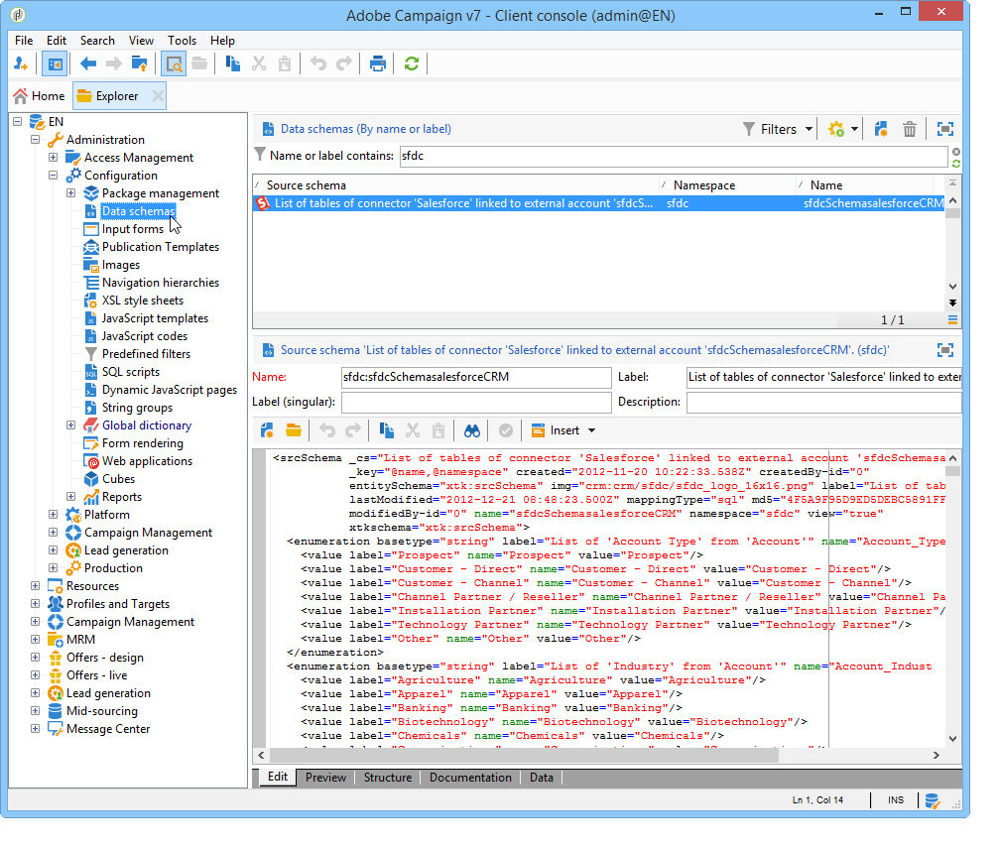
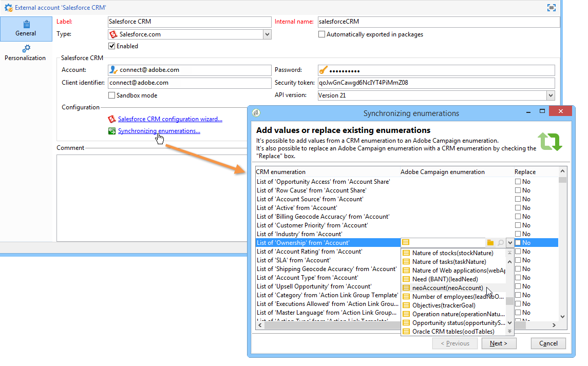
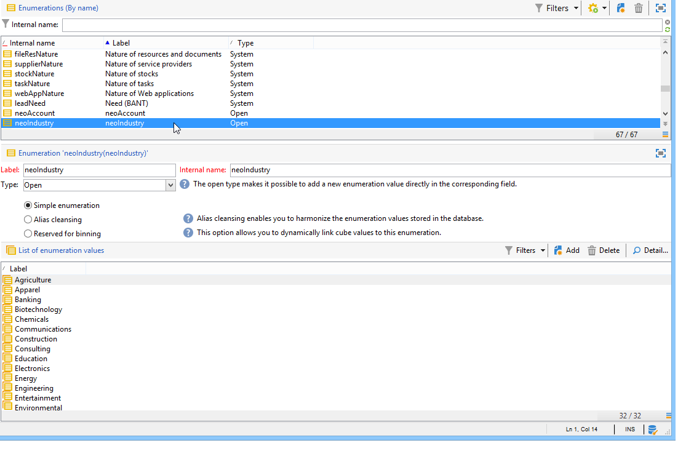
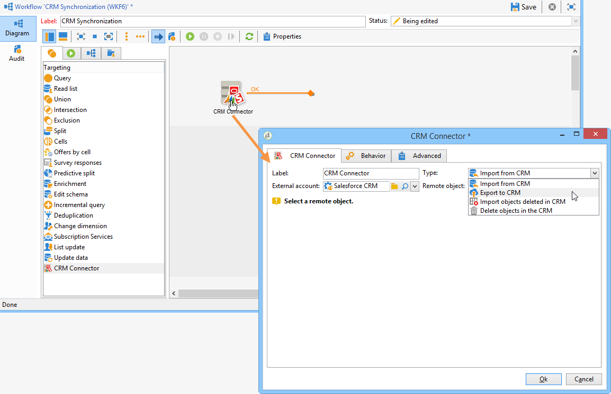

# Connect Campaign and Salesforce.com{#connect-to-sfdc}
   
In this page, you will learn how to connect Campaign Classic to **Salesforce**.

Data synchronization is carried out via a dedicated workflow activity. [Learn more](../../platform/using/crm-data-sync.md).

The external account allows you to import and export Salesforce data into Adobe Campaign.
To configure CRM Connector for Salesforce, follow the steps below:

1. Create a new external account via the **[!UICONTROL Administration > Platform > External accounts]** node of the Adobe Campaign tree.
1. Select **[!UICONTROL Salesforce.com]**.
1. Enter settings to enable connection.
    
    

    To configure the Salesforce CRM external account to work with Adobe Campaign, you need to provide the following details:

    * **[!UICONTROL Account]**
    Account used to sign in to Salesforce CRM.

    * **[!UICONTROL Password]**
    Password used to sign in to Salesforce CRM.

    * **[!UICONTROL Client identifier]**
    To know where to find your client identifier, refer to this [page](https://help.salesforce.com/articleView?id=000205876&type=1).

    * **[!UICONTROL Security token]**
    To know where to find your security token, refer to this [page](https://help.salesforce.com/articleView?id=000205876&type=1).

    * **[!UICONTROL API version]**
    Select the version of the API.
1. Run the configuration wizard to generate the available CRM table: the configuration wizard lets you collect tables and create the matching schema.

   

   >[!NOTE]
   >
   >To approve the setup, you need to log off and back on to the Adobe Campaign console.

1. Check the schema generated in Adobe Campaign in the **[!UICONTROL Administration > Configuration > Data schemas]** node.

   Example for **Salesforce** schema:

   

1. Once the schema is created, you can synchronize enumerations automatically from Salesforce to Adobe Campaign.

   To do this, click the **[!UICONTROL Synchronizing enumerations...]** link and select the Adobe Campaign enumeration that matches the Salesforce enumeration.

   

   >[!NOTE]
   >
   >You can replace all values of an Adobe Campaign enumeration with those of the CRM: to do this, select **[!UICONTROL Yes]** in the **[!UICONTROL Replace]** column.

   Click **[!UICONTROL Next]** and then **[!UICONTROL Start]** to start importing the list.

1. Check the imported values in the **[!UICONTROL Administration > Platform > Enumerations]** menu.

   

   >[!NOTE]
   >
   > Multiple selection enumerations are not supported.

Campaign and Salesforce.com are now connected. You can set up data synchronization between the two systems. 

To synchronize data between Adobe Campaign data and SFDC, you need to create a workflow and use the **[!UICONTROL CRM connector]** activity.

Learn more about data synchronization [in this page](../../platform/using/crm-data-sync.md).
