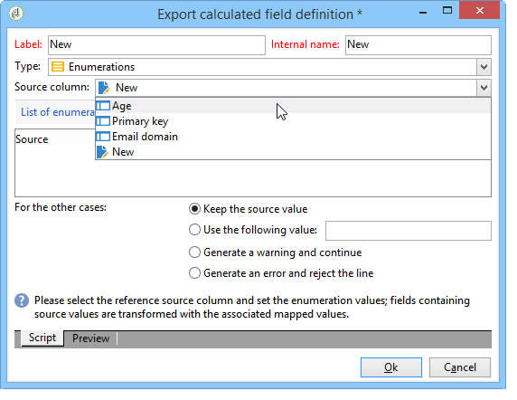

# Define filter conditions{#defining-filter-conditions}

## Choose the operator {#choosing-the-operator}

Within filtering conditions, you need to link two values together using an operator.

Below is a list of the operators available:

<table> 
 <thead> 
  <tr> 
   <th> Operator  </th> 
   <th> Purpose  </th> 
   <th> Example  </th> 
  </tr> 
 </thead> 
 <tbody> 
  <tr> 
   <td> Equal to   </td> 
   <td> Returns a result identical to the data entered in the second Value column.  </td> 
   <td> <strong>Last name (@lastName) equal to 'Jones'</strong>, will return only recipients whose last name is Jones.  </td> 
  </tr> 
  <tr> 
   <td> Greater than   </td> 
   <td> Returns a value greater than the value entered.  </td> 
   <td> <strong>Age (@age) greater than 50</strong>, will return all values greater than '50', i.e. '51', '52', etc.  </td> 
  </tr> 
  <tr> 
   <td> Less than   </td> 
   <td> Returns a value smaller than the value entered.  </td> 
   <td> <strong>Creation date (@created) before 'DaysAgo(100)'</strong>, will return all recipients created less than 100 days ago.  </td> 
  </tr> 
  <tr> 
   <td> Greater than or equal to   </td> 
   <td> Returns all values equal to or greater than the value entered.  </td> 
   <td> <strong>Age (@age) greater than or equal to '30'</strong>, will return all recipients aged 30 or more.  </td> 
  </tr> 
  <tr> 
   <td> Less than or equal to   </td> 
   <td> Returns all values equal to or lower than the value entered.  </td> 
   <td> <strong>Age (@age) less than or equal to '60'</strong>, will return all recipients aged 60 or less.  </td> 
  </tr> 
  <tr> 
   <td> Not equal to   </td> 
   <td> Returns all values not identical to the value entered.  </td> 
   <td> <strong>Language (@language) to equal to 'English'</strong>.  </td> 
  </tr> 
  <tr> 
   <td> Starts with   </td> 
   <td> Returns the results starting with the value entered.  </td> 
   <td> <strong>Account # (@account) starts with '32010'.</strong>  </td> 
  </tr> 
  <tr> 
   <td> Does not start with   </td> 
   <td> Returns the results not starting with the value entered  </td> 
   <td> <strong>Account # (@account) does not start with '20'</strong>.  </td> 
  </tr> 
  <tr> 
   <td> Contains   </td> 
   <td> Returns the results containing at least the value entered.  </td> 
   <td> <strong>Email domain (@domain) contains 'mail'</strong>, will return all domain names that contain 'mail'. So the 'gmail.com' domain will also be returned.  </td> 
  </tr> 
  <tr> 
   <td> Does not contain   </td> 
   <td> Returns results not containing the value entered.  </td> 
   <td> <strong>Email domain (@domain) does not contain 'vo'</strong>. In this case, domain names which contain 'vo' will not be returned. The 'voila.fr' domain name will not appear in the results.  </td> 
  </tr> 
  <tr> 
   <td> Like   </td> 
   <td> Like is very similar to the Contains operator. It lets you insert a % wild card character in the value.  </td> 
   <td> <strong>Last name (@lastName) like 'Jon%s'</strong>. Here, the wild card character is used as a "joker" to find the name "Jones", should the operator have forgotten the missing letter between the 'n' and the 's'.  </td> 
  </tr> 
  <tr> 
   <td> Not like   </td> 
   <td> Is similar to Like . Lets you not recover the entered value. Here too, the entered value must contain the % wild card character.  </td> 
   <td> <strong>Last name (@lastName) not like 'Smi%h'</strong>. Here, the recipients whose last name is 'Smi%h' will not be returned.  </td> 
  </tr> 
  <tr> 
   <td> Is empty   </td> 
   <td> In this case, the result we are looking for matches an empty value in the second Value column.  </td> 
   <td> <strong>Mobile (@mobilePhone) is empty</strong> returns all recipients who do not have a mobile number.  </td> 
  </tr> 
  <tr> 
   <td> Is not empty   </td> 
   <td> Works in reverse to the Is empty operator. It is not necessary to enter data in the second Value column.  </td> 
   <td> <strong>Email (@email) is not empty</strong>.  </td> 
  </tr> 
  <tr> 
   <td> Is included in   </td> 
   <td> Returns results included in the values indicated. These values have to be separated by a comma.  </td> 
   <td> <strong>Birth date (@birthDate) is included in '12/10/1979,12/10/1984'</strong>, will return the recipients born between these dates.   </td> 
  </tr> 
  <tr> 
   <td> Is not included in   </td> 
   <td> Works like the Is included in operator. Here, we want to exclude recipients based on the values entered.  </td> 
   <td> <strong>Birth date (@birthDate) is not included in '12/10/1979,12/10/1984'</strong>. Unlike in the previous example, recipients born within these dates will not be returned.  </td> 
  </tr> 
 </tbody> 
</table>

## Use AND, OR, EXCEPT {#using-and--or--except}

For queries using several filtering conditions, you need to define links between the conditions. There are three possible links:

* **[!UICONTROL And]** lets you combine two filtering conditions,
* **[!UICONTROL Or]** lets you offer an alternative,
* **[!UICONTROL Except]** lets you define an exception.

Click **[!UICONTROL And]** (offered by default) and choose from the drop-down list.

* **[!UICONTROL And]**: adds a condition and enables overfiltering.
* **[!UICONTROL Or]**: adds a condition and enables overfiltering.

  The following example lets you find recipients whose email domain contains "orange.co.uk" OR whose post code starts with "NW".

  

* **[!UICONTROL Except]**: if you have two filters and the first one does not return a value, this type of link creates an exception.

  In the following example, we want to return recipients whose email domain contains "orange.co.uk" EXCEPT if the recipient's last name is "Smith".

  

This example shows a filter which lets you display: recipients who either speak Spanish, OR are women with mobile numbers, OR recipients without an account number and whose company name starts with the letter "N".

## Prioritize conditions {#prioritizing-conditions}

This section explains how to prioritize conditions thanks to the blue arrows in the toolbar.

* The arrow pointing to the right lets you add a level of parentheses to the filter.
* The arrow pointing to the left lets you delete a selected parenthesis level from the filter.

  

* The vertical arrows let you move a condition, thereby changing their execution sequence.

This example shows you how to use the arrow to delete a parenthesis level. Start from the following filtering condition: **[!UICONTROL City equal to London OR gender equal to male and mobile not indicated OR account # starts with "95" and company name starts with "A"]**.

Place your cursor on the **[!UICONTROL Gender (@gender) equal to Male]** filtering condition and click the **[!UICONTROL Remove a parenthesis level]** arrow.

The **[!UICONTROL Gender (@gender) equal to Male]** condition has been taken out of its parenthesis. It has moved to the same level as the "City equal to London" condition. These conditions are linked together (**[!UICONTROL And]**).

## Select data to extract {#selecting-data-to-extract}

The available fields vary from one table to another. All fields are stored in a main node known as the **[!UICONTROL Main element]**. In the following example, the available fields are in the recipient table. Fields are always displayed alphabetically.

The detail the selected field is visible at the bottom of the window. For example, the **[!UICONTROL Email domain]** field is a **[!UICONTROL Calculated SQL field]** and its extension is **[!UICONTROL (@domain)]**.

>[!NOTE]
>
>Use the **[!UICONTROL Search]** tool to find an available field.

Double-click an available field to add it to the output columns. At the end of the query, each selected field creates a column in the **[!UICONTROL Data preview]** window.

Advanced fields are not displayed by default. Click **[!UICONTROL Display advanced fields]** in the bottom right-hand corner of the available fields to display everything. Click again to return to the former view.

For example, in the recipient table, the advanced fields are **Boolean 1**, **[!UICONTROL Boolean 2]**, **[!UICONTROL Boolean 3]**, **[!UICONTROL Foreign key of "Folder" link]**, etc.

The following example shows the advanced fields of the recipient table.

The various categories of fields:

<table> 
 <thead> 
  <tr> 
   <th> Icon  </th> 
   <th> Description  </th> 
   <th> Examples  </th> 
  </tr> 
 </thead> 
 <tbody> 
  <tr> 
   <td>  </td> 
   <td> Simple field  </td> 
   <td> Email, gender, etc.  </td> 
  </tr> 
  <tr> 
   <td>  </td> 
   <td> Primary key. This SQL field is a way of identifying a record in a table.  </td> 
   <td> Identifier recipients are primary keys and identifiers are unique by definition.  </td> 
  </tr> 
  <tr> 
   <td>  </td> 
   <td> Foreign key. Used as a link to another table.  </td> 
   <td> Recipient foreign key, service foreign key, etc.  </td> 
  </tr> 
  <tr> 
   <td>  </td> 
   <td> Calculated field. This type of field is calculated on request using the values in the database.  </td> 
   <td> Age, email domain, etc.  </td> 
  </tr> 
  <tr> 
   <td>  </td> 
   <td> Field containing long texts.  </td> 
   <td> Comment, full address, etc.  </td> 
  </tr> 
  <tr> 
   <td>  </td> 
   <td> Indexed SQL field.   </td> 
   <td> Full name, ISO code, etc.   </td> 
  </tr> 
 </tbody> 
</table>

Link to a table and collection element:

<table> 
 <thead> 
  <tr> 
   <th> Icon  </th> 
   <th> Description  </th> 
   <th> Example  </th> 
  </tr> 
 </thead> 
 <tbody> 
  <tr> 
   <td>  </td> 
   <td> Links to a table in particular. These coincide with 1-1 type associations. An occurrence of the source table can coincide with only one occurrence of the target table. For example, only one recipient can be linked to a country.  </td> 
   <td> Folder, State, Country, etc.   </td> 
  </tr> 
  <tr> 
   <td>  </td> 
   <td> Collection element on a specific table. These coincide with 1-N type associations. One source table occurrence can coincide with several occurrences of the target table, but one occurrence of the target table can coincide with only one occurrence of the source table. For example, one recipient can subscribe to 'n' subscription letters.  </td> 
   <td> Subscriptions, lists, exclusion logs, etc.  </td> 
  </tr> 
 </tbody> 
</table>

>[!NOTE]
>
>* Use the **[!UICONTROL Add]** button (above the side icon bar) to add an output column in which we wish to edit the expression. For more on editing an expression, refer to [this section](#building-expressions).
>* Delete an output column by clicking the red 'x' (**Delete**).
>* Change the order of the output columns using the arrows.
>* The **[!UICONTROL Distribution of values]** serves as a way to view the distribution of the values of the field selected (for example, the distributions linked to recipient towns, recipient languages, etc.).

## Create calculated fields {#creating-calculated-fields}

If necessary, add a column during data formatting. A calculated field adds a column to the data preview section. Click **[!UICONTROL Add a calculated field]**.

There are four types of calculated fields:

* **[!UICONTROL Fixed string]**: lets you add a string of characters.

  

* **[!UICONTROL String with JavaScript tags]**: the value of the calculated field combines a string of characters and JavaScript directives.

  

* **[!UICONTROL JavaScript expression]**: the value of the calculated field is the result of a JavaScript function evaluation. The returned value can be typed (number, date, etc.).

  

* **[!UICONTROL Enumerations]**: This type of field lets you use/modify the content of one of the output columns in a new column.

  It's possible to use the source value of a column and give it a destination value. This destination value will be displayed in the new output column.

  An example of adding calculated field type **[!UICONTROL Enumerations]** is available, refer to [this section](../../workflow/using/adding-enumeration-type-calculated-field.md).

  

  The **[!UICONTROL Enumerations]** type calculated field can include 4 conditions:

    * **[!UICONTROL Keep the source value]** restores the source value to the target without changing it.
    * **[!UICONTROL Use the following value]** lets you enter a default destination value for non-defined source values.
    * **[!UICONTROL Generate a warning and continue]** warns the user that the source value cannot be changed.
    * **[!UICONTROL Generate an error and reject the line]** prevents the line from being calculated and imported.

Click the **[!UICONTROL Detail of calculated field]** to view the detail of the inserted field.  

To remove this calculated field, click the **[!UICONTROL Remove the calculated field]** cross.

## Build expressions {#building-expressions}

The expression editing tool lets you calculate aggregates, generate function, or edit a formula using an expression.

The following example shows you how to run a count on a primary key.

Apply the following steps:

1. Click **[!UICONTROL Add]** in the **[!UICONTROL Data to extract]** window. In the **[!UICONTROL Formula type]** window, select a type of formula to enter the expression.

   There are several types of formulas available: **[!UICONTROL Field only]**, **[!UICONTROL Aggregate]**, **[!UICONTROL Expression]**.

   Select **[!UICONTROL Process on an aggregate function]**, and **[!UICONTROL Count]**. Click **[!UICONTROL Next]**.

   

1. The primary key is calculated.

   

Here is a detailed view of the choices available in the **[!UICONTROL Formula types]** window: 

1. **[!UICONTROL Field only]** lets you return to the **[!UICONTROL Field to select]** window.
1. **[!UICONTROL Aggregate (Process on an aggregate function)]**. Here are some examples of aggregate use:

    * **[!UICONTROL Count]** lets you run a primary key count.
    * **[!UICONTROL Sum]** lets you add up all purchases made by a customer over one year.
    * **[!UICONTROL Maximum value]** lets you find the customers having purchased the most "n" products.
    * **[!UICONTROL Minimum value]** lets you sort through customers and find those having subscribed to an offer most recently.
    * **[!UICONTROL Average]**. This function lets you calculate the average age of your recipients.

      The **[!UICONTROL Distinct]** box lets you recover unique and non-zero values of a column. For example, you can recover all of a recipient's tracking logs and these tracking logs are changed to the value 1 since they all concern the same recipient.

1. **[!UICONTROL Expression]** opens the **[!UICONTROL Edit the expression]** window. This lets you detect telephone numbers with too many figures, likely to be input errors.

   

   For a list of all available functions, refer to [List of functions](#list-of-functions).

## List of functions {#list-of-functions}

If an **[!UICONTROL Expression]** type formula is chosen, you will be taken to the "edit the expression" window. Various categories of functions can be associated to the available fields: **[!UICONTROL Aggregates]**, **[!UICONTROL String]**, **[!UICONTROL Date]**, **[!UICONTROL Numerical]**, **[!UICONTROL Currency]**, **[!UICONTROL Geomarketing]**, **[!UICONTROL Windowing function]** and **[!UICONTROL Others]**.

The expression editor looks like this:

It lets you select fields in the database tables and add advanced functions to them. The following functions are available:

**Aggregates**

<table> 
 <tbody> 
  <tr> 
   <td> <strong>Name</strong>  </td> 
   <td> <strong>Description</strong>  </td> 
   <td> <strong>Syntax</strong>  </td> 
  </tr> 
  <tr> 
   <td> <strong>Avg</strong>  </td> 
   <td> Returns the average of a number type column  </td> 
   <td> Avg(&lt;value&gt;) </td> 
  </tr> 
  <tr> 
   <td> <strong>Count</strong>  </td> 
   <td> Counts the non-null values of a column  </td> 
   <td> Count(&lt;value&gt;) </td>  
  </tr> 
  <tr> 
   <td> <strong>CountAll</strong>  </td> 
   <td> Counts the values returned (all fields)  </td> 
   <td> CountAll()  </td> 
  </tr> 
  <tr> 
   <td> <strong>Countdistinct</strong>  </td> 
   <td> Counts the distinct non-null values of a column  </td> 
   <td> Countdistinct(&lt;value&gt;) </td> 
  </tr> 
  <tr> 
   <td> <strong>Max</strong>  </td> 
   <td> Returns the maximum value of a number, string, or date type column  </td> 
   <td> Max(&lt;value&gt;) </td>  
  </tr> 
  <tr> 
   <td> <strong>Min</strong>  </td> 
   <td> Returns the minimum value of a number, string or date type column  </td> 
   <td> Min(&lt;value&gt;) </td> 
  </tr> 
  <tr> 
   <td> <strong>StdDev</strong>  </td> 
   <td> Returns the standard deviation of a number, string or date column  </td> 
   <td> StdDev(&lt;value&gt;) </td> 
  </tr> 
  <tr> 
   <td> <strong>Sum</strong>  </td> 
   <td> Returns the sum of the values of a number, string, or date type column  </td> 
   <td> Sum(&lt;value&gt;) </td> 
  </tr> 
 </tbody> 
</table>

**String**

<table> 
 <tbody> 
  <tr> 
   <td> <strong>Name</strong>  </td> 
   <td> <strong>Description</strong>  </td> 
   <td> <strong>Syntax</strong>  </td> 
  </tr> 
  <tr> 
   <td> <strong>AllNonNull2</strong>  </td> 
   <td> Indicates if all parameters are non-null and not empty  </td> 
   <td> AllNonNull2(&lt;string&gt;, &lt;string&gt;) </td> 
  </tr> 
  <tr> 
   <td> <strong>AllNonNull3</strong>  </td> 
   <td> Indicates if all parameters are non-null and not empty  </td> 
   <td> AllNonNull3(&lt;string&gt;, &lt;string&gt;, &lt;string&gt;) </td> 
  </tr> 
  <tr> 
   <td> <strong>Ascii</strong>  </td> 
   <td> Returns the ASCII value of the first character in the string.  </td> 
   <td> Ascii(&lt;string&gt;) </td> 
  </tr> 
  <tr> 
   <td> <strong>Char</strong>  </td> 
   <td> Returns the character corresponding to the 'n' ASCII code  </td> 
   <td> Char(&lt;number&gt;) </td>  
  </tr> 
  <tr> 
   <td> <strong>Charindex</strong>  </td> 
   <td> Returns the position of string 2 in string 1.  </td> 
   <td> Charindex(&lt;string&gt;, &lt;string&gt;) </td> 
  </tr> 
  <tr> 
   <td> <strong>GetLine</strong>  </td> 
   <td> Returns the nth (from 1 to n) line of the string  </td> 
   <td> GetLine(&lt;string&gt;) </td> 
  </tr> 
  <tr> 
   <td> <strong>IfEquals</strong>  </td> 
   <td> Returns the third parameter if the first two parameters are equal. If not, returns the last parameter  </td> 
   <td> IfEquals(&lt;string&gt;, &lt;string&gt;, &lt;string&gt;, &lt;string&gt;) </td> 
  </tr> 
  <tr> 
   <td> <strong>IsMemoNull</strong>  </td> 
   <td> Indicates if the memo passed as a parameter is null  </td> 
   <td> IsMemoNull(&lt;memo&gt;) </td> 
  </tr> 
  <tr> 
   <td> <strong>JuxtWords</strong>  </td> 
   <td> Concatenates the strings passed as parameters. Adds spaces between the strings if necessary.  </td> 
   <td> JuxtWords(&lt;string&gt;, &lt;string&gt;) </td> 
  </tr> 
  <tr> 
   <td> <strong>JuxtWords3</strong>  </td> 
   <td> Concatenates the strings passed as parameters. Adds spaces between the strings if necessary  </td> 
   <td> JuxtWords3(&lt;string&gt;, &lt;string&gt;, &lt;string&gt;) </td>  
  </tr> 
  <tr> 
   <td> <strong>LPad</strong>  </td> 
   <td> Returns the completed string on the left  </td> 
   <td> LPad(&lt;string&gt;, &lt;number&gt;, &lt;character&gt;) </td> 
  </tr> 
  <tr> 
   <td> <strong>Left</strong>  </td> 
   <td> Returns the first n characters of the string  </td> 
   <td> Left(&lt;string&gt;, &lt;number&gt;) </td> 
  </tr> 
  <tr> 
   <td> <strong>Length</strong>  </td> 
   <td> Returns the length of the string  </td> 
   <td> Length(&lt;string&gt;) </td> 
  </tr> 
  <tr> 
   <td> <strong>Lower</strong>  </td> 
   <td> Returns the string in lowercase  </td> 
   <td> Lower(&lt;string&gt;) </td> 
  </tr> 
  <tr> 
   <td> <strong>Ltrim</strong>  </td> 
   <td> Removes spaces to the left of the string  </td> 
   <td> Ltrim(&lt;string&gt;) </td> 
  </tr> 
  <tr> 
   <td> <strong>Md5Digest</strong>  </td> 
   <td> Returns an hexadecimal representation of the MD5 key of a string  </td> 
   <td> Md5Digest(&lt;string&gt;) </td> 
  </tr> 
  <tr> 
   <td> <strong>MemoContains</strong>  </td> 
   <td> Specifies whether the memo contains the string passed as a parameter  </td> 
   <td> MemoContains(&lt;memo&gt;, &lt;string&gt;) </td> 
  </tr> 
  <tr> 
   <td> <strong>RPad</strong>  </td> 
   <td> Returns the completed string on the right  </td> 
   <td> RPad(&lt;string&gt;, &lt;number&gt;, &lt;character&gt;) </td> 
  </tr> 
  <tr> 
   <td> <strong>Right</strong>  </td> 
   <td> Returns the last n characters of the string  </td> 
   <td> Right(&lt;string&gt;)  </td> 
  </tr> 
  <tr> 
   <td> <strong>Rtrim</strong>  </td> 
   <td> Removes spaces to the right of the string  </td> 
   <td> Rtrim(&lt;string&gt;)  </td> 
  </tr> 
  <tr> 
   <td> <strong>Smart</strong>  </td> 
   <td> Returns the string with the first letter of each word in capitals  </td> 
   <td> Smart(&lt;string&gt;)  </td> 
  </tr> 
  <tr> 
   <td> <strong>Substring</strong>  </td> 
   <td> Extracts the substring starting at character n1 of the string and of length n2  </td> 
   <td> Substring(&lt;string&gt;, &lt;offset&gt;, &lt;length&gt;)  </td>  
  </tr> 
  <tr> 
   <td> <strong>ToString</strong>  </td> 
   <td> Converts the number to a string  </td> 
   <td> ToString(&lt;number&gt;, &lt;number&gt;)  </td>  
  </tr> 
  <tr> 
   <td> <strong>Upper</strong>  </td> 
   <td> Returns the string in capitals  </td> 
   <td> Upper(&lt;string&gt;)  </td>  
  </tr> 
  <tr> 
   <td> <strong>VirtualLink</strong>  </td> 
   <td> Returns the foreign key of a link passed as a parameter if the other two parameters are equal  </td> 
   <td> VirtualLink(&lt;number&gt;, &lt;number&gt;, &lt;number&gt;)  </td>  
  </tr> 
  <tr> 
   <td> <strong>VirtualLinkStr</strong>  </td> 
   <td> Returns the foreign (text) key of a link passed as a parameter if the other two parameters are equal  </td> 
   <td> VirtualLinkStr(&lt;string&gt;, &lt;number&gt;, &lt;number&gt;)  </td>  
  </tr> 
  <tr> 
   <td> <strong>dataLength</strong>  </td> 
   <td> Returns the string size  </td> 
   <td> dataLength(&lt;string&gt;)  </td>  
  </tr> 
 </tbody> 
</table>

**Date**

<table> 
 <tbody> 
  <tr> 
   <td> <strong>Name</strong>  </td> 
   <td> <strong>Description</strong>  </td> 
   <td> <strong>Syntax</strong>  </td> 
  </tr> 
  <tr> 
   <td> <strong>AddDays</strong>  </td> 
   <td> Adds a number of days to a date  </td> 
   <td> AddDays(&lt;date&gt;, &lt;number&gt;)  </td>  
  </tr> 
  <tr> 
   <td> <strong>AddHours</strong>  </td> 
   <td> Adds a number of hours to a date  </td> 
   <td> AddHours(&lt;date&gt;, &lt;number&gt;)  </td>  
  </tr> 
  <tr> 
   <td> <strong>AddMinutes</strong>  </td> 
   <td> Adds a number of minutes to a date  </td> 
   <td> AddMinutes(&lt;date&gt;, &lt;number&gt;)  </td>  
  </tr> 
  <tr> 
   <td> <strong>AddMonths</strong>  </td> 
   <td> Adds a number of months to a date  </td> 
   <td> AddMonths(&lt;date&gt;, &lt;number&gt;)  </td>  
  </tr> 
  <tr> 
   <td> <strong>AddSeconds</strong>  </td> 
   <td> Adds a number of seconds to a date  </td> 
   <td> AddSeconds(&lt;date&gt;, &lt;number&gt;)  </td>  
  </tr> 
  <tr> 
   <td> <strong>AddYears</strong>  </td> 
   <td> Adds a number of years to a date  </td> 
   <td> AddYears(&lt;date&gt;, &lt;number&gt;)  </td>  
  </tr> 
  <tr> 
   <td> <strong>DateOnly</strong>  </td> 
   <td> Returns the date only (with time at 00:00)*  </td> 
   <td> DateOnly(&lt;date&gt;)  </td>  
  </tr> 
  <tr> 
   <td> <strong>Day</strong>  </td> 
   <td> Returns the number representing the day of the date  </td> 
   <td> Day(&lt;date&gt;)  </td>  
  </tr> 
  <tr> 
   <td> <strong>DayOfYear</strong>  </td> 
   <td> Returns the number of the day in the year of the date  </td> 
   <td> DayOfYear(&lt;date&gt;)  </td>  
  </tr> 
  <tr> 
   <td> <strong>DaysAgo</strong>  </td> 
   <td> Returns the date corresponding to the current date minus n days  </td> 
   <td> DaysAgo(&lt;number&gt;)  </td>  
  </tr> 
  <tr> 
   <td> <strong>DaysAgoInt</strong>  </td> 
   <td> Returns the date (integer yyyymmdd) corresponding to the current date minus n days  </td> 
   <td> DaysAgoInt(&lt;number&gt;)  </td>  
  </tr> 
  <tr> 
   <td> <strong>DaysDiff</strong>  </td> 
   <td> Number of days between two dates  </td> 
   <td> DaysDiff(&lt;end date&gt;, &lt;start date&gt;)  </td>  
  </tr> 
  <tr> 
   <td> <strong>DaysOld</strong>  </td> 
   <td> Returns the age in days of a date  </td> 
   <td> DaysOld(&lt;date&gt;)  </td>  
  </tr> 
  <tr> 
   <td> <strong>GetDate</strong>  </td> 
   <td> Returns the current system date of the server  </td> 
   <td> GetDate()  </td> 
  </tr> 
  <tr> 
   <td> <strong>Hour</strong>  </td> 
   <td> Returns the hour of the date  </td> 
   <td> Hour(&lt;date&gt;)  </td>  
  </tr> 
  <tr> 
   <td> <strong>HoursDiff</strong>  </td> 
   <td> Returns the number of hours between two dates  </td> 
   <td> HoursDiff(&lt;end date&gt;, &lt;start date&gt;)  </td>  
  </tr> 
  <tr> 
   <td> <strong>Minute</strong>  </td> 
   <td> Returns the minutes of the date  </td> 
   <td> Minute(&lt;date&gt;)  </td>  
  </tr> 
  <tr> 
   <td> <strong>MinutesDiff</strong>  </td> 
   <td> Returns the number of minutes between two dates  </td> 
   <td> MinutesDiff(&lt;end date&gt;, &lt;start date&gt;)  </td>  
  </tr> 
  <tr> 
   <td> <strong>Month</strong>  </td> 
   <td> Returns the number representing the month of the date  </td> 
   <td> Month(&lt;date&gt;)  </td>  
  </tr> 
  <tr> 
   <td> <strong>MonthsAgo</strong>  </td> 
   <td> Returns the date corresponding to the current date minus n months  </td> 
   <td> MonthsAgo(&lt;number&gt;)  </td>  
  </tr> 
  <tr> 
   <td> <strong>MonthsDiff</strong>  </td> 
   <td> Returns the number of months between two dates  </td> 
   <td> MonthsDiff(&lt;end date&gt;, &lt;start date&gt;)  </td>  
  </tr> 
  <tr> 
   <td> <strong>MonthsOld</strong>  </td> 
   <td> Returns the age in months of a date  </td> 
   <td> MonthsOld(&lt;date&gt;)  </td>  
  </tr> 
  <tr> 
   <td> <strong>Second</strong>  </td> 
   <td> Returns the seconds of the date  </td> 
   <td> Second(&lt;date&gt;)  </td>  
  </tr> 
  <tr> 
   <td> <strong>SecondsDiff</strong>  </td> 
   <td> Returns the number of seconds between two dates  </td> 
   <td> SecondsDiff(&lt;end date&gt;, &lt;start date&gt;)  </td>  
  </tr> 
  <tr> 
   <td> <strong>SubDays</strong>  </td> 
   <td> Subtracts a number of days from a date  </td> 
   <td> SubDays(&lt;date&gt;, &lt;number&gt;)  </td>  
  </tr> 
  <tr> 
   <td> <strong>SubHours</strong>  </td> 
   <td> Subtracts a number of hours from a date  </td> 
   <td> SubHours(&lt;date&gt;, &lt;number&gt;)  </td>  
  </tr> 
  <tr> 
   <td> <strong>SubMinutes</strong>  </td> 
   <td> Subtracts a number of minutes from a date  </td> 
   <td> SubMinutes(&lt;date&gt;, &lt;number&gt;)  </td>  
  </tr> 
  <tr> 
   <td> <strong>SubMonths</strong>  </td> 
   <td> Subtracts a number of months from a date  </td> 
   <td> SubMonths(&lt;date&gt;, &lt;number&gt;)  </td>  
  </tr> 
  <tr> 
   <td> <strong>SubSeconds</strong>  </td> 
   <td> Subtracts a number of seconds from a date  </td> 
   <td> SubSeconds(&lt;date&gt;, &lt;number&gt;)  </td>  
  </tr> 
  <tr> 
   <td> <strong>SubYears</strong>  </td> 
   <td> Subtracts a number of years from a date  </td> 
   <td> SubYears(&lt;date&gt;, &lt;number&gt;)  </td>  
  </tr> 
  <tr> 
   <td> <strong>ToDate</strong>  </td> 
   <td> Converts a date + time as a date  </td> 
   <td> ToDate(&lt;date + time&gt;)  </td>  
  </tr> 
  <tr> 
   <td> <strong>ToDateTime</strong>  </td> 
   <td> Converts a string to a date + time  </td> 
   <td> ToDateTime(&lt;string&gt;)  </td>  
  </tr> 
  <tr> 
   <td> <strong>TruncDate</strong>  </td> 
   <td> Rounds a date+time to the nearest second  </td> 
   <td> TruncDate(@lastModified, &lt;number of seconds&gt;)  </td> 
  </tr> 
  <tr> 
   <td> <strong>TruncDateTZ</strong>  </td> 
   <td> Rounds a date + time to a given precision expressed in seconds  </td> 
   <td> TruncDateTZ(&lt;date&gt;, &lt;number of seconds&gt;, &lt;time zone&gt;)  </td> 
  </tr> 
  <tr> 
   <td> <strong>TruncQuarter</strong>  </td> 
   <td> Rounds a date off to the quarter  </td> 
   <td> TruncQuarter(&lt;date&gt;)  </td>  
  </tr> 
  <tr> 
   <td> <strong>TruncTime</strong>  </td> 
   <td> Rounds the time part up to the nearest second  </td> 
   <td> TruncTim(e&lt;date&gt;, &lt;number of seconds&gt;)  </td>  
  </tr> 
  <tr> 
   <td> <strong>TruncWeek</strong>  </td> 
   <td> Rounds a date off to the week  </td> 
   <td> TruncWeek(&lt;date&gt;)  </td>  
  </tr> 
  <tr> 
   <td> <strong>TruncYear</strong>  </td> 
   <td> Rounds a date + time to January 1st of the year  </td> 
   <td> TruncYear(&lt;date&gt;)  </td>  
  </tr> 
  <tr> 
   <td> <strong>TruncWeek</strong>  </td> 
   <td> Returns the number representing the day in the week of the date  </td> 
   <td> WeekDay(&lt;date&gt;)  </td>  
  </tr> 
  <tr> 
   <td> <strong>Year</strong>  </td> 
   <td> Returns the number representing the year of the date  </td> 
   <td> Year(&lt;date&gt;)  </td>  
  </tr> 
  <tr> 
   <td> <strong>YearAnd Month</strong>  </td> 
   <td> Returns the number representing the year and month of the date  </td> 
   <td> YearAndMonth(&lt;date&gt;)  </td>  
  </tr> 
  <tr> 
   <td> <strong>YearsDiff</strong>  </td> 
   <td> Returns the number of years between the two dates  </td> 
   <td> YearsDiff(&lt;end date&gt;, &lt;start date&gt;)  </td>  
  </tr> 
  <tr> 
   <td> <strong>YearsOld</strong>  </td> 
   <td> Returns the age in years of a date  </td> 
   <td> YearsOld(&lt;date&gt;)  </td>  
  </tr> 
 </tbody> 
</table>

>[!NOTE]
>
>Note that the **Dateonly** function takes into account the server's timezone, not the operator's.

**Numerical**

<table> 
 <tbody> 
  <tr> 
   <td> <strong>Name</strong>  </td> 
   <td> <strong>Description</strong>  </td> 
   <td> <strong>Syntax</strong>  </td> 
  </tr> 
  <tr> 
   <td> <strong>Abs</strong>  </td> 
   <td> Returns the absolute value of a number  </td> 
   <td> Abs(&lt;number&gt;)  </td>  
  </tr> 
  <tr> 
   <td> <strong>Ceil</strong>  </td> 
   <td> Returns the lowest integer greater than or equal to a number  </td> 
   <td> Ceil(&lt;number&gt;)  </td>  
  </tr> 
  <tr> 
   <td> <strong>Floor</strong>  </td> 
   <td> Returns the greatest integer greater than or equal to a number  </td> 
   <td> Floor(&lt;number&gt;)  </td>  
  </tr> 
  <tr> 
   <td> <strong>Greatest</strong>  </td> 
   <td> Returns the greater of two numbers  </td> 
   <td> Greatest(&lt;number 1&gt;, &lt;number 2&gt;)  </td>  
  </tr> 
  <tr> 
   <td> <strong>Least</strong>  </td> 
   <td> Returns the smaller of two numbers  </td> 
   <td> Least(&lt;number 1&gt;, &lt;number 2&gt;)  </td>  
  </tr> 
  <tr> 
   <td> <strong>Mod</strong>  </td> 
   <td> Returns the remainder of the integer division of n1 by n2  </td> 
   <td> Mod(&lt;number 1&gt;, &lt;number 2&gt;)  </td>  
  </tr> 
  <tr> 
   <td> <strong>Percent</strong>  </td> 
   <td> Returns the ratio of two numbers expressed as a percentage  </td> 
   <td> Percent(&lt;number 1&gt;, &lt;number 2&gt;)  </td>  
  </tr> 
  <tr> 
   <td> <strong>Random</strong>  </td> 
   <td> Returns the random value  </td> 
   <td> Random()  </td> 
  </tr> 
  <tr> 
   <td> <strong>Round</strong>  </td> 
   <td> Rounds off a number to n decimals  </td> 
   <td> Round(&lt;number&gt;, &lt;number of decimals&gt;)  </td>  
  </tr> 
  <tr> 
   <td> <strong>Sign</strong>  </td> 
   <td> Returns the sign of the number  </td> 
   <td> Sign(&lt;number&gt;)  </td>  
  </tr> 
  <tr> 
   <td> <strong>ToDouble</strong>  </td> 
   <td> Converts an integer to a float  </td> 
   <td> ToDouble(&lt;number&gt;)  </td>  
  </tr> 
  <tr> 
   <td> <strong>ToInt64</strong>  </td> 
   <td> Converts a float to a 64 bit integer  </td> 
   <td> ToInt64(&lt;number&gt;)  </td>  
  </tr> 
  <tr> 
   <td> <strong>ToInteger</strong>  </td> 
   <td> Converts a float to an integer  </td> 
   <td> ToInteger(&lt;number&gt;)  </td>  
  </tr> 
  <tr> 
   <td> <strong>Trunc</strong>  </td> 
   <td> Truncates n1 to n2 decimals  </td> 
   <td> Trunc(&lt;n1&gt;, &lt;n2&gt;)  </td>  
  </tr> 
 </tbody> 
</table>

1. Currency

<table> 
 <tbody> 
  <tr> 
   <td> <strong>Name</strong>  </td> 
   <td> <strong>Description</strong>  </td> 
   <td> <strong>Syntax</strong>  </td> 
  </tr> 
  <tr> 
   <td> <strong>ConvertCurrency</strong>  </td> 
   <td> Converts an amount in a source currency to an amount in a target currency  </td> 
   <td> ConvertCurrency(&lt;amount&gt;, &lt;source currency&gt;, &lt;target currency&gt;, &lt;conversion date&gt;)  </td>  
  </tr> 
  <tr> 
   <td> <strong>FormatCurrency</strong>  </td> 
   <td> Formats the amount displayed based on the selected currency settings  </td> 
   <td> FormatCurrency(&lt;amount&gt;, &lt;currency&gt;)  </td>  
  </tr> 
 </tbody> 
</table>

**Geomarketing**

<table> 
 <tbody> 
  <tr> 
   <td> <strong>Name</strong>  </td> 
   <td> <strong>Description</strong>  </td> 
   <td> <strong>Syntax</strong>  </td> 
  </tr> 
  <tr> 
   <td> <strong>Distance</strong>  </td> 
   <td> Returns the distance between two points defined by their longitude and latitude, expressed in degrees.  </td> 
   <td> Distance(&lt;Longitude A&gt;, &lt;Latitude A&gt;, &lt;Longitude B&gt;, &lt;Latitude B&gt;)  </td>  
  </tr> 
 </tbody> 
</table>

**Others**

<table> 
 <tbody> 
  <tr> 
   <td> <strong>Name</strong>  </td> 
   <td> <strong>Description</strong>  </td> 
   <td> <strong>Syntax</strong>  </td> 
  </tr> 
  <tr> 
   <td> <strong>Case</strong>  </td> 
   <td> Returns value 1 if the condition is true. If not, it returns value 2.  </td> 
   <td> Case(When(&lt;condition&gt;, &lt;value 1&gt;), Else(&lt;value 2&gt;))  </td> 
  </tr> 
  <tr> 
   <td> <strong>ClearBit</strong>  </td> 
   <td> Deletes the Flag in the value  </td> 
   <td> ClearBit(&lt;identifier&gt;, &lt;flag&gt;)  </td>  
  </tr> 
  <tr> 
   <td> <strong>Coalesce</strong>  </td> 
   <td> Returns value 2 if value 1 is zero or null, otherwise returns value 1  </td> 
   <td> Coalesce(&lt;value 1&gt;, &lt;value 2&gt;)  </td>  
  </tr> 
  <tr> 
   <td> <strong>Decode</strong>  </td> 
   <td> Returns value 3 if value 1 = value 2. If not returns value 4.  </td> 
   <td> Decode(&lt;value 1&gt;, &lt;value 2&gt;, &lt;value 3&gt;, &lt;value 4&gt;)  </td>  
  </tr> 
  <tr> 
   <td> <strong>Else</strong>  </td> 
   <td> Returns value 1 (may only be used as a parameter of the case function)  </td> 
   <td> Else(&lt;value 1&gt;, &lt;value 2&gt;)  </td>  
  </tr> 
  <tr> 
   <td> <strong>GetEmailDomain</strong>  </td> 
   <td> Extracts the domain from an e-mail address  </td> 
   <td> GetEmailDomain(&lt;value&gt;)  </td>  
  </tr> 
  <tr> 
   <td> <strong>GetMirrorURL</strong>  </td> 
   <td> Retrieves the URL of the mirror page server  </td> 
   <td> GetMirrorURL(&lt;value&gt;)  </td>  
  </tr> 
  <tr> 
   <td> <strong>Iif</strong>  </td> 
   <td> Returns value 1 if the expression is true. If not, returns value 2  </td> 
   <td> Iif(&lt;condition&gt;, &lt;value 1&gt;, &lt;value 2&gt;)  </td>  
  </tr> 
  <tr> 
   <td> <strong>IsBitSet</strong>  </td> 
   <td> Indicates whether the Flag is in the value  </td> 
   <td> IsBitSet(&lt;identifier&gt;, &lt;flag&gt;)  </td>  
  </tr> 
  <tr> 
   <td> <strong>IsEmptyString</strong>  </td> 
   <td> Returns value 2 if string 1 is empty, otherwise returns value 3  </td> 
   <td> IsEmptyString(&lt;value 1&gt;, &lt;value 2&gt;, &lt;value 3&gt;)  </td>  
  </tr> 
  <tr> 
   <td> <strong>NoNull</strong>  </td> 
   <td> Returns the empty string if the argument is NULL  </td> 
   <td> NoNull(&lt;value&gt;)  </td>   
  </tr> 
  <tr> 
   <td> <strong>RowId</strong>  </td> 
   <td> Returns the line number  </td> 
   <td> RowId  </td> 
  </tr> 
  <tr> 
   <td> <strong>SetBit</strong>  </td> 
   <td> Forces the Flag in the value  </td> 
   <td> SetBit(&lt;identifier&gt;, &lt;flag&gt;)  </td>  
  </tr> 
  <tr> 
   <td> <strong>ToBoolean</strong>  </td> 
   <td> Converts a number into a Boolean  </td> 
   <td> ToBoolean(&lt;number&gt;)  </td>   
  </tr> 
  <tr> 
   <td> <strong>When</strong>  </td> 
   <td> Returns value 1 if the expression is true. If not, it returns value 2 (may only be used as a parameter of the case function)  </td> 
   <td> When(&lt;condition&gt;, &lt;value 1&gt;)  </td>  
  </tr> 
 </tbody> 
</table>

**Windowing functions**

<table> 
 <tbody> 
  <tr> 
   <td> <strong>Name</strong>  </td> 
   <td> <strong>Description</strong>  </td> 
   <td> <strong>Syntax</strong>  </td> 
  </tr> 
  <tr> 
   <td> <strong>Desc</strong>  </td> 
   <td> Applies a descending sort  </td> 
   <td> Desc(&lt;value 1&gt;)  </td>  
  </tr> 
  <tr> 
   <td> <strong>OrderBy</strong>  </td> 
   <td> Sorts the result within the partition  </td> 
   <td> OrderBy(&lt;value 1&gt;)  </td>  
  </tr> 
  <tr> 
   <td> <strong>PartitionBy</strong>  </td> 
   <td> Partitions the result of a query on a table  </td> 
   <td> PartitionBy(&lt;value 1&gt;)  </td>  
  </tr> 
  <tr> 
   <td> <strong>RowNum</strong>  </td> 
   <td> Generates a line number based on the table partition and on a sorting sequence.  </td> 
   <td> RowNum(PartitionBy(&lt;value 1&gt;), OrderBy(&lt;value 1&gt;))  </td> 
  </tr> 
 </tbody> 
</table>
