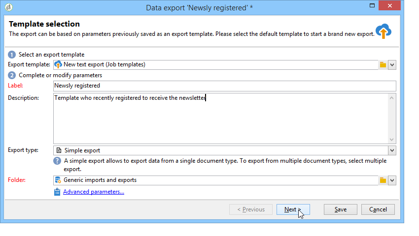
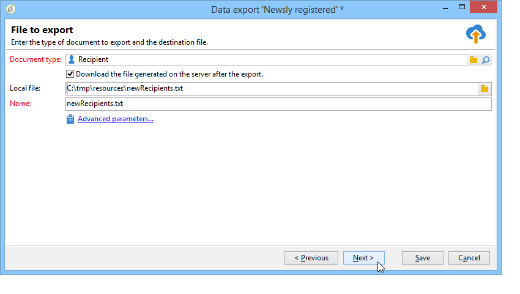
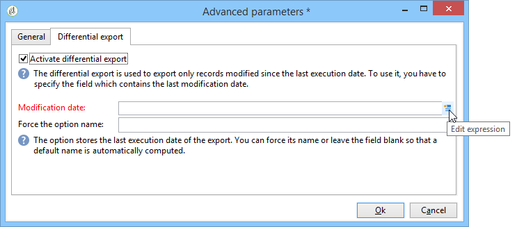
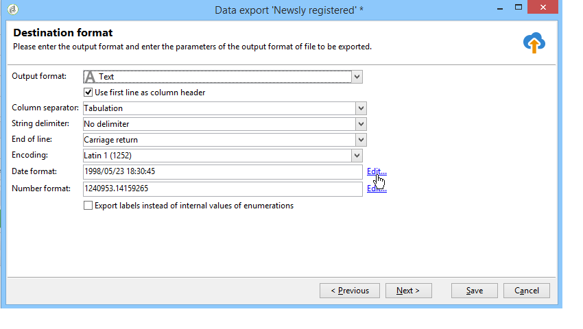
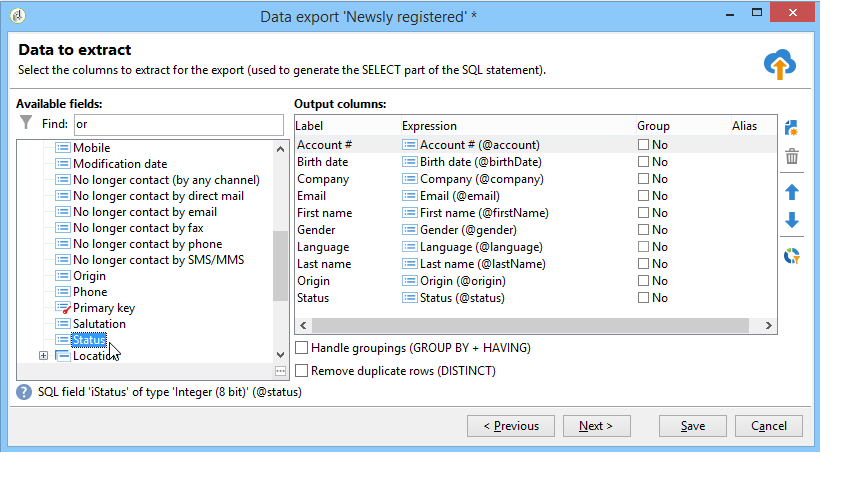
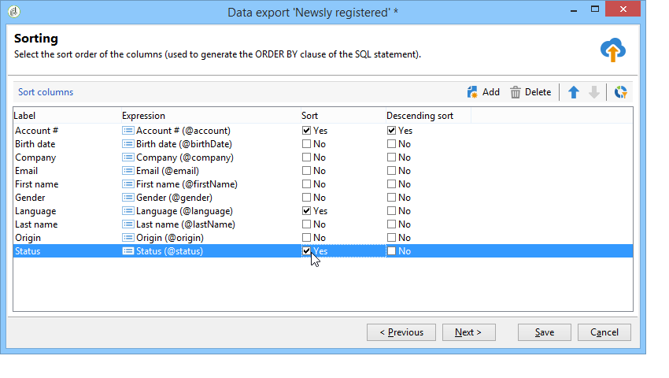
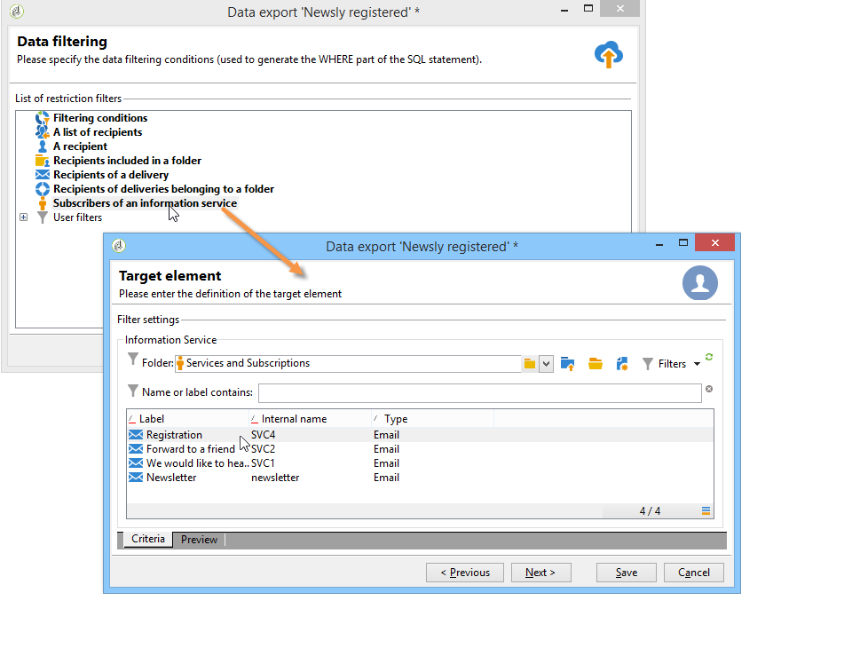
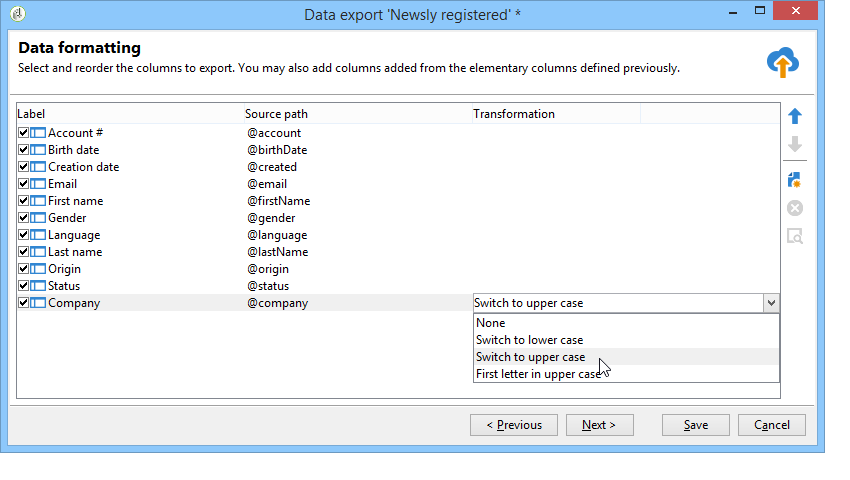
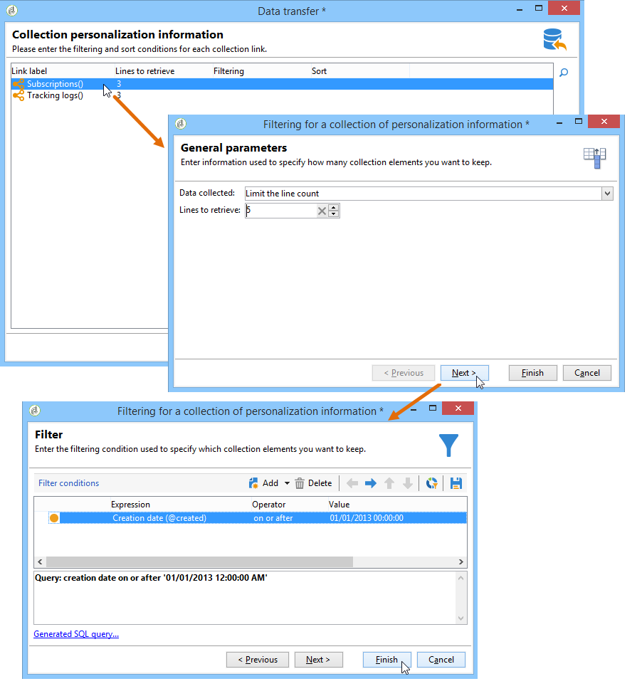
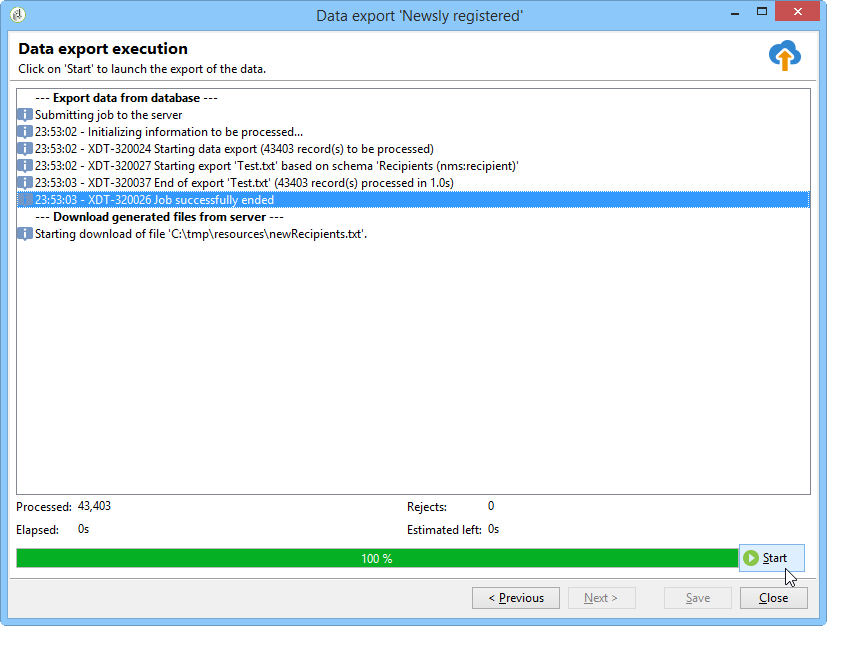

# Configure export jobs {#executing-export-jobs}

The export jobs allow you to access and extract data from the database: contacts, clients, lists, segments, etc.

For example, it can be useful to use campaign tracking data (tracking history, etc.) in a spreadsheet. The output data can be in txt, CSV, TAB, or XML format.

The export wizard lets you configure an export, define its options and launch execution. It is a series of screens whose content depends on the type of export (simple or multiple) and the operator's rights.

The export wizard displays after creating a new export job (see [Create import and export jobs](../../platform/using/creating-import-export-jobs.md).

## Step 1 - Choose the export template {#step-1---choosing-the-export-template}

When launching the export wizard, you first have to select a template. As an example, to configure the export of recipients who recently registered, follow the steps below:

1. Select the **[!UICONTROL Profiles and Targets > Job > Generic imports and exports]** folder.
1. Click **New** and then click **Export** to create the export template.

   

1. Click the arrow to the right of the **[!UICONTROL Export template]** field to select your template, or click **[!UICONTROL Select link]** to browse the tree.

   The native template is **[!UICONTROL New text export]**. This template must not be modified, but you can duplicate it to configure a new template. By default, export templates are saved in the **[!UICONTROL Resources > Templates > Job templates]** node.

1. Enter a name for export in the **[!UICONTROL Label]** field. You can add a description.
1. Select the export type. There are two possible types of export: **[!UICONTROL Simple export]** to export only one file, and **[!UICONTROL Multiple export]** to export several files in a single execution, from one or more types of source document.

## Step 2 - Type of file to export {#step-2---type-of-file-to-export}

Select the type of document to be exported, i.e. the schema of the data to export.

By default, when the export is launched from the **[!UICONTROL Jobs]** node the data comes from the recipient table. When the export is launched from a list of data (from the **[!UICONTROL right click > Export]** menu), the table to which the data belongs is automatically filled in in the **[!UICONTROL Document type]** field.

* By default, the **[!UICONTROL Download the file generated on the server after the export]** option is selected. In the **[!UICONTROL Local file]** field, fill in the name and path of the file to be created, or browse your local disk by clicking the folder to the right of the field. You can deselect this option to enter the access path and name of the server output file.

  >[!NOTE]
  >
  >Automatic import and export jobs are always performed on the server.  
  >
  >To export only some of the data, click **[!UICONTROL Advanced parameters]** and enter the number of lines to be exported in the appropriate field.

* You can create a differential export to export only records that have been modified since the last execution. To do this, click the **[!UICONTROL Advanced parameters]** link, then click the **[!UICONTROL Differential export]** tab, then select **[!UICONTROL Activate differential export]**.

  

  You must enter the date of the last modification. It can be retrieved from a field or calculated.

## Step 3 - Define the output format {#step-3---defining-the-output-format}

Select an output format for the export file. The following formats can be used: text, fixed-column text, CSV, and XML.

* For **[!UICONTROL Text]** format, select the delimiters to separate the columns (tabs, commas, semi-colons, or custom) and the strings (single or double quotes, or none).
* For **[!UICONTROL text]** and **[!UICONTROL CSV]**, you can select the option **[!UICONTROL Use first lines as column titles]**.
* Indicate the date format and number format. To do this, click the **[!UICONTROL Edit]** button for the field concerned and use the editor.
* For fields containing enumerated values, you can select **[!UICONTROL Export labels instead of internal values of enumerations]**. For example, the title can be stored in the form **1=Mr.**, **2=Miss**, **3=Mrs.**. If this option is selected, **Mr.**, **Miss** and **Mrs.** will be exported.

## Step 4 - Data selection {#step-4---data-selection}

Select the fields to export. To do this:

1. Double-click the desired fields in the **[!UICONTROL Available fields]** list in order to add them to the **[!UICONTROL Output columns]** section. 
1. Use the arrows to the right of the list to define the order of the fields in the output file.

   

1. Click the **[!UICONTROL Add]** button to call on functions. For more on this, refer to [List of functions](../../platform/using/defining-filter-conditions.md#list-of-functions).

## Step 5 - Sort columns {#step-5---sorting-columns}

Select the sorting order of the columns.

## Step 6 - Filter conditions {#step-6---filter-conditions-}

You can add filter conditions to avoid exporting all the data. The configuration of this filtering is the same as recipient targeting in the delivery wizard. Refer to [this page](../../delivery/using/steps-defining-the-target-population.md).

## Step 7 - Data formatting {#step-7---data-formatting}

You can modify the order and label of the fields for the output file and apply transformations to the source data.

* To change the order of columns to be exported, select the column concerned and use the blue arrows to the right of the table.
* To change the label of a field, click in the cell of the **[!UICONTROL Label]** column that matches the field to be modified, and enter the new label. Press Enter on the keyboard to confirm.
* To apply a case transformation to the content of a field, select it from the **[!UICONTROL Transformation]** column. You can select:

    * Switch to lower case
    * Switch to upper case
    * First letter in upper case

  

* Click **[!UICONTROL Add a calculated field]** if you want to create a new calculated field (for example, a column containing last name + first name). For more on this, refer to [Calculated fields](../../platform/using/executing-import-jobs.md#calculated-fields).

If you are exporting a collection of elements (e.g. recipients' subscriptions, the lists to which they belong, etc.), you must specify the number of elements in the collection you want to export. 

## Step 8 - Data preview {#step-8---data-preview}

Click **[!UICONTROL Start the preview of the data]** for a preview of the export result. By default, the first 200 lines are displayed. To change this value, click the arrows to the right of the **[!UICONTROL Lines to display]** field.

Click the tabs at the bottom of the wizard to switch from the preview of results in columns to the results in XML. You can also view the generated SQL queries.

## Step 9 - Launch the export {#step-9---launching-the-export}

Click **[!UICONTROL Start]** to launch data export.

You can then monitor the execution of the import job (see [Monitor jobs execution](../../platform/using/monitoring-jobs-execution.md).
