# Configure import jobs {#executing-import-jobs}

Adobe Campaign lets you import data into the database from one or more files in text, CSV, TAB, or XML format. These files are associated with a table (main or linked), and each field of the source file(s) is associated with a field of the database.

>[!NOTE]
>
>You can import data without mapping it with the database data using the **[!UICONTROL Import a list]** function. The data can then be used exclusively in workflows via the **[!UICONTROL Read list]** object. For more on this, refer to [this page](../../workflow/using/read-list.md).  

The import wizard lets you configure an import, define its options (such as data transformation), and launch execution. It is a series of screens whose content depends on the type of import (simple or multiple) and the operator's rights.

The import wizard displays after creating a new import job (see [Create import and export jobs](../../platform/using/creating-import-export-jobs.md).

>[!NOTE]
>
>If you use an IIS Web server, a configuration may be necessary to authorize uploading large files (>28 MB). For more information, refer to [this section](../../installation/using/integration-into-a-web-server-for-windows.md#changing-the-upload-file-size-limit).

## Source file {#source-file}

In the source file, each line coincides with a record. The data in records is separated by delimiters (space, tab, character, etc.). This means that data is retrieved in the form of columns, and each column is associated with a field of the database.

## Step 1 - Choose the import template {#step-1---choosing-the-import-template}

When launching the import wizard, you first have to select a template. As an example, to configure the import of recipients who received a newsletter, follow the steps below:

1. Select the **[!UICONTROL Profiles and Targets > Job > Generic imports and exports]** folder.
1. Click **New** and then click **Import** to create the import template.

   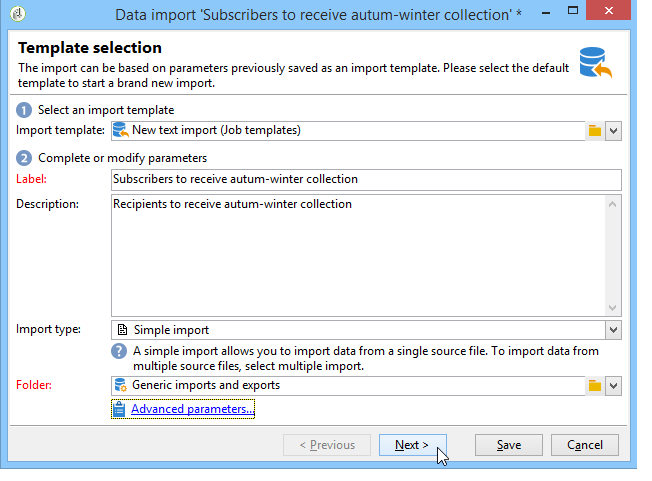

1. Click the arrow to the right of the **[!UICONTROL Import template]** field to select your template, or click **[!UICONTROL Select link]** to browse the tree.

   The native template is **[!UICONTROL New text import]**. This template must not be modified, but you can duplicate it to configure a new template depending on your requirements. By default, import templates are saved in the **[!UICONTROL Profiles and targets > Templates > Job templates]** node.

1. Enter a name for this import in the **[!UICONTROL Label]** field. You can add a description.
1. Select the import type in the appropriate field. There are two possible types of import: **[!UICONTROL Simple import]** to import only one file, and **[!UICONTROL Multiple import]** to import several files in a single execution.

   For a multiple import, select **[!UICONTROL Multiple import]** from the **[!UICONTROL Import type]** drop-down list in the first screen of the import wizard.

   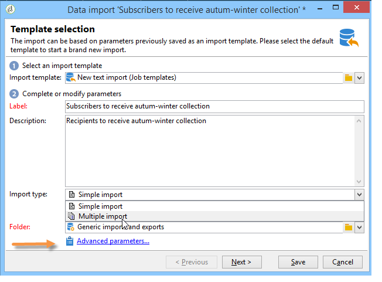

1. Specify the fields you want to import by clicking **[!UICONTROL Add]**.

   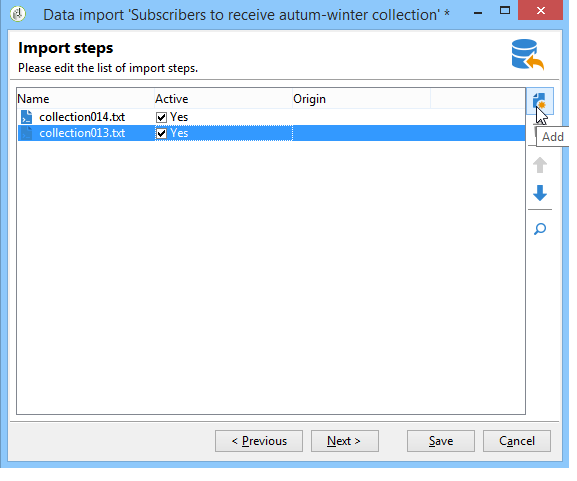

   Each time a file is added, the screen of the **[!UICONTROL File to import]** wizard is displayed. See section [Step 2 - Source file selection](#step-2---source-file-selection) and follow the steps in the wizard to define the import options as for a simple import.

   >[!NOTE]
   >
   >Multiple imports should only address specific needs and are not recommended.

### Advanced parameters {#advanced-parameters}

The **[!UICONTROL Advanced parameters]** link lets you access the following options:

* **[!UICONTROL General]** tab

    * **[!UICONTROL Stop execution if there are too many rejects]**

      This option is selected by default. You can deselect it if you want to continue executing the import irrespective of the number of rejects. By default, execution is stopped if the first 100 lines are rejected.
    
    * **[!UICONTROL Trace mode]**

      Select this option to track the execution of the import for each line.
    
    * **[!UICONTROL Start the job in a detached process]**

      This option is selected by default. It lets you detach the execution of the import so that it will not affect other jobs in progress on the database.
    
    * **[!UICONTROL Do not update enumerations]**

      Select this option to avoid enriching the list of enumerated values in the database. See [Manage enumerations](../../platform/using/managing-enumerations.md).

* **[!UICONTROL Variables]** tab

  You can define variables associated with the job that will be accessible in the query editors and calculated fields. To create a variable, click **[!UICONTROL Add]** and use the variable editor.

  >[!IMPORTANT]
  >
  >The **[!UICONTROL Variables]** tab is for Workflow-type programming use only, and should be configured by expert users only.

## Step 2 - Source file selection {#step-2---source-file-selection}

The source file can be in text format (txt, csv, tab, fixed columns) or xml.

By default, **[!UICONTROL Upload file on the server]** is selected. Click the folder to the right of the **[!UICONTROL Local file]** field to browse the local disk and select the file to import. You can deselect this option to enter the access path and the name of the file to import if it is on the server.

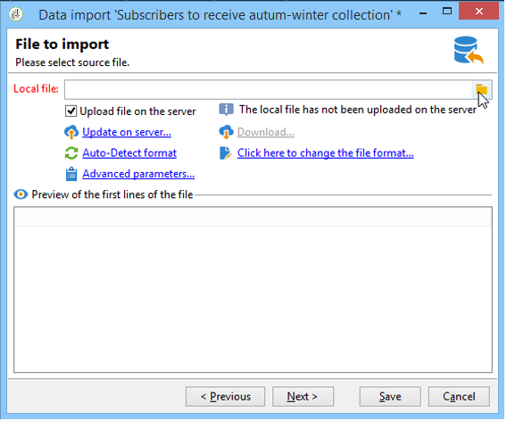

When the file has been specified, you can view its data in the lower section of the window by clicking **[!UICONTROL Auto-detect format]**. This preview displays the first 200 lines of the source file. 

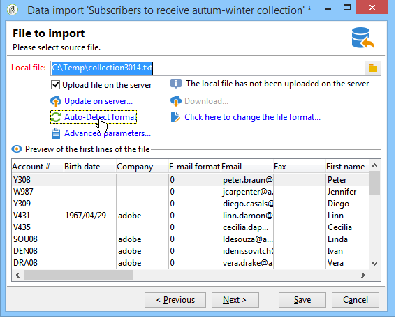

Use the options offered above this view to configure the import. The parameters defined via these options are transferred into the preview. The following options are available:

* **[!UICONTROL Click here to change the file format...]** lets you check the file format and fine-tune the configuration.
* **[!UICONTROL Update on server...]** lets you transfer the local file to the server. This option is available only if **[!UICONTROL Upload file on the server]** is selected.
* **[!UICONTROL Download]** is available only if the file has been uploaded on the server.
* **[!UICONTROL Auto-detect format]** is used to reinitialize the format of the data source. This option lets you reapply the original formats to data that has been formatted via the **[!UICONTROL Click here to change the file format...]** option.
* The **[!UICONTROL Advanced parameters]** link lets you filter the source data and access advanced options. From this screen, you can choose to import only part of the file. You can also define a filter, for example to import only 'Prospect' or 'Customer' type users, according to the value of the corresponding line. These options should be used by expert JavaScript users only.

### Change the file format {#changing-the-file-format}

The **[!UICONTROL Click here to change the file format...]** option lets you format the data of the source file, and in particular to specify the column separator and the type of data for each field. This configuration is performed via the following window:

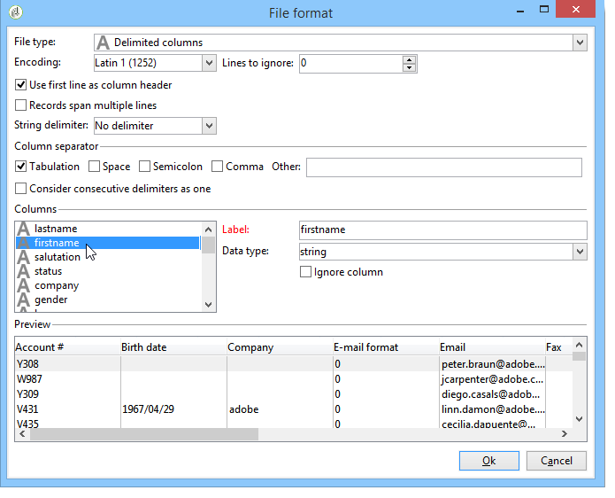

This step lets you describe how the values of the file fields should be read. For example, in the case of a date, the Date or Date + Time data can be associated with a format (dd/mm/yyyy, mm/dd/yy, etc.). If the input data does not match the expected format, rejects will occur during import.

You can view the result of the configuration in the preview zone in the lower part of the window.

Click **[!UICONTROL OK]** to save the formatting, then click **[!UICONTROL Next]** to display the next step.

## Step 3 - Field mapping {#step-3---field-mapping}

You must then select the destination schema and map the data of each column onto fields in the database. 

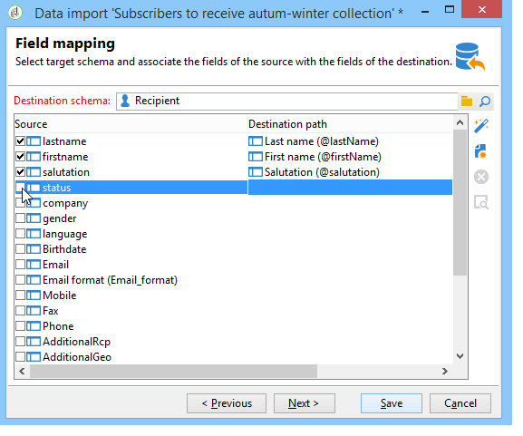

* The **[!UICONTROL Destination schema]** field lets you select the schema in which the data will be imported. This information is mandatory. Click the **[!UICONTROL Select link]** icon to select one of the existing schemas. Click **[!UICONTROL Edit link]** to display the content of the selected table. 
* The central table shows all the fields defined in the source file. Select the fields to be imported in order to associate a destination file with them. These fields can be mapped manually or automatically.

  To map a field manually, click the checkbox to select the source field, and click the second column to activate the cell corresponding to the selected field. Next, click the **[!UICONTROL Edit expression]** icon to display all the fields of the current table. Select the destination field and click **[!UICONTROL OK]** to validate the mapping.

  To associate the source fields and destination fields automatically, click the **[!UICONTROL Guess the destination fields]** icon to the right of the list of fields. The proposed fields can be modified if required.

  >[!IMPORTANT]
  >
  >The result of this operation must always be validated before you proceed to the next step.

* You can apply a transformation to the imported fields. To do this, click in the cell of the **[!UICONTROL Transformation]** column that relates to the field concerned, and select the transformation to be applied.

  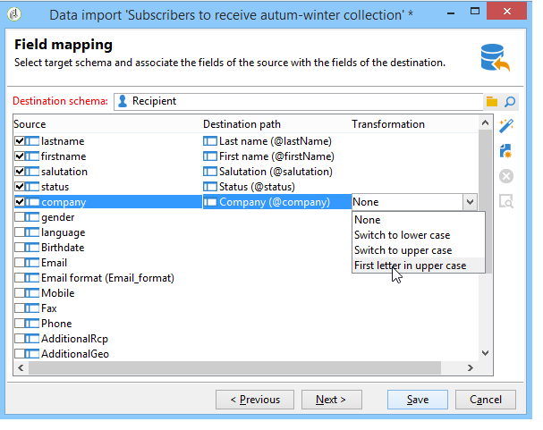

  >[!IMPORTANT]
  >
  >The transformation is applied at the time of the import. If constraints on the destination field have been defined, however (in the above example, on the @lastname field), these constraints take priority.

* You can add calculated fields using the appropriate icon, located to the right of the central table. Calculated fields let you perform complex transformations, add virtual columns, or merge the data of several columns. Refer to the following sections for details of the various possibilities.

### Calculated fields {#calculated-fields}

Calculated fields are new columns added to the source file and calculated from other columns. Calculated fields can then be associated with fields of the Adobe Campaign database. Reconciliation operations, however, are not possible on calculated fields.

There are four types of calculated fields:

* **[!UICONTROL Fixed string]**: the value of the calculated field is the same for all the lines of the source file. Lets you set the value of a field of the records inserted or updated. For example, you can set a marker to "yes" for all imported records.
* **[!UICONTROL String with JavaScript tags]**: the value of the calculated field is a character string containing JavaScript commands.
* **[!UICONTROL JavaScript expression]**: the value of the calculated field is the result of the evaluation of a JavaScript function. The value returned can be a number, a date, etc.
* **[!UICONTROL Enumeration]**: the value of the field is attributed according to a value contained in the source file. The editor lets you specify the source column and enter the list of enumeration values, as in the following example:

  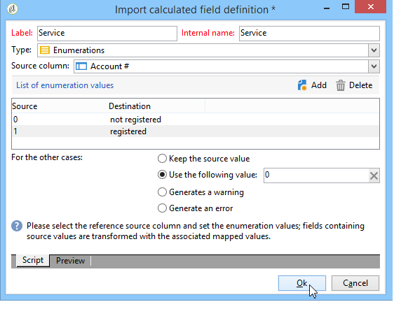

  The **[!UICONTROL Preview]** tab lets you view the result of the defined configuration. Here, the **[!UICONTROL Subscription]** column has been added. The value is calculated from the **Status** field.

  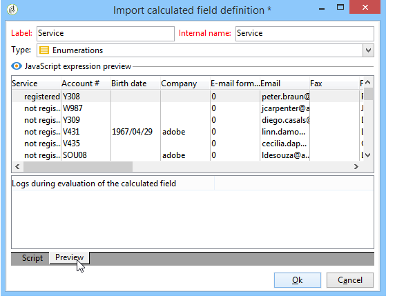

## Step 4 - Reconciliation {#step-4---reconciliation}

The reconciliation step of the import wizard lets you define the mode of reconciling the data from the file with the existing data in the database, and to set the priority rules between the file data and the database data. The configuration window looks like this:

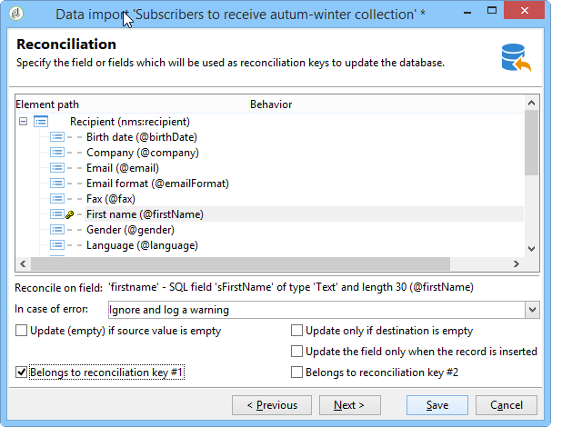

The central section of the screen contains a tree with the fields and the tables of the Adobe Campaign database to which the data will be imported.

Special options are available for each node (table or field). When you click the node concerned in the list, its parameters and a brief description appear below. The behavior defined for each element is displayed in the corresponding **[!UICONTROL Behavior]** column.

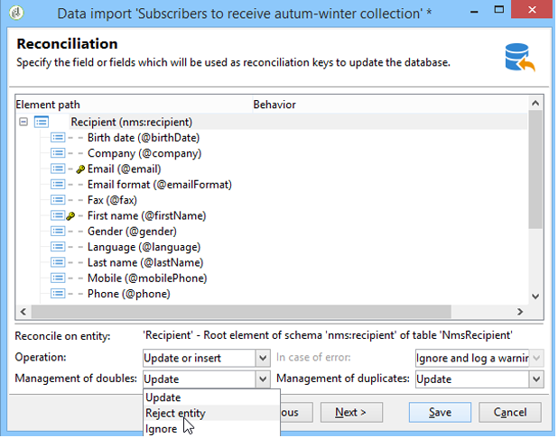

### Types of operation {#types-of-operation}

For each table concerned by the import, you must define the type of operation. The following operations are available for the main element of the database:

* **[!UICONTROL Update or insertion]**: updates the record if it exists in the database, and creates it if not.
* **[!UICONTROL Insertion]**: inserts records into the database.
* **[!UICONTROL Update]**: updates existing records only (ignores other records).
* **[!UICONTROL Reconciliation only]**: looks for the record in the database, but does not perform an update. For example, lets you associate the folder of recipients to import according to a column of the file without updating the data in the folders.
* **[!UICONTROL Deletion]**: lets you destroy records in the database.

The following options are available for each field in the table concerned by the import:

* **[!UICONTROL Update (empty) if source value is empty]**: in the event of an update, the value in the field will remove the database value if the field is empty in the source file. Otherwise, the database field is kept.
* **[!UICONTROL Update only if destination is empty]**: the value from the source file does not overwrite the value in the database field unless the database field is empty. In that case, it takes the value of the source file. 
* **[!UICONTROL Update the field only when the record is inserted]**: during an update or insertion operation, only source file records that are new will be imported.

>[!NOTE]
>
>The definition of a reconciliation key is always **mandatory**, except in the case of insertion without deduplication.

### Reconciliation keys {#reconciliation-keys}

At least one reconciliation key must be filled in to manage deduplication.

A reconciliation key is a set of fields used to identify a record. For example, to import recipients, the reconciliation key can be the account number, the "e-mail" field, or the "Last name, First name, Company" fields, etc.

In this case, to find out if a line of a file matches an existing recipient in the database, the import engine compares the values of the file with those of the database for all fields of the key. When fields are specific to a record, a fine comparison between the source and destination data can be performed, guaranteeing the integrity of data after import. A second reconciliation key can be filled in for the same table; it is used for the lines whose first key is empty.

Avoid choosing a field which might be modified during import; if this occurs, the engine could create additional records.

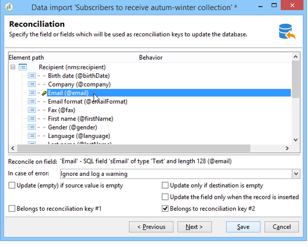

>[!NOTE]
>
>For a recipient import, the identifier of the selected folder is implicitly added to the key. 
>
>Reconciliation is therefore performed on this folder only (unless no folder is selected).

### Deduplication {#deduplication}

>[!NOTE]
>
>A 'double' is an item that exists two or more times in the file to be imported.  
>
>A 'duplicate' is an item that exists both in the file to be imported and in the database.

The **[!UICONTROL Management of doubles]** field lets you configure the deduplication of data. Deduplication concerns records that appear several times **in the source file** (or source files in the event of a multiple-file import), i.e. lines for which the fields of the reconciliation key are identical.

* Duplicate management in **[!UICONTROL Update]** mode (the default mode) does not perform deduplication. The last record therefore has priority (because it updates the data of the preceding records). Counting of duplicates is not performed in this mode.
* Duplicate management in **[!UICONTROL Ignore]** mode or **[!UICONTROL Reject entity]** excludes duplicates from the import. In this case, no record is imported.
* In **[!UICONTROL Reject entity]** mode, the element is not imported, and an error is generated in the import logs.
* In **[!UICONTROL Ignore]** mode, the element is not imported, but no trace of the error is kept. This mode lets you optimize performance.

>[!IMPORTANT]
>
>Deduplication is performed in memory only. The size of an import with deduplication is therefore limited. The limit depends on several parameters (capacity of the application server, activity, number of fields in the key, etc.). The maximum size for a deduplication is of the order of 1,000,000 lines.

Deduplication concerns a record that is present both in the source file and the database. It concerns operations with update only (i.e. **[!UICONTROL Update and insertion]** or **[!UICONTROL Update]**). The **[!UICONTROL Duplicate management]** option lets you update or ignore the record if it is in both the source file and the database. The **[!UICONTROL Update or insert based on origin]** option belongs to the optional module and cannot be used in a standard context.

The options **[!UICONTROL Reject]** and **[!UICONTROL Ignore]** operate as presented above.

### In case of error {#behavior-in-the-event-of-an-error}

Most data transfer operations generate various types of errors (incoherent line format, invalid e-mail address, etc.). All errors and all warnings generated by the import engine are stored and linked to the import instance.

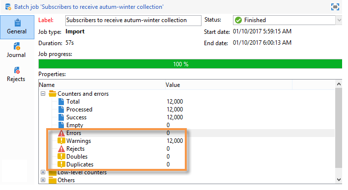

Details of these rejects can be viewed via the **[!UICONTROL Rejects]** tab. 

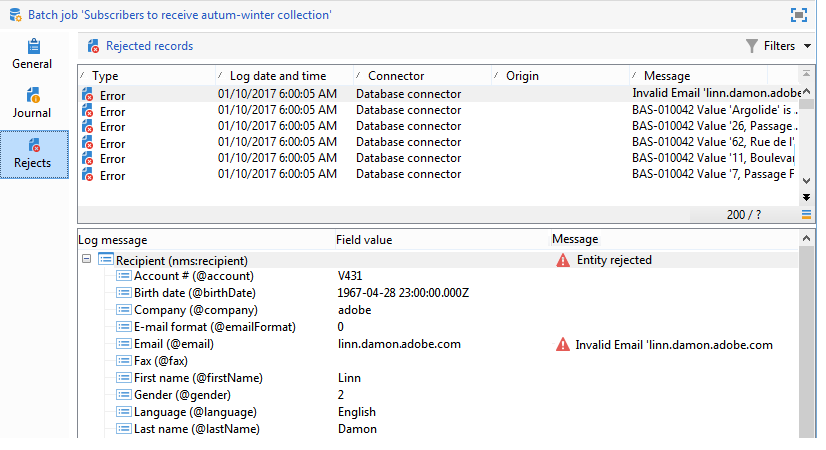

There are two types of rejects (the type is displayed in the **[!UICONTROL Connector]** column):

* Rejections of the text connector concern errors which occur while the file line is being processed (calculated field, data analysis, etc.). In this case, in the event of an error, the entire line is always rejected.
* Database connector rejections concern errors occurring during data reconciliation or writing to the database. In the case of an import to several tables, the rejection can concern only a part of the record (for example, for an import of recipients and associated events, an error can prevent the updating of an event without rejecting the recipient).

In the data reconciliation page, you can define the desired error management type field by field and table by table.

* **[!UICONTROL Ignore and log a warning]**: all of the fields are imported into the database except the one that generated an error.
* **[!UICONTROL Reject parent element]**: the entire line of the record is rejected, not only the field that caused an error.
* **[!UICONTROL Reject all elements]**: the import stops and all elements of the record are rejected.

  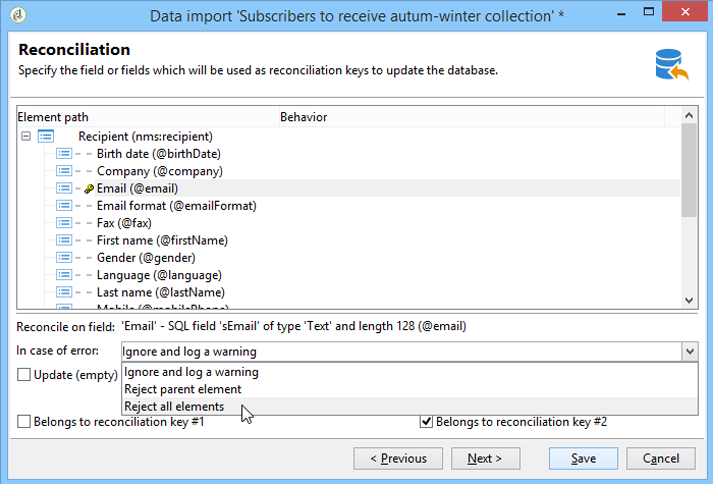

The tree in the rejection screen of an import instance indicates which fields were rejected and where the errors occurred.

You can generate a file containing these records via the **[!UICONTROL Export rejects]** icon:

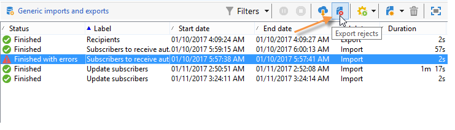

## Step 5 - Additional step when importing recipients {#step-5---additional-step-when-importing-recipients}

The next step of the import wizard lets you select or create the folder in which data will be imported, automatically map imported recipients with a (new or existing) list, and subscribe recipients to a service.

>[!NOTE]
>
>This step appears when importing recipients only and when using the default Adobe Campaign recipients table (**nms:recipient**).

* Click the **[!UICONTROL Edit]** links to select the folder, the list, or the service to which you want to associate or subscribe the recipients.

    1. Importing into a folder

       The **[!UICONTROL Edit...]** link of the **[!UICONTROL Import into a folder]** section lets you select or create the folder into which the recipients will be imported. By default, if no partition is defined, the data is imported into the operator's default folder.

       >[!NOTE]
       >
       >The default folder for an operator is the first folder for which the operator has write access. Learn more in [Folder access management](../../platform/using/access-management-folders.md).

       To select the import folder, click the arrow to the right of the **[!UICONTROL Folder]** field and select the folder concerned. You can also use the **[!UICONTROL Select link]** icon to display the tree in a new window or create a new folder. 
    
       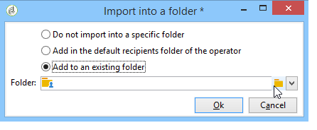

       To create a new folder, select the node from which you want to add a folder, and right-click. Select **[!UICONTROL Create a new 'Recipients' folder]**.
    
       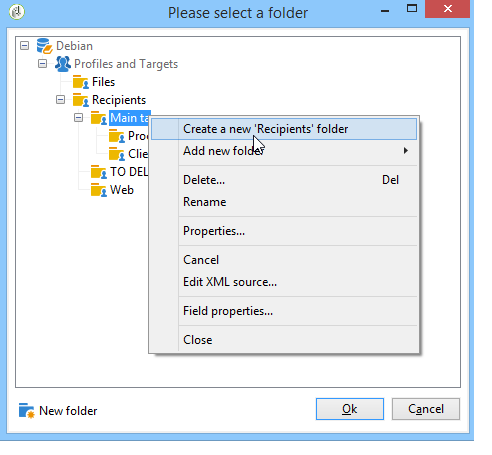

       The folder is added below the current node. Enter the name of the new folder, hit Enter to confirm, and then click **[!UICONTROL OK]**.
    
       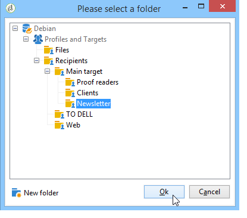

    1. Associating with a list

       The **[!UICONTROL Edit...]** link in the **[!UICONTROL Add recipients to a list]** section lets you select or create a list into which the recipients will be imported.
    
       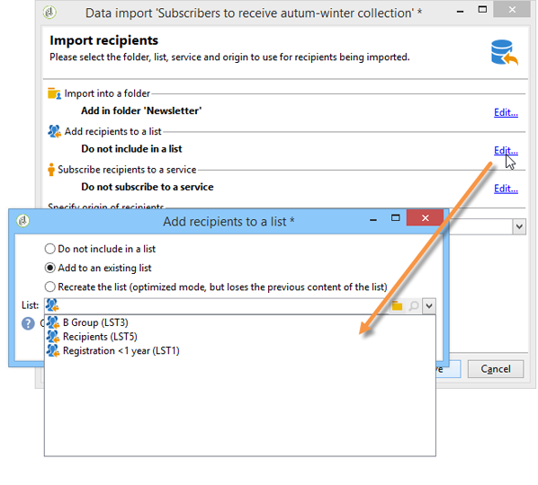

       You can create a new list for these recipients by clicking **[!UICONTROL Select link]**, then **[!UICONTROL Create]**. The creation and management of lists are presented in [this section](../../platform/using/creating-and-managing-lists.md).
    
       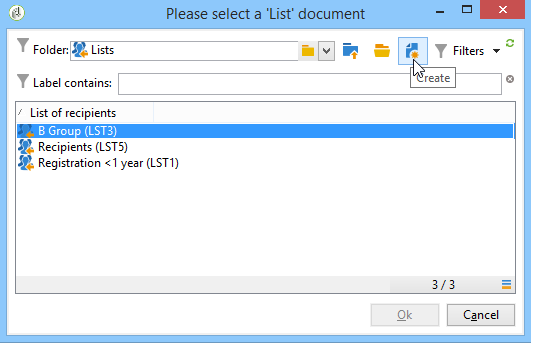

       You can decide to add the recipients to those already present in a list, or to recreate the list with the new recipients. In this case, if the list already contained recipients, they will be deleted and replaced by the imported recipients.
    
    1. Subscribing to a service

       To subscribe all imported recipients to an information service, click the **[!UICONTROL Edit...]** link of the **[!UICONTROL Subscribe recipients to a service]** section in order to select or create the information service which the recipients will be subscribed to. You can select the **[!UICONTROL Send a confirmation message]** option: The content of this message is defined in the delivery template associated with the subscription service.
    
       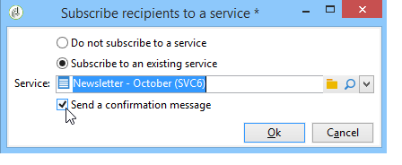

       You can create a new service for these recipients by clicking **[!UICONTROL Select link]** and then the **[!UICONTROL Create]** icon. The management of information services is presented in [this section](../../delivery/using/managing-subscriptions.md).

* Use the **[!UICONTROL Origin]** field to add information about the origin of recipients to their profiles. This information is particularly useful within the framework of a multiple import.

Click **[!UICONTROL Next]** to validate this step and display the following step.

## Step 6 - Launch the import {#step-6---launching-the-import}

The last step of the wizard lets you launch data import. To do this, click the **[!UICONTROL Start]** button.

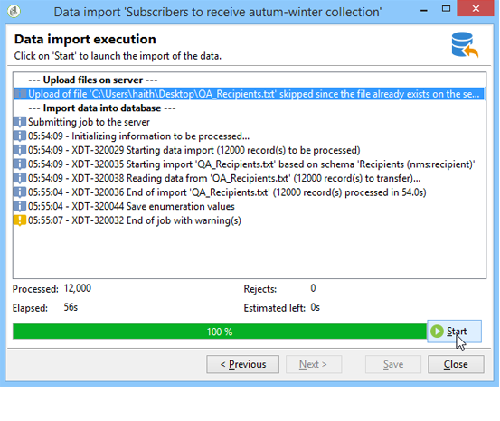

You can then monitor the execution of the import job (see [Monitor jobs execution](../../platform/using/monitoring-jobs-execution.md).
