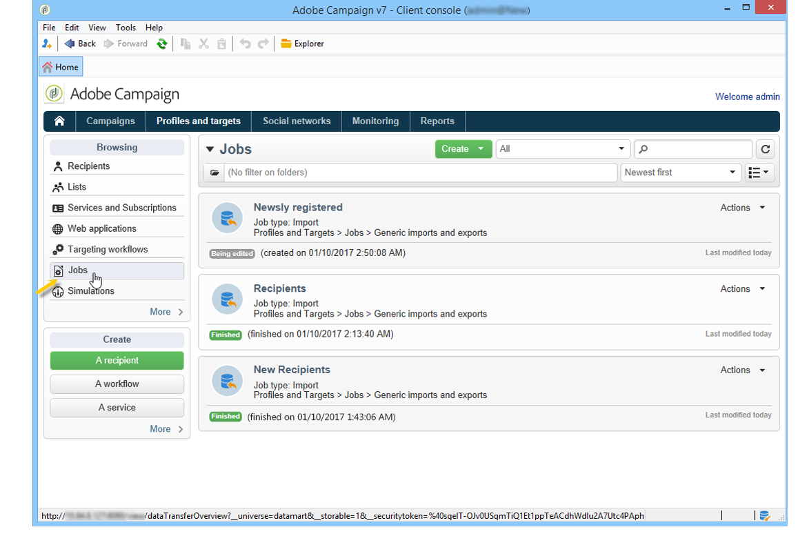

# Exporting and importing profiles{#exporting-and-importing-profiles}

Recipient profiles can be imported into the Adobe Campaign database or exported and stored in a file external to the database.

To configure and execute data imports and exports, go to the **[!UICONTROL Profiles and targets]** universe and click the **[!UICONTROL Jobs]** link.

>[!NOTE]
>
>Data importing and exporting are presented in [Generic imports and exports](https://helpx.adobe.com/campaign/standard/platform/using/generic-imports-and-exports.html) and in [this video](https://docs.campaign.adobe.com/doc/AC/en/Videos/Videos.html).

