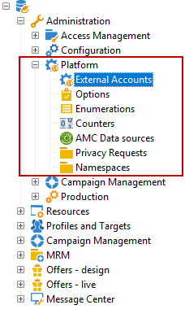
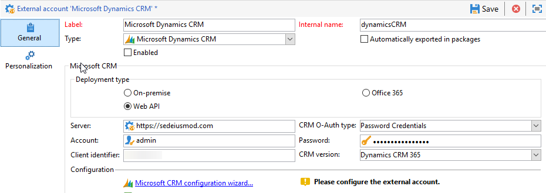

# External accounts{#external-accounts}

An external account is a configuration that allows you to configure and test the access to a server that is external to Adobe Campaign. These external accounts can be used in Campaign workflows to access and manage data.

You can set up the following types of external accounts:

* [Routing external account](../../platform/using/external-accounts.md#routing-external-account)
* [FTP external account](../../platform/using/external-accounts.md#ftp-external-account)
* [External database external account](../../platform/using/external-accounts.md#external-database-external-account)
* [Web Analytics external account](../../platform/using/external-accounts.md#web-analytics-external-account)
* [Facebook connect external account](../../platform/using/external-accounts.md#facebook-connect-external-account)
* [Execution instance external account](../../platform/using/external-accounts.md#execution-instance-external-account)
* [Adobe Experience Cloud external account](../../platform/using/external-accounts.md#adobe-experience-cloud-external-account)
* [SFTP external account](../../platform/using/external-accounts.md#sftp-external-account)
* [Adobe Experience Manager external account](../../platform/using/external-accounts.md#adobe-experience-manager-external-account)
* [Amazon Simple Storage Service (S3) external account](../../platform/using/external-accounts.md#amazon-simple-storage-service--s3--external-account)
* [Azure external account](../../platform/using/external-accounts.md#azure-external-account)
* [Hadoop external account](../../platform/using/external-accounts.md#hadoop-external-account)
* [Microsoft Dynamics CRM external account](../../platform/using/external-accounts.md#microsoft-dynamics-crm-external-account)
* [Oracle on demand external account](../../platform/using/external-accounts.md#oracle-on-demand-external-account)
* [Salesforce CRM external account](../../platform/using/external-accounts.md#salesforce-crm-external-account)

## Creating an external account {#creating-an-external-account}

Adobe Campaign comes with a set of pre-defined external accounts. In order to set up connections with external systems such as FTP servers used for file transfers, you can create your own external accounts.

External accounts are used by technical processes such as technical workflows or campaign workflows. When setting up a file transfer in a workflow or a data exchange with any other application (Adobe Target, Experience Manager, etc.), you need to select an external account.

1. From the **Explorer**, unfold the **Administration** menu.
1. Unfold the **Platform** menu and click **External accounts**.

   

1. Click the **New** button.

   

1. Enter a **Label** and **Internal Name**. Both will be used when selecting external accounts in workflows.
1. Check **Enabled** if you want your connection to be enabled. 
1. Select your external account **Type** which one you want to create.
1. Configure the access to the account by specifying credentials depending on the chosen external account type.

   The necessary information is usually provided by the provider of the server you are connecting to.

1. Click **Save**.

The external account is created and added to the external accounts list. It is now available for your data/file transfers or routing configurations in workflow activities and delivery properties.

## Bounce mails external account {#bounce-mails-external-account}

The **Bounce mails** external account specifies the external POP3 account to be used to connect to the email service. For more on this external account, refer to this [page](../../workflow/using/inbound-emails.md).

All servers configured for POP3 access can be used to receive return mail.


To configure the **Bounce mails (defaultPopAccount)** external account:

* **Server**

  URL of the POP3 server.

* **Port**

  POP3 connection port number. The default port is 110.

* **Account**

  Name of the user.

* **Password**

  User account password.

* **Encryption**

  Type of chosen encryption between **By default**, **POP3 + STARTTLS**, **POP3** or **POP3S**.

## Routing external account {#routing-external-account}

The **Routing** external account allows you to configure each channel available in Adobe Campaign depending on the packages installed.


The following channels can be configured:

* [Email](../../installation/using/deploying-an-instance.md#email-channel-parameters)
* [Mobile (SMS)](../../delivery/using/sms-channel.md#activating-an-external-account).
* [Phone](../../delivery/using/other-channels.md)
* [Direct mail](../../delivery/using/about-direct-mail-channel.md)
* [Agency](../../delivery/using/other-channels.md)
* [Facebook](../../social/using/publishing-on-facebook-walls.md#delegating-write-access-to-adobe-campaign)
* [Twitter](../../social/using/configuring-publishing-on-twitter.md)
* [iOS channel](../../delivery/using/setting-up-mobile-app-channel.md#ios-connectors)
* [Android channel](../../delivery/using/setting-up-mobile-app-channel.md#android-connectors)

## FTP external account {#ftp-external-account}

The FTP external account lets you configure and test access to a server outside of Adobe Campaign. To set up connections with external systems such as FTP servers 898 used for file transfers, you can create your own external accounts. For more on this, refer to this [page](../../workflow/using/file-transfer.md).

To do so, specify in this external account the address and credentials used to establish the connection to the FTP server


* **Server**

  Name of the FTP server.

* **Port**

  FTP connection port number. The default port is 21.

* **Account**

  Name of the user.

* **Password**

  User account password.

* **Encryption**

  Type of chosen encryption between **None** or **SSL**.

To know where to locate these credentials, refer to this [page](https://help.dreamhost.com/hc/en-us/articles/115000675027-FTP-overview-and-credentials).

## External database external account {#external-database-external-account}

Adobe Campaign provides several connectors that allow you to communicate with external applications and connect to database engines.


The following connection types can be configured:

* Oracle
* Microsoft SQL server
* PostgreSQL
* Teradata
* DB2
* MySQL
* InfiniDB
* Netezza
* AsterData
* SAP HANA
* Amazon Redshift
* ODBC (Sybase ASE, Sybase IQ)
* HTTP relay to remote database

### Teradata external account {#teradata-external-account}

The **Teradata** external account allows you to connect your Campaign instance to your Teradata external database. For more information on how to configure Campaign Classic with Teradata, refer to this [page](https://helpx.adobe.com/campaign/kb/campaign_fda_teradata.html).


To configure this external account to work with Adobe Campaign, you need to provide the following details:

* **Type**

  Choose the **Teradata** type.

* **Server**

  URL or name of your Teradata server.

* **Account**

  Name of the account used to access the Teradata database.

* **Password**

  Password used to connect to the Teradata database.

* **Database**

  This field can be left empty.

* **Options**

  Options to be passed through Teradata

* **Timezone**

  Timezone set in Teradata


When multiple Adobe Campaign users connect to the same FDA Teradata external account, the **Query banding** tab allows you to set a query band, i.e. a set of key/value pairs, on a session.

Each time a Campaign user performs a query on the Teradata database, Adobe Campaign will send meta data, which consists of a list of keys, associated to this user. This data can then be used by Teradata administrators for audit purposes or to manage access rights.

Check the **Active** box to activate this feature

The **Default** field lets you enter a default query band that will be used if a user has no associated query band. If this field is left empty, the users with no query band will not be able to use Teradata.

The **Users** field allows you to specify a query band for each user. You can add as many key/value pairs as you need e.g. priority=1;workload=high. If the user has no query band assigned, the **Default** field will be applied.

For more information on **Query banding**, refer to the [Teradata documentation](https://docs.teradata.com/reader/cY5B~oeEUFWjgN2kBnH3Vw/a5G1iz~ve68yTMa24kVjVw).

## Web Analytics external account {#web-analytics-external-account}

The **Web Analytics (Adobe Analytics - Data connector)** external account allows you to forward data from Adobe Analytics to Adobe Campaign in the form of segments. Conversely, it sends indicators and attributes of email campaigns delivered by Adobe Campaign to Adobe Analytics - Data connector.


For this external account, the calculation formula for tracked URLs must be enriched and connection between the two solutions must be approved. For more on this, refer to this [page](../../platform/using/adobe-analytics-data-connector.md#step-2--create-the-external-account-in-campaign).

## Facebook connect external account {#facebook-connect-external-account}

The **Facebook Connect** external account lets you display personalized content in your Facebook applications, making it easier to acquire prospects via this social network.

For each Facebook application, you need to create a **Facebook Connect** type external account. For more on this, refer to [page](../../social/using/creating-a-facebook-application.md#configuring-external-accounts).


* **Hosting mode**

  Hosting mode of the application between **hosted by a partner** or **hosted by this instance**.

* **Application ID**

  App ID of your Facebook application.

* **Application secret**

  App secret of your Facebook application

If you chose the hosted by this instance mode, the Secure Canvas URL needs to be paste into the **Facebook Web games (https)** field on Facebook

To know where to locate these credentials, refer to this [page](https://developers.facebook.com/docs/facebook-login/access-tokens).

## Execution instance external account {#execution-instance-external-account}

If you have a broken-down architecture, you need to specify the execution instances linked to the control instance and connect them. Transactional message templates are deployed to the execution instance


* **URL**

  URL of the server on which the execution instance is installed.

* **Account**

  Name of the account, it must match the Message Center Agent as defined in the operator folder. 

* **Password**

  Password of the account as defined in the operator folder.

For more information on this configuration, refer to this [page](../../message-center/using/creating-a-shared-connection.md#control-instance).

## Adobe Experience Cloud external account {#adobe-experience-cloud-external-account}

To connect to the Adobe Campaign console using an Adobe ID, you must configure the **Adobe Experience Cloud (MAC)** external account.


* **IMS server**

  URL of your IMS server. Make sure both stage and production instances point to the same IMS production end point.

* **IMS scope**

  Scopes defined here must be a subset of those provisioned by IMS.

* **IMS client identifier**

  ID of your IMS client.

* **IMS client secret**

  Credential of your IMS client secret

* **Callback server**

  Access URL of your Adobe Campaign instance

* **IMS organization ID**

  ID of your IMS organization. To find your organization ID, refer to this [page](https://marketing.adobe.com/resources/help/en_US/mcloud/faq.html) (**Where can I find my IMS organization ID?**).

* **Association mask**

  Syntax which will allow configuration names in Enterprise Dashboard to be synced with the groups in Adobe Campaign.

* **Server**

  URL of your Adobe Experience Cloud instance.

* **Tenant**

  Name of your Adobe Experience Cloud Tenant.

For more information on this configuration, refer to this [page](../../integrations/using/configuring-ims.md).

## SFTP external account {#sftp-external-account}

The SFTP external account lets you configure and test access to a server outside of Adobe Campaign. To set up connections with external systems such as SFTP used for file transfers, you can create your own external accounts. For more on this, refer to this [page](../../workflow/using/file-transfer.md).


* **Server**

  URL of the SFTP server.

* **Port**

  FTP connection port number. The default port is 22.

* **Account**

  Account name used to connect to the SFTP server.

* **Password**

  Password used to connect to the SFTP server.

## Adobe Experience Manager external account {#adobe-experience-manager-external-account}

The **AEM (AEM instance)** external account allows you to manage the content of your email deliveries as well as your forms directly in Adobe Experience Manager.


* **Server**

  URL of the Adobe Experience Manager server.

* **Port**

  Account name used to connect to the Adobe Experience Manager authoring instance.

* **Password**

  Password used to connect to the Adobe Experience Manager authoring instance.

For more on this, refer to this [section](../../integrations/using/about-adobe-experience-manager.md).

## Amazon Simple Storage Service (S3) external account {#amazon-simple-storage-service--s3--external-account}

The Amazon Simple Storage Service (S3) connector can be used to import or export data to Adobe Campaign. It can be set up in a workflow activity. For more on this, refer to this [page](../../workflow/using/file-transfer.md).


As you are setting up this new external account, you need to provide the following details:

* **AWS S3 Account Server**

  URL of your server, it should be filled as follows:

  ```
  <S3bucket name>.s3.amazonaws.com/<s3object path>
  ```

* **AWS access key ID**

  To know where to find your AWS access key ID, refer to this .

* **Secret access key to AWS**

  To know where to find your secret access key to AWS, refer to this [page](https://aws.amazon.com/fr/blogs/security/wheres-my-secret-access-key/).

* The **Use server side encryption** checkbox allows you to store your file in S3 encrypted mode.

To learn where to find the access key ID and secret access key, refer to Amazon Web services .

## Azure external account {#azure-external-account}

The **Azure** external account enables a connection to a shared external database, as long as this connection is active, the database can be accessed via Adobe Campaign.


* **Server**

  URL of the Azure server.

* **Encryption**

  Type of chosen encryption between **None** or **SSL**.

* **Access key**

  To know where to find your access key, refer to this [page](https://docs.microsoft.com/en-us/azure/storage/common/storage-account-manage) (section **View and copy access keys**).

## Hadoop external account {#hadoop-external-account}

The **Hadoop** external account enables a connection to a shared external database, as long as this connection is active, the database can be accessed via Adobe Campaign.


* **Server**

  URL of the Hadoop server.

* **User account name**

  Name of the account used to access Hadoop.

## Microsoft Dynamics CRM external account {#microsoft-dynamics-crm-external-account}

The **Microsoft Dynamics CRM** external account allows you to import and export Microsoft Dynamics data into Adobe Campaign.



To configure the Microsoft Dynamics connector to work with Adobe Campaign, you need to provide the following details:

* **Account**

  Account used to sign in to Microsoft CRM.

* **Server**

  URL of your Microsoft CRM server.

* **Password**

  Password used to sign in to Microsoft CRM.

* **Company name** for On-premise and Office 365 deployment

  Company name which can be found in the Developers resource dashboard, **Unique Name** field.

* **Client identifier** for Web API deployment

  Client ID which can be found from Microsoft Azure management portal in the **Update your code** category, **Client ID** field.

* **Organization name** for On-premise deployment

  Name of your organization.

* **CRM version** for On-premise and Web API deployments

  Version of the CRM between **Dynamics CRM 2007**, **Dynamics CRM 2015** or **Dynamics CRM 2016**.

For more information on this configuration, refer to this [page](../../platform/using/crm-connectors.md#example-for-microsoft-dynamics).

## Oracle on demand external account {#oracle-on-demand-external-account}

The **Oracle on demand** external account allows you to import and export Oracle data into Adobe Campaign.


To configure the Oracle on demand external account to work with Adobe Campaign, you need to provide the following details:

* **Account**

  Account used to sign in to Oracle CRM on demand.

* **Server**

  URL of your Oracle CRM on demand server.

* **Password**

  Password used to sign in to Oracle CRM on demand.

For more information on this configuration, refer to this [page](../../platform/using/crm-connectors.md#example-for-oracle-on-demand).

## Salesforce CRM external account {#salesforce-crm-external-account}

The **Salesforce CRM** external account allows you to import and export Salesforce data into Adobe Campaign.


To configure the Salesforce CRM external account to work with Adobe Campaign, you need to provide the following details:

* **Account**

  Account used to sign in to Salesforce CRM.

* **Password**

  Password used to sign in to Salesforce CRM.

* **Client identifier**

  To know where to find your client identifier, refer to this [page](https://help.salesforce.com/articleView?id=000205876&type=1).

* **Security token**

  To know where to find your security token, refer to this [page](https://help.salesforce.com/articleView?id=000205876&type=1).

* **API version**

  Version of the API between **Version 37**, **Version 21** or **Version 15**.

For this external account, you need to configure you Salesforce CRM with the configuration wizard.

For more information on this configuration, refer to this [page](../../platform/using/crm-connectors.md#example-for-salesforce-com).
