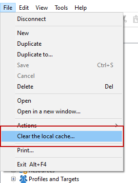

# Campaign Settings FAQ {#settings-faq}

Learn key configurations to set up your Campaign instance to fit with your needs.

## Can I change the language of Campaign interface? {#can-i-change-the-language-of-campaign-interface-}

Campaign language is selected when creating the instance. You cannot change it afterwards. For more on this, refer to [this section](../../installation/using/creating-an-instance-and-logging-on.md).

Adobe Campaign user interface is available in 4 languages: English, French, German and Japanese. Please note that the client console and the server must be set with the same language. Each Campaign instance can only run in one language.

For English, when installing Campaign, you can select either US English or UK English: they differ on date and time formats. For more on these differences refer to [this section](../../platform/using/adobe-campaign-workspace.md#date-and-time).

## Can I use Campaign Classic with other Adobe solutions? {#can-i-use-campaign-classic-with-other-adobe-solutions-}

You can combine the delivery functionalities and advanced campaign management functionalities of Adobe Campaign with a set of solutions created to help you personalize your users' experience.

Click here to learn [how to work with other Adobe solutions](../../integrations/using/about-campaign-integrations.md) and [how to set up IMS in Campaign](../../integrations/using/about-adobe-id.md).

## How can I set up tracking capabilities on my Campaign instance? {#how-can-i-set-up-tracking-capabilities-on-my-campaign-instance-}

As an expert user, you can configure tracking capabilities on your Campaign instance.

[Click here to learn more](../../installation/using/deploying-an-instance.md#tracking-configuration).

## How to configure email deliverability? {#how-to-configure-email-deliverability-}

In addition to the [Deliverability getting started guide](https://docs.adobe.com/content/help/en/campaign-classic/using/sending-messages/deliverability-management/about-deliverability.html), read out the section about email deliverability configuration to understand how to configure your instance to maximize Campaign delivering capabilities.

[Click here to learn more](../../installation/using/email-deliverability.md).

## How can I implement content approval? {#how-can-i-implement-content-approval-}

Campaign lets you set up approval processes for the main steps of the marketing campaign, in collaborative mode. For each campaign you can approve the delivery target, contents and costs. Adobe Campaign operators in charge of approval can be notified by e-mail and can accept or reject approval from the console or via a Web connection.

[Click here to learn more](../../campaign/using/marketing-campaign-approval.md#checking-and-approving-deliveries) and discover steps to implement your delivery content approval in Campaign.

## How can I access data stored in an external database? {#how-can-i-access-data-stored-in-an-external-database-}

Adobe Campaign provides the Federated Data Access (FDA) option in order to process information stored in one or more external databases: you can access external data without changing the structure of Adobe Campaign data.

[Click here to learn more](../../platform/using/connecting-to-database.md).

## Which external databases can I connect Campaign to? {#which-external-databases-can-i-connect-campaign-to-}

External database compatible with Campaign through Federated Data Access (FDA) are listed in the [Compatibility matrix](https://helpx.adobe.com/campaign/kb/compatibility-matrix.html).

## Can Adobe Campaign integrate with LDAP? {#can-adobe-campaign-integrate-with-ldap-}

As an on-premise/hybrid customer, you can integrate Campaign Classic with your LDAP directory.

[Click here to learn how](../../installation/using/connecting-through-ldap.md).

## How can I set up CRM connectors in Campaign? {#how-can-i-set-up-crm-connectors-in-campaign-}

Adobe Campaign provides various CRM connectors for linking your Adobe Campaign platform to your third-party systems. These CRM connectors enable you to synchronize contacts, accounts, purchases, etc. They make for easy integration of your application with various third-party and business applications.

These connectors enable quick and easy data integration: Adobe Campaign provides a dedicated wizard for collecting and selecting from the tables available in the CRM. This guarantees two-directional synchronization to make sure data is up-to-date at all times throughout the systems.

Read out [Configure CRM connectors](../../platform/using/crm-connectors.md) to learn how to synchronize your CRM tool with Adobe Campaign. Watch this use case video on [Adobe Campaign and Microsoft Dynamics 365 integration](https://helpx.adobe.com/campaign/kt/acc/using/acc-integrate-dynamics365-with-acc-feature-video-set-up.html).

## How to perform Soft Cache Clear when the issues are Machine-specific or User-specific? {perform-soft-cache-clear}

If you have issues such as the new logos being reflected correctly, able to successfully export the data which are machine specific / user specific, you might need to perform a Soft Cache clearing with Windows (Windows 7, Windows XP, Windows 10).

Once you logged in, go to **[!UICONTROL File]** > **[!UICONTROL Clear the local cache]**. After this, logout and log back in.

If this still doesn’t help, please try clearing the Hard Cache by performing the below steps.

## How to perform Hard Cache Clear when the issues are Machine-specific or User-specific? {perform-hard-cache-clear}

1. On the client console, choose File > Clear the local cache.

1. Logout and close the client console (rich client).

1. Go to the following locations, based on your operating system version:

Windows 7: C:\Users\<Username>\AppData\Roaming\Neolane\NL_5\
Windows XP: C:\Documents and Settings\<Username>\Application Data\Neolane\NL_5
Here you will see many xml files named nlclient-config-<alphanumerical value>.xml.

1. Delete these xml files and associated folders.

Caution:

Do not delete nlclient_cnx.xml file.

1. Sign in to client console.