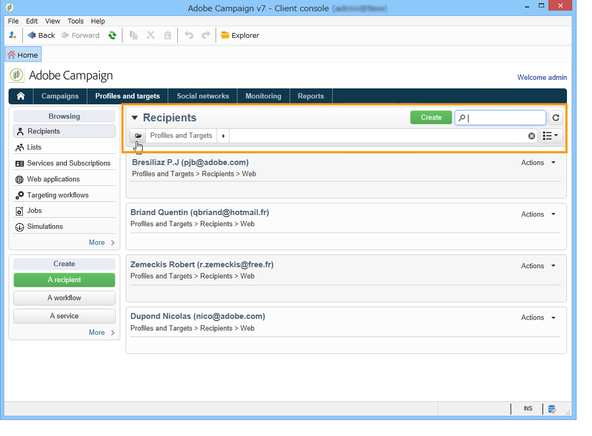
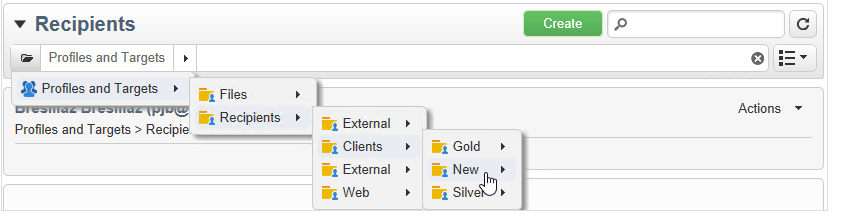
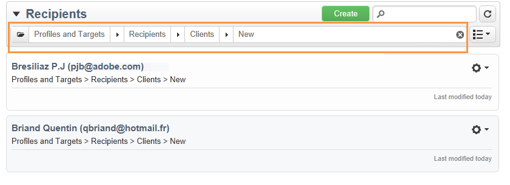
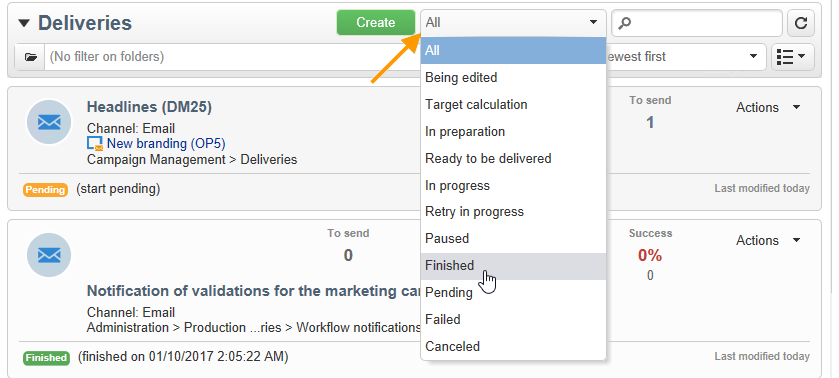
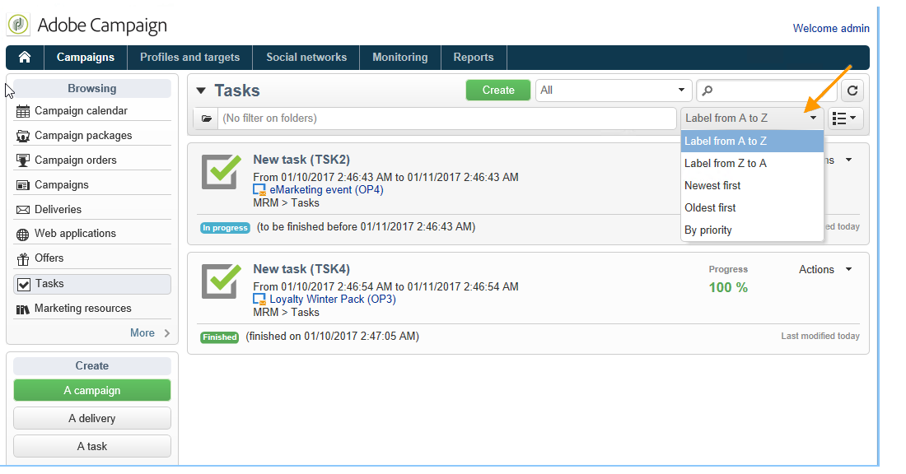
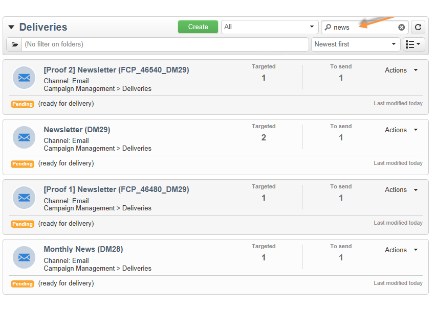

# Filtering options{#filtering-options}

## About filtering {#about-filtering}

By default, Adobe Campaign displays all the data in the database for which the concerned operator has read rights.

This data can be filtered via the options located in the upper section of the browser window.

There are several ways of filtering the data to be displayed. If necessary, these can be used together:

* Filter on folders, refer to [Filter by folder](#filter-by-folder),
* Filter by status, refer to [Filter by status](#filter-by-status),
* Data sorting, refer to [Order by](#order-by),
* Search, refer to [Quick search](#quick-search).

## Filter by folder {#filter-by-folder}

Click the **[!UICONTROL Folder]** icon to select the folder containing the data to display.

Only the profiles in the folder will be displayed:

Use the cross to the right of the folder selection field to return to the default display mode.

## Filter by status {#filter-by-status}

Depending on the type of information displayed, you can apply a filter by status or by state. For instance for deliveries, you can choose to display only finished deliveries as shown below:

## Order by {#order-by}

You can select the sorting order of the data offered on pages via the drop-down list to the right of the 'per folder' filtering field. The content of this field depends on the type of data on the page.

For instance, you can sort tasks by priority, creation date, or alphabetical order.

## Quick search {#quick-search}

Use the search field to quickly access the item you are looking for: enter the characters included in the label or internal name of the item you want to display, then confirm to apply an automatic filter to the data on the page.

To display all items again, click on the cross to delete the content of the search field.
