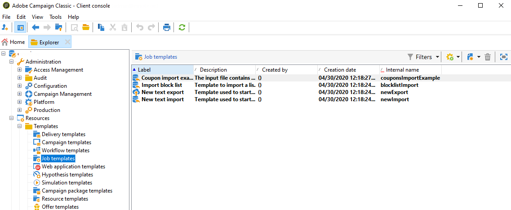

# Generic imports and exports{#generic-imports-and-exports}

Adobe Campaign offers a data export module that makes it easy to extract a list of customers or prospects (for example, following a targeting operation) who will then become part of a target population.

Adobe Campaign also offers an import module that lets you supply your database with data from external files.

>[!NOTE]
>
>Exports and imports are configured in dedicated templates executed through workflows via the **Import** and **Export** activities. They can be repeated automatically according to a schedule, for example to automate data exchange between several information systems. If necessary, you can create an occasional import or export via the **Profiles and Targets > Jobs > Generic imports and exports** node of the Adobe Campaign tree.

You can:

* Create an import or export template and configure it (see below).
* Create an import or export: refer to [Exporting data](../../platform/using/exporting-data.md) or [Importing data](../../platform/using/importing-data.md).
* Launch the import or export and monitor its execution. refer to [Execution tracking](../../platform/using/generic-imports-and-exports.md#execution-tracking).

>[!CAUTION]
>
>Data import in Campaign should be performed through workflows to secure data consistency and improve efficiency. For more on this, refer to the [Importing data](../../workflow/using/importing-data.md), [Import best practices](../../workflow/using/importing-data.md#best-practices-when-importing-data) and [Import template example](../../workflow/using/importing-data.md#setting-up-a-recurring-import) sections.

## Creating a job template {#creating-a-job-template}

Import and export templates are stored in the **Resources > Templates > Job templates** directory of the Adobe Campaign tree.

By default, three import templates and one export template are present in this directory. They must not be modified. You can duplicate them to create your own templates or create a new template via the **New > Import template**/**Export template** menu.

The procedure for creating a process template is presented in [Export wizard](../../platform/using/generic-imports-and-exports.md#export-wizard) and [Import wizard](../../platform/using/generic-imports-and-exports.md#import-wizard).

>[!NOTE]
>
>The native template **Import blacklist** is already configured to import a list of blacklisted e-mail addresses.  
>The **New text import** and **New text export** templates let you configure an import or export from scratch.

## Creating a new import/export {#creating-a-new-import-export}

Once the template has been configured, import and export operations can be launched in several contexts in Adobe Campaign.

All of these open the [import](../../platform/using/importing-data.md) or [export](../../platform/using/exporting-data.md#export-wizard) wizard.

* In the **Profiles and targets** section of Adobe Campaign workspace, click the **Jobs** link: this takes you to the list of existing imports and exports.

  Click the **Create** button and select the type of job you want to perform.

  

* You can also launch imports and exports from the Supervision section of the workspace: two dedicated links enable you to start the import or export directly.

  

* Imports and exports can also be launched from the Adobe Campaign explorer.

  To export/import data, click the **Profiles and Targets > Jobs > Generic imports and exports** node, then the **New** icon, and select **Export** or **Import**. This opens the appropriate wizard.

  

## Execution tracking {#execution-tracking}

You can view the tracking of the execution in the upper section of this editor. You can close the export wizard and view the execution of the job via the list of import/export jobs.

* The **Log** tab lets you look at log messages concerning execution.
* The **Rejects** tab contains the rejected records. See [Behavior in the event of an error](../../platform/using/generic-imports-and-exports.md#behavior-in-the-event-of-an-error).

>[!NOTE]
>
>Import/export job statuses are presented in [Job statuses](../../platform/using/generic-imports-and-exports.md#job-statuses).

