# Generic import samples {#import-operations-samples}

## Import from a list of recipients {#example--import-from-a-list-of-recipients}

To create and supply a list of recipients from the overview of lists, apply the following steps:

1. Creating the list

    * Click the **[!UICONTROL Lists]** link in the **[!UICONTROL Profiles and targets]** menu of the Adobe Campaign home page.
    * Click the **[!UICONTROL Create]** and then the **[!UICONTROL Import a list]** button.

1. Selecting the file to import

   Click the folder to the right of the **[!UICONTROL Local file]** field and select the file containing the list to import.

   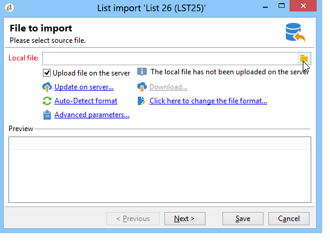

1. List name and storage

   Input the name of the list and select the directory where it should be saved.

   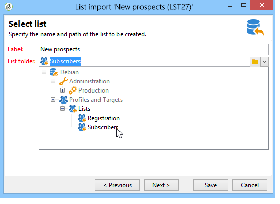

1. Launching the import

   Click **[!UICONTROL Next]** and then **[!UICONTROL Start]** to start importing the list.

   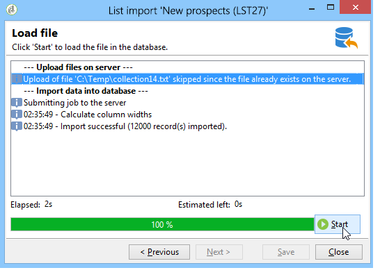

## Import new records from a text file {#example--import-new-records-from-a-text-file-}

To import new recipient profiles stored in a text file into the Adobe Campaign database, apply the following steps:

1. Choosing a template

    * From the Adobe Campaign home page, click the **[!UICONTROL Profiles and targets]** link, then **[!UICONTROL Jobs]**. Above the list of jobs, click **[!UICONTROL New import]**.
    * Keep the **[!UICONTROL New text import]** template selected by default.
    * Change the label and the description.
    * Select **[!UICONTROL Simple import]**.
    * Keep the default job folder.
    * Click **[!UICONTROL Advanced parameters]** and select the **[!UICONTROL Tracking mode]** option to view the details of your import during execution.

1. Selecting the file to import

   Click the folder to the right of the **[!UICONTROL Local file]** field and select the file you want to import.

   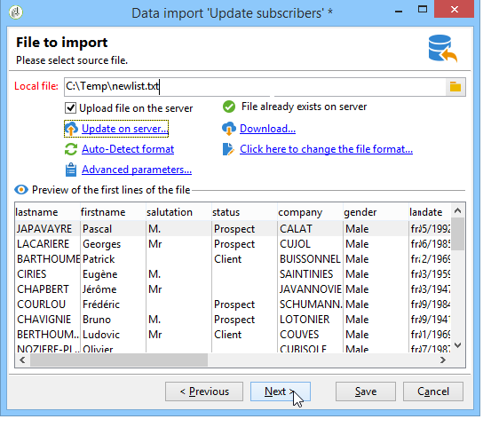

1. Associating fields

   Click the **[!UICONTROL Guess the destination fields]** icon to map the source and destination schemas automatically. Check the information in this window before clicking **[!UICONTROL Next]**.

   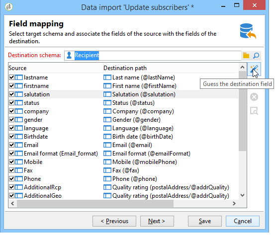

1. Reconciliation

    * Go to the **Recipients (nms:recipient)** table.
    * Select the **[!UICONTROL Insertion]** operation and leave the default values in the other fields.
    
      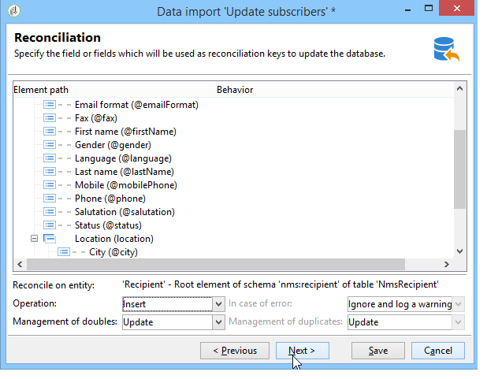

1. Importing recipients

    * If necessary, specify a folder for your records to be imported into.
    
      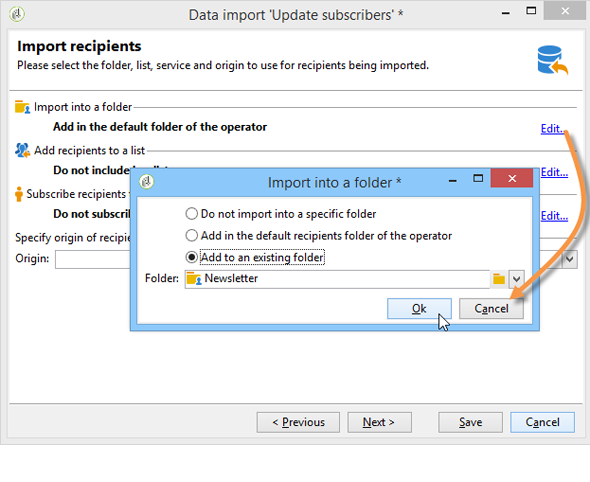

1. Launching the import

    * Click **[!UICONTROL Start]**.

      In the central area of the editor, you can check that the import operation has succeeded and view the number of records processed.
    
      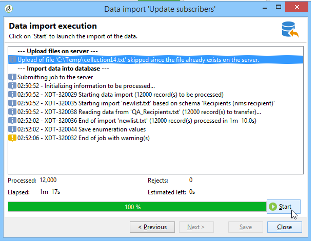

      The **[!UICONTROL Tracking]** mode lets you track the details of the import for each record in the source file. To do this, from the home page click **[!UICONTROL Profiles and Targets]** then **[!UICONTROL Processes]**, select the relevant import, and look up the **[!UICONTROL General]**, **[!UICONTROL Journal]** and **[!UICONTROL Rejects]** tabs.

        * Checking import progress
        
          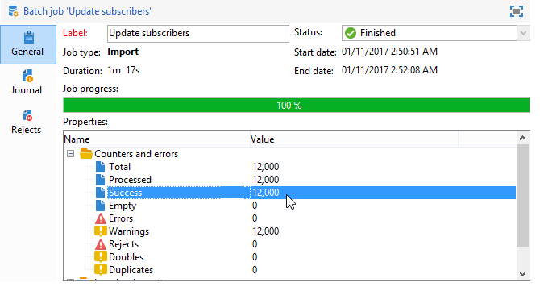

        * Process viewing for each record
        
          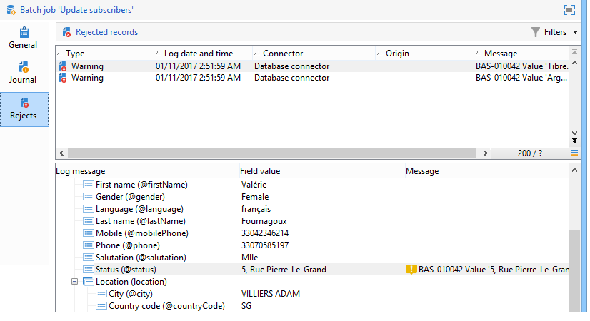

## Update and insert recipients {#example--update-and-insert-recipients}

We want to update existing records in the database and create new ones from a text file. Here is an example of the procedure:

1. Choosing a template

   Repeat the steps described in example 2 above.

1. File to import

   Select the file that you want to import.

   In our example, the overview of the first lines of the file shows that the file contains updates for three records and the creation of a record.

   

1. Associating fields

   Apply the procedure in example 2 above.

1. Reconciliation

    * Keep **[!UICONTROL Update or insert]** selected by default.
    * Keep the option **[!UICONTROL Management of duplicates]** in **[!UICONTROL Update]** mode so that existing records in the database will be modified with data from the text file.
    * Select the fields **[!UICONTROL Birth date]**, **[!UICONTROL Name]** and **[!UICONTROL Company]** and assign a reconciliation key to them. 
    
      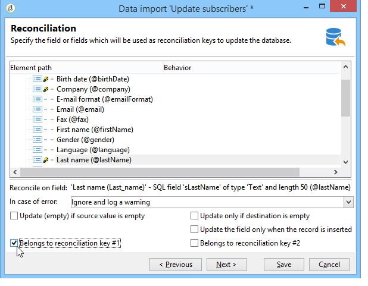

1. Launching the import

    * Click **[!UICONTROL Start]**.

      In the tracking window, you can check that the import has succeeded and view the number of records processed.
    
      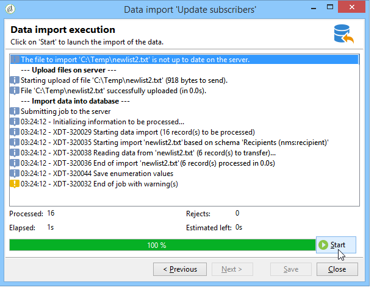

    * Look in the recipient table to check that the records have been modified by this operation.
    
      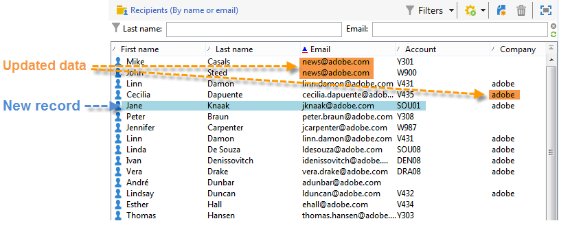

## Enrich the values with those of an external file {#example--enrich-the-values-with-those-of-an-external-file}

We want to modify certain fields in a database table from a text file, giving priority to the values contained in the database.

In this example, you can see that certain fields in your text file have a value, while the corresponding fields in the database are empty. Other fields contain a different value from the one contained in the database.

* Content of the text file to import.

  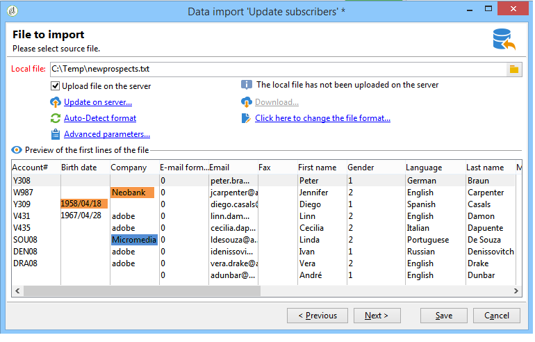

* Database status before import

  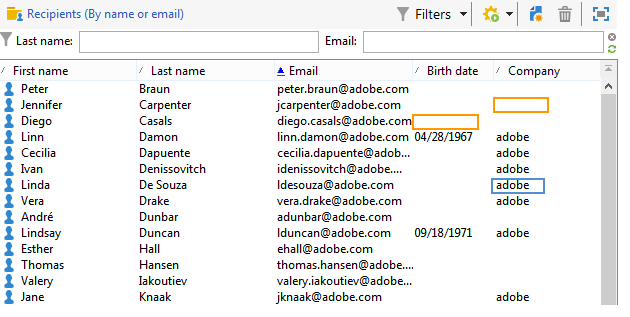

Apply the following steps:

1. Choosing a template

   Apply the procedure in example 2 above.

1. File to import

   Select the file that you want to import.

1. Associating fields

   Apply the procedure in example 2 above.

   In the preview of the first lines of the file, you can see that the file contains updates for certain records.

1. Reconciliation

    * Go to the table and select the **[!UICONTROL Update]** operation.
    * Select the option **[!UICONTROL Reject entity]** for the **[!UICONTROL Management of doubles]** field.
    * Keep the option **[!UICONTROL Management of duplicates]** in **[!UICONTROL Update]** mode so that existing records in the database will be modified with data from the text file.
    * Place the cursor on the **[!UICONTROL Last name (@lastName)]** node and select the **[!UICONTROL Update only if destination is empty]** option.
    * Repeat this operation for the **[!UICONTROL Company (@company)]** node.
    * Assign a reconciliation key to the fields **[!UICONTROL Birth date]**, **[!UICONTROL E-mail]** and **[!UICONTROL First name]**.
    
      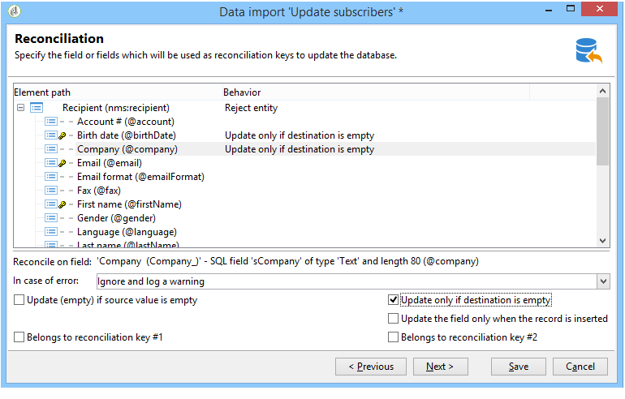

1. Launching the import

   Click **[!UICONTROL Start]**.

   Look in the recipient table to check that the records have been modified by the import.

   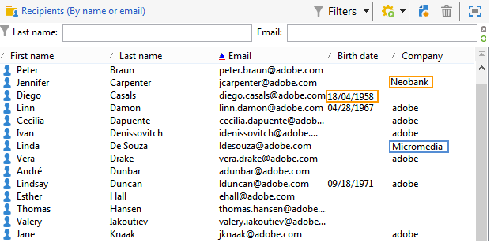

   Only values that were empty have been replaced by values from the text file, but the existing value in the database has not been overwritten by the value from the import file.

## Update and enrich the values from those in an external file {#example--update-and-enrich-the-values-from-those-in-an-external-file}

We want to modify certain fields in a database table from a text file, giving priority to the values contained in the text file.

In this example, you will see that certain fields in your text file have an empty value, while the corresponding fields in the database are not empty. Other fields contain a different value from the one in the database.

* Content of the text file to import.

  

* Database status before import

  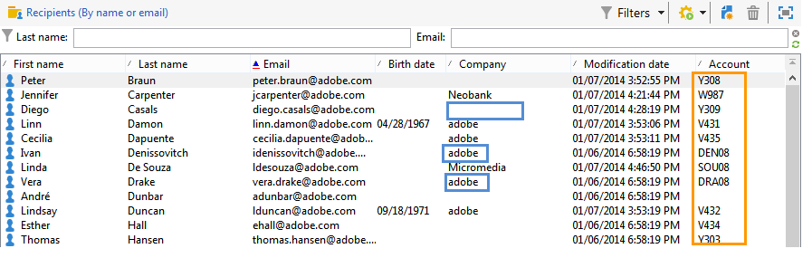

1. Choosing a template

   Apply the procedure in example 2 above.

1. File to import

   Select the file that you want to import.

   In the preview of the first lines of the file, you can see that the file contains empty fields and updates for certain records.

1. Associating fields

   Apply the procedure in example 2 above.

1. Reconciliation

    * Go to the table and select **[!UICONTROL Update]**.
    * Select the option **[!UICONTROL Reject entity]** for the **[!UICONTROL Management of doubles]** field.
    * Leave the option **[!UICONTROL Management of duplicates]** in **[!UICONTROL Update]** mode for existing records in the database to be modified with data from the text file.
    * Place the cursor on the **[!UICONTROL Account number (@account)]** node and select the option **[!UICONTROL Take empty values into account]**.
    * Select the fields **[!UICONTROL Birth date]**, **[!UICONTROL E-mail]** and **[!UICONTROL First name]** and assign a reconciliation key to them. 
    
      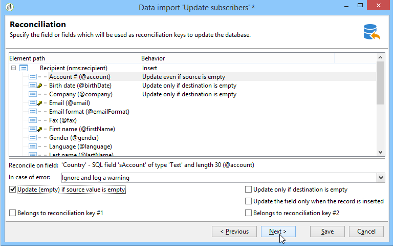

1. Launching the import

    * Click **[!UICONTROL Start]**. 
    * Look in the recipient table to check that the records have been modified by the operation.
    
      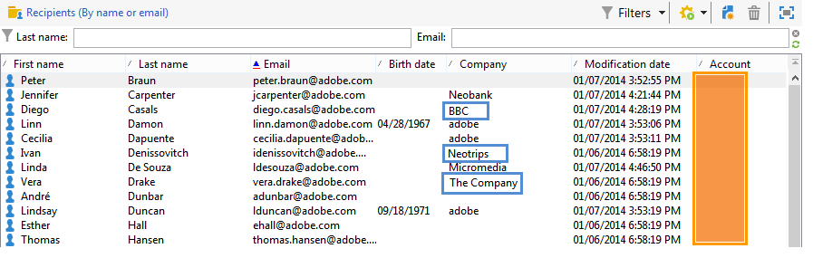

      The values of the text file which were empty have overwritten those in the database. The existing values in the database were updated with those in the import file in keeping with the **[!UICONTROL Update]** option selected for duplicates in step 4.
