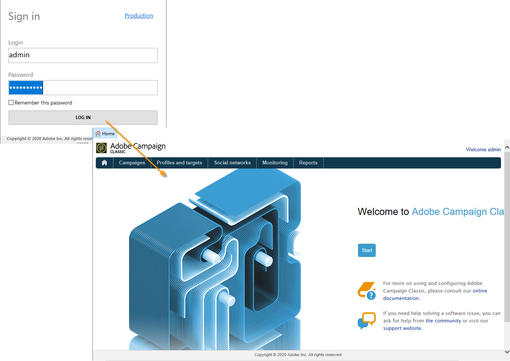
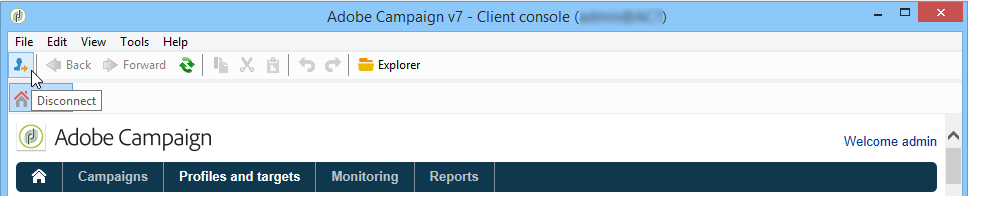
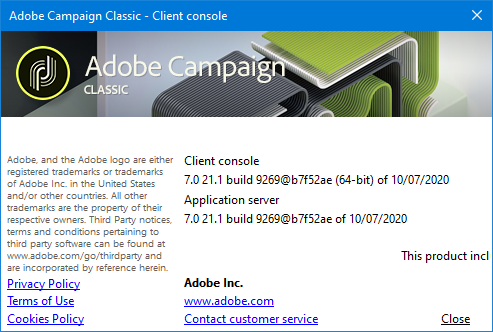
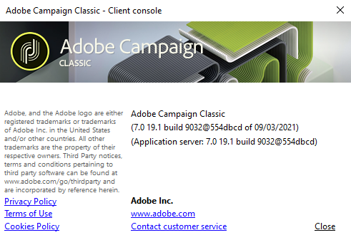

# Launch Adobe Campaign{#launching-adobe-campaign}

Campaign Client console is a rich client which enables you to connect to your Campaign application server(s). Learn how to download and configure the client console in [this page](../../installation/using/installing-the-client-console.md).

## Start Adobe Campaign {#starting-adobe-campaign}

You can start Adobe Campaign by selecting **[!UICONTROL Start / All Programs / Adobe Campaign v.X / Adobe Campaign client console]**.

The client console connection window lets you select or configure existing databases and connect to them using a user name and password:

## Connect to Adobe Campaign {#connecting-to-adobe-campaign}

You can connect to Adobe Campaign using your Adobe ID. For more on this, refer to [this page](../../integrations/using/about-adobe-id.md).

You can also connect with a dedicated login/password:

1. Enter the operator account identifier in the **[!UICONTROL Login]** field.

   Your identifier is given by the administrator of your Adobe Campaign platform.

1. Enter your password in the **[!UICONTROL Password]** field.

   The first time you access the database, your password is the one given to you by the administrator. Once you are connected, you can change your password via the **[!UICONTROL Tools > Change password...]** menu. Details on operators and connections are available in [Access management](../../platform/using/access-management.md).

1. Click **[!UICONTROL LOG IN]** to confirm.<!--You can also press the **Enter** key to launch connection.-->

You can now access [Adobe Campaign workspace](../../platform/using/adobe-campaign-workspace.md).

Some keyboard shortcuts are available on the **[!UICONTROL Sign in screen]**:
* All actionable items are selectable through the **Tab** key (top to bottom) or the **Tab** + **Shift** keys (bottom to top).
* To launch connection, you can also press the **Enter** key.
* You can use the **Escape** key to reset the **[!UICONTROL Login]** and **[!UICONTROL Password]** fields to the last successful connection values.

## Set up connections {#setting-up-connections}

You can access the server connection settings via the link above the input zone.

In the **[!UICONTROL Connections]** window, click **[!UICONTROL Add > Connection]**.

You must then define the connection settings. To do this:

1. Enter a **[!UICONTROL Label]** to assign a name to your database connection.

1. Add the address of the application server in the **[!UICONTROL URL]** field. If you do not know the connection URL, contact the administrator.

1. Check **[!UICONTROL Connect with an Adobe ID]** for the operators to connect to the console using their Adobe ID. For more on this, refer to [this page](../../integrations/using/about-adobe-id.md).

1. Click **[!UICONTROL OK]** to validate.

## Operators and permissions {#operators-and-permissions}

The identifiers and passwords of operators with access to the software and their respective permissions are defined by your Adobe Campaign system administrator in the **[!UICONTROL Administration > Access management > Operators]** node of the Adobe Campaign tree.

This functionality is detailed in the [Access management](../../platform/using/access-management.md) section.

## Disconnect from Adobe Campaign {#disconnecting-from-adobe-campaign}

To disconnect from Adobe Campaign, use the first icon in the icon bar.

>[!NOTE]
>
>You can also close the application without logging off first.

## Get your Adobe Campaign version {#getting-your-campaign-version}

The **[!UICONTROL Help > About...]** menu lets you access the following information:

* **version** number for Campaign client console and application server
* **build** number for Campaign client console and application server
* a link to contact Adobe Customer Care
* links to Adobe Privacy Policy, Terms of Use and Cookies Policy

Whenever you reach out to Adobe Customer Care team, you need to provide the version number and build number of your Adobe Campaign client console and application server.

If you are running on [Campaign [!DNL Gold Standard] version](../../rn/using/gold-standard.md), you also need to share the SHA/1 characters which are displayed in the **[!UICONTROL About]** box. As an example, for Gold **Standard 10 release**, the build number will show **build 9032&#64;efd8a94**, as shown below:

Learn more about [!DNL Gold Standard] [in this article](../../rn/using/gs-overview.md)).

**Related topics**:

* [Adobe Campaign Help and Support options](../../support.md)
* [Adobe Campaign Software Distribution](https://experience.adobe.com/#/downloads/content/software-distribution/en/campaign.html)
* [Adobe Experience Cloud Support and Expert sessions](https://helpx.adobe.com/enterprise/admin-guide.html/enterprise/using/support-for-experience-cloud.ug.html)
