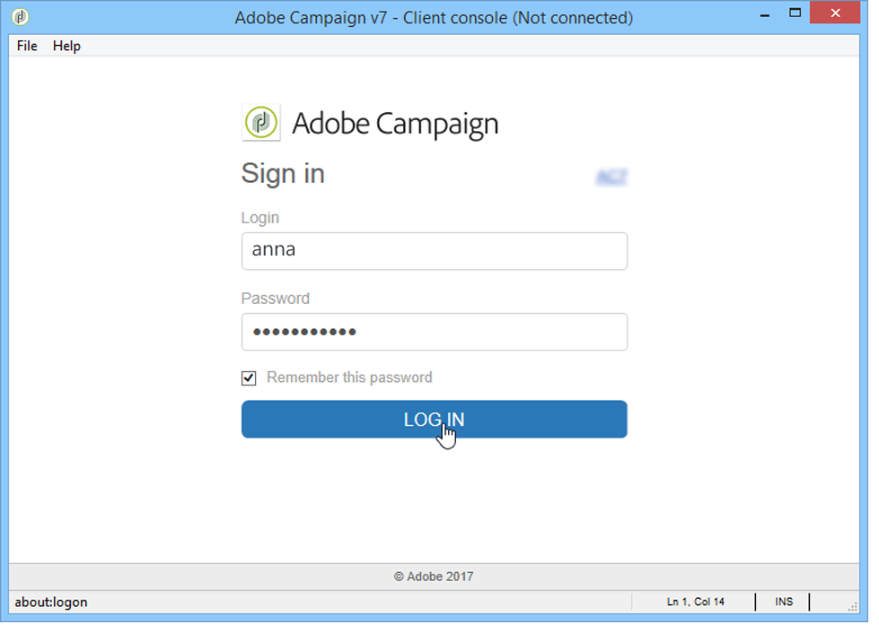
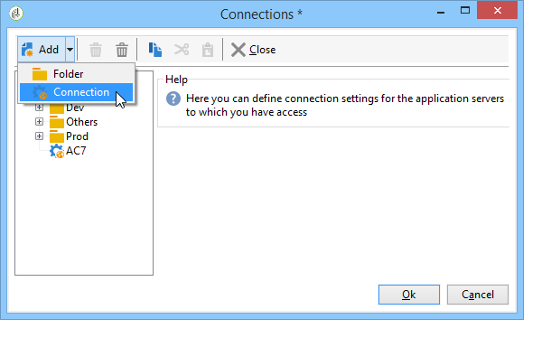

# Launching Adobe Campaign{#launching-adobe-campaign}

## Starting Adobe Campaign {#starting-adobe-campaign}

You can start Adobe Campaign by selecting **[!UICONTROL Start / All Programs / Adobe Campaign v.X / Adobe Campaign client console]** .

The client console connection window lets you select or configure existing databases and connect to them using a user name and password:

## Connecting to Adobe Campaign {#connecting-to-adobe-campaign}

You can connect to Adobe Campaign using your Adobe ID. For more on this, refer to [this page](../../integrations/using/about-adobe-id.md).

You can also connect with a dedicated login/password:

1. Enter the operator account identifier in the **[!UICONTROL login]** field.

   Your identifier is given by the administrator of your Adobe Campaign platform.

1. Enter your password in the **[!UICONTROL Password]** field.

   The first time you access the database, your password is the one given to you by the administrator. Once you are connected, you can change your password via the **[!UICONTROL Tools > Change password...]** menu. Details on operators and connections are available in [Access management](../../platform/using/access-management.md).

1. Click **[!UICONTROL Log in]** to confirm.

You can now access [Adobe Campaign workspace](../../platform/using/adobe-campaign-workspace.md).

## Setting up connections {#setting-up-connections}

You can access the server connection settings via the link above the input zone.

In the **[!UICONTROL Connections]** window, click **[!UICONTROL Add > Connection]** .

You must then define the connection settings. To do this:

* Enter a **[!UICONTROL Label]** to assign a name to your database connection.
* Add the address of the application server in the **[!UICONTROL URL]** field. If you do not know the connection URL, contact the administrator.
* Check **[!UICONTROL Connect with an Adobe ID]** for the operators to connect to the console using their Adobe ID. For more on this, refer to [this page](../../integrations/using/about-adobe-id.md).
* Click **[!UICONTROL OK]** to validate.

>[!NOTE]
>
>The **[!UICONTROL Add]** button lets you create **[!UICONTROL folders]** to organize all your connections. Simply drag and drop each connection into a folder.

## Operators and permissions {#operators-and-permissions}

The identifiers and passwords of operators with access to the software and their respective permissions are defined by your Adobe Campaign system administrator in the **[!UICONTROL Administration > Access management > Operators]** node of the Adobe Campaign tree.

This functionality is detailed in the [Access management](../../platform/using/access-management.md) section.

## Disconnecting from Adobe Campaign {#disconnecting-from-adobe-campaign}

To disconnect from Adobe Campaign, use the first icon in the icon bar.

>[!NOTE]
>
>You can also close the application without logging off first.

## Getting your Campaign version {#getting-your-campaign-version}

The **[!UICONTROL Help > About...]** menu lets you access the following information:

* **version** number,
* **build** number,
* a link to contact Adobe Campaign Support.

  >[!CAUTION]
  >
  >Whenever you reach out to Adobe Support team, you need to provide the version number and build number of your Campaign client console and application server.

