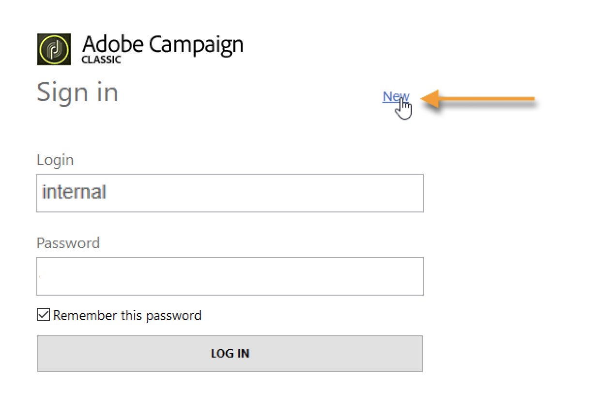
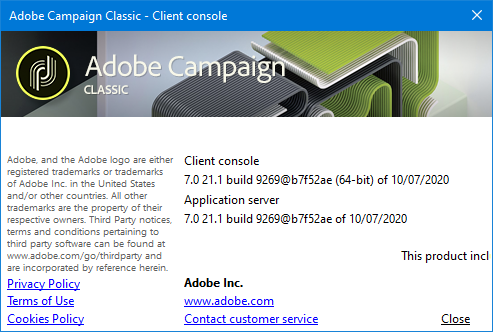

# Launch Adobe Campaign {#launching-adobe-campaign}

Campaign Client console is a rich client which enables you to connect to your Campaign application server(s). Learn how to download and configure the client console in [this page](../../installation/using/installing-the-client-console.md).

>[!CAUTION]
>
>Check your system and tools compatibility with Adobe Campaign Client Console in the [Compatibility matrix](../../rn/using/compatibility-matrix.md#ClientConsoleoperatingsystems)

## Start Adobe Campaign {#starting-adobe-campaign}

You can start Adobe Campaign by selecting **[!UICONTROL Start / All Programs / Adobe Campaign v.X / Adobe Campaign client console]**.

The client console connection window lets you select or configure existing databases and connect to them using a user name and password:

## Connect to Adobe Campaign {#connecting-to-adobe-campaign}

### Connect with your Adobe ID

Campaign users connect to the Adobe Campaign console using their Adobe ID, through Adobe Identity Management System (IMS). They can use same ID all Adobe solutions. The connection is saved when using Adobe Campaign with other solutions. Learn more about Adobe IMS [on this page](https://helpx.adobe.com/enterprise/using/identity.html).

To configure Campaign Classic v7 connection with Adobe Identity Management Service (IMS), refer to [this page](../../integrations/using/about-adobe-id.md).

Once the configuration is done, learn how to connect to Campaign with your Adobe ID in the [Campaign v8 (console) documentation](https://experienceleague.adobe.com/en/docs/campaign/campaign-v8/new/connect){target=_blank}.

### Connect with a login/password

You can also connect with a dedicated login/password. This connection is known as the Campaign 'Native Authentication':

1. Enter the operator account identifier in the **[!UICONTROL Login]** field.

   Your identifier is given by the administrator of your Adobe Campaign platform.

1. Enter your password in the **[!UICONTROL Password]** field.

   The first time you access the database, your password is the one given to you by the administrator. Once you are connected, you can change your password via the **[!UICONTROL Tools > Change password...]** menu. Details on operators and connections are available in [Access management](../../platform/using/access-management.md).

1. Click **[!UICONTROL LOG IN]** to confirm.

You can now access [Adobe Campaign workspace](../../platform/using/adobe-campaign-workspace.md).

## Set up connections {#setting-up-connections}

You can access the server connection settings via the link above the input zone.

Learn how to set up connections in the [Campaign v8 (console) documentation](https://experienceleague.adobe.com/en/docs/campaign/campaign-v8/new/connect#create-your-connection){target=_blank}. 

## Operators and permissions {#operators-and-permissions}

The identifiers and passwords of operators with access to the software and their respective permissions are defined by your Adobe Campaign system administrator in the **[!UICONTROL Administration > Access management > Operators]** node of the Adobe Campaign tree.

This functionality is detailed in the [Access management](../../platform/using/access-management.md) section.

## Get your Adobe Campaign version {#getting-your-campaign-version}

The **[!UICONTROL Help > About...]** menu lets you access the following information:

* **version** number for Campaign client console and application server
* **build** number for Campaign client console and application server
* a link to contact Adobe Customer Care
* links to Adobe Privacy Policy, Terms of Use and Cookies Policy

Whenever you reach out to Adobe Customer Care team, you need to provide the version number and build number of your Adobe Campaign client console and application server.

