# Manage enumerations{#managing-enumerations}

An enumeration (also known as 'itemized list') is a list of values suggested by the system to populate certain fields. Enumerations let you standardize the values of these fields, and help with data input or use within queries.

The list of values appears as a drop-down list from which you can select the value to be entered in the field. The drop-down list also enables predictive input, where the operator enters the first few letters, and the application fills in the rest.

Some of the console fields have been defined with this type of enumerations. Enumerations are called "open" if you can add values by direct input in the corresponding field.

## Access to values {#access-to-values}

The values for this type of field are defined and overall administration of these fields (adding/deleting a value) is performed via the **[!UICONTROL Administration > Platform > Enumerations]** node of the tree.

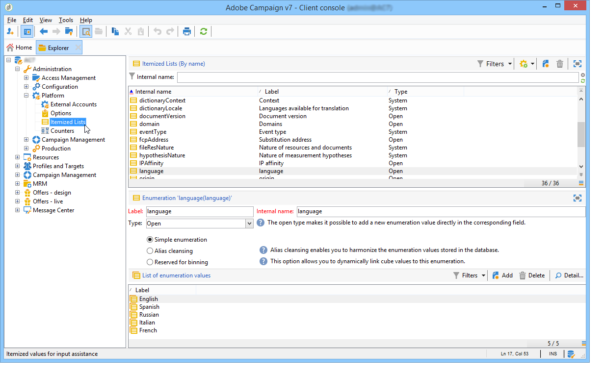

* The upper section offers a list of fields for which an itemized list has been defined.
* The lower section lists the proposed values. These values will be repeated in the editors that use this field.

  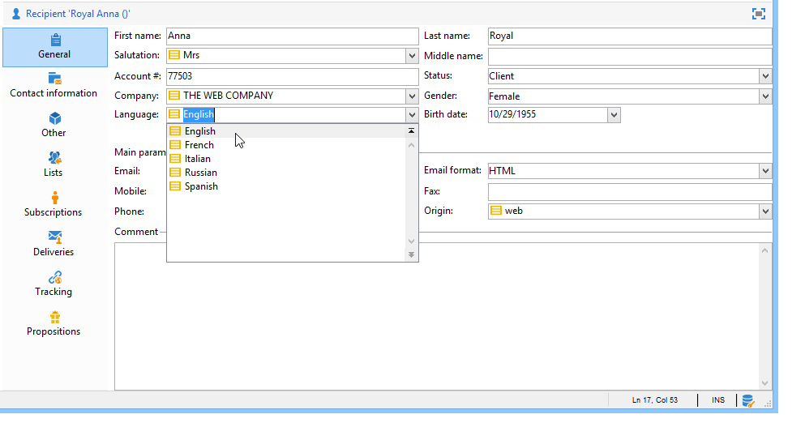

  To create a new enumeration value, click **[!UICONTROL Add]**.

  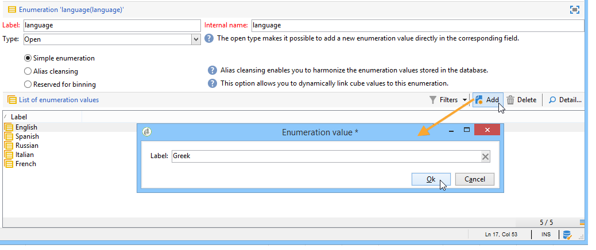

  If the **[!UICONTROL Open]** option is selected, the user can add a new itemized list value directly in the corresponding field. A confirmation message allows you to create this value.

  

* If the **[!UICONTROL Closed]** option is selected, users will not be able to create new values, but merely choose from the values available.

## Standardize data {#standardizing-data}

### About alias cleansing {#about-alias-cleansing}

In the itemized list fields, you can enter values other than enumeration values. These can either be stored as they are or be cleansed.

>[!CAUTION]
>
>Data cleansing is a critical process that impacts the data in the database. Adobe Campaign carries out mass data updates, which may lead to some values being deleted. This operation is therefore reserved for expert users.

The entered value is then either:

* Added to the itemized list values: in this case the **[!UICONTROL Open]** option must be selected,
* or automatically replaced by its corresponding alias: In this case, this case must then be defined in the **[!UICONTROL Alias]** tab of the itemized list,
* or is stored in the list of aliases: an alias be assigned to it later on.

  >[!NOTE]
  >
  >If you need to use data cleansing capabilities, select the **[!UICONTROL Alias cleansing]** option in the itemized list.

### Using aliases {#using-aliases}

The option **[!UICONTROL Alias cleansing]** makes it possible to use aliases for the selected itemized list. When this option is selected, the **[!UICONTROL Alias]** tab is displayed at the bottom of the window. 

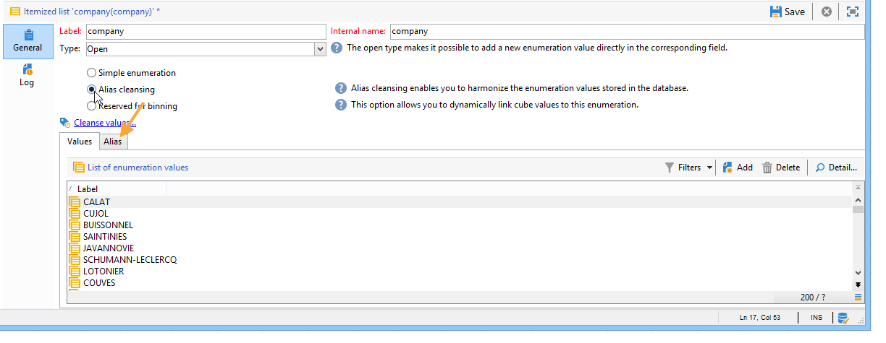

#### Create an alias {#creating-an-alias}

To create an alias, click **[!UICONTROL Add]**.

Enter the alias you want to convert and the value to be applied and click **[!UICONTROL Ok]**.

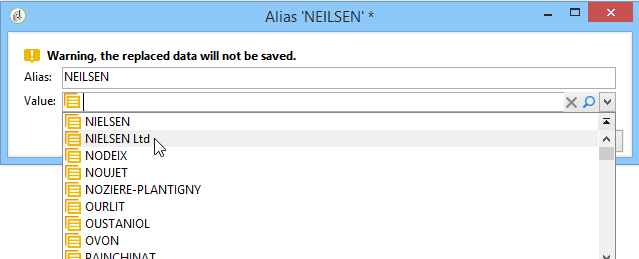

Check parameters before confirming this operation.

>[!CAUTION]
>
>Once this stage has been confirmed, the previously entered values may not be recovered: they have been replaced.

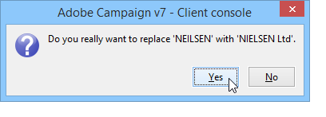

Thus, when a user enters the value **NEILSEN** in a "company" field (in the Adobe Campaign console or in a form), it will automatically be replaced by the value **NIELSEN Ltd**. Value replacement is performed by the **Alias cleansing** workflow. Refer to [Run data cleansing](#running-data-cleansing).

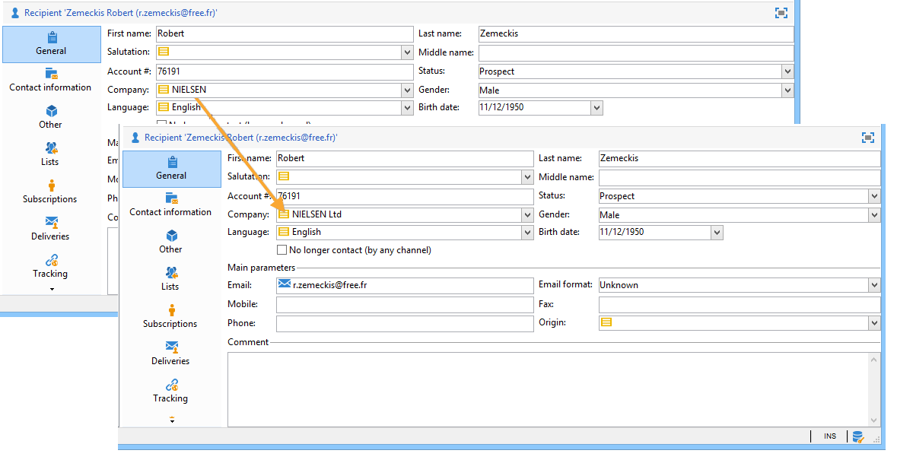

#### Converting values into aliases {#converting-values-into-aliases}

To convert an enumeration value into an alias, right-click in the list of values and choose **[!UICONTROL Convert values into aliases...]**. 

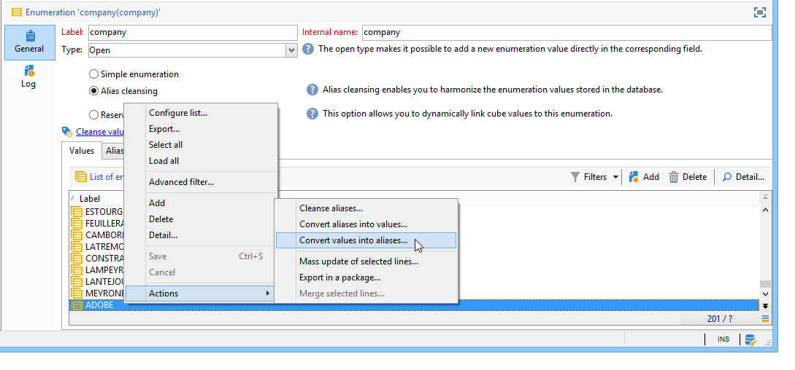

Choose the values you want to convert and click **[!UICONTROL Next]**.

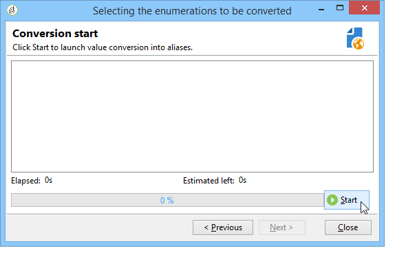

Click **[!UICONTROL Start]** to run the conversion.

Once execution is complete, the alias is added to the list of aliases.

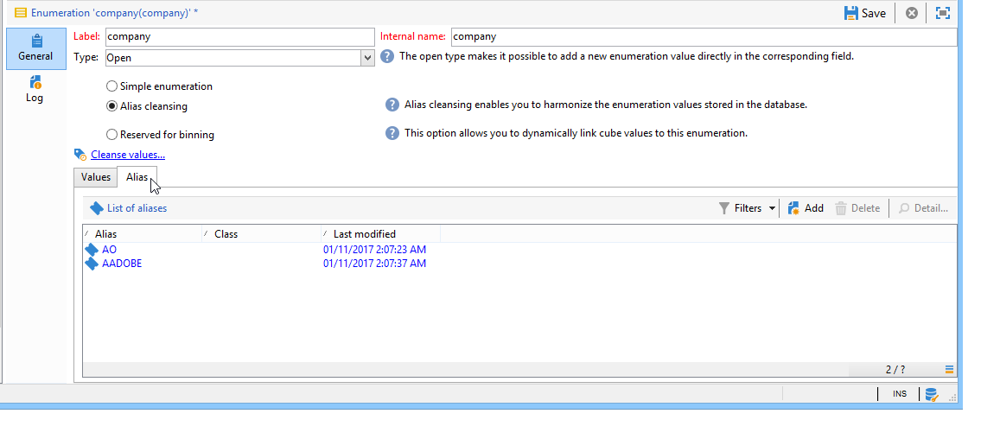

#### Retrieve alias hits {#retrieving-alias-hits}

The values entered by the users can be converted into aliases. In effect, when the user enters a value that is not included in the itemized list, the value is stored in the **[!UICONTROL Alias]** tab.

The **Alias cleansing** technical workflow recovers these values every night to update itemized list. Refer to [Run data cleansing](#running-data-cleansing)

If necessary, the **[!UICONTROL Hits]** column can display the number of times this value was entered. Calculating this value can be both time and memory consuming. For more on this, refer to [Calculate entry occurrences](#calculating-entry-occurrences).

### Run data cleansing {#running-data-cleansing}

Data cleansing is performed by the **[!UICONTROL Alias cleansing]** technical workflow. The configurations defined for enumerations are applied during execution. Refer to [Alias cleansing workflow](#alias-cleansing-workflow).

Cleansing can be triggered via the **[!UICONTROL Cleanse values...]** link.

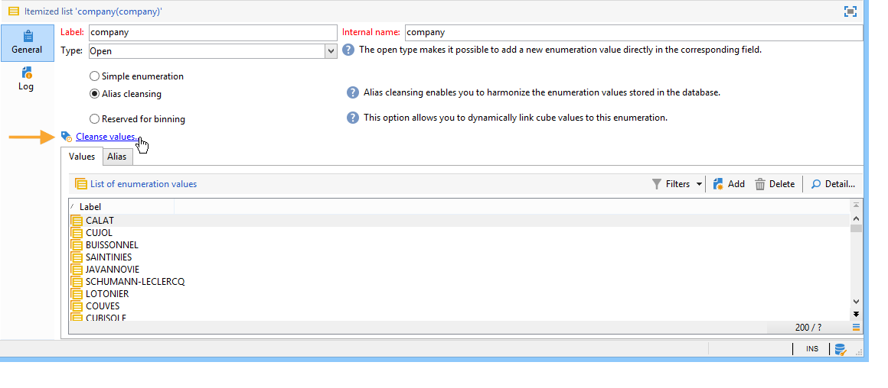

The **[!UICONTROL Advanced parameters...]** link lets you set the date starting from which collected values are taken into account.

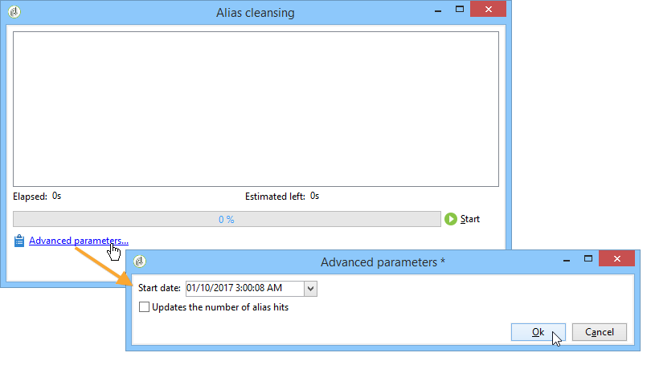

Click the **[!UICONTROL Start]** button to run data cleansing.

#### Calculate entry occurrences {#calculating-entry-occurrences}

The **[!UICONTROL Alias]** sub-tab of an itemized list can display the number of occurrences of an alias among all the values entered. This information is an estimate and will be displayed in the **[!UICONTROL Hits]** column.

>[!CAUTION]
>
>Calculating alias entry occurrences can take a long time. That's why caution should be applied when using this function.

You can run hit calculation manually via the **[!UICONTROL Cleanse values...]** link. To do this, click the **[!UICONTROL Advanced parameters...]** link and select the desired option(s).

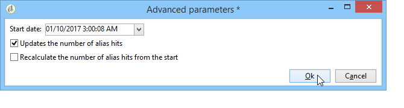

* **[!UICONTROL Update the number of alias hits]**: this lets you update hits which have already been calculated, based on the entered date.
* **[!UICONTROL Recalculate the number of alias hits from the start]**: lets you run calculation on the entire Adobe Campaign platform.

You can also create a dedicated workflow in order for the calculation to run automatically for a given period, once a week for example.

To do this, create a copy of the **[!UICONTROL Alias cleansing]** workflow, change the scheduler and use the following settings in the **[!UICONTROL Enumeration value cleansing]** activity:

* **-updateHits** to update the number of alias hits,
* **-updateHits:full** to recalculate all alias hits.

#### Alias cleansing workflow {#alias-cleansing-workflow}

The **Alias cleansing** workflow runs enumerations value cleansing. By default, it is executed on a daily basis.

It is accessed via the **[!UICONTROL Administration > Production > Technical workflows]** node.

