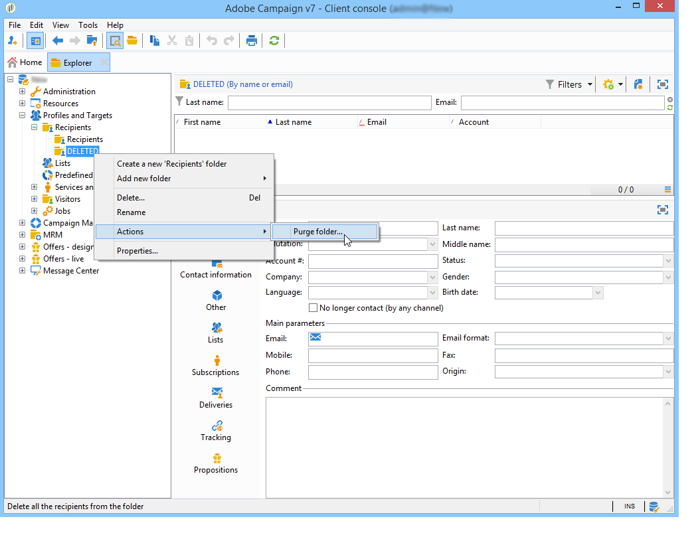
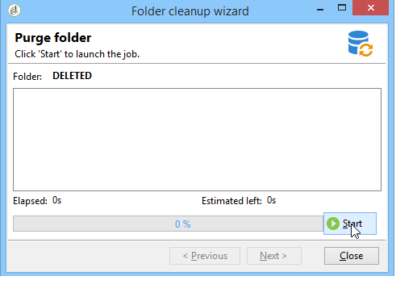

# Manage profiles{#managing-profiles}

## Recipient tree {#recipient-tree}

To access the advanced recipient management functionalities, you need to edit the Adobe Campaign tree. To do this, click the **[!UICONTROL Explorer]** button in the toolbar.

By default, recipients are stored in the **[!UICONTROL Profiles and targets]** node of the Adobe Campaign tree. From the same node, you can create one or more folders and sub-folders to store recipient profiles.

Each node coincides with a folder. The data from each folder must be considered to be partitioned from each other. This means that the management of doubles will be trickier for multiple recipient folders.

>[!NOTE]
>
>To display the list of all recipients in the database, you must create a view. Learn more in [Folders and views](../../platform/using/access-management-folders.md).

## Move recipients {#moving-recipients}

You can select one or more recipients, drag them from the recipient list, and drop them in the desired folder. A warning message asks you to confirm this action.

## Copy a recipient {#copying-a-recipient}

You can copy a recipient in the same folder by right-clicking the desired recipient and selecting **[!UICONTROL Copy]**.

## Delete recipients {#deleting-recipients}

To delete recipients, move them to a specific folder and then purge the content of this folder. It is **strongly recommended not to use** the **[!UICONTROL Delete]** option in this case.

To purge a folder, use the **[!UICONTROL Actions > Purge folder]** menu, accessed by right-clicking the desired folder.

Click **[!UICONTROL Start]** to launch the operation. The middle section of the window displays the progress status, as shown below:

