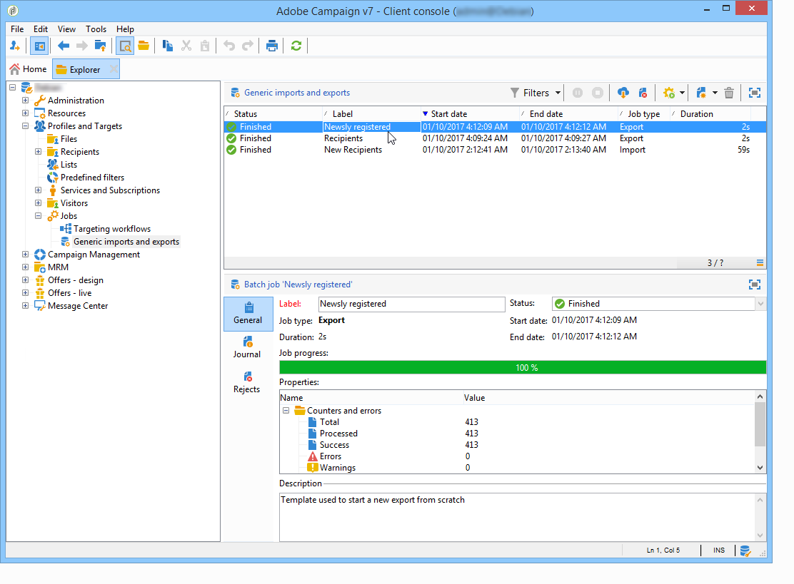
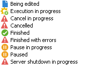

# Monitor jobs execution {#monitoring-job-execution}

You can track the execution of your import and export jobs directly from the list of import/export jobs.

* The **[!UICONTROL Journal]** tab lets you look at log messages concerning execution.
* The **[!UICONTROL Rejects]** tab contains the rejected records. See [this section](../../platform/using/executing-import-jobs.md#behavior-in-the-event-of-an-error).

In the **[!UICONTROL General]** tab, the **[!UICONTROL Status]** field indicates the current status of a job.

Each status is represented by a special icon and label. The statuses and their icons are listed below:

* **Editing in progress**

  Job is being created.

* **Execution in progress**

  The job is being executed.

* **Cancel**

  Click the **[!UICONTROL Cancel]** button: the job in progress is cancelled.

* **Cancellation in progress**

  The cancellation command has been taken into account and the job is being cancelled.

* **Pause in progress**

  Click **[!UICONTROL Pause]**: the job is being suspended.

* **Paused**

  Click **[!UICONTROL Pause]**: the job is suspended. It can be restarted by clicking **[!UICONTROL Start]**.

* **Finished**

  Execution of the job is finished.

* **Finished with error**

  The job was not executed because of a technical error.

* **Server shutdown in progress**

  The job in progress is interrupted because the Adobe Campaign server has shut down.
