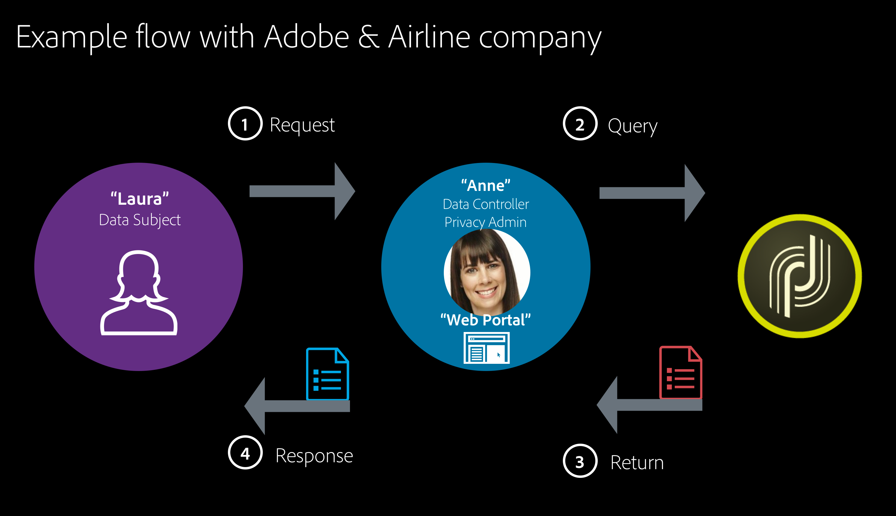

# Privacy and Consent{#privacy-and-recommendations}

## General recommendations {#general-recommendations}

Adobe Campaign is a powerful tool for collecting and processing extremely large amounts of data, including personal information and sensitive data. This is why privacy needs to be managed carefully.

* Always make responsible and ethical use of personal information.

* Refrain from sending unsolicited email, push notifications and SMS messages ("spam"). Adobe strongly believes in the principles of permission marketing in fostering customer lifetime value and loyalty, and therefore strictly forbids the use of Adobe Campaign in sending unsolicited messages.

Take the time to go through the [Security and Privacy checklist](../../installation/using/get-started-security-privacy.md) to learn the key elements to check regarding security and privacy.

### Privacy regulations {#privacy-regulations}

To correctly handle privacy and manage personal data, work within the legislations applicable to the region(s) where you operate. These regulations include:
* [GDPR](https://ec.europa.eu/info/law/law-topic/data-protection/reform/what-does-general-data-protection-regulation-gdpr-govern_en) (European General Data Protection Regulation)
* [DPA](https://www.gov.uk/data-protection) (UK’s implementation of GDPR)
* [European Directive on privacy and electronic communications](https://eur-lex.europa.eu/legal-content/EN/TXT/?uri=CELEX:02002L0058-20091219)
* [CAN-SPAM Act](https://www.ftc.gov/tips-advice/business-center/guidance/can-spam-act-compliance-guide-business) (US law setting the rules and requirements for commercial email)
* [CCPA](https://leginfo.legislature.ca.gov/faces/codes_displayText.xhtml?lawCode=CIV&division=3.&title=1.81.5.&part=4.&chapter=&article=) (California Consumer Privacy Act)
* [PDPA](https://secureprivacy.ai/thailand-pdpa-summary-what-businesses-need-to-know/) (Thailand Personal Data Protection Act)
* [LGPD](https://iapp.org/media/pdf/resource_center/Brazilian_General_Data_Protection_Law.pdf) (Brazilian General Data Protection Law) - will be effective starting Aug, 16 2020

>[!NOTE]
>
>For more on how GDPR, CCPA, PDPA, and LGPD apply to Adobe Campaign, see [this page](../../platform/using/privacy-management.md#privacy-management-regulations).

### Adobe Experience Cloud privacy {#experience-cloud-privacy}

Adobe Campaign is part of the Adobe Experience Cloud solutions. The way privacy is handled in Campaign obeys the Experience Cloud general principles, such as the following:

* **What information is collected when using Adobe Experience Cloud**

    As a company using Adobe Experience Cloud solutions, you choose what information to collect and send to your Adobe Experience Cloud account. Examples of the types of information that may be collected include web browsing activity, IP addresses, location information from mobile devices, campaign success rates, items purchased or placed in shopping cart, etc.

    >[!NOTE]
    >
    >As for all Adobe products, Campaign collects information about app and website users. For more on this, see the [Adobe Privacy Policy](https://www.adobe.com/privacy/policy.html).

* **How Adobe Experience Cloud is used to collect information**

    * Adobe Experience Cloud solutions use cookies and similar technologies, such as web beacons (also known as tags or pixels), to enable you to collect information. For more on cookies and tracking capabilities with Adobe Campaign, see [this section](#tracking-capabilities).
    * You may also use Adobe Experience Cloud technologies within your mobile apps. For more on sending mobile deliveries with Campaign, see [SMS channel](../../delivery/using/sms-channel.md) and [Mobile app channel](../../delivery/using/about-mobile-app-channel.md).

* **You users' privacy choices about your use of Adobe Experience Cloud**

    Adobe asks you to provide your customers privacy policies describing:

    * Your privacy practices in connection with Adobe Experience Cloud
    * How users can set their preferences for the collection or use of their information in connection with Adobe Experience Cloud

    >[!NOTE]
    >
    >As for all Adobe products, Campaign users can opt-out sharing information collected about them through apps and websites. For more on this, see the [Adobe Experience Cloud Usage Information FAQ](https://www.adobe.com/privacy/experience-cloud-usage-info-faq.html).

For further details on the Adobe Experience Cloud privacy, see [this page](https://www.adobe.com/privacy/marketing-cloud.html).

## Personal Data and Personas {#personal-data}

When managing Privacy, it is important to define what data should be handled with care and by whom.
* **Personal Data** is information that can directly or indirectly identify a living individual.
* **Sensitive Personal Data** is information related to an individual’s race, political views, religious beliefs, criminal background, genetic information, health data, sexual preference, biometric information, as well as trade union membership.

When integrating Campaign with other Experience Cloud solutions where audiences can be transferred from one system to another, such as [Adobe Analytics](../../platform/using/adobe-analytics-data-connector.md), [Audience Manager or People core service](../../integrations/using/sharing-audiences-with-adobe-experience-cloud.md), [Campaign Standard](../../integrations/using/synchronizing-audiences.md), or with other solutions through [CRM Connectors](../../platform/using/crm-connectors.md), you need to pay extra care to personal data protection.

The [main regulations](#privacy-regulations) refer to the different entities that manage data as follows:
* A **Data Controller** is the authority that determines the means and purpose of collecting, using, and sharing personal data.
* A **Data Processor** is any individual or party that collects, uses, or shares personal data as directed by the Data Controller.
* A **Data Subject** is any living individual whose personal data is being collected, used or shared, and who can be identified, directly or indirectly, by reference to that personal data.

Therefore, as a company collecting and sharing personal data, you are the Data Controller, your clients are the Data Subjects and Adobe Campaign acts as a Data Processor when handling their personal data as directed by you. Note that it is your responsibility as a Data Controller to handle the relationship with the Data Subjects such as when managing [privacy requests](#privacy-requests).

### Use case scenario {#use-case-scenario}

To illustrate how the different personas are interacting, here is an example of a high-level GDPR customer experience use case.

In this example, an airline company is the Adobe Campaign customer. This company is the **Data Controller** and all the clients of the airline company are **Data Subjects**. Laura in this particular case is a client of the airline company.

Here are the different personas used in this example:

* **Laura** is the **Data subject**. She is the recipient who receives messages from the airline company. Laura may be a frequent flyer, but may decide at some point that she does not want any personalized advertising or marketing messages from the airline company. She will ask the airline company (based on their process) to delete her frequent flier number.

* **Anne** is the **Data Controller** at the airline company. She receives Laura’s request, retrieves useful IDs requested to identify the Data Subject and submits the request in Adobe Campaign.

* **Adobe Campaign** is the **Data Processor**.

Here is the general flow for this use case:

1. The **Data Subject** (Laura) sends a GDPR request to the **Data Controller**, via email, customer care or a web portal.

1. The **Data Controller** (Anne) pushes the GDPR request to Campaign via the interface or using an API.

1. Once the **Data Processor** (Adobe Campaign) receives the information, it takes action on the GDPR request and sends a response or acknowledgement to the **Data Controller** (Anne).

1. The **Data Controller** (Anne) then reviews the information and sends it back to the **Data Subject** (Laura).

## Data acquisition {#data-acquisition}

Adobe Campaign enables you to collect data, including personal and sensitive information. It is therefore essential that you receive and monitor consent from your recipients.

* Always have recipients agree to receive communications. To do this, keep honoring opt-out requests as quickly as possible and verify consent through a double opt-in process. For more on this, see [Create a subscription form with double opt-in](../../web/using/use-cases--web-forms.md#create-a-subscription--form-with-double-opt-in).
* Do not import fraudulent lists and use seed addresses to check that your client file is not being used fraudulently. For more on this, see [About seed addresses](../../delivery/using/about-seed-addresses.md).
* Through consent and rights management, you can track your recipients' preferences as well as manage who within your organization can access which data. For more on this, see [this section](#consent).
* Facilitate and manage Privacy requests from your recipients. For more on this, see [this section](#privacy-requests).

## Privacy management {#privacy-management}

Privacy management refer to all the processes and tools that can help you comply with Privacy regulations (GDPR, CCPA, etc.). Get an overview of what privacy management is on [this page](https://helpx.adobe.com/campaign/kb/campaign-privacy-overview.html).

Adobe Campaign provides you with various sets of features dedicated to privacy management:
* Consent management, data Retention and user Roles. See [this section](#consent).
* Privacy requests (Right to Access and Right to be Forgotten). See [this section](#privacy-requests).
* Opt-out for the Sale of Personal Information (CCPA-specific). See [this section](../../platform/using/privacy-requests.md#sale-of-personal-information-ccpa).

The main Privacy capabilities in Campaign and an example of the personas involved are presented in [this section](https://helpx.adobe.com/campaign/kb/campaign-privacy-more.html#gdprpersonasandflow).

### Consent, Retention and Roles {#consent}

Originally, Adobe Campaign offers important features that are essential to Privacy:

* **Consent management**: Through the subscription management process, you can manage your recipients' preferences and track which recipients have opted-in to which type of subscriptions. For more on this, see [About subscriptions](../../delivery/using/about-services-and-subscriptions.md).
* **Data retention**: All built-in standard log tables have pre-set retention periods, generally limiting their data storage to 6 months or less. Additional retention periods can be set up with workflows. For more on this, reach out to the Adobe consultants or technical administrators.
* **Rights management**: Adobe Campaign provides you with the ability to manage the rights assigned to the various Campaign operators via different pre-built or custom roles. This allows you to manage who within your company can access, modify or export different types of data. For more on this, see [About access management](../../platform/using/access-management.md).

For more on these features and how to manage them in Adobe Campaign, see [this section](../../platform/using/privacy-management.md#consent-retention-roles).

### Privacy requests {#privacy-requests}

Adobe Campaign provides additional capabilities to help you facilitate your readiness as a Data Controller for certain Privacy requests:

* The **Right to Access** is the right for the Data Subject to obtain from the Data Controller confirmation as to whether or not personal data concerning them is being processed, where and why.

* The **Right to be Forgotten** (delete request) entitles the Data Subject to have the Data Controller erase his/her personal data.

The **Access** and **Delete** requests are presented in [this section](../../platform/using/privacy-management.md#right-access-forgotten).

The implementation steps to create these requests are detailed in [this section](../../platform/using/privacy-requests.md).

## Tracking capabilities {#tracking-capabilities}

### Cookies {#cookies}

Thanks to its tracking functionalities, Adobe Campaign enables you to track the browsing of your delivery recipients using three types of cookies: a session cookie and two permanent cookies.

* A **session** cookie: the **nlid** cookie contains the identifier of the email sent to the contact (**broadlogId**) and the identifier of the message template (**deliveryId**). It is added when the contact clicks a URL included in an email sent by Adobe Campaign and enables you to track their behavior on the web. This session cookie is erased automatically when the browser is closed. The contact can configure their browser to refuse cookies.

* Two **permanent** cookies: 
    * The **UUID** (Universal Unique IDentifier) cookie is shared between Adobe Experience Cloud solutions. It is set once until it disappears from the client browser when a new value is generated. This cookie enables you to identify the users who interact with the Experience Cloud solutions when they visit a website. It can be deposited by a landing page (to associate unknown customer activities to a recipient) or by a delivery. The description of this cookie is available on [this page](https://experienceleague.adobe.com/docs/core-services/interface/ec-cookies/cookies-mc.html?lang=en#ec-cookies).
    * The **nllastdelid** cookie (introduced in Campaign Classic 20.3) is a permanent cookie which contains the **deliveryId** of the last delivery that user clicked the link from. This cookie is used - when the session cookie is missing - to identify the tracking table that will be used.

Regulations such as the General Data Protection Regulation (GDPR) state that companies require the agreement of website users before installing any cookies.

* You must inform users that your sites are equipped with web tracking tools via an authorization request (that comes up over the page, for example) with a checkbox to authorize the use of cookies, or add a banner at the top of the first page they land on, etc.
* Pop-up windows should be avoided as they are often blocked by browsers.

### Message tracking {#message-tracking}

Adobe Campaign lets you track the emails sent and the behavior of your delivery recipients: opening, clicks on links, unsubscriptions, etc. For more on this, see [About message tracking](../../delivery/using/about-message-tracking.md).

To do this, add [tracked links](../../delivery/using/how-to-configure-tracked-links.md) to your messages in order to measure the impact of your delivery and recipient behavior in the [Tracking](../../delivery/using/delivery-dashboard.md#tracking-logs) tab of the delivery dashboard. Tracking data is interpreted in the [Tracking indicators](../../reporting/using/delivery-reports.md#tracking-indicators) report.

### Web tracking {#web-tracking}

Adobe Campaign also lets you monitor how recipients browse your website: insert tracking tags to collect information and measure visits on web application pages. For more on this, see [Tracking a web application](../../web/using/tracking-a-web-application.md).

The configuration of web tracking is presented in [this section](../../configuration/using/about-web-tracking.md).

To further manage tracking, Adobe Campaign enables you to display an opt-out banner to stop tracking web behaviors of end users who opt-out of behavioral tracking. For more on this, see [Web application tracking opt-out](../../web/using/web-application-tracking-opt-out.md).
