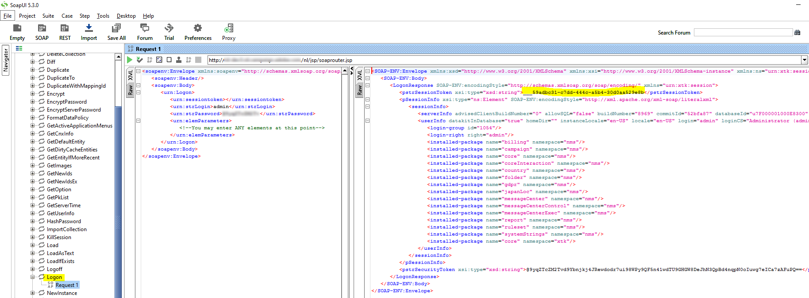

# Automatic Privacy request process {#automatic-privacy-request-api}


Adobe Campaign provides an **API** which allows you to setup an automatic Privacy request process.

With the API, the general Privacy process is the same as [using the interface](privacy-requests-ui.md). The only difference is the creation of the Privacy request. Instead of creating the request in Adobe Campaign, a POST containing the request information is sent to Campaign. For every request, a new entry is added in the **[!UICONTROL Privacy Requests]** screen. The Privacy technical workflows then process the request, the same way as for a request added using the interface.

If you're using the API to submit Privacy requests, we recommend that you leave the **2-step process** activated for the first Delete requests, in order to test the returned data. When your tests are finished, you can deactivate the 2-step process so that the Delete request process can run automatically.

The **[!UICONTROL CreateRequestByName]** JS API is defined as follows.

>[!NOTE]
>
>If you were using the **gdprRequest** API, you can still use it but it is recommended to use the new **privacyRequest** API.

>[!IMPORTANT]
>
>The **[!UICONTROL Privacy Data Right]** named right is required to use the API.

```
<method library="nms:gdpr.js" name="CreateRequestByName" static="true">
 <help>Create a new GDPR Request using namespace internal name</help>
 <parameters>
  <param name="namespaceName" type="string" desc="Namespace internal name"/>
  <param name="reconciliationValue" type="string" desc="Reconciliation value"/>
  <param name="type" type="long" desc="Reconciliation value"/>
  <param name="confirmDeletePending" type="boolean" desc="Request confirm before deleting data"/>
  <param name="regulation" type="long" desc="regulation of newly created request"/>
  <param name="id" type="long" inout="out" desc="ID of newly created request"/>
 </parameters>
</method>
```

>[!NOTE]
>
>The 'regulation' field is only available if you are using Campaign Classic 20.2 (build 9178+).
>
>If you are migrating to 20.2 and if you were already using the API, you must add the ‘regulation’ field as shown above. If you are using a previous build, you can continue to use the API without the ‘regulation’ field.

## Invoking the API externally {#invoking-api-externally}

Here is an example of how you can invoke the API externally (authentication via the API and details about the Privacy API specifically). For more information on the Privacy API, consult the [API documentation](https://experienceleague.adobe.com/developer/campaign-api/api/s-nms-privacyRequest.html). You can also consult the [Web service calls documentation](../../configuration/using/web-service-calls.md).

First of all, you need to perform the authentication via the API:

1. Download the **xtk:session** WSDL via this url: **`<server url>`/nl/jsp/schemawsdl.jsp?schema=xtk:session**.

1. Use the "Logon" method and pass in a username and password as parameters in the request. You will get a response containing a session token. Here is an example using SoapUI.

    

1. Use the returned Session Token as the authentication for all subsequence API calls. It expires after 24 hours.

Then invoke the Privacy API:

1. Download the WSDL from this URL: **`<server url>`/nl/jsp/schemawsdl.jsp?schema=nms:privacyRequest**.

1. Use **[!UICONTROL CreateRequestByName]** to create a specific Privacy request.

    Here is an example using the **[!UICONTROL CreateRequestByName]**. Note how we use the session token provided above as authentication. The response is the ID of the created request.

    

    To help you perform the steps above, consider the following:

    * You can use a **queryDef** on the **nms:gdprRequest** schema to check the status of the Access request.
    * You can use a **queryDef** on the **nms:gdprRequestData** schema to get the result of the Access request.
    * To be able to download the XML file from **"$(serverUrl)'/nms/gdpr.jssp?id='@id"**, you must be logged in and accessing it from an IP that is included in the allowlist. To do this, create a web application allowing you to access the file generated by the JSSP.

## Invoking the API from a JS {#invoking-api-from-js}

Here is an example of how you can invoke the API from a JS within Campaign Classic.

>[!NOTE]
>
>The 'regulation' field is only available if you are using Campaign Classic 20.2 (build 9178+).
>
>If you are migrating to 20.2 and if you were already using the API, you must add the ‘regulation’ field. If you are using a previous build, you can continue to use the API without the ‘regulation’ field.

* If you are **using a previous build (with GDPR package)**, you can continue to use the API without the ‘regulation’ field as shown below:

    ```
    loadLibrary("nms:gdpr.js");
    /**************************** 
    This code calls an API to create new Privacy request on the DB.
    It requires 4 parameters below.
    Feel free to change parameter values.
    ****************************/
    // 1. Namespace internal name
    var namespaceName = "defaultNamespace1";
    // 2. Reconciliation value for privacy request
    var reconciliationValue = "example@adobe.com";
    // 3. Privacy request type
    // GDPR_REQUEST_TYPE_ACCESS = 1;
    // GDPR_REQUEST_TYPE_DELETE = 2;
    var requestType = GDPR_REQUEST_TYPE_ACCESS;
    // 4. Confirm deleting data required.
    // value : true or false
    var ConfirmDeletePending = true;
    // BEGIN
    var requestId = nms.privacyRequest.CreateRequestByName(namespaceName, reconciliationValue, requestType, ConfirmDeletePending);
    // User can use a simple queryDef with requestID as a parameter to check request status.
    ```

* If you are **migrating to 20.2** and if you were already using the API, you must add the ‘regulation’ field as shown below:

    ```
    loadLibrary("nms:gdpr.js");
    /**************************** 
    This code calls an API to create new Privacy request on the DB.
    It requires 5 parameters below.
    Feel free to change parameter values.
    ****************************/
    // 1. Namespace internal name
    var namespaceName = "defaultNamespace1";
    // 2. Reconciliation value for privacy request
    var reconciliationValue = "example@adobe.com";
    // 3. Privacy request type
    // PRIVACY_REQUEST_TYPE_ACCESS = 1;
    // PRIVACY_REQUEST_TYPE_DELETE = 2;
    var requestType = PRIVACY_REQUEST_TYPE_ACCESS;
    // 4. Confirm deleting data required.
    // value : true or false
    var ConfirmDeletePending = true;
    // 5. Specify which regulation applies to newly created request. This is mandatory parameter.
    // GDPR = 1
    // CCPA = 2
    // PDPA = 3
    // LGPD = 4
    var regulation = 1;
    // BEGIN
    var requestId = nms.privacyRequest.CreateRequestByName(namespaceName, reconciliationValue, requestType, ConfirmDeletePending, regulation);
    // User can use a simple queryDef with requestID as a parameter to check request status.
    ```

* If you are **using Campaign Classic 20.2 (build 9178+) or above**, the 'regulation' field is optional, as shown below:

    ```
    loadLibrary("nms:gdpr.js");
    /**************************** 
    This code calls an API to create new Privacy request on the DB.
    It requires 5 parameters below.
    Feel free to change parameter values 
    ****************************/
    // 1. Namespace internal name
    var namespaceName = "defaultNamespace1";
    // 2. Reconciliation value for privacy request
    var reconciliationValue = "example@adobe.com";
    // 3. Privacy request type
    // PRIVACY_REQUEST_TYPE_ACCESS = 1;
    // PRIVACY_REQUEST_TYPE_DELETE = 2;
    var requestType = PRIVACY_REQUEST_TYPE_ACCESS;
    // 4. Confirm deleting data required.
    // value : true or false
    var ConfirmDeletePending = true;
    // 5. Specify which regulation applies to newly created request. This is optional parameter.
    // GDPR = 1
    // CCPA = 2
    // PDPA = 3
    // LGPD = 4
    var regulation = 1;
    // BEGIN
    var requestId = nms.privacyRequest.CreateRequestByName(namespaceName, reconciliationValue, requestType, ConfirmDeletePending, regulation);
    // User can use a simple queryDef with requestID as a parameter to check request status.
    ```
