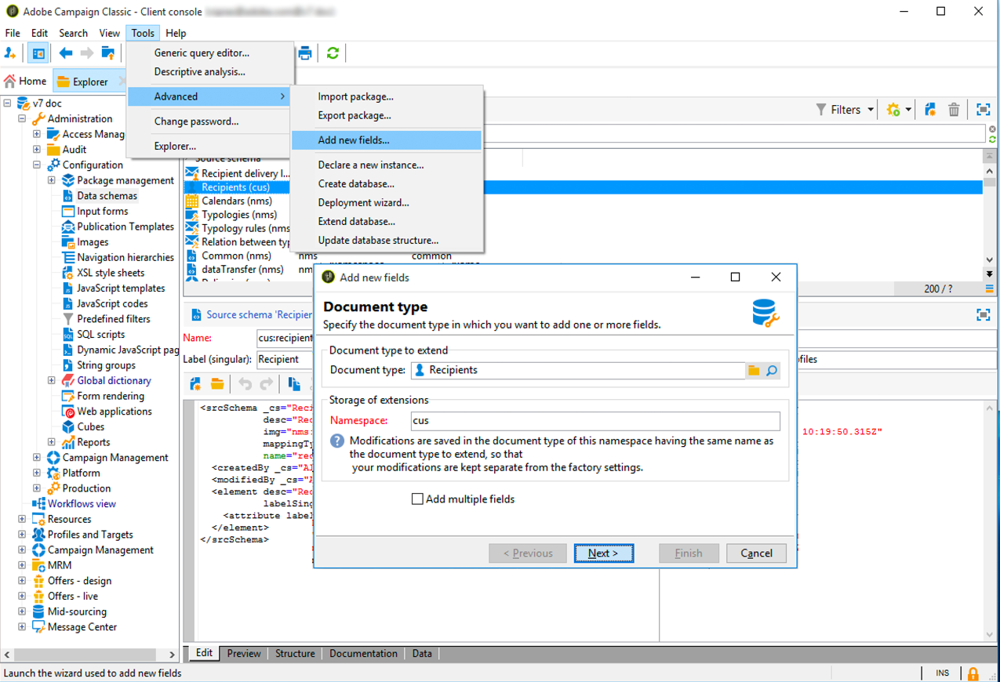
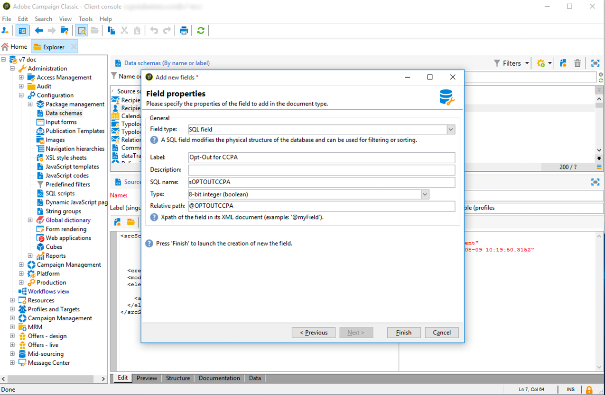

# Opt-out for the Sale of Personal Information (CCPA) {#sale-of-personal-information-ccpa}

 

The **California Consumer Privacy Act** (CCPA) provides California residents new rights in regards to their personal information and imposes data protection responsibilities on certain entities whom conduct business in California.

The configuration and usage of Access and Delete requests are common to both GDPR and CCPA. This section presents the opt-out for the sale of personal data, which is specific to CCPA.

In addition to the [Consent management](privacy-management.md#consent-management) tools provided by Adobe Campaign, you have the possibility to track whether a consumer has opted-out for the sale of Personal Information.

Contacts can decide, through your system, that they do not allow their personal information from being sold to a third-party. In Adobe Campaign, you will be able to store and track this information.

For this to work, you need to extend the Profiles table and add an **[!UICONTROL Opt-Out for CCPA]** field.

>[!IMPORTANT]
>
>It is your responsibility as the Data Controller to receive the Data Subject's request and to keep track of the request dates for CCPA. As a technology provider, we only provide a way to opt-out. For more on your role as a Data Controller, see [Personal data and Personas](privacy-and-recommendations.md#personal-data).

## Prerequisite {#ccpa-prerequisite}

To leverage this information, you need to create this field in Adobe Campaign Classic. For this, you will add a boolean field to the **[!UICONTROL Recipient]** table. When a new field is created, it is automatically supported by the Campaign API.

If you use a custom recipient table, you also need to perform this operation.

For more detailed information on how to create a new field, refer to the [Schema edition documentation](../../configuration/using/about-schema-edition.md).

>[!IMPORTANT]
>
>Modifying schemas is a sensitive operation which must be performed by expert users only.

1. Go to **[!UICONTROL Tools]** > **[!UICONTROL Advanced]** > **[!UICONTROL Add new fields]**, select **[!UICONTROL Recipients]** as the **[!UICONTROL Document type]** and click **[!UICONTROL Next]**. For more on adding fields to a table, see [this section](../../configuration/using/new-field-wizard.md).

    

1. For the **[!UICONTROL Field type]**, select **[!UICONTROL SQL field]**. For the Label, use **[!UICONTROL Opt-Out for CCPA]**. Select the **[!UICONTROL 8-bit integer (boolean)]** type and define the following unique **[!UICONTROL Relative path]**: @OPTOUTCCPA. Click **[!UICONTROL Finish]**.

    

    This will extend or create the **[!UICONTROL Recipient (cus)]** schema. Click it to verify that the field has been correctly added.

    

1. Click the **[!UICONTROL Configuration]** > **[!UICONTROL Input forms]** node of the explorer. In **[!UICONTROL Recipient (nms)]**, under "General Package", add an `<input>` element and use, for the xpath value, the relative path defined in step 2. For more on identifying a form, see [this section](../../configuration/using/identifying-a-form.md).

    ```
    <input  colspan="2" type="checkbox" xpath="@OPTOUTCCPA"/>
    ```

    

1. Disconnect and re-connect. Follow the steps described in the next section to verify that the field is available on a recipient's details. 

## Usage {#usage}

It is the responsibility of the Data Controller to populate the value of the field and follow the CCPA guidelines and rules concerning data selling.

To populate the values, several methods can be used:

* Using Campaign's interface by editing the recipient's details
* Using the API
* Via a data import workflow

You should then ensure that you never sell to any third party the personal information of profiles who have opted-out.

1. To change the opt-out status, go to **[!UICONTROL Profiles and Target]** > **[!UICONTROL Recipients]** and select a recipient. In the **[!UICONTROL General]** tab, you will see the field configured in the previous section.

    

1. Configure the recipients list to display the op-out column. To learn how to configure lists, refer to the [detailed documentation](../../platform/using/adobe-campaign-ui-lists.md#configuring-lists).

    

1. You can click the column to sort recipients according to the opt-out information. You can also create a filter to only display recipients who have opted-out. For more information about filters, refer to the [Campaign v8 (console) documentation](https://experienceleague.adobe.com/en/docs/campaign/campaign-v8/audience/create-filters){target=_blank}.


    
