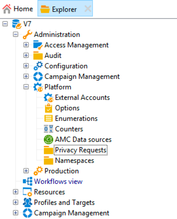
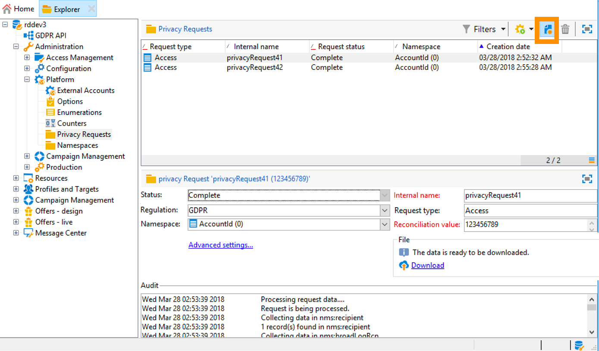
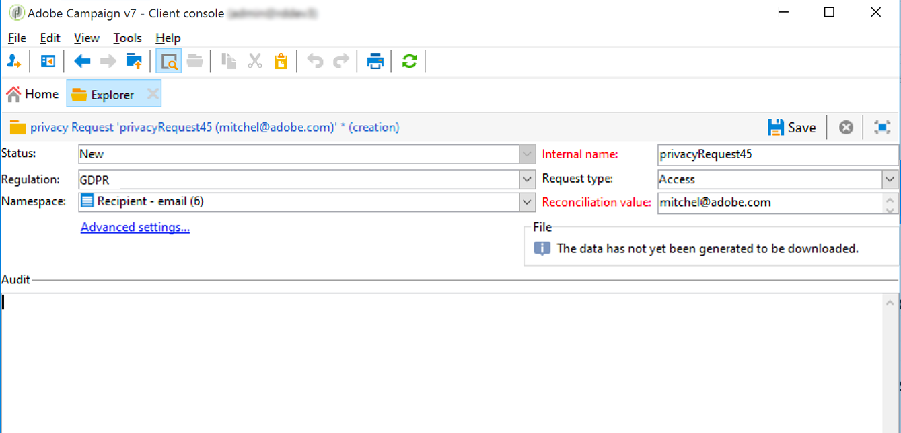
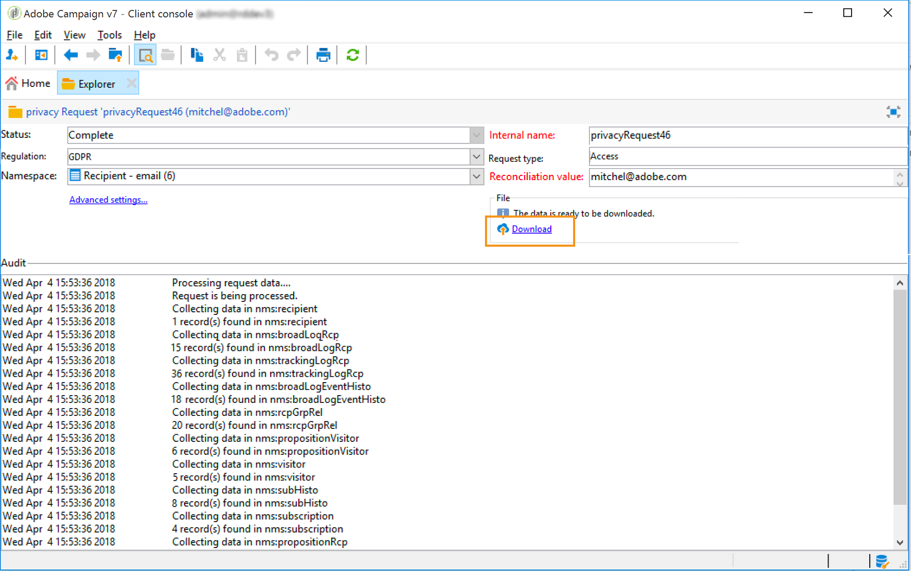
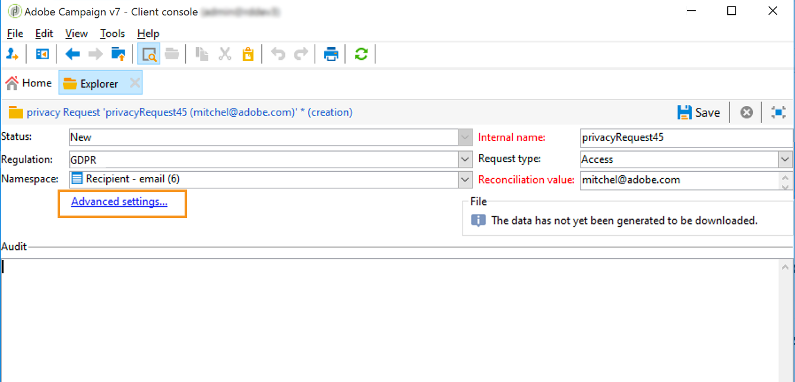
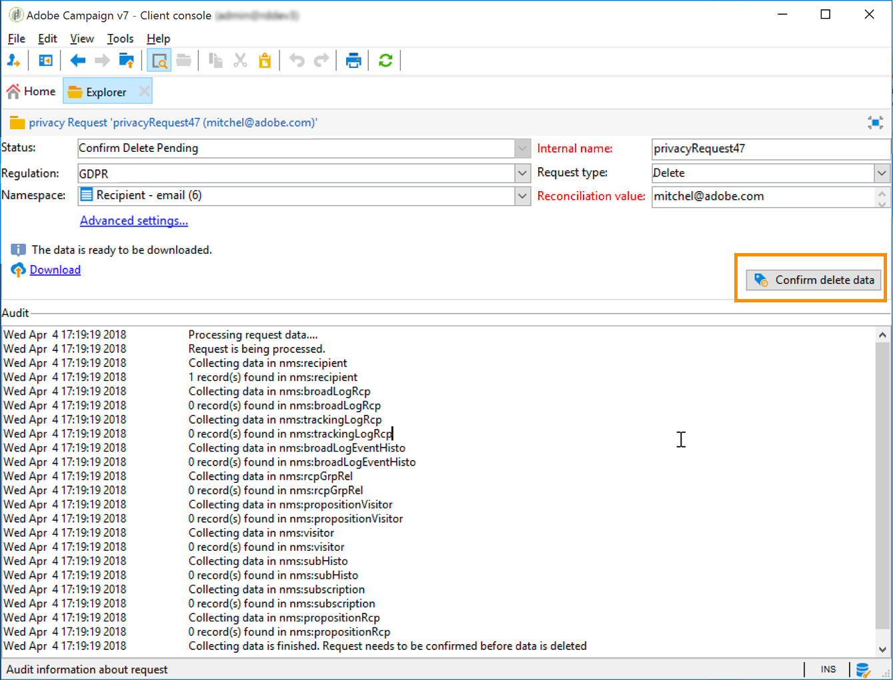
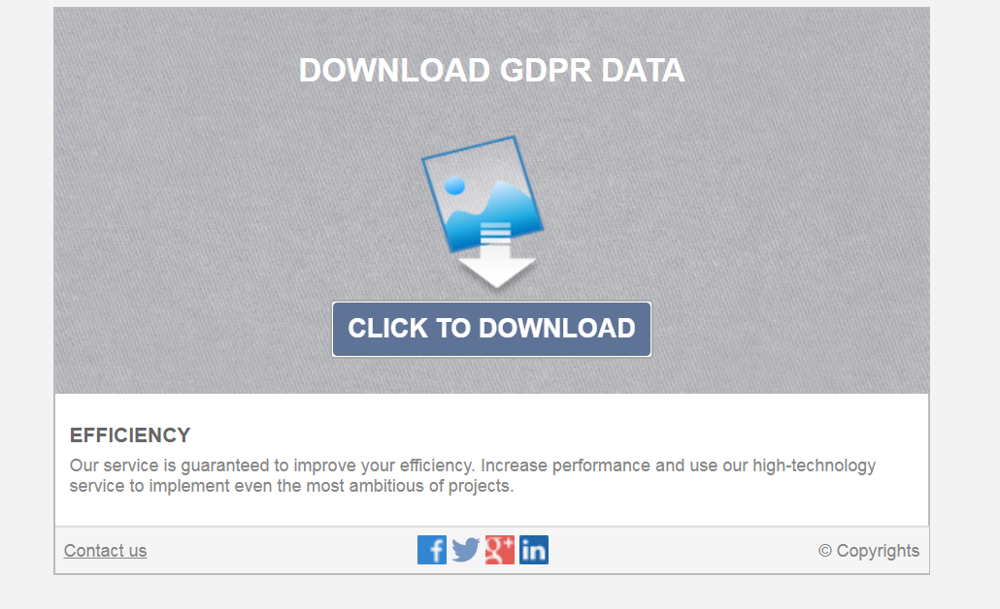
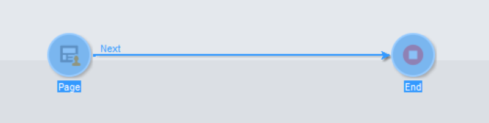

# Create and manage Privacy requests {#privacy-request-ui}


This section describes how you can create Access and Delete requests, as well as how Adobe Campaign processes them.

## Create a Privacy request {#create-privacy-request-ui}

The **Adobe Campaign interface** allows you to create your Privacy requests and track their evolution. To create a new Privacy request, follow these instructions:

1. Access the Privacy request folder under **[!UICONTROL Administration]** > **[!UICONTROL Platform]** > **[!UICONTROL Privacy Requests]**.

    

1. This screen allows you to view all the current Privacy requests, their status and logs. Click **[!UICONTROL New]** to create a Privacy request.

    

1. Select the **[!UICONTROL Regulation]** (GDPR, CCPA, PDPA or LGPD),  **[!UICONTROL Request type]** (Access or Delete), select a **[!UICONTROL Namespace]** and enter the **[!UICONTROL Reconciliation value]**. If you're using email as the namespace, type in the Data Subject's email.

    

The Privacy technical workflows run once every day and process each new request:

* Delete request: the recipient's data stored in Adobe Campaign is erased.
* Access requests: the recipient's data stored in Adobe Campaign is generated and made available as an XML file in the left part of the request screen.



## List of tables {#list-of-tables}

When performing a Delete or Access Privacy request, Adobe Campaign searches all the Data Subject's data based on the **[!UICONTROL Reconciliation value]** in all the tables that have a link to the recipient table (own type).

Here is the list of out-of-the-box tables that are taken into account when performing Privacy requests:

* Recipients (recipient)
* Recipient delivery log (broadLogRcp)
* Recipient tracking log (trackingLogRcp)
* Archived event delivery log (broadLogEventHisto)
* Recipient list content (rcpGrpRel)
* Visitor offer proposition (propositionVisitor)
* Visitors (visitor)
* Subscription history (subHisto)
* Subscriptions (subscription)
* Recipient offer proposition (propositionRcp)

If you created custom tables that have a link to the recipient table (own type), they will also be taken into account. For example, if you have a transaction table linked to the recipient table and a transaction details table linked to the transaction table, they will be both taken into account.

>[!IMPORTANT]
>
>If you perform Privacy batch requests using profile deletion workflows, please take into consideration the following remarks:
>* Profile deletion via workflows do not process children tables.
>* You need to handle the deletion for all the children tables.
>* Adobe recommends that you create an ETL workflow that add the lines to delete in the Privacy Access table and let the **[!UICONTROL Delete privacy requests data]** workflow perform the deletion. We suggest to limit to 200 profiles per day to delete for performance reasons.

## Privacy request statuses {#privacy-request-statuses}

Here are the different statuses for Privacy requests:

* **[!UICONTROL New]** / **[!UICONTROL Retry pending]**: in progress, the workflow has not processed the request yet.
* **[!UICONTROL Processing]** / **[!UICONTROL Retry in progress]**: the workflow is processing the request.
* **[!UICONTROL Delete pending]**: the workflow has identified all the recipient data to delete.
* **[!UICONTROL Delete in progress]**: the workflow is processing the deletion.
* **[!UICONTROL Delete Confirmation Pending]** (Delete request in 2-steps process mode): the workflow has processed the Access request. Manual confirmation is requested to perform the deletion. The button is available for 15 days.
* **[!UICONTROL Complete]**: the processing of the request has finished without an error.
* **[!UICONTROL Error]**: the workflow has encountered an error. The reason appears in the list of Privacy requests in the **[!UICONTROL Request status]** column. For example, **[!UICONTROL Error data not found]** means that no recipient data matching the Data Subject's **[!UICONTROL Reconciliation value]** has been found in the database.

## 2-step process {#two-step-process}

By default, the **2-step process** is activated. When you create a new Delete request using this mode, Adobe Campaign always performs an Access request first. This allows you to check the data before confirming the deletion.

You can change this mode from the privacy request edition screen. Click **[!UICONTROL Advanced settings]**.



With the 2-step mode activated, the status of a new Delete request changes to **[!UICONTROL Confirm Delete Pending]**. Download the generated XML file from the privacy request screen and check the data. To confirm erasing the data, click the **[!UICONTROL Confirm delete data]** button.



## JSSP URL {#jspp-url}

When processing Access requests, Adobe Campaign generates a JSSP that retrieves the recipient's data from the database and exports it into an XML file stored on the local machine. The JSSP URL is defined as below:

```
"$(serverUrl)+'/nms/gdpr.jssp?id='+@id"
```

where @id is the privacy request ID.

This URL is stored in the **[!UICONTROL "File location" (@urlFile)]** field of the **[!UICONTROL Privacy Requests (gdprRequest)]** schema.

The information is available in the database for 90 days. Once the request is cleaned up by the technical workflow, the information is removed from the database and the URL becomes obsolete. Please check that the URL is still valid before downloading the data from a web page.

Here is an example of a Data Subject's data file:


Data Controllers can easily create a web application including the corresponding JSSP URL to make the Data Subject's data file available from a web page.



Here is a code snippet you can use as an example in the web application **[!UICONTROL Page]** activity.



```
<!DOCTYPE html PUBLIC "-//W3C//DTD XHTML 1.0 Transitional//EN" "http://www.w3.org/TR/xhtml1/DTD/xhtml1-transitional.dtd"> <html xmlns="http://www.w3.org/1999/xhtml"> <head> <meta http-equiv="Content-Language" content="en"> <meta http-equiv="Content-Type" content="text/html; charset=utf-8" /> <link rel="stylesheet" type="text/css" href="/nl/webForms/landingPage.css"/> <title>Clickthrough</title> <style type="text/css" media="all"> /* override formulary area */ .formulary { top: 200px; position: absolute; left: 0; } </style> </head> <body style="" class="">
<center>
<div id="wrap">
<div id="header">
<div class="header-title center-title">DOWNLOAD GDPR DATA</div>
<div class="formulary center-formulary"><form>
<div class="button large-button"><a href=[SERVER_URL]/nms/gdpr.jssp?id=13000" data-nl-type="externalLink">CLICK TO DOWNLOAD</a></div>
</form></div>
</div>
<div id="content">
<div class="row">
<div class="info">
<div class="desc">
<div class="title">EFFICIENCY</div>
<div class="desc">Our service is guaranteed to improve your efficiency. Increase performance and use our high-technology service to implement even the most ambitious of projects.</div>
</div>
</div>
</div>
</div>
<div id="footer">
<div style="text-align: center;">
<div style="float: left;"><a href="#">Contact us</a></div>
<div style="float: right;">&copy; Copyrights</div>
<div><a href="#"></a> <a href="#"></a> <a href="#"></a> <a href="#"></a></div>
</div>
</div>
</div>
</center>
</body> </html>
```

Since the access to the Data Subject's data file is restricted, the web page anonymous access must be disabled. Only operator with the **[!UICONTROL Privacy Data Right]** named right can log on to the page and download the data.
