# Managing privacy requests {#privacy-requests}

For a general presentation on Privacy Management, refer to [this section](../../platform/using/privacy-management.md).

This information applies to GDPR, CCPA, PDPA, and LGPD. For more on these regulations, see [this section](../../platform/using/privacy-management.md#privacy-management-regulations).

The opt-out for the Sale of Personal Information, which is specific to CCPA, is explained in [this section](#sale-of-personal-information-ccpa).

<!--Installation procedures described in this document are applicable starting Campaign Classic 18.4 (build 8931+). If you are running on a previous version, refer to this [technote](https://helpx.adobe.com/campaign/kb/how-to-install-gdpr-package-on-legacy-versions.html).-->

## About Privacy Requests {#about-privacy-requests}

In order to help you facilitate your Privacy readiness, Adobe Campaign allows you to handle Access and Delete requests. The **Right to Access** and the **Right to be Forgotten** (delete request) are described in [this section](../../platform/using/privacy-management.md#right-access-forgotten).

Let's see how you can create Access and Delete requests, as well as how Adobe Campaign processes them.

### Principles {#principles}

Adobe Campaign offers Data Controllers two possibilities for performing Privacy Access and Delete requests:

* Via the **Adobe Campaign interface**: for each Privacy request, the Data Controller creates a new privacy request in Adobe Campaign. See [this section](#create-privacy-request-ui).
* Via the **API**: Adobe Campaign provides an API that allows the automatic process of Privacy requests using SOAP. See [this section](#automatic-privacy-request-api).

>[!NOTE]
>
>For more on personal data and on the different entities that manage data (Data Controller, Data Processor and Data Subject), see [Personal data and Personas](../../platform/using/privacy-and-recommendations.md#personal-data).

### Prerequisites {#prerequesites}

Adobe Campaign offers Data Controllers tools to create and process Privacy requests for data stored in Adobe Campaign. However, it is the Data Controller's responsibility to handle the relationship with the Data Subject (email, customer care or a web portal).

It is therefore your responsibility as a Data Controller to confirm the identity of the Data Subject making the request and to confirm that the data returned to the requester is about the Data Subject.

### Installing the Privacy package {#install-privacy-package}

In order to use this feature, you need to install the **[!UICONTROL Privacy Data Protection Regulation]** package via the **[!UICONTROL Tools]** > **[!UICONTROL Advanced]** > **[!UICONTROL Import package]** > **[!UICONTROL Adobe Campaign Package]** menu. For more information on how to install packages, refer to the [detailed documentation](../../installation/using/installing-campaign-standard-packages.md).

Two new folders, specific to Privacy, are created under **[!UICONTROL Administration]** > **[!UICONTROL Platform]**:

* **[!UICONTROL Privacy Requests]**: this is where you will create your Privacy requests and track their evolution.
* **[!UICONTROL Namespaces]**: this is where you will define the field that will be used to identify the Data Subject in the Adobe Campaign database.

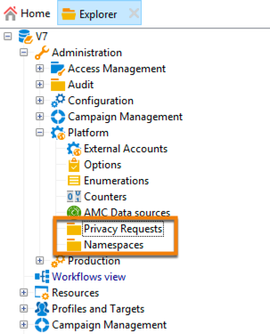

In **[!UICONTROL Administration]** > **[!UICONTROL Production]** > **[!UICONTROL Technical workflows]**, three technical workflows run every day to process Privacy requests.

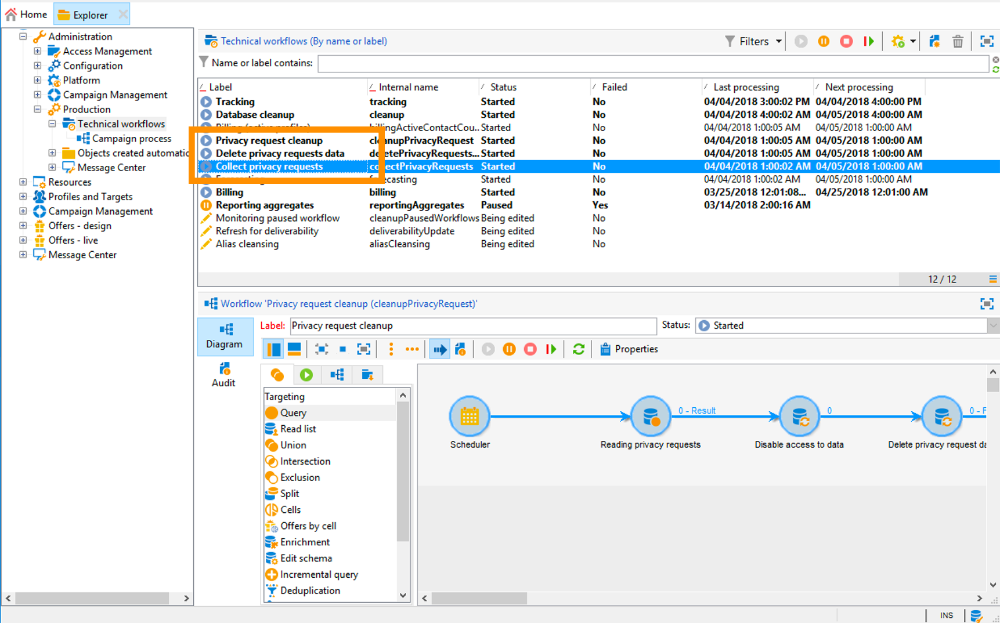

* **[!UICONTROL Collect privacy requests]**: this workflow generates the recipient's data stored in Adobe Campaign and makes it available for download in the privacy request's screen.
* **[!UICONTROL Delete privacy requests data]**: this workflow deletes the recipient's data stored in Adobe Campaign.
* **[!UICONTROL Privacy request cleanup]**: this workflow erases the access request files that are older than 90 days.

In **[!UICONTROL Administration]** > **[!UICONTROL Access Management]** > **[!UICONTROL Named rights]**, the **[!UICONTROL Privacy Data Right]** named right has been added. This named right is required for Data Controllers in order for them to use privacy tools. This allows them to create new requests, track their evolution, use the API, etc.

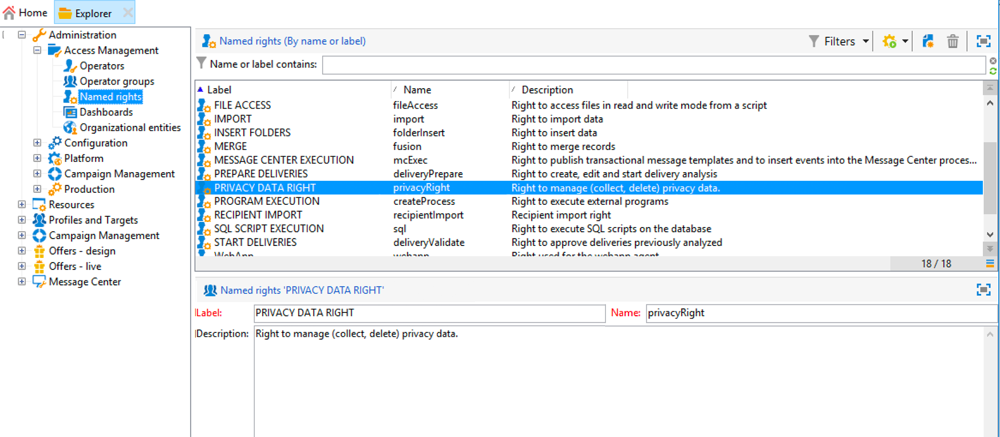

### Namespaces {#namesspaces}

Before creating Privacy requests, you need to define the namespace you will use. This is the key that will be used to identify the Data Subject in the Adobe Campaign database.

Three namespaces are available out-of-the-box: email, phone and mobile phone. If you need a different namespace (a recipient custom field, for example), you can create a new one from **[!UICONTROL Administration]** > **[!UICONTROL Platform]** > **[!UICONTROL Namespaces]**.

## Creating a Privacy request {#create-privacy-request-ui}

The **Adobe Campaign interface** allows you to create your Privacy requests and track their evolution. To create a new Privacy request, follow these instructions:

1. Access the Privacy request folder under **[!UICONTROL Administration]** > **[!UICONTROL Platform]** > **[!UICONTROL Privacy Requests]**.

    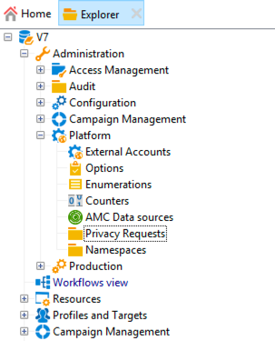

1. This screen allows you to view all the current Privacy requests, their status and logs. Click **[!UICONTROL New]** to create a Privacy request.

    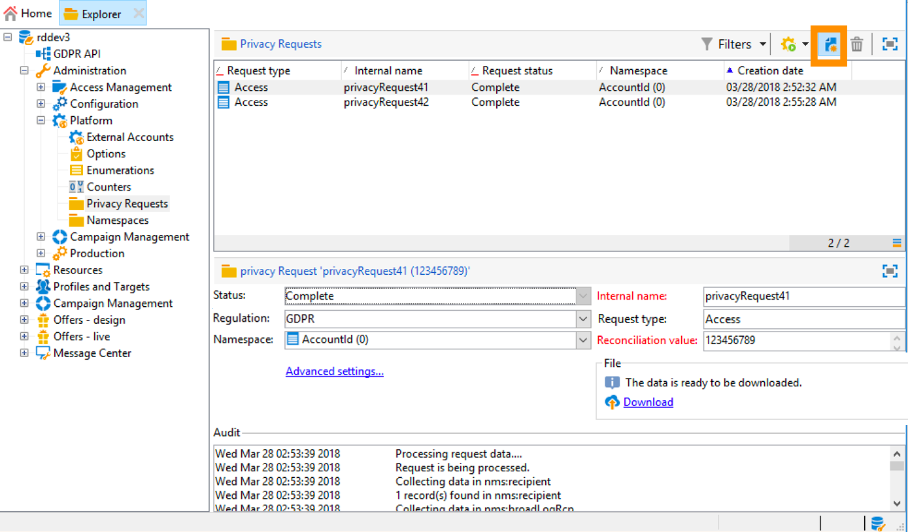

1. Select the **[!UICONTROL Regulation]** (GDPR, CCPA, PDPA or LGPD),  **[!UICONTROL Request type]** (Access or Delete), select a **[!UICONTROL Namespace]** and enter the **[!UICONTROL Reconciliation value]**. If you're using email as the namespace, type in the Data Subject's email.

    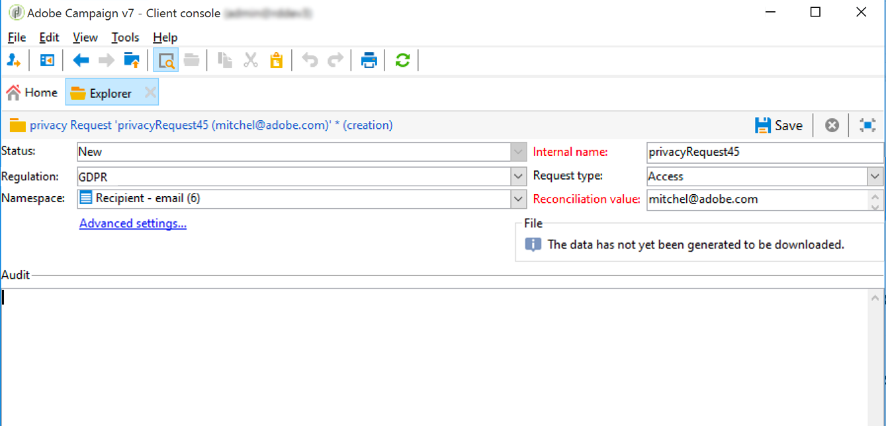

The Privacy technical workflows run once every day and process each new request:

* Delete request: the recipient's data stored in Adobe Campaign is erased.
* Access requests: the recipient's data stored in Adobe Campaign is generated and made available as an XML file in the left part of the request screen.

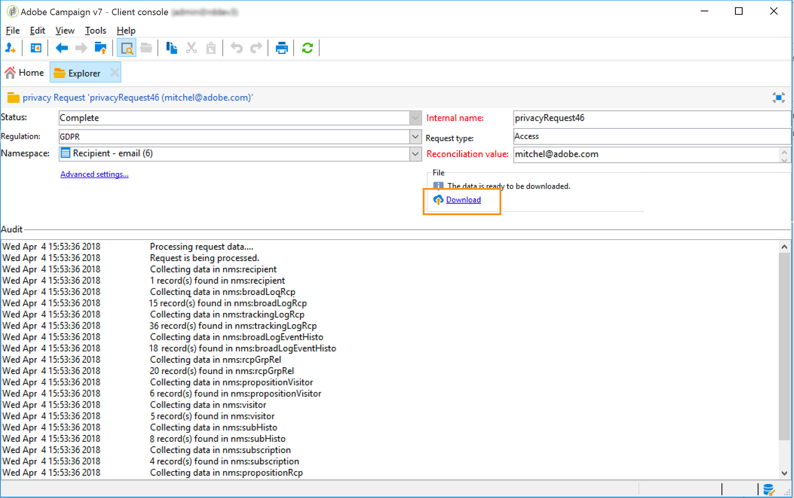

### List of tables {#list-of-tables}

When performing a Delete or Access Privacy request, Adobe Campaign searches all the Data Subject's data based on the **[!UICONTROL Reconciliation value]** in all the tables that have a link to the recipient table (own type).

Here is the list of out-of-the-box tables that are taken into account when performing Privacy requests:

* Recipients (recipient)
* Recipient delivery log (broadLogRcp)
* Recipient tracking log (trackingLogRcp)
* Archived event delivery log (broadLogEventHisto)
* Recipient list content (rcpGrpRel)
* Visitor offer proposition (propositionVisitor)
* Visitors (visitor)
* Subscription history (subHisto)
* Subscriptions (subscription)
* Recipient offer proposition (propositionRcp)

If you created custom tables that have a link to the recipient table (own type), they will also be taken into account. For example, if you have a transaction table linked to the recipient table and a transaction details table linked to the transaction table, they will be both taken into account.

>[!IMPORTANT]
>
>If you perform Privacy batch requests using profile deletion workflows, please take into consideration the following remarks:
>* Profile deletion via workflows do not process children tables.
>* You need to handle the deletion for all the children tables.
>* Adobe recommends that you create an ETL workflow that add the lines to delete in the Privacy Access table and let the **[!UICONTROL Delete privacy requests data]** workflow perform the deletion. We suggest to limit to 200 profiles per day to delete for performance reasons.

### Privacy request statuses {#privacy-request-statuses}

Here are the different statuses for Privacy requests:

* **[!UICONTROL New]** / **[!UICONTROL Retry pending]**: in progress, the workflow has not processed the request yet.
* **[!UICONTROL Processing]** / **[!UICONTROL Retry in progress]**: the workflow is processing the request.
* **[!UICONTROL Delete pending]**: the workflow has identified all the recipient data to delete.
* **[!UICONTROL Delete in progress]**: the workflow is processing the deletion.
* **[!UICONTROL Delete Confirmation Pending]** (Delete request in 2-steps process mode): the workflow has processed the Access request. Manual confirmation is requested to perform the deletion. The button is available for 15 days.
* **[!UICONTROL Complete]**: the processing of the request has finished without an error.
* **[!UICONTROL Error]**: the workflow has encountered an error. The reason appears in the list of Privacy requests in the **[!UICONTROL Request status]** column. For example, **[!UICONTROL Error data not found]** means that no recipient data matching the Data Subject's **[!UICONTROL Reconciliation value]** has been found in the database.

### 2-step process {#two-step-process}

By default, the **2-step process** is activated. When you create a new Delete request using this mode, Adobe Campaign always performs an Access request first. This allows you to check the data before confirming the deletion.

You can change this mode from the privacy request edition screen. Click **[!UICONTROL Advanced settings]**.

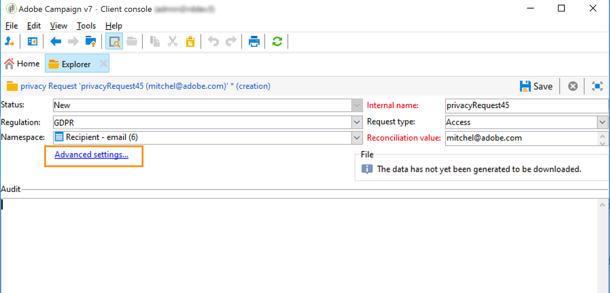

With the 2-step mode activated, the status of a new Delete request changes to **[!UICONTROL Confirm Delete Pending]**. Download the generated XML file from the privacy request screen and check the data. To confirm erasing the data, click the **[!UICONTROL Confirm delete data]** button.

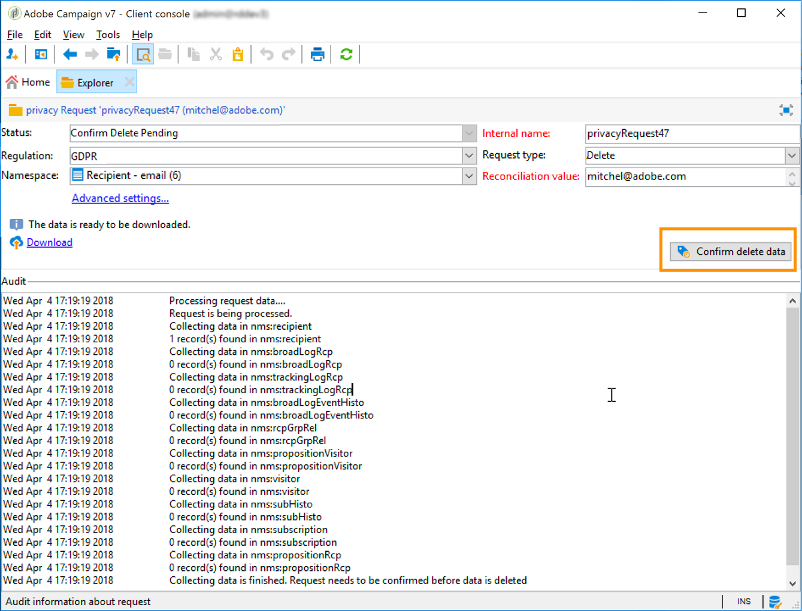

### JSSP URL {#jspp-url}

When processing Access requests, Adobe Campaign generates a JSSP that retrieves the recipient's data from the database and exports it into an XML file stored on the local machine. The JSSP URL is defined as below:

```
"$(serverUrl)+'/nms/gdpr.jssp?id='+@id"
```

where @id is the privacy request ID.

This URL is stored in the **[!UICONTROL "File location" (@urlFile)]** field of the **[!UICONTROL Privacy Requests (gdprRequest)]** schema.

The information is available in the database for 90 days. Once the request is cleaned up by the technical workflow, the information is removed from the database and the URL becomes obsolete. Please check that the URL is still valid before downloading the data from a web page.

Here is an example of a Data Subject's data file:

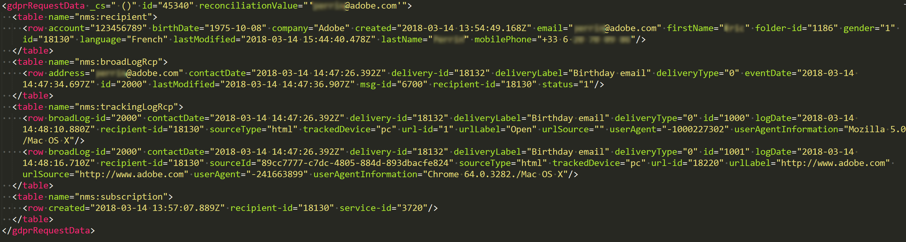

Data Controllers can easily create a web application including the corresponding JSSP URL to make the Data Subject's data file available from a web page.

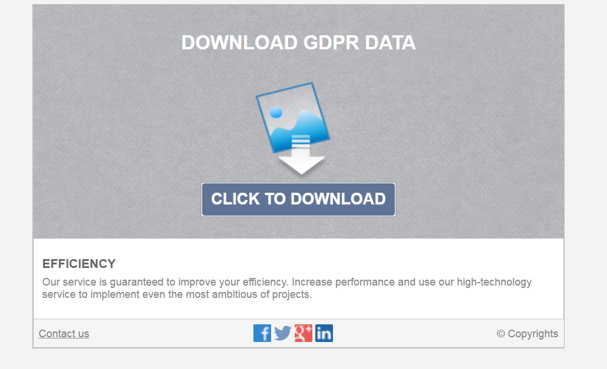

Here is a code snippet you can use as an example in the web application **[!UICONTROL Page]** activity.

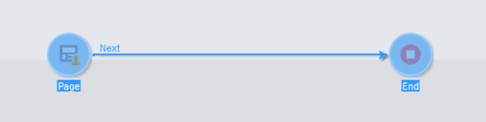

```
<!DOCTYPE html PUBLIC "-//W3C//DTD XHTML 1.0 Transitional//EN" "http://www.w3.org/TR/xhtml1/DTD/xhtml1-transitional.dtd"> <html xmlns="http://www.w3.org/1999/xhtml"> <head> <meta http-equiv="Content-Language" content="en"> <meta http-equiv="Content-Type" content="text/html; charset=utf-8" /> <link rel="stylesheet" type="text/css" href="/nl/webForms/landingPage.css"/> <title>Clickthrough</title> <style type="text/css" media="all"> /* override formulary area */ .formulary { top: 200px; position: absolute; left: 0; } </style> </head> <body style="" class="">
<center>
<div id="wrap">
<div id="header">
<div class="header-title center-title">DOWNLOAD GDPR DATA</div>
<div class="formulary center-formulary"><form>
<div class="button large-button"><a href=[SERVER_URL]/nms/gdpr.jssp?id=13000" data-nl-type="externalLink">CLICK TO DOWNLOAD</a></div>
</form></div>
</div>
<div id="content">
<div class="row">
<div class="info">
<div class="desc">
<div class="title">EFFICIENCY</div>
<div class="desc">Our service is guaranteed to improve your efficiency. Increase performance and use our high-technology service to implement even the most ambitious of projects.</div>
</div>
</div>
</div>
</div>
<div id="footer">
<div style="text-align: center;">
<div style="float: left;"><a href="#">Contact us</a></div>
<div style="float: right;">&copy; Copyrights</div>
<div><a href="#"></a> <a href="#"></a> <a href="#"></a> <a href="#"></a></div>
</div>
</div>
</div>
</center>
</body> </html>
```

Since the access to the Data Subject's data file is restricted, the web page anonymous access must be disabled. Only operator with the **[!UICONTROL Privacy Data Right]** named right can log on to the page and download the data.

## Automatic Privacy request process {#automatic-privacy-request-api}

Adobe Campaign provides an **API** which allows you to setup an automatic Privacy request process.

With the API, the general Privacy process is the same as [using the interface](#create-privacy-request-ui). The only difference is the creation of the Privacy request. Instead of creating the request in Adobe Campaign, a POST containing the request information is sent to Campaign. For every request, a new entry is added in the **[!UICONTROL Privacy Requests]** screen. The Privacy technical workflows then process the request, the same way as for a request added using the interface.

If you're using the API to submit Privacy requests, we recommend that you leave the **2-step process** activated for the first Delete requests, in order to test the returned data. When your tests are finished, you can deactivate the 2-step process so that the Delete request process can run automatically.

The **[!UICONTROL CreateRequestByName]** JS API is defined as follows.

>[!NOTE]
>
>If you were using the **gdprRequest** API, you can still use it but it is recommended to use the new **privacyRequest** API.

>[!IMPORTANT]
>
>The **[!UICONTROL Privacy Data Right]** named right is required to use the API.

```
<method library="nms:gdpr.js" name="CreateRequestByName" static="true">
 <help>Create a new GDPR Request using namespace internal name</help>
 <parameters>
  <param name="namespaceName" type="string" desc="Namespace internal name"/>
  <param name="reconciliationValue" type="string" desc="Reconciliation value"/>
  <param name="type" type="long" desc="Reconciliation value"/>
  <param name="confirmDeletePending" type="boolean" desc="Request confirm before deleting data"/>
  <param name="regulation" type="long" desc="regulation of newly created request"/>
  <param name="id" type="long" inout="out" desc="ID of newly created request"/>
 </parameters>
</method>
```

>[!NOTE]
>
>The 'regulation' field is only available if you are using Campaign Classic 20.2 (build 9178+).
>
>If you are migrating to 20.2 and if you were already using the API, you must add the ‘regulation’ field as shown above. If you are using a previous build, you can continue to use the API without the ‘regulation’ field.

### Invoking the API externally {#invoking-api-externally}

Here is an example of how you can invoke the API externally (authentication via the API and details about the Privacy API specifically). For more information on the Privacy API, consult the [API documentation](https://docs.adobe.com/content/help/en/campaign-classic/technicalresources/api/s-nms-privacyRequest.html). You can also consult the [Web service calls documentation](../../configuration/using/web-service-calls.md).

First of all, you need to perform the authentication via the API:

1. Download the **xtk:session** WSDL via this url: **`<server url>`/nl/jsp/schemawsdl.jsp?schema=xtk:session**.

1. Use the "Logon" method and pass in a username and password as parameters in the request. You will get a response containing a session token. Here is an example using SoapUI.

    

1. Use the returned Session Token as the authentication for all subsequence API calls. It expires after 24 hours.

Then invoke the Privacy API:

1. Download the WSDL from this URL: **`<server url>`/nl/jsp/schemawsdl.jsp?schema=nms:privacyRequest**.

1. Use **[!UICONTROL CreateRequestByName]** to create a specific Privacy request.

    Here is an example using the **[!UICONTROL CreateRequestByName]**. Note how we use the session token provided above as authentication. The response is the ID of the created request.

    

    To help you perform the steps above, consider the following:

    * You can use a **queryDef** on the **nms:gdprRequest** schema to check the status of the Access request.
    * You can use a **queryDef** on the **nms:gdprRequestData** schema to get the result of the Access request.
    * To be able to download the XML file from **"$(serverUrl)'/nms/gdpr.jssp?id='@id"**, you must be logged in and accessing it from a whitelisted IP. To do this, create a web application allowing you to access the file generated by the JSSP.

### Invoking the API from a JS {#invoking-api-from-js}

Here is an example of how you can invoke the API from a JS within Campaign Classic.

>[!NOTE]
>
>The 'regulation' field is only available if you are using Campaign Classic 20.2 (build 9178+).
>
>If you are migrating to 20.2 and if you were already using the API, you must add the ‘regulation’ field. If you are using a previous build, you can continue to use the API without the ‘regulation’ field.

* If you are **using a previous build (with GDPR package)**, you can continue to use the API without the ‘regulation’ field as shown below:

    ```
    loadLibrary("nms:gdpr.js");
    /**************************** 
    This code calls an API to create new Privay request on the DB.
    It requires 4 parameters below.
    Feel free to change parameter values.
    ****************************/
    // 1. Namespace internal name
    var namespaceName = "defaultNamespace1";
    // 2. Reconciliation value for privacy request
    var reconciliationValue = "example@adobe.com";
    // 3. Privacy request type
    // GDPR_REQUEST_TYPE_ACCESS = 1;
    // GDPR_REQUEST_TYPE_DELETE = 2;
    var requestType = GDPR_REQUEST_TYPE_ACCESS;
    // 4. Confirm deleting data required.
    // value : true or false
    var ConfirmDeletePending = true;
    // BEGIN
    var requestId = nms.privacyRequest.CreateRequestByName(namespaceName, reconciliationValue, requestType, ConfirmDeletePending);
    // User can use a simple queryDef with requestID as a parameter to check request status.
    ```

* If you are **migrating to 20.2** and if you were already using the API, you must add the ‘regulation’ field as shown below:

    ```
    loadLibrary("nms:gdpr.js");
    /**************************** 
    This code calls an API to create new Privay request on the DB.
    It requires 5 parameters below.
    Feel free to change parameter values.
    ****************************/
    // 1. Namespace internal name
    var namespaceName = "defaultNamespace1";
    // 2. Reconciliation value for privacy request
    var reconciliationValue = "example@adobe.com";
    // 3. Privacy request type
    // PRIVACY_REQUEST_TYPE_ACCESS = 1;
    // PRIVACY_REQUEST_TYPE_DELETE = 2;
    var requestType = PRIVACY_REQUEST_TYPE_ACCESS;
    // 4. Confirm deleting data required.
    // value : true or false
    var ConfirmDeletePending = true;
    // 5. Specify which regulation applies to newly created request. This is mandatory parameter.
    // GDPR = 1
    // CCPA = 2
    // PDPA = 3
    // LGPD = 4
    var regulation = 1;
    // BEGIN
    var requestId = nms.privacyRequest.CreateRequestByName(namespaceName, reconciliationValue, requestType, ConfirmDeletePending, regulation);
    // User can use a simple queryDef with requestID as a parameter to check request status.
    ```

* If you are **using Campaign Classic 20.2 (build 9178+) or above**, the 'regulation' field is optional, as shown below:

    ```
    loadLibrary("nms:gdpr.js");
    /**************************** 
    This code calls an API to create new Privay request on the DB.
    It requires 5 parameters below.
    Feel free to change parameter values 
    ****************************/
    // 1. Namespace internal name
    var namespaceName = "defaultNamespace1";
    // 2. Reconciliation value for privacy request
    var reconciliationValue = "example@adobe.com";
    // 3. Privacy request type
    // PRIVACY_REQUEST_TYPE_ACCESS = 1;
    // PRIVACY_REQUEST_TYPE_DELETE = 2;
    var requestType = PRIVACY_REQUEST_TYPE_ACCESS;
    // 4. Confirm deleting data required.
    // value : true or false
    var ConfirmDeletePending = true;
    // 5. Specify which regulation applies to newly created request. This is optional parameter.
    // GDPR = 1
    // CCPA = 2
    // PDPA = 3
    // LGPD = 4
    var regulation = 1;
    // BEGIN
    var requestId = nms.privacyRequest.CreateRequestByName(namespaceName, reconciliationValue, requestType, ConfirmDeletePending, regulation);
    // User can use a simple queryDef with requestID as a parameter to check request status.
    ```

## Opt-out for the Sale of Personal Information (CCPA) {#sale-of-personal-information-ccpa}

The **California Consumer Privacy Act** (CCPA) provides California residents new rights in regards to their personal information and imposes data protection responsibilities on certain entities whom conduct business in California.

The configuration and usage of Access and Delete requests are common to both GDPR and CCPA. This section presents the opt-out for the sale of personal data, which is specific to CCPA.

In addition to the [Consent management](../../platform/using/privacy-management.md#consent-management) tools provided by Adobe Campaign, you have the possibility to track whether a consumer has opted-out for the sale of Personal Information.

A consumer decides, through your system, that he/she does not allow his/her personal information from being sold to a third-party. In Adobe Campaign, you will be able to store and track this information.

For this to work, you need to extend the Profiles table and add an **[!UICONTROL Opt-Out for CCPA]** field.

>[!IMPORTANT]
>
>It is your responsibility as the Data Controller to receive the Data Subject's request and to keep track of the request dates for CCPA. As a technology provider, we only provide a way to opt-out. For more on your role as a Data Controller, see [Personal data and Personas](../../platform/using/privacy-and-recommendations.md#personal-data).

### Prerequisite {#ccpa-prerequisite}

To leverage this information, you need to create this field in Adobe Campaign Classic. For this, you will add a boolean field to the **[!UICONTROL Recipient]** table. When a new field is created, it is automatically supported by the Campaign API.

If you use a custom recipient table, you also need to perform this operation.

For more detailed information on how to create a new field, refer to the [Schema edition documentation](../../configuration/using/about-schema-edition.md).

>[!IMPORTANT]
>
>Modifying schemas is a sensitive operation which must be performed by expert users only.

1. Go to **[!UICONTROL Tools]** > **[!UICONTROL Advanced]** > **[!UICONTROL Add new fields]**, select **[!UICONTROL Recipients]** as the **[!UICONTROL Document type]** and click **[!UICONTROL Next]**. For more on adding fields to a table, see [this section](../../configuration/using/new-field-wizard.md).

    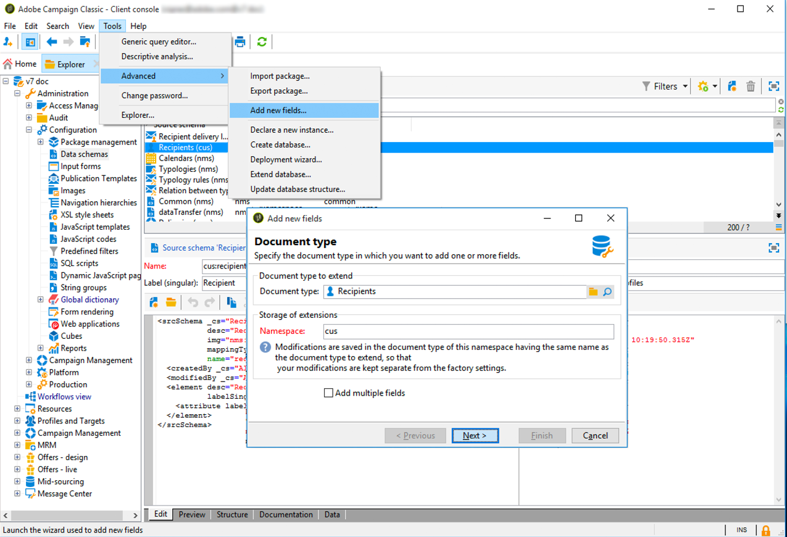

1. For the **[!UICONTROL Field type]**, select **[!UICONTROL SQL field]**. For the Label, use **[!UICONTROL Opt-Out for CCPA]**. Select the **[!UICONTROL 8-bit integer (boolean)]** type and define the following unique **[!UICONTROL Relative path]**: @OPTOUTCCPA. Click **[!UICONTROL Finish]**.

    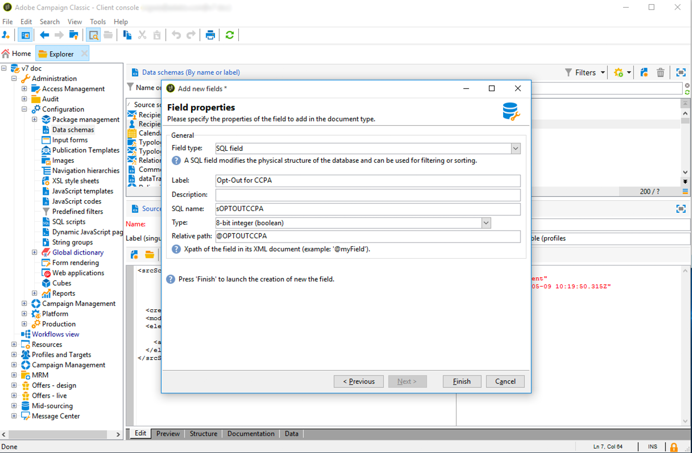

    This will extend or create the **[!UICONTROL Recipient (cus)]** schema. Click it to verify that the field has been correctly added.

    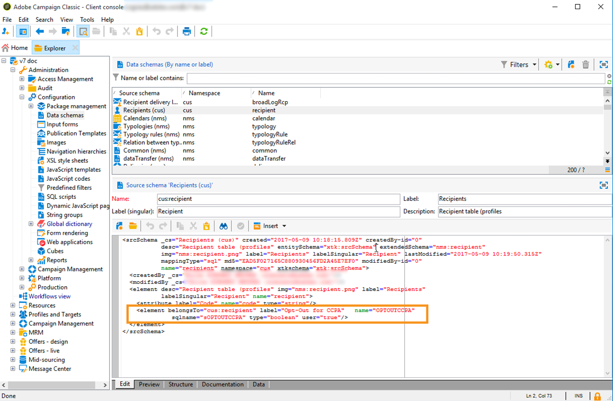

1. Click the **[!UICONTROL Configuration]** > **[!UICONTROL Input forms]** node of the explorer. In **[!UICONTROL Recipient (nms)]**, under "General Package", add an `<input>` element and use, for the xpath value, the relative path defined in step 2. For more on identifying a form, see [this section](../../configuration/using/identifying-a-form.md).

    ```
    <input  colspan="2" type="checkbox" xpath="@OPTOUTCCPA"/>
    ```

    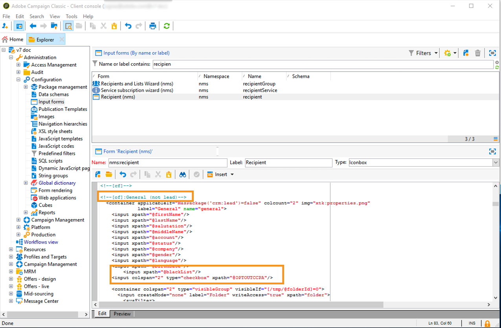

1. Disconnect and re-connect. Follow the steps described in the next section to verify that the field is available on a recipient's details. 

### Usage {#usage}

It is the responsibility of the Data Controller to populate the value of the field and follow the CCPA guidelines and rules concerning data selling.

To populate the values, several methods can be used:

* Using Campaign’s interface by editing the recipient's details
* Using the API
* Via a data import workflow

You should then ensure that you never sell to any third party the personal information of profiles who have opted-out.

1. To change the opt-out status, go to **[!UICONTROL Profiles and Target]** > **[!UICONTROL Recipients]** and select a recipient. In the **[!UICONTROL General]** tab, you will see the field configured in the previous section.

    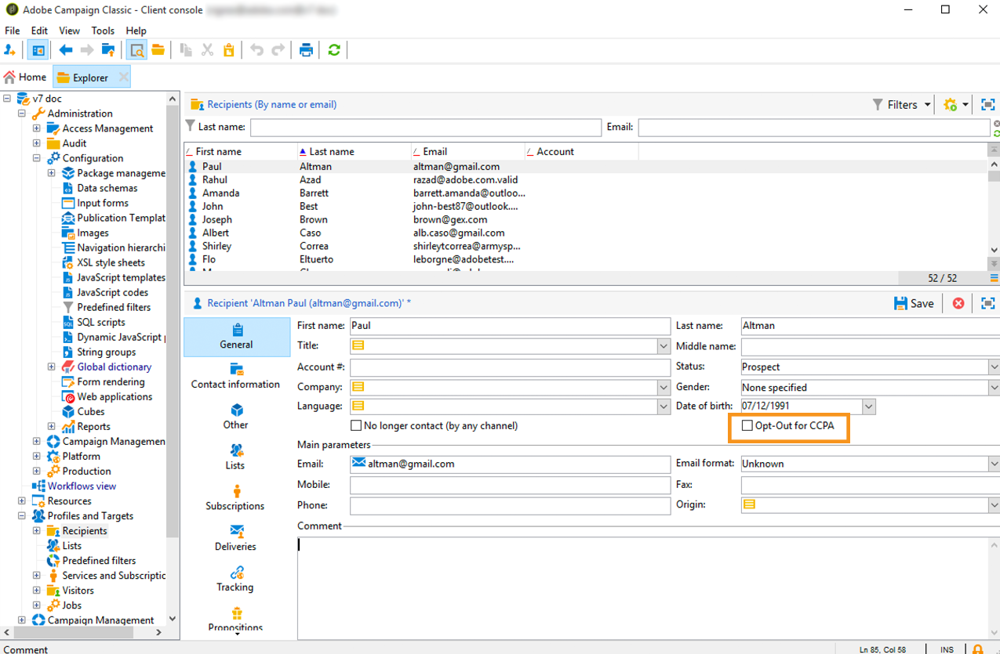

1. Configure the recipients list to display the op-out column. To learn how to configure lists, refer to the [detailed documentation](../../platform/using/adobe-campaign-workspace.md#configuring-lists).

    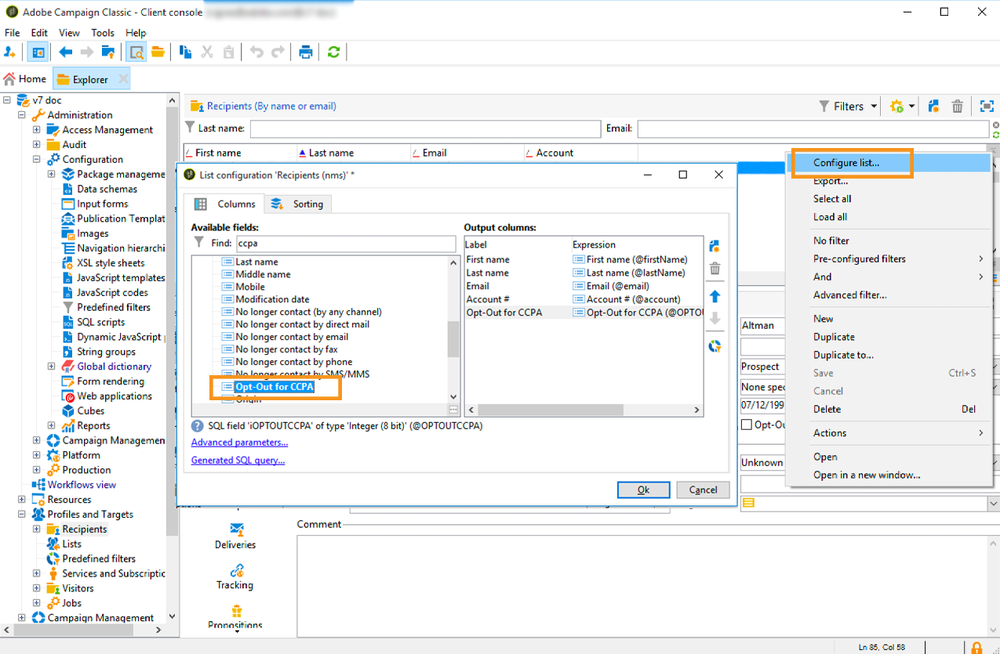

1. You can click the column to sort recipients according to the opt-out information. You can also create a filter to only display recipients who have opted-out. For more on creating filters, see [this section](../../platform/using/creating-filters.md).

    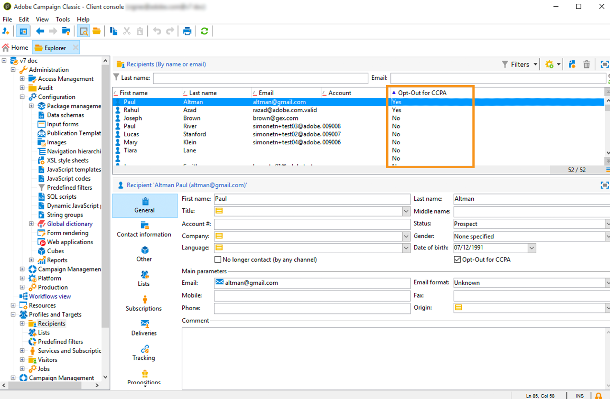
