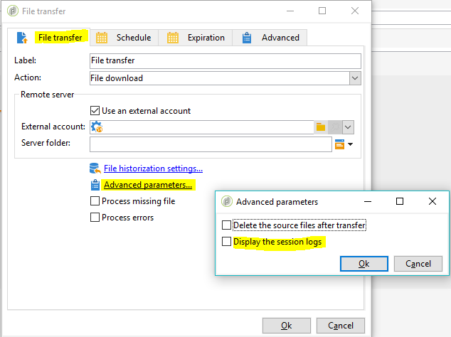

# SFTP server best practices and troubleshooting {#sftp-server-usage}

## SFTP server global recommendations {#global-recommendations}

When managing files and data for ETL purposes, these files are stored on a hosted SFTP server provided by Adobe. Make sure you follow the recommendations below when using SFTP servers.

* Use key based authentication rather than password authentication, in order to avoid password expiration (passwords have a validity period of 90 days). Moreover, key based authentication lets you generate multiple keys, for example when managing multiple entities. On the contrary, password authentication requires that you share the password with all the entities you are managing.

  The supported key format is SSH-2 RSA 2048. Keys can be generated with tools like PyTTY (Windows), or ssh-keygen (Unix).You will have to provide the public key to Adobe Support team via [Adobe Customer Care](https://helpx.adobe.com/enterprise/admin-guide.html/enterprise/using/support-for-experience-cloud.ug.html) to have it uploaded on the Campaign server. 

* Use batching in SFTP uploads as well as in workflows.

* Handle errors/exceptions.

* By default, all the folders you create are in Read/Write mode for your identifier only. When creating folders that need to be accessed by Campaign, make sure to configure them with Read/write rights for the whole group. Otherwise, workflows may not be able to create / delete files as they are run under a different identifier within the same group for security reasons.

* The public IPs from which you are trying to initiate the SFTP connection must be added to the allowlist on the Campaign instance. Adding IP addresses to the allowlist can be requested via [Adobe Customer Care](https://helpx.adobe.com/enterprise/admin-guide.html/enterprise/using/support-for-experience-cloud.ug.html).

## Database usage best practices {#sftp-server-best-practices}

SFTP severs are designed to be temporary storage spaces on which you can control retention and deletion of files.

When not correctly used or monitored, these spaces can quickly fill the physical space available on the server and lead to files being truncated on subsequent uploads. Once the space saturated, automatic purge may trigger and erase oldest files from the SFTP storage.

To avoid such problems, Adobe recommends following the best practices below.

>[!NOTE]
>
>If your instance is hosted on AWS, you can monitor your SFTP server storage with the Campaign Classic [Control Panel](https://docs.adobe.com/content/help/en/control-panel/using/sftp-management/sftp-storage-management.html). To check if your instance is hosted on AWS, follow the steps detailed in [this page](https://experienceleague.adobe.com/docs/control-panel/using/faq.html).
>
>Control Panel is accessible to all Admin users. The steps to grant Admin access to a user are detailed in [this page](https://experienceleague.adobe.com/docs/control-panel/using/discover-control-panel/managing-permissions.html?lang=en#discover-control-panel).
>
>Note that your instance must be upgraded with the latest [Gold Standard](../../rn/using/gs-overview.md) build or the [latest GA build (21.1)](../../rn/using/latest-release.md). Learn how to check your version in [this section](../../platform/using/launching-adobe-campaign.md#getting-your-campaign-version).

* The server size capabilities vary according to your license. In any case, keep the minimum data possible, and keep data for only as long as required (15 days is the maximum time limit).

* Use workflows to properly delete the data (manage the retention from workflows consuming the data).

* Occasionally, log-in to SFTP to directly check what is lying there.

* Remember that SFTP disk management is primarily your responsibility.

## External SFTP server usage {#external-SFTP-server}

If you use your own SFTP server, make sure you follow the recommendations above as much as possible.

Moreover, when specifying in Campaign Classic a path to an external SFTP server, the path syntax differ according to the SFTP server operating system:

* If your SFTP server is on **Windows**, always use a relative path.
* If your STP server is on **Linux**, always use a path that is relative to the home (starting with "~/"), or an absolute path (starting with "/").

## Connection issues with Adobe hosted SFTP server {#sftp-server-troubleshooting}

The section below lists the information to check and provide to the Adobe Support team via [Adobe Customer Care](https://helpx.adobe.com/enterprise/admin-guide.html/enterprise/using/support-for-experience-cloud.ug.html) when encountering connection issues with Adobe hosted SFTP servers.

1. Check that your instance is running. To do this, open your browser, then make a **[!UICONTROL GET]** call on the instance **[!UICONTROL /r/test]** endpoint:

   ```
   https://instanceUrl/r/test
   ```

   If the instance is running, you should get this type of response:

   ```
   <redir status='OK' date='YYYY-MM-DD HH:MM:SS' build='XXXX' instance='instanceName'
   sourceIP='AAA.BB.CCC.DD' host='instanceUrl' localHost='instanceName'/>
   ```

   In any case, provide the command response in the support ticket.

1. Check if the outbound port 22 is opened at the site from which you are trying to initiate the SFTP connection. To do this, use the following command:

   ```
   bash-3.2$ nc -vz <SFTP_URL> 22
   # Replace the SFTP_URL with actual SFTP instance URL
   # If the port 22 is opened you will see output similar to the below one
   # for e.g. the  output for the command on myCompany-stage-sftp.neolane.net after ssh-out, will give
   bash-3.2$ nc -vz myCompagny-stage-sftp.neolane.net 22
   myCompany-stage-sftp.neolane.net [AAA.BBB.CCC.D] 22 (ssh) open
   ```

   >[!NOTE]
   >
   >The Netcat tool lets you easily manage network connections on various operating systems (see [https://eternallybored.org/misc/netcat/](https://eternallybored.org/misc/netcat/)).

   If the port is not opened, make sure to open outbound connections at your side, then try again. If you still meet connection issues, share the output of the command with [Adobe Customer Care](https://helpx.adobe.com/enterprise/admin-guide.html/enterprise/using/support-for-experience-cloud.ug.html) team.

1. Check that the public IP from which you are trying to initiate the SFTP connection is the one you provided to the Adobe Support for the allowlist.
1. If you are using a password-based authentication, your password may have expired (passwords have a 90 days validity period). We therefore strongly recommend using a key based authentication (see [SFTP server best practices](#sftp-server-best-practices)).
1. If you are using a key based authentication, check that the key you are using is the same that you provided to [Adobe Customer Care](https://helpx.adobe.com/enterprise/admin-guide.html/enterprise/using/support-for-experience-cloud.ug.html) team for the instance configuration.
1. If you are using FileZilla or an equivalent FTP tool, provide the connection logs details in the support ticket.

## "Couldn't resolve host name" error

This section provides information on the checks and action to perform when getting the "Couldn't resolve host name" error after connecting to FTP server from Campaign Classic.

The workflow journal shows the following logs:

```
16/05/2016 12:49:03    fileTransfer    Upload error in cURL
16/05/2016 12:49:03    fileTransfer    Couldn't resolve host name
16/05/2016 12:49:03    fileTransfer    Couldn't resolve host name
16/05/2016 12:49:03    fileTransfer    Starting transfer of '/usr/local/neolane/nl6/var/williamreed/export/Recipients' to 'ftp://213.253.61.250/Recipients'
16/05/2016 12:49:03    fileTransfer    1 file(s) to transfer
```

This error occurs when trying to connect the FTP server from a workflow and downloading the files from the server, while you are still able to connect via FTP using FileZilla or WinSCP.

This error indicates that FTP server domain name could not be resolved properly. To troubleshoot, do the following:

1. Troubleshoot **DNS server configuration**:

   1. Check if the server name has been added into the local DNS server.
   1. If yes, run the following command on Adobe Campaign server to get the IP address:

      `nslookup <server domain name>`

      This confirms the FTP server is working and reachable from Adobe Campaign application server.

1. Troubleshoot **session logs**:

   1. In the workflow, double-click the [File transfer](../../workflow/using/file-transfer.md) activity.
   1. Go to **[!UICONTROL File Transfer]** tab, then click **[!UICONTROL Advanced Parameters]**.
   1. Check the **[!UICONTROL Display the session logs]** option.

      

   1. Go to the workflow Audit and check if the logs show the 'Couldn't resolve host name' error.

1. If the SFTP server is hosted by Adobe, check whether IP is added to the allowlist by contacting Customer Care.

      Otherwise validate:

      * The password doesn't contain '@'. The connection failed if there is '@' in the password.
      * There are no firewall issues which can hamper communication between Adobe Campaign application server and SFTP server.
      * Run tracert and telnet commands from the campaign server to the sftp to see if there are any connection issues.
      * There are no communication protocol issues.
      * Port is open.
