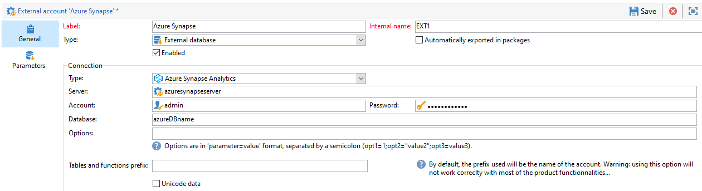
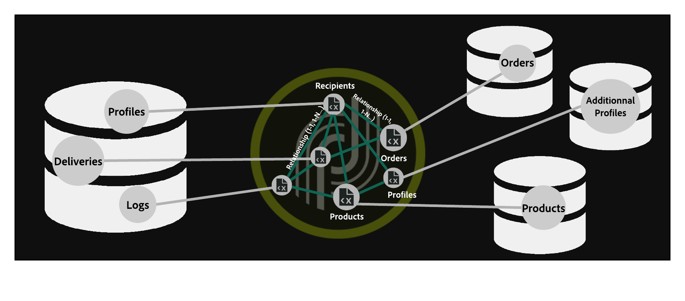
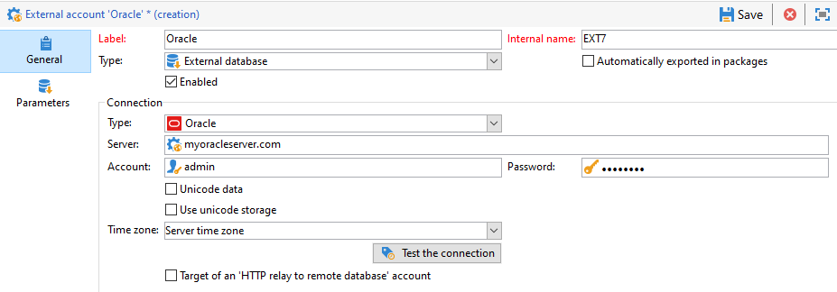

# Configuring FDA connectors {#specific-configurations-by-database-type}

Depending on the external databases that you want to be able to access from Adobe Campaign, you will need to carry out certain specific configurations. These configurations essentially involve installing drivers and declaring environment variables that belong to each RDBMS on the Adobe Campaign server.

For more information on legacy connectors such as Teradata, Hadoop 2.1 or Netezza, refer to this [page](../../platform/using/legacy-connectors.md).

As a general rule, you need to install the corresponding client layer on the external database on the Adobe Campaign server.

>[!NOTE]
>
>Compatible versions are listed in [Campaign Compatibility Matrix](https://helpx.adobe.com/campaign/kb/compatibility-matrix.html#FederatedDataAccessFDA).

## Configure access to Azure Synapse {#configure-access-to-azure-synapse}

### Azure synapse external account {#azure-external}

The [!DNL Azure] external account allows you to connect your Campaign instance to your Azure Synapse external database.
To create your [!DNL Azure Synapse] external account external account:

1. In Campaign Classic, configure your [!DNL Azure Synapse] external account. From the **[!UICONTROL Explorer]**, click **[!UICONTROL Administration]** / **[!UICONTROL Platform]** / **[!UICONTROL External accounts]**.

1. Click **[!UICONTROL New]**.

1. Select **[!UICONTROL External database]** as your external account's **[!UICONTROL Type]**.

1. Configure the [!DNL Azure Synapse] external account, you must specify:

     * **[!UICONTROL Type]**: Azure Synapse Analytics

    * **[!UICONTROL Server]**: URL of the Azure Synapse server

    * **[!UICONTROL Account]**: Name of the user

    * **[!UICONTROL Password]**: User account password

    * **[!UICONTROL Database]**: Name of the database

    

### Azure Synapse on CentOS {#azure-centos}

**Prerequisites:**

* You will need root privileges to install a ODBC driver.
* Red Hat Enterprise ODBC drivers provided by Microsoft can also be used with CentOS to connect to SQL Server.
* Version 13.0 will work with Red Hat 6 and 7.

To configure Azure Synapse on CentOS:

1. First, install the ODBC Driver. You can find it in this [page](https://www.microsoft.com/en-us/download/details.aspx?id=50420).

    >[!NOTE]
    >
    >This is exclusive to version 13 of the ODBC Driver.

    ```
    sudo su
    curl https://packages.microsoft.com/config/rhel/6/prod.repo > /etc/yum.repos.d/mssql-release.repo
    exit
    # Uninstall if already installed Unix ODBC driver
    sudo yum remove unixODBC-utf16 unixODBC-utf16-devel #to avoid conflicts

    sudo ACCEPT_EULA=Y yum install msodbcsql
  
    sudo ACCEPT_EULA=Y yum install mssql-tools
    echo 'export PATH="$PATH:/opt/mssql-tools/bin"' >> ~/.bash_profile
    echo 'export PATH="$PATH:/opt/mssql-tools/bin"' >> ~/.bashrc
    source ~/.bashrc
  
    # the Microsoft driver expects unixODBC to be here /usr/lib64/libodbc.so.1, so add soft links to the '.so.2' files
    cd /usr/lib64
    sudo ln -s libodbccr.so.2   libodbccr.so.1
    sudo ln -s libodbcinst.so.2 libodbcinst.so.1
    sudo ln -s libodbc.so.2     libodbc.so.1
  
    # Set the path for unixODBC
    export ODBCINI=/usr/local/etc/odbc.ini
    export ODBCSYSINI=/usr/local/etc
    source ~/.bashrc
  
    #Add a DSN information to /etc/odbc.ini
    sudo vi /etc/odbc.ini
  
    #Add the following:
    [Azure Synapse Analytics]
    Driver      = ODBC Driver 13 for SQL Server
    Description = Azure Synapse Analytics DSN
    Trace       = No
    Server      = [insert your server here]
    ```

1. If needed, you can install unixODBC development headers by running the following command:

    ```
    sudo yum install unixODBC-devel
    ```

1. After installing the drivers, you can test and verify your ODBC Driver and query your database if needed. Run the following command:

    ```
    /opt/mssql-tools/bin/sqlcmd -S yourServer -U yourUserName -P yourPassword -q "your query" # for example -q "select 1"
    ```

1. In Campaign Classic, you can then configure your [!DNL Azure Synapse] external account. For more on how to configure your external account, refer to this [section](../../platform/using/specific-configuration-database.md#azure-external).

1. Since Azure Synapse Analytics communicates through the TCP 1433 port, you need to open up this port on your firewall. Use the following command:

    ```
    firewall-cmd --permanent --add-rich-rule='rule family="ipv4" source address="[server_ip_here]/32" port port="1433" protocol="tcp" accept'
    # you can ping your hostname and the ping command will translate the hostname to IP address which you can use here
    ```

   >[!NOTE]
   >
   >To allow communication from Azure Synapse Analytics' side you might need to add your public IP to the allow list. To do so, refer to [Azure documentation](https://docs.microsoft.com/en-us/azure/sql-database/sql-database-firewall-configure#use-the-azure-portal-to-manage-server-level-ip-firewall-rules).

1. In case of iptables, run the following command:

    ```
    iptables -A OUTPUT -p tcp -d [server_hostname_here] --dport 1433 -j ACCEPT
    ```

### Azure Synapse on Windows {#azure-windows}

   >[!NOTE]
   >
   >This is exclusive to version 13 of the ODBC Driver but Adobe Campaign Classic can also use SQL Server Native Client drivers 11.0 and 10.0.

To configure Azure Synapse on Windows:

1. First, install the Microsoft ODBC driver. You can find it in this [page](https://www.microsoft.com/en-us/download/details.aspx?id=50420).

1. Choose the following files to install:

    ```
    your_language\your_architecture\msodbcsql.msi (i.e: English\X64\msodbcsql.msi)
    ```

1. Once your ODBC driver is installed, you can test it if needed. For more on this, refer to this [page](https://docs.microsoft.com/en-us/sql/connect/odbc/windows/system-requirements-installation-and-driver-files?view=sql-server-ver15#installing-microsoft-odbc-driver-for-sql-server).

1. In Campaign Classic, you can then configure your [!DNL Azure Synapse] external account. For more on how to configure your external account, refer to this [section](../../platform/using/specific-configuration-database.md#azure-external).

1. Since Azure Synapse Analytics communicates through the TCP 1433 port, you need to open up this port on the Windows Defender Firewall. For more on this, refer to [Windows documentation](https://docs.microsoft.com/en-us/windows/security/threat-protection/windows-firewall/create-an-outbound-program-or-service-rule).

### Azure Synapse on Debian {#azure-debian}

**Prerequisites:**

* You will need root privileges to install a ODBC driver.
* Curl is needed to install the msodbcsql package. If you don't have it installed, run the following command:
  
    ```
    sudo apt-get install curl
    ```

To configure Azure Synapse on Debian:

1. First, install the Microsoft ODBC driver for SQL Server. Use the following commands to install the ODBC Driver 13.1 for SQL Server:

    ```
    sudo su
    curl https://packages.microsoft.com/keys/microsoft.asc | apt-key add -
    curl https://packages.microsoft.com/config/debian/8/prod.list > /etc/apt/sources.list.d/mssql-release.list
    exit
    sudo apt-get update
    sudo ACCEPT_EULA=Y apt-get install msodbcsql
    ```

1. If you get the following an error **"The method driver /usr/lib/apt/methods/https could not be found"** when calling **sudo apt-get update**, you should run the command:

   ```
   sudo apt-get install apt-transport-https ca-certificates
   ```

1. You now need to install mssql-tools with the following commands. Mssq-tools are needed to use the bulk copy program (or BCP) utility and to run queries.

    ```
    sudo ACCEPT_EULA=Y apt-get install mssql-tools
    echo 'export PATH="$PATH:/opt/mssql-tools/bin"' >> ~/.bash_profile
    echo 'export PATH="$PATH:/opt/mssql-tools/bin"' >> ~/.bashrc
    source ~/.bashrc
    ```

1. If needed, you can install unixODBC development headers by running the following command:

    ```
    sudo yum install unixODBC-devel
    ```

1. After installing the drivers, you can test and verify your ODBC Driver and query your database if needed. Run the following command:

    ```
    /opt/mssql-tools/bin/sqlcmd -S yourServer -U yourUserName -P yourPassword -q "your query" # for example -q "select 1"
    ```

1. In Campaign Classic, you can now configure your [!DNL Azure Synapse] external account. For more on how to configure your external account, refer to this [section](../../platform/using/specific-configuration-database.md#azure-external).

1. To configure iptables on Debian to ensure the connection with Azure Synapse Analytics, enable the outbound TCP 1433 port for your hostname with the following command:

    ```
    iptables -A OUTPUT -p tcp -d [server_hostname_here] --dport 1433 -j ACCEPT
    ```

   >[!NOTE]
   >
   >To allow communication from Azure Synapse Analytics' side you might need to add your public IP to the allow list. To do so, refer to [Azure documentation](https://docs.microsoft.com/en-us/azure/sql-database/sql-database-firewall-configure#use-the-azure-portal-to-manage-server-level-ip-firewall-rules).

## Configure access to Snowflake {#configure-access-to-snowflake}

>[!NOTE]
>
>[!DNL Snowflake] connector is available for hosted and on-premise deployments. For more on this, refer to [this article](https://helpx.adobe.com/campaign/kb/acc-on-prem-vs-hosted.html).



### Snowflake external account {#snowflake-external}

The [!DNL Snowflake] external account allows you to connect your Campaign instance to your Snowflake external database.

1. In Campaign Classic, configure your [!DNL Snowflake] external account. From the **[!UICONTROL Explorer]**, click **[!UICONTROL Administration]** / **[!UICONTROL Platform]** / **[!UICONTROL External accounts]**.

1. Click **[!UICONTROL New]**.

1. Select **[!UICONTROL External database]** as your external account's **[!UICONTROL Type]**.

1. Configure the **[!UICONTROL Snowflake]** external account, you must specify:

    * **[!UICONTROL Type]**: [!DNL Snowflake]

    * **[!UICONTROL Server]**: URL of the [!DNL Snowflake] server

    * **[!UICONTROL Account]**: Name of the user

    * **[!UICONTROL Password]**: User account password

    * **[!UICONTROL Database]**: Name of the database

    

1. Click the **[!UICONTROL Parameters]** tab then the **[!UICONTROL Deploy functions]** button to create functions.

    

The connector supports the following options:

| Option   |  Description |
|---|---|
|  workschema | Database schema to use for work tables |
|  warehouse | Name of the default warehouse to use. It will override the user's default. |
|  TimeZoneName |  By default empty, which means that the system time zone of the Campaign Classic app server is used. The option can be used to force the TIMEZONE session parameter. <br>For more on this, refer to [this page](https://docs.snowflake.net/manuals/sql-reference/parameters.html#timezone). |
|  WeekStart |  WEEK_START session parameter. By default set to 0. <br>For more on this, refer to [this page](https://docs.snowflake.com/en/sql-reference/parameters.html#week-start). |
|  UseCachedResult | USE_CACHED_RESULTS session parameter. By default set to TRUE. This option can be used to disable Snowflake cached results. <br>For more on this, refer to [this page](https://docs.snowflake.net/manuals/user-guide/querying-persisted-results.html). |

### Snowflake on CentOS {#snowflake-centos}

1. Download the ODBC drivers for [!DNL Snowflake]. [Click here](https://sfc-repo.snowflakecomputing.com/odbc/linux/latest/snowflake-odbc-2.20.2.x86_64.rpm) to start downloading.
1. You then need to install the ODBC drivers on CentOs with the following command:

    ```
    rpm -Uvh unixodbc
    rpm -Uvh snowflake-odbc-2.20.2.x86_64.rpm
    ```

1. After downloading and installing the ODBC drivers, you need to restart Campaign Classic. To do so, run the following command:

    ```
    /etc/init.d/nlserver6 stop
    /etc/init.d/nlserver6 start
    ```

1. In Campaign Classic, you can then configure your [!DNL Snowflake] external account. For more on how to configure your external account, refer to this [section](../../platform/using/specific-configuration-database.md#snowflake-external).

### Snowflake on Debian {#snowflake-debian}

1. Download the ODBC drivers for [!DNL Snowflake]. [Click here](https://sfc-repo.snowflakecomputing.com/odbc/linux/latest/index.html) start downloading.

1. You then need to install the ODBC drivers on Debian with the following command:

     ```
     apt-get install unixodbc
     apt-get install snowflake-odbc-x.xx.x.x86_64.deb
     ```

1. After downloading and installing the ODBC drivers, you need to restart Campaign Classic. To do so, run the following command:

     ```
     systemctl stop nlserver.service
     systemctl start nlserver.service
     ```

1. In Campaign Classic, you can then configure your [!DNL Snowflake] external account. For more on how to configure your external account, refer to this [section](../../platform/using/specific-configuration-database.md#snowflake-external).

### Snowflake on Windows {#snowflake-windows}

1. Download the [ODBC driver for Windows](https://docs.snowflake.net/manuals/user-guide/odbc-download.html). Note that you need administrator-level privileges to install the driver. For more on this, refer to [this page](https://docs.snowflake.net/manuals/user-guide/admin-user-management.html)

1. Configure the ODBC driver. For more on this, refer to [this page](https://docs.snowflake.net/manuals/user-guide/odbc-windows.html#step-2-configure-the-odbc-driver)

1. In Campaign Classic, you can then configure your [!DNL Snowflake] external account. For more on how to configure your external account, refer to this [section](../../platform/using/specific-configuration-database.md#snowflake-external).

## Configure access to Hadoop 3.0 {#configure-access-to-hadoop-3}

### Hadoop external account {#hadoop-external}

The [!DNL Hadoop] external account allows you to connect your Campaign instance to your Hadoop external database.

1. In Campaign Classic, configure your [!DNL Hadoop] external account. From the **[!UICONTROL Explorer]**, click **[!UICONTROL Administration]** / **[!UICONTROL Platform]** / **[!UICONTROL External accounts]**.

1. Click **[!UICONTROL New]**.

1. Select **[!UICONTROL External database]** as your external account's **[!UICONTROL Type]**.

1. Configure the **[!UICONTROL Hadoop]** external account, you must specify:

    * **[!UICONTROL Type]**: ODBC (Sybase ASE, Sybase IQ)

    * **[!UICONTROL Server]**: Name of the DNS

    * **[!UICONTROL Account]**: Name of the user

    * **[!UICONTROL Password]**: User account password

    * **[!UICONTROL Database]**: Name of your database if not specified in DSN. It can be left empty if specified in the DSN

    * **[!UICONTROL Time zone]**: Server time zone

    

The connector supports the following ODBC options:

| Name |  Value |
|---|---|
|  ODBCMgr | iODBC |
|  warehouse |  1/2/4 |

The connector also supports the following Hive options:

| Name |  Value |  Description |
|---|---|---|
|  bulkKey |  Azure blob or DataLake access key |  For wasb:// or wasbs:// bulk loaders (i.e. if the bulk load tool starts with wasb:// or wasbs://). <br>It is the access key for blob or DataLake bucket for bulk load. |
|  hdfsPort |  port number <br>set by default to 8020 |  For HDFS bulk load (i.e. if the bulk load tool starts with webhdfs:// or webhdfss://). |
|  bucketsNumber |  20 |  Number of buckets when creating a clustered table. |
|  fileFormat |  PARQUET |  Default file format for work tables. |

### Configuring Hadoop 3.0 {#configuring-hadoop}

Connecting to a Hadoop external database in FDA requires the following configurations on the Adobe Campaign server. Note that this configuration is available for both Windows and Linux.

1. Download the ODBC drivers for Hadoop depending on your OS version. Drivers can be found on [this page](https://www.cloudera.com/downloads.html).

1. You then need to install the ODBC drivers and create a DSN for your Hive connection. Instructions can be found in [this page](https://docs.cloudera.com/documentation/other/connectors/hive-odbc/2-6-5/Cloudera-ODBC-Driver-for-Apache-Hive-Install-Guide.pdf)

1. After downloading and installing the ODBC drivers, you need to restart Campaign Classic. To do so, run the following command:

     ```
     systemctl stop nlserver.service
     systemctl start nlserver.service
     ```

1. In Campaign Classic, you can then configure your [!DNL Hadoop] external account. For more on how to configure your external account, refer to this [section](../../platform/using/specific-configuration-database.md#hadoop-external).

## Configure access to Oracle {#configure-access-to-oracle}

### Oracle external account {#oracle-external}

The [!DNL Oracle] external account allows you to connect your Campaign instance to your Hadoop external database.

1. In Campaign Classic, configure your [!DNL oracle] external account. From the **[!UICONTROL Explorer]**, click **[!UICONTROL Administration]** / **[!UICONTROL Platform]** / **[!UICONTROL External accounts]**.

1. Click **[!UICONTROL New]**.

1. Select **[!UICONTROL External database]** as your external account's **[!UICONTROL Type]**.

1. Configure the **[!UICONTROL Oracle]** external account, you must specify:

    * **[!UICONTROL Type]**: Oracle

    * **[!UICONTROL Server]**: Name of the DNS

    * **[!UICONTROL Account]**: Name of the user

    * **[!UICONTROL Password]**: User account password

    * **[!UICONTROL Time zone]**: Server time zone

    

### Oracle on Linux {#for-linux-1}

Connecting to an Oracle external database in FDA requires additional configurations below on the Adobe Campaign server.

1. Install the Oracle full client corresponding to your version of Oracle.
1. Add your TNS definitions to your installation. To do this, specify them in a **tnsnames.ora** file in the /etc/oracle repository. If this repository does not exist, create it.

   Then create a new TNS_ADMIN environment variable: export TNS_ADMIN=/etc/oracle and restart the machine.

1. Integrate Oracle into your Adobe Campaign server (nlserver). To do this, check that the **customer.sh** file is present in the "nl6" folder of the Adobe Campaign server tree structure and that it includes the links to the Oracle libraries.

   For example, for a client in 11.2:

   ```
   export ORACLE_HOME=/usr/lib/oracle/11.2
   export TNS_ADMIN=/etc/oracle
   export LD_LIBRARY_PATH=$ORACLE_HOME/client64/lib:$LD_LIBRARY_PATH
   ```

   >[!NOTE]
   >
   >These values (particularly ORACLE_HOME), depends on your installation repositories. Make sure to check your tree structure before referencing these values.

1. Install the libraries necessary for Oracle:

    * **libclntsh.so**

      ```    
      cd /usr/lib/oracle/<version>/client<architecture>/lib
      ln -s libclntsh.so.<version> libclntsh.so
      ```

    * **libaio1**

      ```
      aptitude install libaio1
      or
      yum install libaio1
      ```

1. In Campaign Classic, you can then configure your [!DNL Oracle] external account. For more on how to configure your external account, refer to this [section](../../platform/using/specific-configuration-database.md#oracle-external).

### Oracle on Windows {#for-windows-1}

Connecting to an Oracle external database in FDA requires additional configurations below on the Adobe Campaign server.

1. Install the Oracle client.

1. In the C:Oracle folder, create a **tnsnames.ora** file containing your TNS definition.

1. Add a TNS_ADMIN environment variable with C:Oracle as value and restart the machine.

1. In Campaign Classic, you can then configure your [!DNL Oracle] external account. For more on how to configure your external account, refer to this [section](../../platform/using/specific-configuration-database.md#oracle-external).