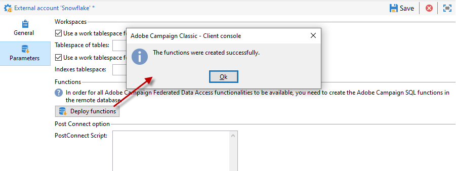

# Specific configurations by database type {#specific-configurations-by-database-type}

Depending on the external databases that you want to be able to access from Adobe Campaign, you will need to carry out certain specific configurations. These configurations essentially involve installing drivers and declaring environment variables that belong to each RDBMS on the Adobe Campaign server.

As a general rule, you need to install the corresponding client layer on the external database on the Adobe Campaign server.

>[!NOTE]
>
>Compatible versions are listed in [Campaign Compatibility Matrix](https://helpx.adobe.com/campaign/kb/compatibility-matrix.html#FederatedDataAccessFDA).

<!--
## Configure access to Azure Synapse {#configure-access-to-azure-synapse}

### Azure Synapse on CentOS {#azure-centos}

1. Download mysql57-community-release.noarch.rpm. You can find it in this [page](https://dev.mysql.com/downloads/repo/yum).

1. Install the client library:

    ```
    $ yum install mysql57-community-release-el7-9.noarch.rpm
    $ yum install mysql-community-libs
    ```

1. You now need to configure the external account. In Campaign Classic, unfold the **[!UICONTROL Platform]** menu and click **[!UICONTROL External accounts]**.

1. Select the out-of-the box **[!UICONTROL Azure Synapse]** external account.

1. To configure the **[!UICONTROL Azure Synapse]** external account:

    * **[!UICONTROL Server]**
  
      URL of the Azure Synapse server.

    * **[!UICONTROL Account]**

      Name of the user.

    * **[!UICONTROL Password]**

      User account password.

    * **[!UICONTROL Database]**

      Name of your database

    >[!NOTE]
    >
    >Make sure the **[!UICONTROL Time zone]** and **[!UICONTROL Unicode data]** are set according to your database.

### Azure Synapse on Debian {#azure-debian}

1. Download mysql-apt-config.deb. You can find it in this [page](https://dev.mysql.com/doc/mysql-apt-repo-quick-guide/en).

1. Install the client library:

    ```
    $ dpkg -i mysql-apt-config_*_all.deb # choose mysql-5.7 in the configuration menu
    $ apt update
    $ apt install libmysqlclient20
    ```

1. You now need to configure the external account. In Campaign Classic, unfold the **[!UICONTROL Platform]** menu and click **[!UICONTROL External accounts]**.

1. Select the out-of-the box **[!UICONTROL Azure Synapse]** external account.

1. To configure the **[!UICONTROL Azure Synapse]** external account:

    * **[!UICONTROL Server]**
  
      URL of the Azure Synapse server.

    * **[!UICONTROL Account]**

      Name of the user.

    * **[!UICONTROL Password]**

      User account password.

    * **[!UICONTROL Database]**

      Name of your database

    >[!NOTE]
    >
    >Make sure the **[!UICONTROL Time zone]** and **[!UICONTROL Unicode data]** are set according to your database.

### Azure Synapse on Windows {#azure-windows}

1. Download the C connector. You can find it in this [page](https://dev.mysql.com/downloads/connector/c).

1. Make sure the directory that contains libmysqlclient.dll is added to the PATH environment variable that nlserver will use.

1. You now need to configure the external account. In Campaign Classic, unfold the **[!UICONTROL Platform]** menu and click **[!UICONTROL External accounts]**.

1. You now need to configure the external account. In Campaign Classic, unfold the **[!UICONTROL Platform]** menu and click **[!UICONTROL External accounts]**.

1. Select the out-of-the box **[!UICONTROL Azure Synapse]** external account.

1. To configure the **[!UICONTROL Azure Synapse]** external account:

    * **[!UICONTROL Server]**
  
      URL of the Azure Synapse server.

    * **[!UICONTROL Account]**

      Name of the user.

    * **[!UICONTROL Password]**

      User account password.

    * **[!UICONTROL Database]**

      Name of your database

    >[!NOTE]
    >
    >Make sure the **[!UICONTROL Time zone]** and **[!UICONTROL Unicode data]** are set according to your database.

-->

## Configure access to Snowflake {#configure-access-to-snowflake}

>[!NOTE]
>
>Snowflake connector is available for hosted and on-premise deployments. For more on this, refer to this [page](https://helpx.adobe.com/campaign/kb/acc-on-prem-vs-hosted.html).

### Snowflake on CentOS {#snowflake-centos}

1. Download the ODBC drivers for Snowflake. Drivers for Snowflake can be found [here](https://sfc-repo.snowflakecomputing.com/odbc/linux/latest/snowflake-odbc-2.20.2.x86_64.rpm).

1. You then need to install the ODBC drivers on CentOs with the following command:

     ```
     rpm -Uvh unixodbc
     rpm -Uvh snowflake-odbc-2.20.2.x86_64.rpm
     ```

1. After downloading and installing the ODBC drivers, you need to restart Campaign Classic. To do so, run the following command:

     ```
    /etc/init.d/nlserver6 stop
    /etc/init.d/nlserver6 start
     ```
1. In Campaign Classic, configure your Snowflake external account in Campaign Classic. From the **[!UICONTROL Explorer]**, unfold the **[!UICONTROL Administration]** menu.

1. Unfold the **[!UICONTROL Platform]** menu and click **[!UICONTROL External accounts]**.

1. Select the out-of-the box **[!UICONTROL Snowflake]** external account.

1. To configure the **[!UICONTROL Snowflake]** external account:

    * **[!UICONTROL Server]**
  
      URL of the Snowflake server.

    * **[!UICONTROL Account]**

      Name of the user.

    * **[!UICONTROL Password]**

       User account password.

    * **[!UICONTROL Database]**

       Name of your database.

    

1. Click the **[!UICONTROL Parameters]** tab then the **[!UICONTROL Deploy function]** button to create functions.

    

The connector supports the following options:

| Option   |  Value |  Description |
|---|---|---|
|  workschema |   |  Database schema to use for work tables |
|  warehouse |   |  Name of the default warehouse to use. It will override the user's default. |
|  TimeZoneName |   |  By default empty, which means that the system timezone of the Campaign Classic app server is used. The option can be used to force the TIMEZONE session parameter. <br>For more on this, refer to this [page](https://docs.snowflake.net/manuals/sql-reference/parameters.html#timezone). |
|  WeekStart |  0, 1-7 |  By default set to 0. (WEEK_START session parameter) <br>For more on this, refer to this [page](https://docs.snowflake.net/manuals/sql-reference/parameters.html#week-start). |
|  UseCachedResult |  TRUE/FALSE |  By default set to TRUE. This option can be used to disable Snowflake cached results (USE_CACHED_RESULTS session parameter) <br>For more on this, refer to this [page](https://docs.snowflake.net/manuals/user-guide/querying-persisted-results.html). |

### Snowflake on Debian {#snowflake-debian}

1. Download the ODBC drivers for Snowflake. Drivers for Snowflake can be found [here](https://sfc-repo.snowflakecomputing.com/odbc/linux/latest/index.html).

1. You then need to install the ODBC drivers on Debian with the following command:

     ```
    apt-get install unixodbc
    apt-get install snowflake-odbc-x.xx.x.x86_64.deb
     ```

1. After downloading and installing the ODBC drivers, you need to restart Campaign Classic. To do so, run the following command:

     ```
    systemctl stop nlserver.service
    systemctl start nlserver.service
     ```
     
1. In Campaign Classic, configure your Snowflake external account in Campaign Classic. From the **[!UICONTROL Explorer]**, unfold the **[!UICONTROL Administration]** menu.

1. Unfold the **[!UICONTROL Platform]** menu and click **[!UICONTROL External accounts]**.

1. Select the out-of-the box **[!UICONTROL Snowflake]** external account.

1. To configure the **[!UICONTROL Snowflake]** external account:

    * **[!UICONTROL Server]**
  
      URL of the Snowflake server.

    * **[!UICONTROL Account]**

      Name of the user.

    * **[!UICONTROL Password]**

       User account password.

    * **[!UICONTROL Database]**

       Name of your database

    

1. Click the **[!UICONTROL Parameters]** tab then the **[!UICONTROL Deploy function]** button to create functions.

    

The connector supports the following options:

| Option   |  Value |  Description |
|---|---|---|
|  workschema | &nbsp; |  Database schema to use for work tables |
|  warehouse | &nbsp; |  Name of the default warehouse to use. It will override the user's default. |
|  TimeZoneName | &nbsp; |  By default empty, which means that the system timezone of the Campaign Classic app server is used. The option can be used to force the TIMEZONE session parameter. <br>For more on this, refer to this [page](https://docs.snowflake.net/manuals/sql-reference/parameters.html#timezone).|
|  WeekStart |  0, 1-7 |  By default set to 0. (WEEK_START session parameter) <br>For more on this, refer to this [page](https://docs.snowflake.net/manuals/sql-reference/parameters.html#week-start). |
|  UseCachedResult |  TRUE/FALSE |  By default set to TRUE. This option can be used to disable Snowflake cached results (USE_CACHED_RESULTS session parameter) <br>For more on this, refer to this [page](https://docs.snowflake.net/manuals/user-guide/querying-persisted-results.html). |

### Snowflake on Windows {#snowflake-windows}

1. Download the [ODBC driver for Windows](https://docs.snowflake.net/manuals/user-guide/odbc-download.html). Note that you need administrator-level privileges to install the driver. For more on this, refer to this [page](https://docs.snowflake.net/manuals/user-guide/admin-user-management.html)

1. Configure the ODBC driver. For more on this, refer to this [page](https://docs.snowflake.net/manuals/user-guide/odbc-windows.html#step-2-configure-the-odbc-driver)

1. Once the ODBC driver has been installed and configured, you need to configure your Snowflake external account in Campaign Classic. From the **[!UICONTROL Explorer]**, unfold the **[!UICONTROL Administration]** menu.

1. Unfold the **[!UICONTROL Platform]** menu and click **[!UICONTROL External accounts]**.

1. Select the out-of-the box **[!UICONTROL Snowflake]** external account.

1. To configure the **[!UICONTROL Snowflake]** external account:

    * **[!UICONTROL Server]**
  
      URL of the Snowflake server.

    * **[!UICONTROL Account]**

      Name of the user.

    * **[!UICONTROL Password]**

       User account password.

    * **[!UICONTROL Database]**

       Name of your database

    

1. Click the **[!UICONTROL Parameters]** tab then the **[!UICONTROL Deploy function]** button to create functions.

    

The connector supports the following options:

| Option   |  Value |  Description |
|---|---|---|
|  workschema |  &nbsp; |  Database schema to use for work tables |
|  warehouse |  &nbsp; |  Name of the default warehouse to use. It will override the user's default. |
|  TimeZoneName | &nbsp; |  By default empty, which means that the system timezone of the Campaign Classic app server is used. The option can be used to force the TIMEZONE session parameter. <br>For more on this, refer to this [page](https://docs.snowflake.net/manuals/sql-reference/parameters.html#timezone). |
|  WeekStart |  0, 1-7 |  By default set to 0. (WEEK_START session parameter) <br>For more on this, refer to this [page](https://docs.snowflake.net/manuals/sql-reference/parameters.html#week-start). |
|  UseCachedResult |  TRUE/FALSE |  By default set to TRUE. This option can be used to disable Snowflake cached results (USE_CACHED_RESULTS session parameter) <br>For more on this, refer to this [page](https://docs.snowflake.net/manuals/user-guide/querying-persisted-results.html).|

## Configure access to Hadoop 3.0 {#configure-access-to-hadoop-3}

Connecting to an Hadoop external database in FDA requires the following configurations on the Adobe Campaign server. Note that this configuration is available for both Windows and Linux.

1. Download the ODBC drivers for Hadoop depending on your OS version. Drivers can be found on this [page](https://www.cloudera.com/downloads.html).

1. You then need to install the ODBC drivers and create a DSN for your Hive connection. Instruction can be found [here](https://docs.cloudera.com/documentation/other/connectors/hive-odbc/2-6-5/Cloudera-ODBC-Driver-for-Apache-Hive-Install-Guide.pdf)

1. After downloading and installing the ODBC drivers, you need to restart Campaign Classic. To do so, run the following command:

     ```
    systemctl stop nlserver.service
    systemctl start nlserver.service
     ```
   
1. In Campaign Classic, configure your Hadoop external account in Campaign Classic. From the **[!UICONTROL Explorer]**, unfold the **[!UICONTROL Administration]** menu.

1. Unfold the **[!UICONTROL Platform]** menu and click **[!UICONTROL External accounts]**.

1. Click **[!UICONTROL Create]** and select **[!UICONTROL External database]** as Account type.

1. To configure the **[!UICONTROL  Hadoop]** external account:

    * **[!UICONTROL Type]**
  
      ODBC (Sybase ASE, Sybase IQ)

    * **[!UICONTROL Server]**
  
      Name of the DNS.

    * **[!UICONTROL Account]**

      Name of the user.

    * **[!UICONTROL Password]**

      User account password.

    * **[!UICONTROL Database]**

      Name of your database if not specified in DSN. It can be left empty if specified in the DSN.

    * **[!UICONTROL Timezone]**

      Server time zone

    

The connector supports the following ODBC options:

| Name |  Value |
|---|---|
|  ODBCMgr | iODBC |
|  warehouse |  1/2/4 |

The connector also supports the following Hive options:

| Name |  Value |  Description |
|---|---|---|
|  bulkKey |  Azure blob or DataLake access key |  For wasb:// or wasbs:// bulk loaders (i.e. if the bulk load tool starts with wasb:// or wasbs://). <p>It is the access key for blob or DataLake bucket for bulk load.</p> |
|  hdfsPort |  port number <p>set by default to 8020</p> |  For HDFS bulk load (i.e. if the bulk load tool starts with webhdfs:// or webhdfss://). |
|  bucketsNumber |  20 |  Number of buckets when creating a clustered table. |
|  fileFormat |  PARQUET |  Default file format for work tables. |

## Configure access to Hadoop 2.1 {#configure-access-to-hadoop}

For more information on how to configure your Hadoop external database in FDA, refer to this [article](https://helpx.adobe.com/campaign/kb/access-hadoop-2.html).

### For Windows {#for-windows}

1. Install ODBC and [Azure HD Insight](https://www.microsoft.com/en-us/download/details.aspx?id=40886) drivers for Windows.
1. Create the DSN (Data Source Name) by running the ODBC DataSource Adminstrator tool. A System DSN sample for Hive is provided for you to modify.

   ```
   Description: vorac (or any name you like)
   Host: vorac.azurehdinsight.net
   Port: 443
   Database: sm_tst611 (or your database name)
   Mechanism: Azure HDInsight Service
   User/Password: admin/<your password here>
   ```

1. Create the Hadoop external account, as detailed in the [Creating a shared connection](#creating-a-shared-connection) section.

### For Linux {#for-linux}

1. Install unixodbc for Linux.

   ```
   apt-get install unixodbc
   ```

1. Download and install ODBC drivers for Apache Hive from HortonWorks: [https://www.hortonworks.com/downloads/](https://www.hortonworks.com/downloads/).

   ```
   dpkg -i hive-odbc-native_2.1.10.1014-2_amd64.deb
   ```

1. Check ODBC files location.

   ```
   
   root@campadpac71:/tmp# odbcinst -j
   unixODBC 2.3.1
   DRIVERS............: /etc/odbcinst.ini
   SYSTEM DATA SOURCES: /etc/odbc.ini
   FILE DATA SOURCES..: /etc/ODBCDataSources
   USER DATA SOURCES..: /root/.odbc.ini
   SQLULEN Size.......: 8
   SQLLEN Size........: 8
   SQLSETPOSIROW Size.: 8
   ```

1. Create the DSN (Data Source Name) and edit the odbc.ini file. Then, create a DSN for your Hive connection.

   Here is an example for HDInsight to setup a connection called "viral":

   ```
   [ODBC Data Sources]
   vorac 
   
   [vorac]
   Driver=/usr/lib/hive/lib/native/Linux-amd64-64/libhortonworkshiveodbc64.so
   HOST=vorac.azurehdinsight.net
   PORT=443
   Schema=sm_tst611
   HiveServerType=2
   AuthMech=6
   UID=admin
   PWD=<your password here>
   HTTPPath=
   UseNativeQuery=1
   ```

   >[!NOTE]
   >
   >The **UseNativeQuery** parameter here is very important. Campaign is Hive-aware and will not work correctly unless UseNativeQuery is set. Typically, the driver or Hive SQL Connector will rewrite queries and tamper the column ordering.

   The authentication setup depends on the Hive/Hadoop configuration. For instance, for HD Insight, use AuthMech=6 for user/password authentication, as described [here](http://www.simba.com/products/Spark/doc/ODBC_InstallGuide/unix/content/odbc/hi/configuring/authenticating/azuresvc.htm).

1. Export the variables.

   ```
   export ODBCINI=/etc/myodbc.ini
   export ODBCSYSINI=/etc/myodbcinst.ini
   ```

1. Setup Hortonworks drivers via /usr/lib/hive/lib/native/Linux-amd64-64/hortonworks.hiveodbc.ini.

   You have to use UTF-16 to be able to connect with Campaign and unix-odbc (libodbcinst).

   ```
   [Driver]
   
   DriverManagerEncoding=UTF-16
   ErrorMessagesPath=/usr/lib/hive/lib/native/hiveodbc/ErrorMessages/
   LogLevel=0
   LogPath=/tmp/hive
   SwapFilePath=/tmp
   
   ODBCInstLib=libodbcinst.so
   ```

1. You can now test your connection using isql.

   ```
   isql vorac
   isql vorac -v
   ```

1. Create the Hadoop external account, as detailed in the [Creating a shared connection](#creating-a-shared-connection) section.

## Configure access to Netezza {#configure-access-to-netezza}

Connecting to a Netezza external database in FDA requires additional configurations below on the Adobe Campaign server:

1. Install the ODBC drivers for Netezza, according to the operating system that you use:

    * **nz-linuxclient-v7.2.0.0.tar.gz** for Linux. Select the folder that corresponds to your operating system (linux or linux64) and start the unpack command. You can leave the installation to be carried out in the repository that is suggested by default: "/usr/local/nz".
    * **nz-winclient-v7.2.0.0.zip** for Windows. Unzip the file and start the executable script that corresponds to your operating system: nzodbcsetup.exe or nzodbcsetup64.exe. Follow the wizard instructions to finish installing the drivers.

1. Configure the ODBC driver. The configuration can be carried out in the standard files: **/etc/odbc.ini** for general parameters and **/etc/odbcinst.ini** for declaring drivers.

    * **/etc/odbc.ini**

      ```    
      [ODBC]
      InstallDir=/etc/
      ```    
    
      "InstallDir" corresponds to the location of the odbcinst.ini file.
    
    * **/etc/odbcinst.ini**

      ```    
      [ODBC Drivers]
      NetezzaSQL = Installed
       
      [NetezzaSQL]
      Driver           = /usr/local/nz/lib/libnzsqlodbc3.so
      Setup            = /usr/local/nz/lib/libnzsqlodbc3.so
      APILevel         = 1
      ConnectFunctions = YYN
      Description      = Netezza ODBC driver
      DriverODBCVer    = 03.51
      DebugLogging     = false
      LogPath          = /tmp
      UnicodeTranslationOption = utf8
      CharacterTranslationOption = all
      PreFetch         = 256
      Socket           = 16384
      ```

1. Specify the environment variables of the Adobe Campaign server:

    * **LD_LIBRARY_PATH**: /usr/local/nz/lib and /usr/local/nz/lib64. "/usr/local/nz" corresponds to the installation repository offered by default when installing the drivers. Here you need to specify the repository that you have selected for the installation.
    * **ODBCINI**: location of the odbc.ini file (for example /etc/odbc.ini).
    * **NZ_ODBC_INI_PATH**: location of the odbc.ini file. Netezza also requires this second variable for using the odbc.ini file.

1. Create the Netezza external account, as detailed in the [Creating a shared connection](#creating-a-shared-connection) section.

>[!NOTE]
>
>Operations on schemas containing automatically generated primary keys are not taken into account.  
>
>The table will be using the **Organize on** clause on the first index defined in the schema. As this clause is limited to 1 to 4 columns with Netezza, this index cannot contain more than 4 columns.

## Configure access to Oracle {#configure-access-to-oracle}

Connecting to an Oracle external database in FDA requires additional configurations below on the Adobe Campaign server.

### For Linux {#for-linux-1}

1. Install the Oracle full client corresponding to your version of Oracle.
1. Add your TNS definitions to your installation. To do this, specify them in a **tnsnames.ora** file in the /etc/oracle repository. If this repository does not exist, create it.

   Then create a new TNS_ADMIN environment variable: export TNS_ADMIN=/etc/oracle and restart the machine.

1. Integrate Oracle into your Adobe Campaign server (nlserver). To do this, check that the **customer.sh** file is present in the "nl6" folder of the Adobe Campaign server tree structure and that it includes the links to the Oracle libraries.

   For example, for a client in 11.2:

   ```
   export ORACLE_HOME=/usr/lib/oracle/11.2
   export TNS_ADMIN=/etc/oracle
   export LD_LIBRARY_PATH=$ORACLE_HOME/client64/lib:$LD_LIBRARY_PATH
   ```

   >[!NOTE]
   >
   >These values (particularly ORACLE_HOME), depends on your installation repositories. Make sure to check your tree structure before referencing these values.

1. Install the libraries necessary for Oracle:

    * **libclntsh.so**

      ```    
      cd /usr/lib/oracle/<version>/client<architecture>/lib
      ln -s libclntsh.so.<version> libclntsh.so
      ```

    * **libaio1**

      ```    
      aptitude install libaio1
      or
      yum install libaio1
      ```

### For Windows {#for-windows-1}

1. Install the Oracle client.
1. In the C:Oracle folder, create a **tnsnames.ora** file containing your TNS definition.

   Add a TNS_ADMIN environment variable with C:Oracle as value and restart the machine.

## Configure access to Sybase IQ {#configure-access-to-sybase-iq}

Connecting to a Sybase IQ external database in FDA requires additional configurations below on the Adobe Campaign server:

1. Make sure the unixodbc package is on the server.
1. Install **iq_odbc**. An error can occur at the end of the installation. This error can be ignored.
1. Install **iq_client_common**. A Java error can occur at the end of the installation. This error can be ignored.
1. Configure the ODBC driver. The configuration can be carried out in the standard files: /etc/odbc.ini for general parameters and /etc/odbcinst.ini for declaring drivers:

    * **/etc/odbc.ini** (replace values like `<server_alias>` characters by your own):

      ```    
      [ODBC Data Sources]
      <server_alias>=libdbodbc.so
      
      [<server_alias>]
      Driver=/opt/sybase/IQ-16_0/lib64/libdbodbc16.so
      Description=<description>
      Username=<username>
      Password=<password>
      ServerName=<server_name>
      CommLinks=tcpip(host=<host>)
      ```

    * **/etc/odbcinst.ini**

      ```    
      
      [ODBC DRIVERS]
      SAP SybaseIQ=Installed
      
      [SAP SybaseIQ]
      Driver=/opt/sybase/IQ-16_0/lib64/libdbodbc16.so
      ```

1. Add the path for the new libodbc16.so library in the LD_LIBRARY_PATH variable. To do that:

    * If you are using a customer.sh file to declare your path: add the path /opt/sybase/IQ-16_0/lib64 for the LD_LIBRARY_PATH variable.
    * Otherwise, use a Unix command.

1. Create a new FDA external account, as described in the [Creating a shared connection](#creating-a-shared-connection) section. For Sybase IQ, the server name corresponds to the ODBC connection (`<server_alias>`) defined in step 5. It is not necessarily the name of the server itself.

>[!NOTE]
>
>For Windows, you must install the Sybase IQ client on the Adobe Campaign server and create an ODBC connection. Make sure you create a system datasource when the Adobe Campaign server (nlserver) is running as a service in Windows.

## Configure access to Teradata {#configure-access-to-teradata}

Connecting to a Teradata external database in FDA requires certain additional configurations on the Adobe Campaign server. For more information on how to configure your Teradata database, refer to this [article](https://helpx.adobe.com/campaign/kb/campaign_fda_teradata.html).

1. Install the [ODBC driver for Teradata](http://downloads.teradata.com/download/connectivity/odbc-driver/linux).

   It is made up of three packages that can be installed on Red Hat (or CentOS)/Suse in the following order:

    * TeraGSS
    * tdicu1510 (install it using setup_wrapper.sh)
    * tdodbc1510 (install it using setup_wrapper.sh)

1. Configure the ODBC driver. The configuration can be carried out in the standard files: **/etc/odbc.ini** for general parameters and /etc/odbcinst.ini for declaring drivers:

    * **/etc/odbc.ini**

      ```    
      [ODBC]
      InstallDir=/etc/
      ```    
    
      "InstallDir" corresponds to the location of the **odbcinst.ini** file.
    
    * **/etc/odbcinst.ini**

      ```    
      [ODBC DRIVERS]
      teradata=Installed
       
      [teradata]
      Driver=/opt/teradata/client/15.10/lib64/tdata.so
      APILevel=CORE
      ConnectFunctions=YYY
      DriverODBCVer=3.51
      SQLLevel=1
      ```

1. Specify the environment variables of the Adobe Campaign server:

    * **LD_LIBRARY_PATH**: /opt/teradata/client/15.10/lib64 and /opt/teradata/client/15.10/odbc_64/lib.
    * **ODBCINI**: location of the odbc.ini file (for example /etc/odbc.ini).
    * **NLSPATH**: location of the opermsgs.cat file (/opt/teradata/client/15.10/msg/opermsgs.cat)

## Configure access to SAP HANA {#configure-access-to-sap-hana}

Connecting to an SAP HANA external database in FDA requires certain additional configurations on the Adobe Campaign server:

1. Install the ODBC drivers for SAP HANA, according to the operating system that you use:

    * **hdb_client_linux.tgz** for Linux. Once unzipped, launch the hdbinst command and follow the instructions to finish installing the drivers.
    * **hdb_client_windows.zip** for Windows. Unzip the file and start the executable: **hdbinst.exe**. Follow the wizard instructions to finish installing the drivers.

1. Configure the ODBC driver. The configuration can be carried out in the standard files: /etc/odbc.ini for general parameters and /etc/odbcinst.ini for declaring drivers.

    * **/etc/odbc.ini**

      ```    
      [ODBC]
      InstallDir=/etc/
      
      [HDB]
      Driver=HDBODBC
      servernode=localhost:39013 (this value depend of your server)
      User:SYSTEM
      ```    
    
      "InstallDir" corresponds to the location of the **odbcinst.ini** file.
    
    * **/etc/odbcinst.ini**

      ```    
      [HDBODBC]
      Description = "SmartCloudPT HANA"
      Driver = /usr/sap/hdbclient/libodbcHDB.so
      ```

1. Specify the environment variables of the Adobe Campaign server:

    * **LD_LIBRARY_PATH**: It should include the link to your SAP Hana client (/usr/sap/hdbclient/ [libodbcHDB.so](http://libodbchdb.so/) by default).
    * **ODBCINI**: location of the odbc.ini file (for example /etc/odbc.ini).

1. Create the SAP Hana external account, as detailed in the [Creating a shared connection](#creating-a-shared-connection) section.
