# Steps to create a query{#steps-to-create-a-query}

The steps for building a query in Adobe Campaign are as follows:

1. Select the work table. Refer to [Step 1 - Choose a table](../../platform/using/steps-to-create-a-query.md#step-1---choose-a-table).
1. Select the data to extract. Refer to [Step 2 - Choose data to extract](../../platform/using/steps-to-create-a-query.md#step-2---choose-data-to-extract).
1. Define the data sorting sequence. Refer to [Step 3 - Sort data](../../platform/using/steps-to-create-a-query.md#step-3---sort-data).
1. Filter the data. Refer to [Step 4 - Filter data](../../platform/using/steps-to-create-a-query.md#step-4---filter-data).
1. Format the data. Refer to [Step 5 - Format data](../../platform/using/steps-to-create-a-query.md#step-5---format-data).
1. Display the result. Refer to [Step 6 - Preview data](../../platform/using/steps-to-create-a-query.md#step-6---preview-data).

>[!NOTE]
>
>All these steps are available in the generic query editor. When a query is created in another context, some steps can be left out.  
>Query samples are presented in [this section](../../workflow/using/designing-queries.md).

## Step 1 - Choose a table {#step-1---choose-a-table}

Select the table containing the data you want to query in the **Document type** window. If necessary, filter the data using the filter field or the **Filters** button.

## Step 2 - Choose data to extract {#step-2---choose-data-to-extract}

In the **Data to extract** window, select the data to display: these fields will make up the output columns.

For example, select **Age**, **Primary key**, **Email domain** and **City**. The results will be organized based on this selection. Use the blue arrows to the right of the window to change the column order.

You can edit an expression by inserting a formula into it or running a process on an aggregate function. To do this, click the **Expression** column field, then select **Edit expression**.

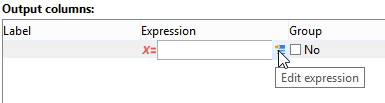

It is possible to group output column data: to do this, check **Yes** in the **Group** column of the **Data to extract** window. This function generates a result around the checked grouping axis. An example of a query with grouping is available in [this section](../../workflow/using/designing-queries.md#querying-delivery-information).

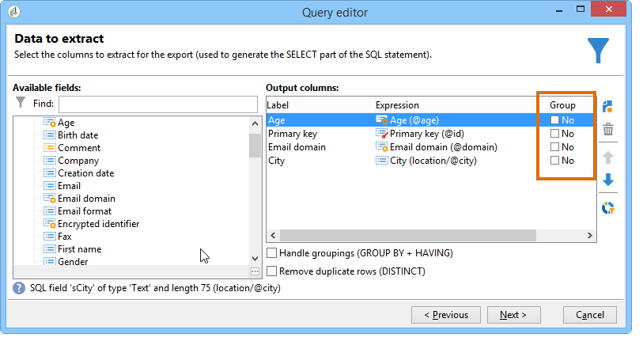

* The **Handle groupings (GROUP BY + HAVING)** function lets you "group by" and select what has been grouped ("having"). This function applies to all fields in the output column. For example, this option lets you group all choices of an output column and recover a specific type of information, such as recipients between 35 and 50.

  For more on this, refer to [this section](../../workflow/using/designing-queries.md#querying-using-grouping-management).

* The **Remove duplicate rows (DISTINCT)** function lets you deduplicate identical results obtained in the output column. For example, if you take a census by selecting the Last name, First name and Email fields in the output column, those with identical data will be eliminated, since it means the same contact has been entered several times in the database: only one result will be taken into account.

## Step 3 - Sort data {#step-3---sort-data}

The **Sorting** window lets you sort column content. Use the arrows to change the column order:

* The **Sorting** column enables a simple sort and arranges column content from A to Z or in ascending order.
* The **Descending sort** arranges the content from Z to A and in descending order. This is useful for viewing record sales for example: the highest figures are shown at the top of the list.

In this example, the data is sorted in ascending order based on recipient age.

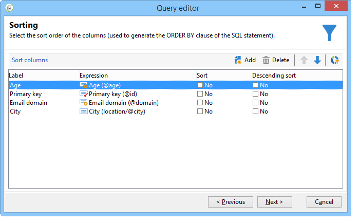

## Step 4 - Filter data {#step-4---filter-data}

The query editor lets you filter data to refine your search.

The filters offered depend on the table which the query concerns.

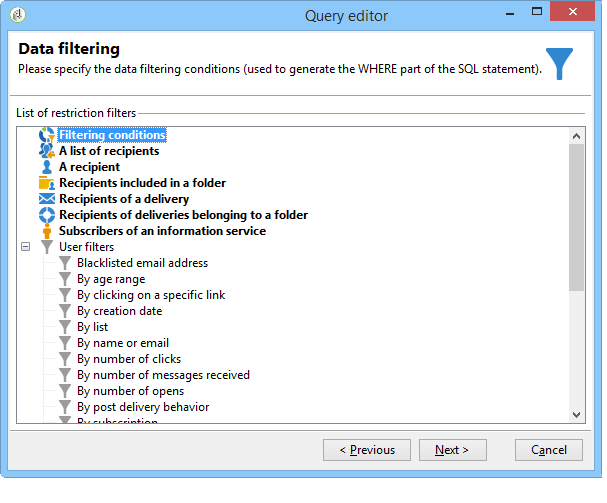

Once you select the **Filtering conditions** you will access the **Target elements** section: this lets you define how to filter the data to collect.

* To create a new filter, select the fields, operators and values required for creating the formula to be verified in order for data to be selected. It's possible to combine several conditions (for more on this, refer to [Defining filter conditions](../../platform/using/defining-filter-conditions.md)).
* To use previously saved filters, open the drop-down list by clicking the **Add** button, click **Predefined filter** and select the one you want.

  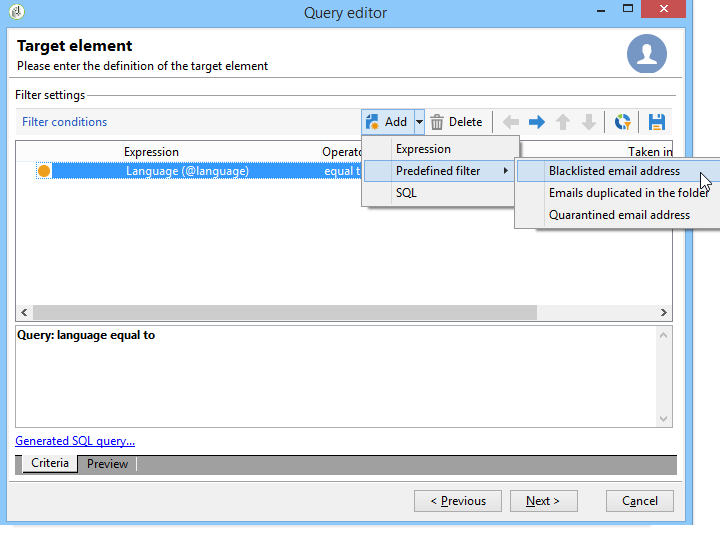

* The filters created in the **Generic query editor** are available in other query applications and vice versa. To save a filter, click the **Save** icon.

  >[!NOTE]
  >
  >For more on creating and using filters, refer to [Filtering options](../../platform/using/filtering-options.md).

As shown in the following example, to recover all English-speaking recipients, select: "recipient language **equal to** EN".

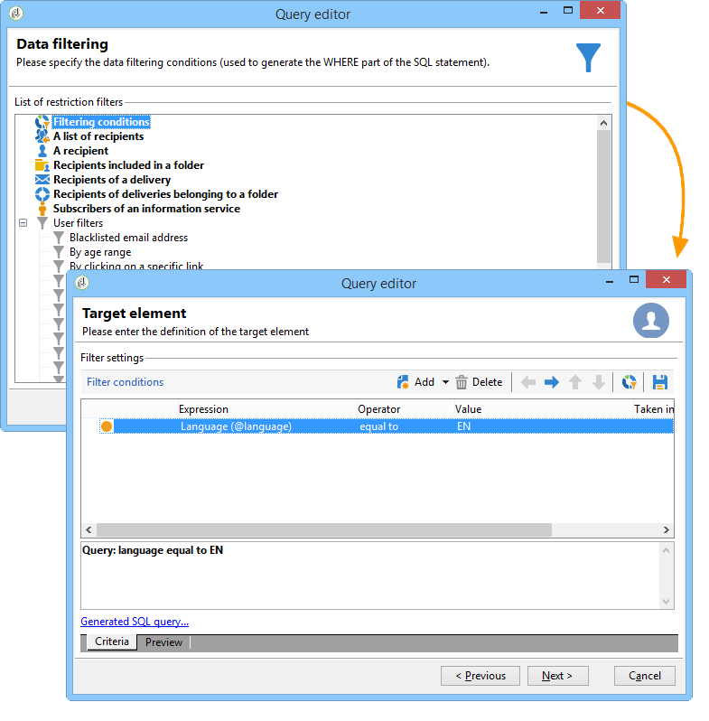

>[!NOTE]
>
>You can directly access an option by typing the following formula in the **Value** field: **$(options:OPTION_NAME)**.

Click the **Preview** tab to view the result of the filtering condition. In this case, all English-speaking recipients are displayed with their name, first name and email address.

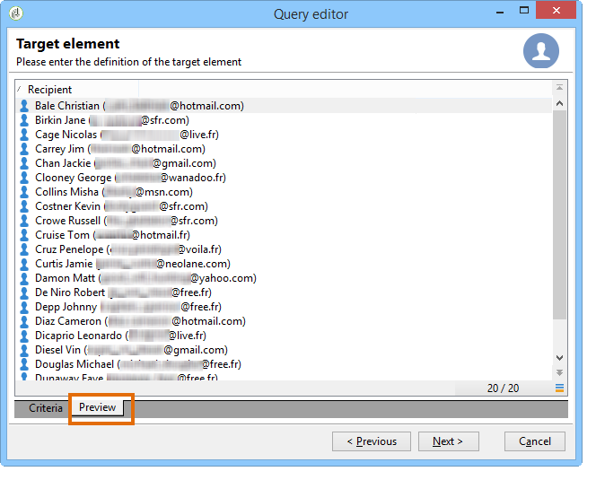

Users familiar with SQL language can click **Generate SQL query** to view the query in SQL.

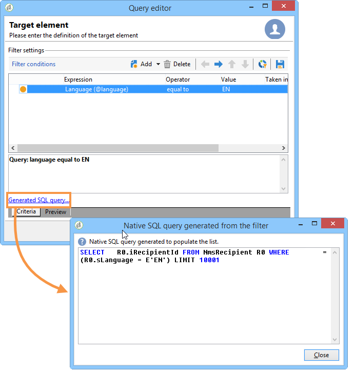

## Step 5 - Format data {#step-5---format-data}

Once you have configured the restriction filters, you will access the **Data formatting** window. This window lets you re-arrange output columns, transform data, and change the upper/lower case of the column labels. It also lets you apply a formula to the final result using a calculated field.

>[!NOTE]
>
>For more information on the types of calculated fields, refer to [Creating calculated fields](../../platform/using/steps-to-create-a-query.md#creating-calculated-fields).

Unchecked columns will not be shown in the data preview window.

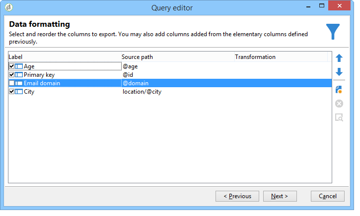

The **Transformation** column lets you change a column label to upper or lower case. Select the column and click in the **Transformation** column. You can choose:

* **Switch to lower case**,
* **Switch to upper case**, 
* **First letter in upper case**.

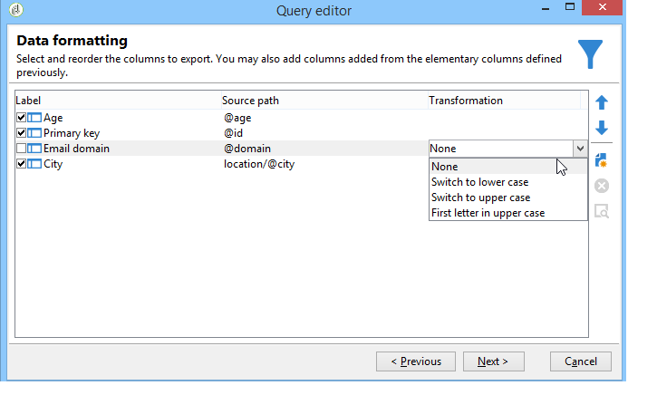

## Step 6 - Preview data {#step-6---preview-data}

The **Data preview** window is the last stage. Click **Start the preview of the data** to get your query result. It is available in columns or in XML format. Click the **Generated SQL queries** tab to view the query in SQL format.

In this example, data is sorted in ascending order based on recipient age.

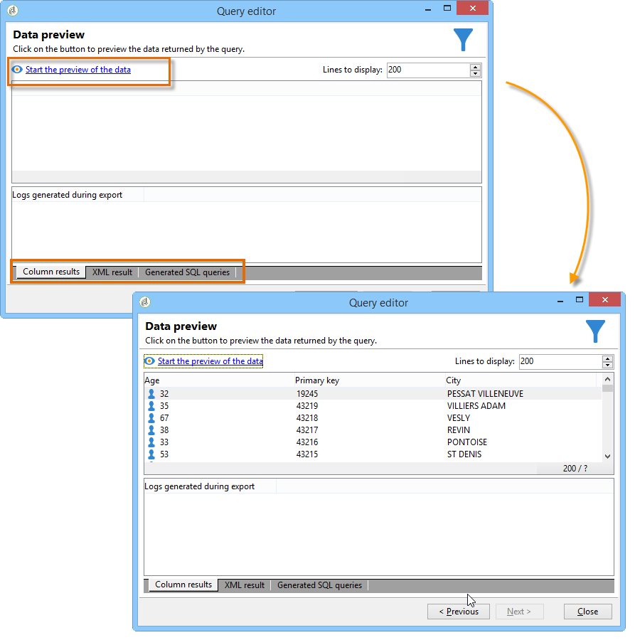

>[!NOTE]
>
>By default, only the first 200 lines are displayed in the **Data preview** window. To change this, enter a number in the **Lines to display** box and click **Start the preview of the data**.

