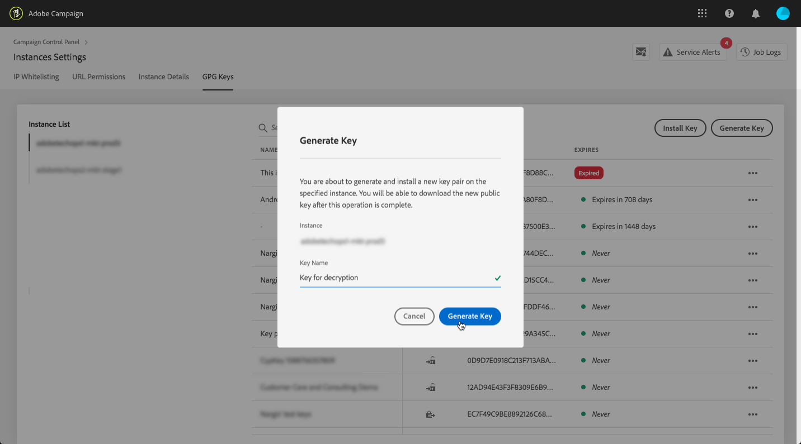
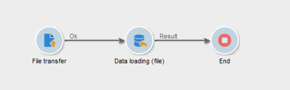
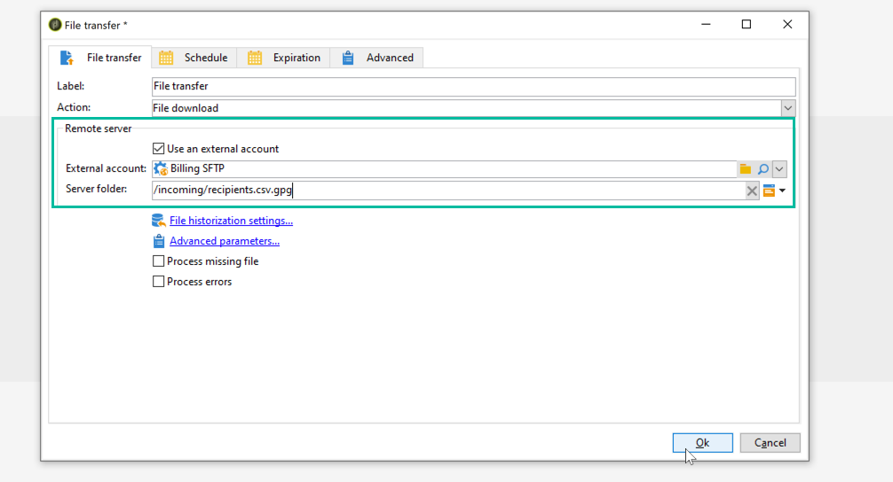
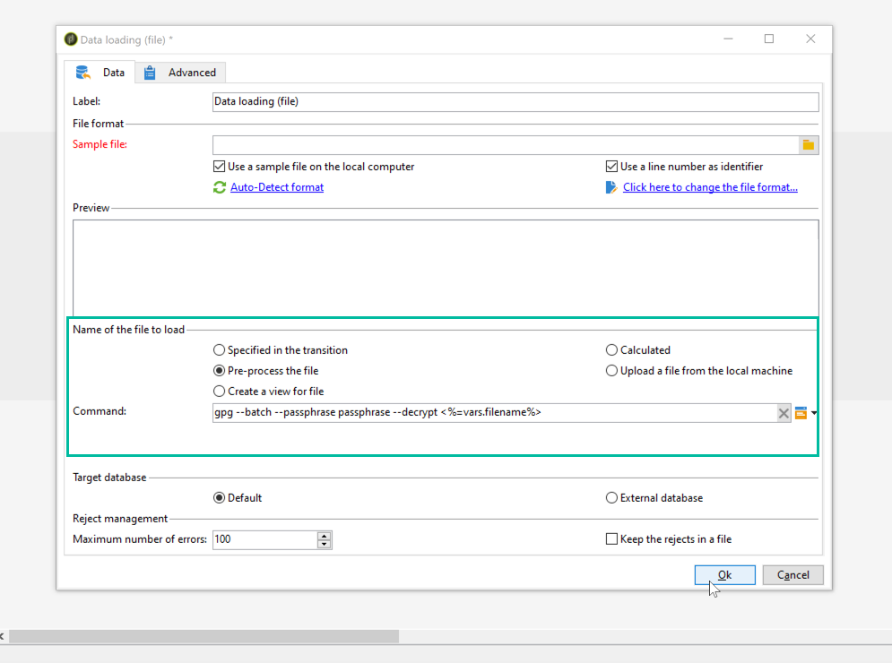

# Unzip or decrypt a file {#unzipping-or-decrypting-a-file-before-processing}

Adobe Campaign lets you import zipped or encrypted files. Before they can be read in a [Data loading (file)](https://experienceleague.adobe.com/docs/campaign/automation/workflows/wf-activities/action-activities/data-loading-file.html){target="_blank"}) activity, you can define a pre-processing to unzip or to decrypt the file.

>[!IMPORTANT]
>
>You cannot uncompress zipped files larger than 4Gb.

To be able to do so:

1. Use the [Control Panel](https://experienceleague.adobe.com/docs/control-panel/using/instances-settings/gpg-keys-management.html#decrypting-data) to generate a public/private key pair in order to allow file decryption.

    >[!NOTE]
    >
    >Control Panel is accessible to all Admin users. The steps to grant Admin access to a user are detailed in [this page](https://experienceleague.adobe.com/docs/control-panel/using/discover-control-panel/managing-permissions.html#discover-control-panel).
    >
    >Note that your instance must be hosted on AWS and upgraded with the [latest GA build](../../rn/using/rn-overview.md). Learn how to check your version in [this section](../../platform/using/launching-adobe-campaign.md#getting-your-campaign-version). To check if your instance is hosted on AWS, follow the steps detailed in [this page](https://experienceleague.adobe.com/docs/control-panel/using/faq.html).

1. If your installation of Adobe Campaign is on premise, install the utility you want to use (for example: GPG, GZIP) as well as the necessary keys (encryption key) on the application server. 

    If your installation of Adobe Campaign is hosted by Adobe, contact [Adobe Customer Care](https://helpx.adobe.com/enterprise/admin-guide.html/enterprise/using/support-for-experience-cloud.ug.html) to have the necessary utilities installed on the server.

You can then use the desired pre-processing commands into your workflows:

1. Add and configure a **[!UICONTROL File transfer]** activity in your workflow.
1. Add a **[!UICONTROL Data loading (file)]** activity and define the file format.
1. Check the **[!UICONTROL Pre-process the file]** option.
1. Select the pre-processing command you want to apply.
1. Add other activities to manage data coming from the file.
1. Save and execute your workflow.

An example is presented in the use case below.

**Related topics:**

* [Data loading (file) activity](https://experienceleague.adobe.com/docs/campaign/automation/workflows/wf-activities/action-activities/data-loading-file.html){target="_blank"}.
* [Zip or encrypt a file](https://experienceleague.adobe.com/docs/campaign/automation/workflows/wf-activities/action-activities/extraction-file.html){target="_blank"}.

## Use case: Import data encrypted using a key generated by Control Panel {#use-case-gpg-decrypt}

In this use case, we will build a workflow in order to import data that has been encrypted in an external system, using a key generated in the Control Panel.

 [Discover this feature in video](#video)

The steps to perform this use case are as follows:

1. Use the Control Panel to generate a key pair (public/private). Detailed steps are available in [Control Panel documentation](https://experienceleague.adobe.com/docs/control-panel/using/instances-settings/gpg-keys-management.html#decrypting-data).

    * The public key will be shared with the external system, which will use it to  encrypt the data to send to Campaign.
    * The private key will be used by Campaign Classic to decrypt the incoming encrypted data.

    

1. In the external system, use the public key downloaded from the Control Panel to encrypt the data to import into Campaign Classic.

1. In Campaign Classic, build a workflow to import the encrypted data and decrypt it using the private key that has been installed via the Control Panel. To do this, we will build a workflow as follows:

     

    * **[!UICONTROL File transfer]** activity: Transfers the file from an external source to Campaign Classic. In this example, we want transfer the file from an SFTP server.
    * **[!UICONTROL Data loading (file)]** activity: Loads the data from the file into the database and decrypt it using the private key generated in the Control Panel.

1. Open the **[!UICONTROL File transfer]** activity then specify the external account from which you want to import the encrypted .gpg file.

     

     Global concepts on how to configure the activity are available in the [Campaign v8 documentation](https://experienceleague.adobe.com/docs/campaign/automation/workflows/wf-activities/event-activities/file-transfer.html){target="_blank"}.

1. Open the **[!UICONTROL Data loading (file)]** activity, then configure it according to your needs. Global concepts on how to configure the activity are available in the [Campaign v8 documentation](https://experienceleague.adobe.com/docs/campaign/automation/workflows/wf-activities/action-activities/data-loading-file.html){target="_blank"}.

    Add a pre-processing stage to the activity, in order to decrypt the incoming data. To do this, select the **[!UICONTROL Pre-process the file]** option, then select **[!UICONTROL Decrypt]** from the **[!UICONTROL Command]** drop-down list:

     

    >[!NOTE]
    >
    >If changes are needed to the available commands, you can reach out to [Adobe Customer Care](https://helpx.adobe.com/enterprise/admin-guide.html/enterprise/using/support-for-experience-cloud.ug.html) to adjust the preProcessCommand settings.
    >
    >If you are working with an hybrid deployment, you can configure these commands directly from the server configuration file (serverConf.xml). [Learn how to configure pre-processing commands in the server configuration file](../../installation/using/the-server-configuration-file.md#preprocesscommand)

1. Click **[!UICONTROL OK]** to confirm the activity configuration.

1. You can now run the workflow. Once it is executed, you can check in the workflow logs that the decryption has been executed, and that data from the file have been imported.

    

## Tutorial video {#video}

This video shows how to use a GPG key to decrypt data.

>[!VIDEO](https://video.tv.adobe.com/v/36482?quality=12)

Additional Campaign Classic how-to videos are available [here](https://experienceleague.adobe.com/docs/campaign-classic-learn/tutorials/overview.html).
