# Updating data{#updating-data}

The data linked to a recipient's profile can be updated manually or automatically.

## Setting up an automatic update {#setting-up-an-automatic-update}

An automatic update can be configured via a workflow. For more on this, refer to [this section](../../workflow/using/update-data.md).

## Performing a mass update {#performing-a-mass-update}

To perform manual updates, right-click the selected recipient(s) to use the **Actions** shortcut menu, or use the **Actions** icon.

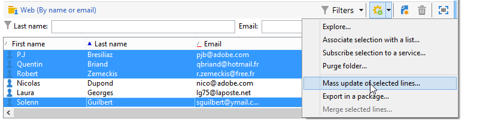

There are two types of updates: mass update for a set of recipients, and data merging between two profiles. For each action, a wizard lets you configure the update.

### Mass update {#mass-update}

For mass updating, use **Action > Mass update of selected lines...**. The wizard helps you configure and run the update.

The first step of the wizard is to specify the field(s) to be updated.

The left-hand section of the wizard displays the list of available fields. Use the **Find** field to run a search of these fields. Press the **Enter** key to browse the list. The field names matching your entry appear in bold, as shown below.

Double-click the field(s) to be updated to display them in the right-hand section of the wizard.

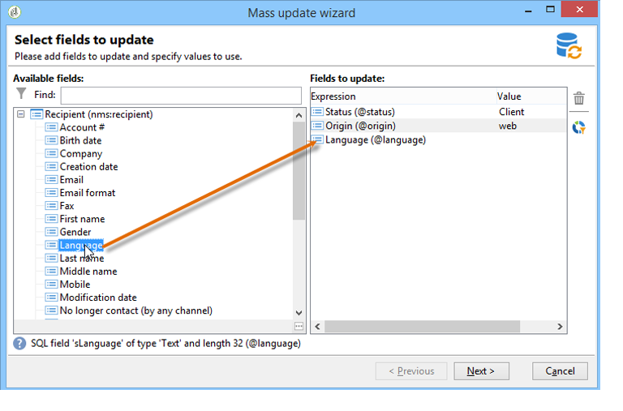

In the event of an error, use the **Delete** button to delete a field from the list of fields to be updated.

Select or enter the values to apply to the profiles to be updated.

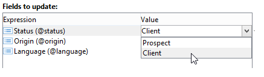

You can click **Distribution of values** to display the distribution of values of the selected field for the recipients present in the current folder (not only the recipients affected by the update).

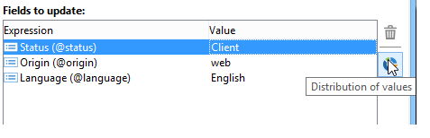

You can define filters to display the distribution of values in this window or modify the current folder to display the distribution of values in another folder. These are read-only actions; they do not affect the configuration of the update being defined.

Close this window and click **Next** to display the second update wizard step. In this step, you can launch the update by clicking **Start**.

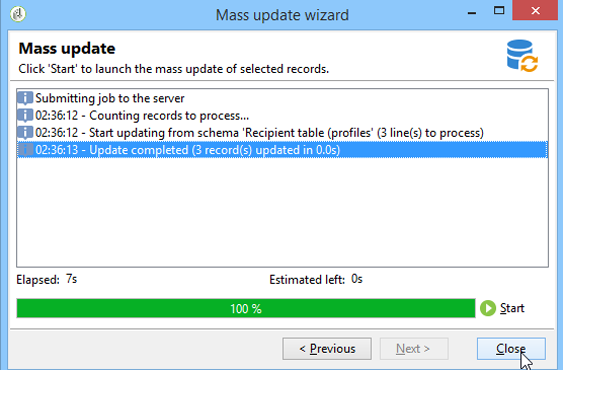

Information concerning update execution is displayed in the upper section of the wizard.

The **Stop** lets you cancel the update, but certain records might have been updated, and stopping the process will not cancel these updates. The progress bar shows how far the operation has advanced.

### Merge data {#merge-data}

Select **Merge selected lines...** to launch the merging of two recipient profiles. The profiles to be merged must be selected before selecting the option. The merge is configured and launched using a wizard.

The wizard displays the values to be retrieved for each field completed in one or other of the source profiles. If one or more fields in the profiles to be merged have different values, they are displayed in the **List of conflicts** section. You can then select the default profile using the radio buttons under the list, as in the following example:

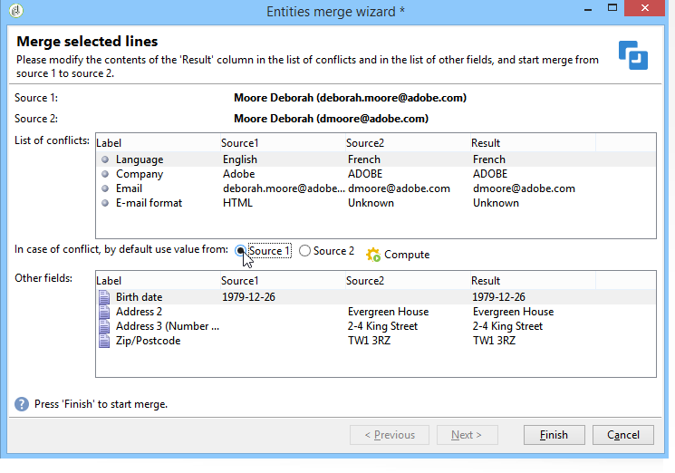

Click **Compute** to display the result of your choice.

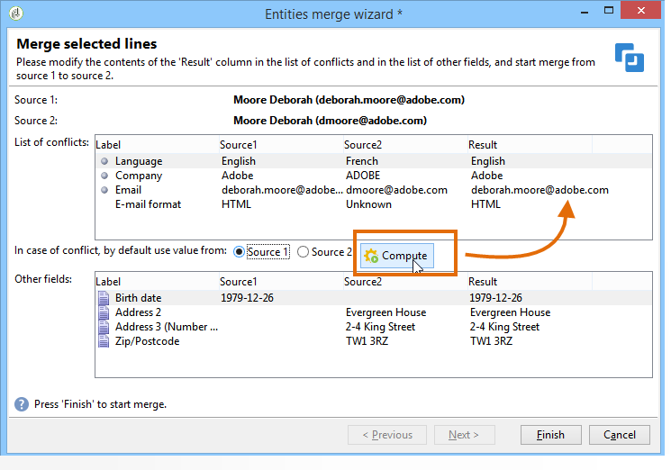

Check the **Result** columns of both sections of the window, and click **Finish** to run the merge.

## Exporting data {#exporting-data}

The content of a list can be exported. To configure and run the export:

1. Select records to export.
1. Right-click and select **Export...**.

   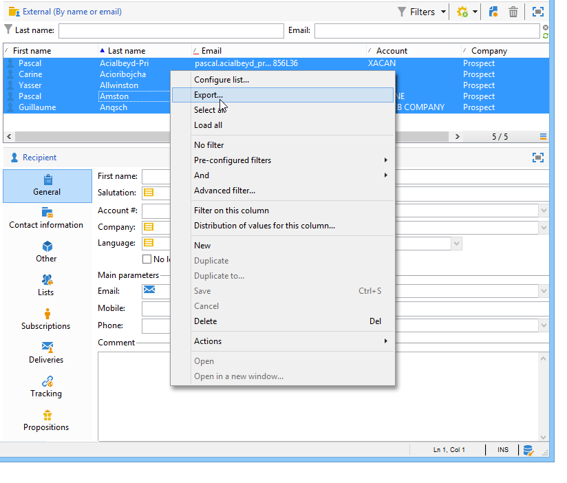

1. Then select the data to extract. By default, all columns displayed are added to the output columns.

   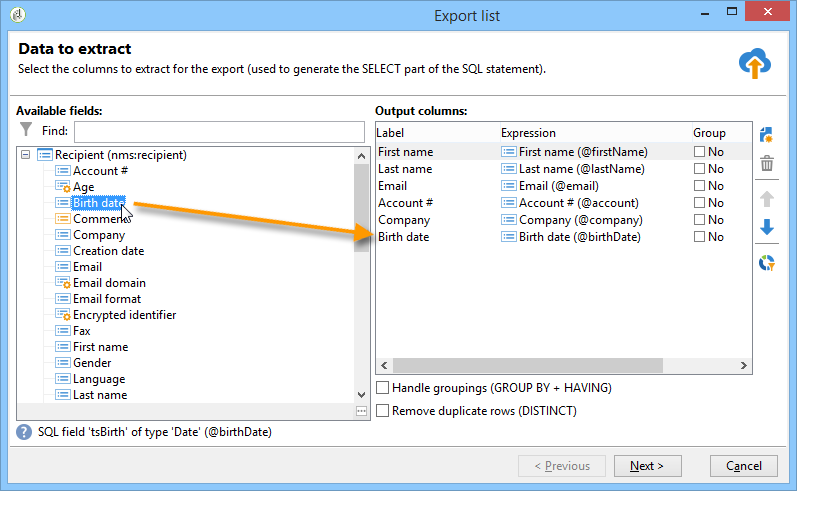

   For more on how to configure the export wizard, refer to [Export wizard](../../platform/using/updating-data.md#export-wizard).

## Subscribing to a service {#subscribing-to-a-service}

In most cases, recipients subscribe to a newsletter through a dedicated landing page, as explained in [this section](../../delivery/using/managing-subscriptions.md). However, the profiles of filtered recipients can be subscribed to a service (Newsletter or Viral service) manually. To do this:

1. Select the recipients you want to subscribe and right-click. 
1. Select **Actions > Subscribe selection to a service**.

   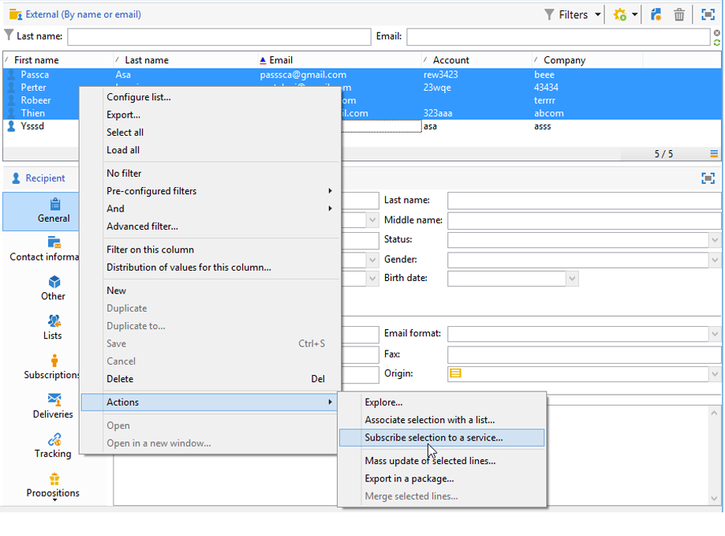

1. Select the desired service and click **Next**:

   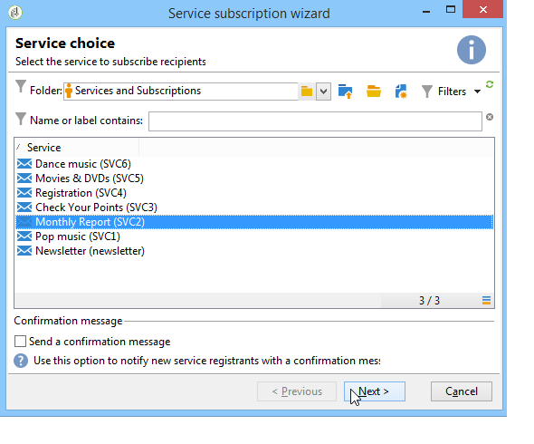

   >[!NOTE]
   >
   >This editor lets you create a new service: click the **Create** button.

1. You can **Send a confirmation message** to recipients. The content of this message can be configured in the subscription scenario linked to the selected service.
1. Click the **Start** button to run the subscription process.

   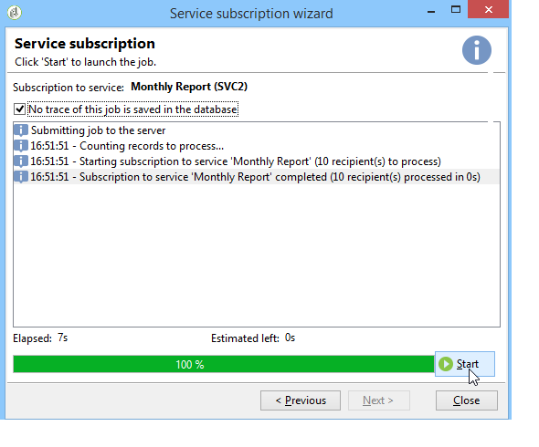

The upper section of the window lets you monitor the execution process. The **Stop** button lets you stop the process. However, recipients already processed will be subscribed.

If you uncheck the **Do not keep a trace of this job in the database** option, you can select (or create) the execution folder where the information on this process will be stored.

To check on the process, go to the **Subscriptions** tab on the profiles of the recipients concerned by this operation, or to the **Subscriptions** tab accessed via the **Profiles and Targets > Services and Subscriptions** node.

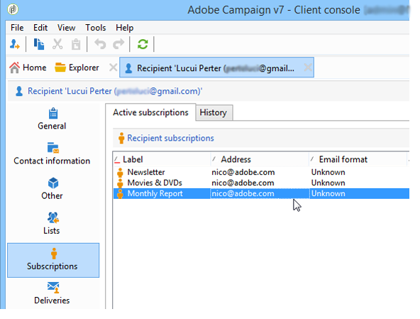

>[!NOTE]
>
>For more on creating and configuring information services, refer to [this page](../../delivery/using/managing-subscriptions.md).

