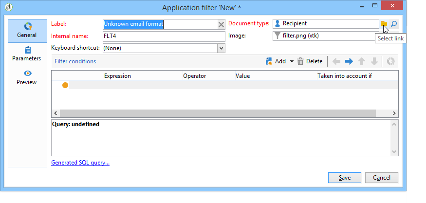
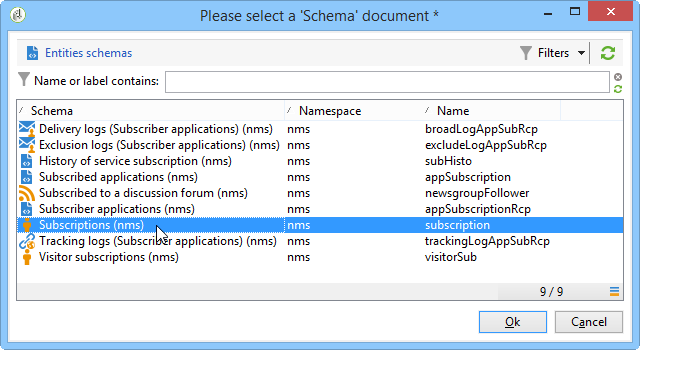
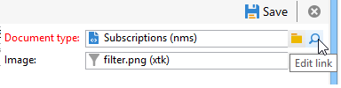
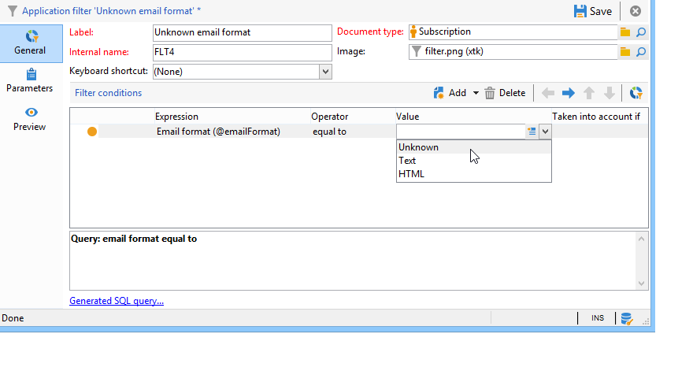
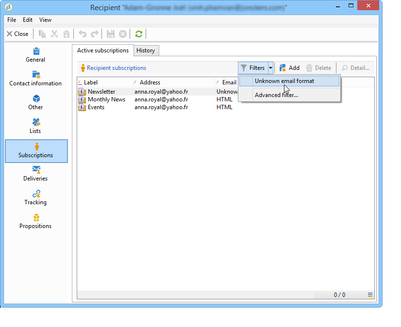
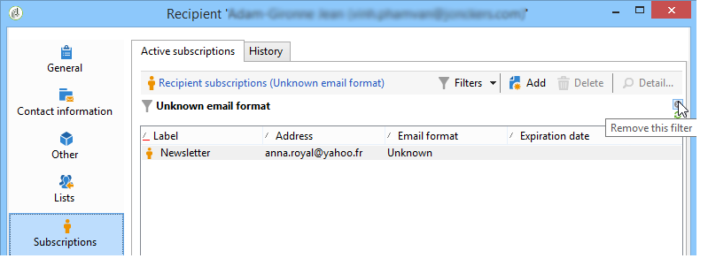

# Use case{#use-case}

## Creating a filter on the email format of subscribers {#creating-a-filter-on-the-email-format-of-subscribers}

This use case will show you how to create a filter to sort newsletter subscriptions based on recipient email format.

To do this, we need to use a predefined filer: these filters are linked to a document type and are accessed via the **[!UICONTROL Administration > Configuration > Predefined filters]** node. These data filters can be used for each type of editor (or document) in the application.

Data filters are created in the same way as predefined filters, but there is an additional field to select the document type to which the filter will be applied.

Apply the following steps:

1. Create a new filter via the **[!UICONTROL Administration > Configuration > Predefined filters]** node.
1. Click the **[!UICONTROL Select link]** icon to select the concerned document:

   

1. Select the subscription schema (nms:subscription) and click **[!UICONTROL OK]** .

   

1. Click **[!UICONTROL Edit link]** to view the fields of the selected document.

   

   You can then view the content of the selected document:

   

   You can access these fields to define filter conditions in the body of the filter editor. An application filter is defined in exactly the same way as an advanced filter. See [Creating an advanced filter](https://helpx.adobe.com/campaign/standard/platform/using/creating-filters.html#creating-an-advanced-filter).

1. Create a new filter on subscriptions to display only subscriptions with an undefined email format:

   

1. Click **[!UICONTROL Save]** to add a filter to the pre-defined filters for this type of list.
1. You can now use this filter in the **[!UICONTROL Subscriptions]** tab of the recipient profile; you can access the "Unknown e-mail format" filter by clicking the **[!UICONTROL Filters]** button.

   

   The name of the current filter is displayed above the list. To cancel the filter, click the **[!UICONTROL Delete this filter]** icon.

   

