# Working with data packages{#working-with-data-packages}

## About data packages {#about-data-packages}

Adobe Campaign allows you to export or import the platform configuration and data through a package system. Packages can contain different kinds of configurations, elements, filtered or not.

Data packages let entities of the Adobe Campaign database be displayed via files in XML format. Each entity contained in a package is represented with all of its data.

The principle of **data packages** is to export a data configuration and integrate it into another Adobe Campaign system. For more information on how to maintain a consistent set of data packages, refer to this [technote](https://docs.campaign.adobe.com/doc/AC/en/technicalResources/Technotes/AdobeCampaign_How_to_maintain_a_consistent_set_of_data_packages.pdf).

### Types of packages {#types-of-packages}

There are three types of exportable packages: user packages, platform packages and admin packages.

* **User package**: it enables you to select the list of entities to be exported. This type of package manages dependencies and verifies errors.
* **Platform package**: it includes all added technical resources (not standard): schemas, JavaScript code, etc. 

  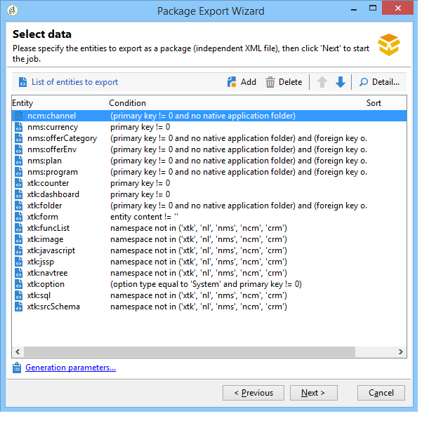

* **Admin package**: it includes all added templates and business objects (not standard): templates, libraries, etc.

  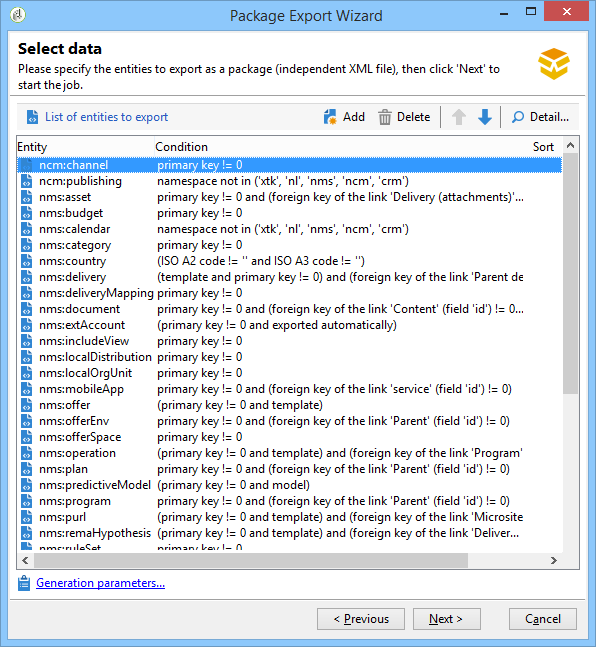

>[!CAUTION]
>
>The **platform** and **admin** types contain a predefined list of entities to be exported. Each entity is linked to filtering conditions that enable you to remove the out-of-the-box resources of the created package.

## Data structure {#data-structure}

The description of a data package is a structured XML document that complies with the grammar of the **xrk:navtree** data schema.

Data package example:

```
<package>
  <entities schema="nms:recipient">
    <recipient email="john.smith@adobe.com" lastName="Smith" firstName="John">      
      <folder _operation="none" name="nmsRootFolder"/>      
      <company _operation="none" name="Adobe"/>
    </recipient>
  </entities>
  <entities schema="sfa:company">
    <company name="Adobe">
      location city="London" zipCode="W11 2BQ"/>
    </company>
  </entities>
</package>
```

The XML document must begin and end with the ** `<package>`** element. Any ** `<entities>`** elements that follow distribute the data by document type.

An ** `<entities>`** element contains the data of the package in the format of the data schema entered in the **schema** attribute.

The data in a package must not contain internal keys that are not compatible between bases, such as auto-generated keys (**autopk** option).

In our example, the joins on the "folder" and "company" links have been replaced by so-called "high level" keys on the destination tables:

```
<recipient>
  <folder _operation="none" name="nmsRootFolder"/>
  <company _operation="none" name="Adobe"/>
</recipient>
```

The ** _operation** attribute with the value "none" defines a reconciliation link.

A data package can be constructed manually from any text editor. Simply ensure that the structure of the XML document complies with the "xtk:navtree" data schema. The Adobe Campaign console has a data package export and import module.

## Exporting packages {#exporting-packages}

### About package export {#about-package-export}

Packages can be exported in three different ways:

* The **Package Export Wizard** enables you to export a set of objects in a single package. For more on this refer to [Exporting a set of objects in a package](../../platform/using/working-with-data-packages.md#exporting-a-set-of-objects-in-a-package)
* A **single object** can be exported in a package directly by right-clicking on it and selecting **Actions > Export in a package**.
* **Package definitions** let you create a package structure in which you add objects that will be exported later on in a package. For more on this, refer to [Managing package definitions](../../platform/using/working-with-data-packages.md#managing-package-definitions)

Once a package exported, you will be able to import it and all the added entities into another Campaign instance.

### Exporting a set of objects in a package {#exporting-a-set-of-objects-in-a-package}

The package export wizard is accessible via the **Tools > Advanced > Export package...** menu of the Adobe Campaign client console.

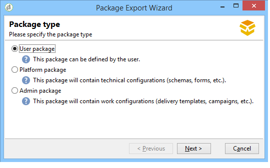

For the three types of packages, the wizard offers the following steps:

1. List the entities to be exported by document type:

   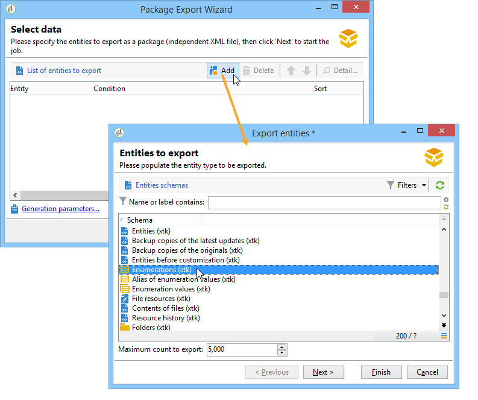

   >[!CAUTION]
   >
   >If you export an **Offer category**, **Offer environment**, **Program** or **Plan** type folder, don't ever select the **xtk:folder** as you may lose some data. Select the entity that corresponds with the folder: **nms:offerCategory** for offer categories, **nms:offerEnv** for offer environments, **nms:program** for programs, and **nms:plan** for plans.

   List management lets you add or delete entities for export from the configuration. Click **Add** to select a new entity.

   The **Detail** button edits the selected configuration.

   >[!NOTE]
   >
   >The dependency mechanism controls the entity export sequence. For more on this, refer to [Managing dependencies](../../platform/using/working-with-data-packages.md#managing-dependencies).

1. The entity configuration screen defines the filter query on the type of document to be extracted.

   You must configure the filtering clause for data extraction.

   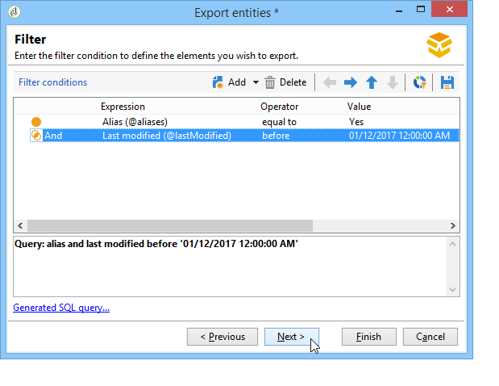

   >[!NOTE]
   >
   >The query editor is presented in [this section](../../platform/using/about-queries-in-campaign.md).

1. Click **Next** and select the sorting columns to order the data during extraction:

   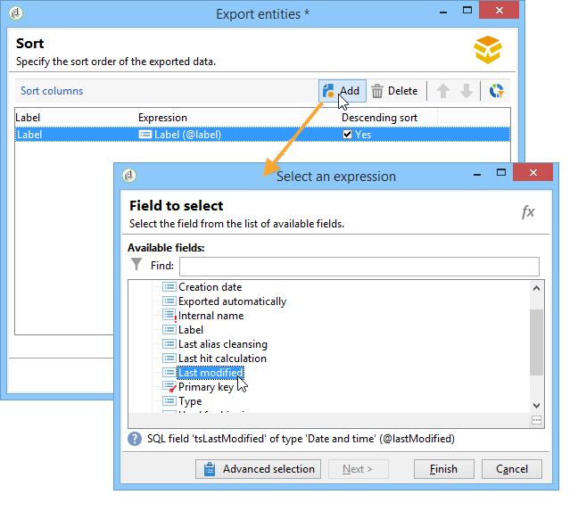

1. Preview the data to extract before running the export.

   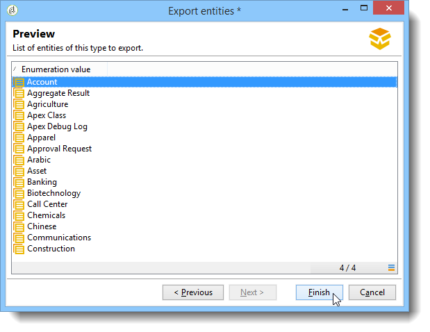

1. The last page of the package export wizard lets you start the export. The data will be stored in the file indicated in the **File** field.

   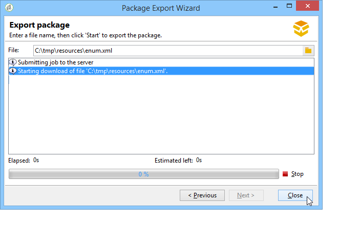

### Managing dependencies {#managing-dependencies}

The export mechanism enables Adobe Campaign to track the links between the various exported elements.

This mechanism is defined by two rules:

* objects linked to a link with an **own** or **owncopy** type integrity are exported in the same package as the exported object.
* objects linked to a link with a **neutral** or **define** type integrity (defined link) must be exported separately.

>[!NOTE]
>
>Integrity types linked to schema elements are defined in [this section](../../configuration/using/database-mapping.md#links--relation-between-tables).

#### Exporting a campaign {#exporting-a-campaign}

Here is an example on how to export a campaign. The marketing campaign to be exported contains a task (label: "MyTask") and a workflow (label: "CampaignWorkflow") in a "MyWorkflow" folder (node: Administration / Production / Technical workflows / Campaign processes / MyWorkflow).

The task and the workflow are exported in the same package as the campaign since the matching schemas are connected by links with an "own" type integrity.

Package content:

```

<?xml version='1.0'?>
<package author="Administrator (admin)" buildNumber="7974" buildVersion="6.1" img=""
label="" name="" namespace="" vendor="">
 <desc></desc>
 <version buildDate="2013-01-09 10:30:18.954Z"/>
 <entities schema="nms:operation">
  <operation duration="432000" end="2013-01-14" internalName="OP1" label="MyCampaign"
  modelName="opEmpty" start="2013-01-09">
   <controlGroup>
    <where filteringSchema=""/>
   </controlGroup>
   <seedList>
    <where filteringSchema="nms:seedMember"></where>
    <seedMember internalName="SDM1"></seedMember>
   </seedList>
   <parameter useAsset="1" useBudget="1" useControlGroup="1" useDeliveryOutline="1"
   useDocument="1" useFCPValidation="0" useSeedMember="1" useTask="1"
   useValidation="1" useWorkflow="1"></parameter>
   <fcpSeed>
    <where filteringSchema="nms:seedMember"></where>
   </fcpSeed>
   <owner _operation="none" name="admin" type="0"/>
   <program _operation="none" name="nmsOperations"/>
   <task end="2013-01-17 10:07:51.000Z" label="MyTask" name="TSK2" start="2013-01-16 10:07:51.000Z"
   status="1">
    <owner _operation="none" name="admin" type="0"/>
    <operation _operation="none" internalName="OP1"/>
    <folder _operation="none" name="nmsTask"/>
   </task>
   <workflow internalName="WKF12" label="CampaignWorkflow" modelName="newOpEmpty"
   order="8982" scenario-cs="Notification of the workflow supervisor (notifySupervisor)"
   schema="nms:recipient">
    <scenario internalName="notifySupervisor"/>
    <desc></desc>
    <folder _operation="none" name="Folder4"/>
    <operation _operation="none" internalName="OP1"/>
   </workflow>
  </operation>
 </entities>
</package>   
  
```

Affiliation to a type of package is defined in a schema with the **@pkgAdmin and @pkgPlatform** attribute. Both these attributes receive an XTK expression that defines the conditions of affiliation to the package.

```
<element name="offerEnv" img="nms:offerEnv.png" 
template="xtk:folder" pkgAdmin="@id != 0">
```

Finally, the **@pkgStatus** attribute enables you to define the export rules for these elements or attributes. Depending on the value of the attribute, the element or attribute will be found in the exported package. The three possible values for this attribute are:

* **never**: does not export the field / link
* **always**: forces export for this field 
* **preCreate**: authorizes creation of the linked entity

>[!NOTE]
>
>The **preCreate** value is only admitted for link type events. It authorizes you to create or point towards an entity not yet loaded in the exported package.

## Managing package definitions {#managing-package-definitions}

### About package definitions {#about-package-definitions}

Package definitions let you create a package structure in which you add entities that will be exported later on in a single package. You will then be able to import this package and all the added entities into another Campaign instance.

**Related topics:**

* [Creating a package definition](../../platform/using/working-with-data-packages.md#creating-a-package-definition)
* [Adding entities to a package definition](../../platform/using/working-with-data-packages.md#adding-entities-to-a-package-definition)
* [Configuring package definitions generation](../../platform/using/working-with-data-packages.md#configuring-package-definitions-generation)
* [Exporting packages from a package definition](../../platform/using/working-with-data-packages.md#exporting-packages-from-a-package-definition)

### Creating a package definition {#creating-a-package-definition}

Package definitions can be accessed from the **Administration > Configuration > Package management > Package definitions** menu.

To create a package definition, click the **New** button, then fill in the package definition general information.

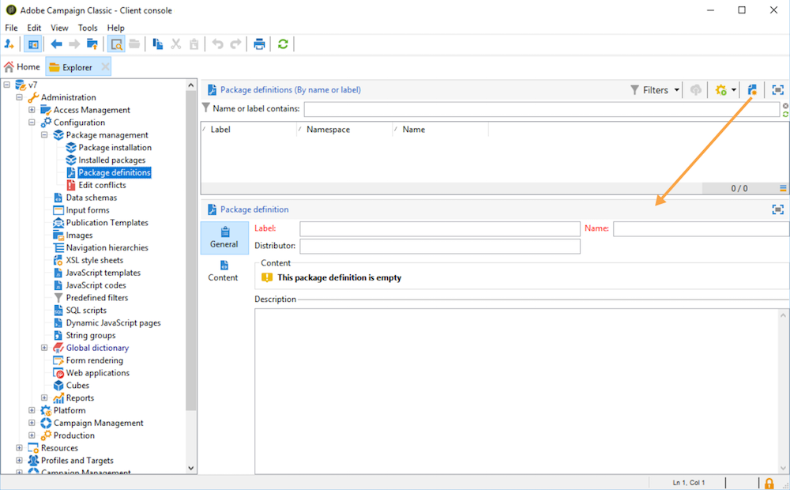

You can then add entities to the package definition, and export it to an XML file package.

**Related topics:**

* [Adding entities to a package definition](../../platform/using/working-with-data-packages.md#adding-entities-to-a-package-definition)
* [Configuring package definitions generation](../../platform/using/working-with-data-packages.md#configuring-package-definitions-generation)
* [Exporting packages from a package definition](../../platform/using/working-with-data-packages.md#exporting-packages-from-a-package-definition)

### Adding entities to a package definition {#adding-entities-to-a-package-definition}

In the **Content** tab, click the **Add** button to select the entities to export with the package. Best practices when selecting entities are presented in the [Exporting a set of objects in a package](../../platform/using/working-with-data-packages.md#exporting-a-set-of-objects-in-a-package) section.

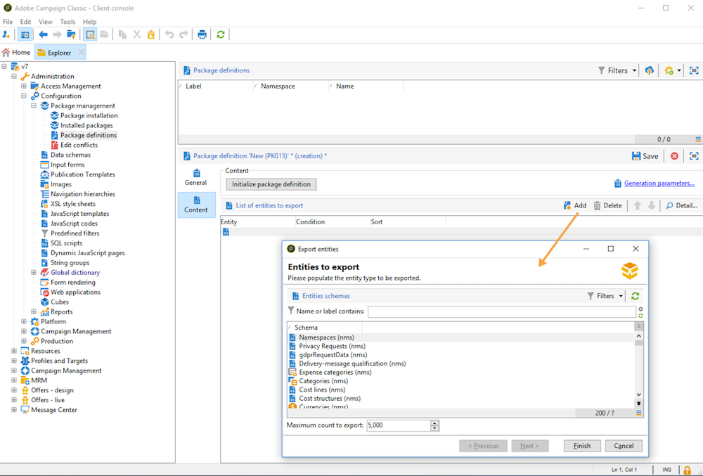

Entities can be added to a package definition directly from their location in the instance. To do this, follow the steps below:

1. Right-click the desired entity, then select **Actions > Export in a package**.

   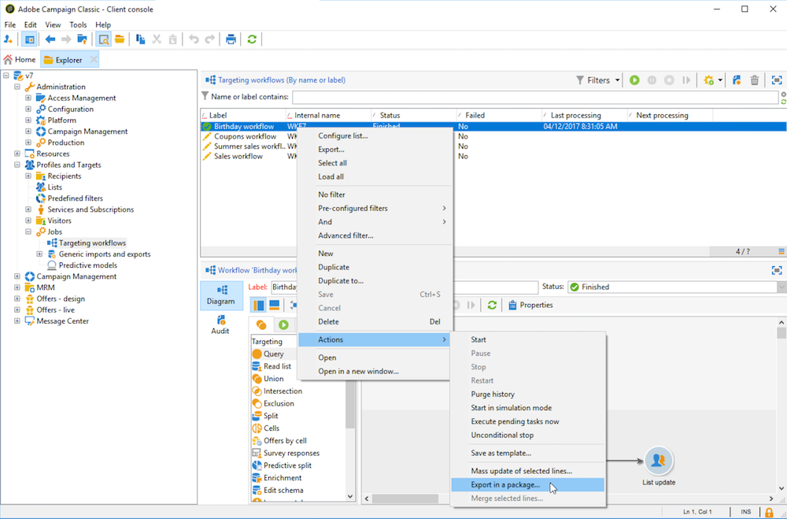

1. Select **Add to a package definition**, then select the package definition to which you want to add the entity.

   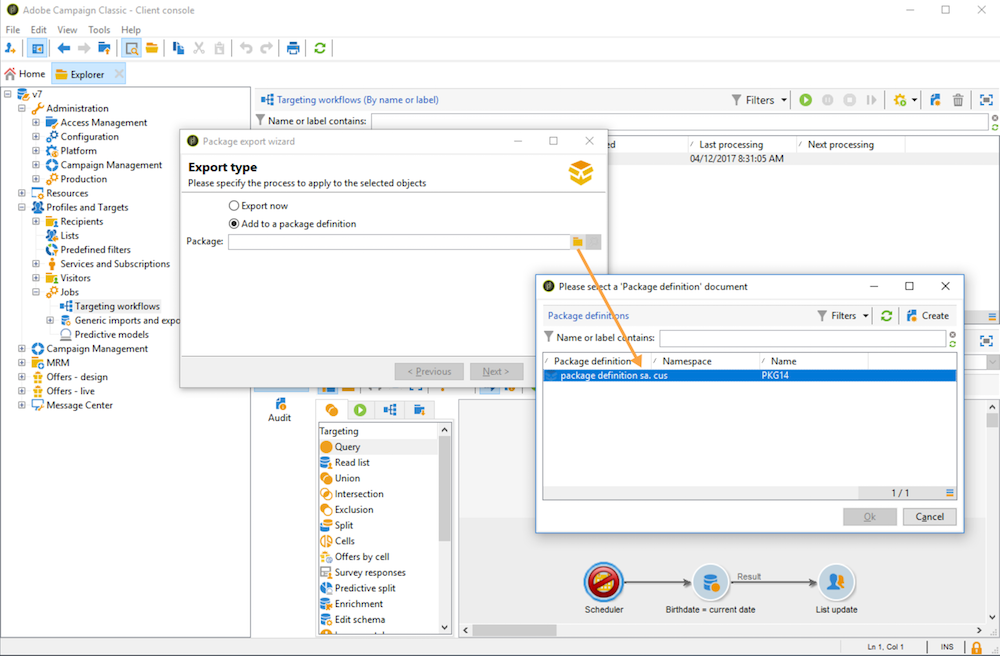

1. The entity is added to the package definition, it will be exported with the package (see [Exporting packages from a package definition](../../platform/using/working-with-data-packages.md#exporting-packages-from-a-package-definition)).

   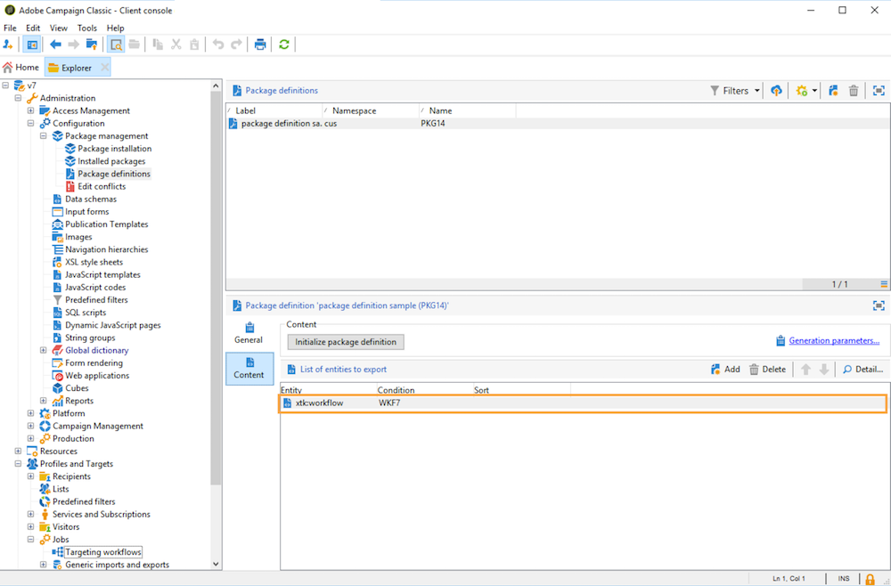

### Configuring package definitions generation {#configuring-package-definitions-generation}

Package generation can be configured from the package definition **Content** tab. To do this, click the **Generation parameters** link.

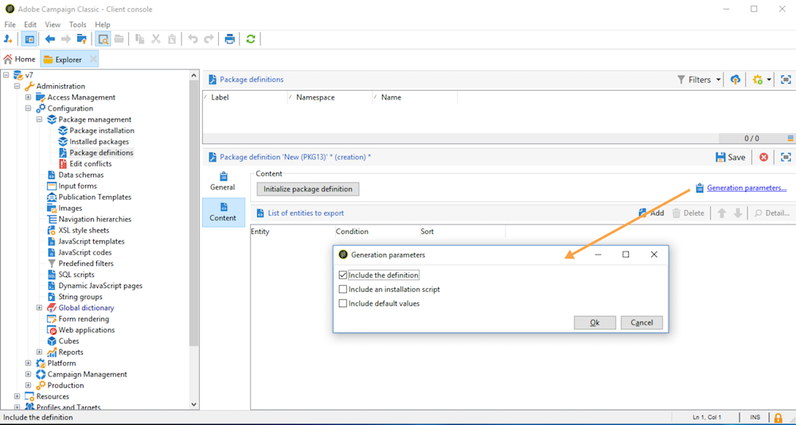

* **Include the definition**: includes the definition currently used in the package definition.
* **Include an installation script**: lets you add a javascript script to execute at the package import. When selected, a **Script** tab is added in the package definition screen.
* **Include default values**: adds to the package the values of all the entities' attributes.

  This option is not selected by default, in order to avoid lengthy exports. This means that entities' attributes with default values ('empty string', '0', and 'false' if not defined otherwise in the schema) will not be added to the package and will therefore not be exported.

  >[!CAUTION]
  >
  >Unselecting this option can result in a merge of local and imported versions.   
  >If the instance where the package is imported contains entities that are identical to those of the package (for example with the same external ID), their attributes will not be updated. This can occur if the attributes from the former instance have default values, as they are not included in the package.   
  >In that case, selecting the **Include default values** option would prevent versions merging, as all attributes from the former instance would be exported with the package.

### Exporting packages from a package definition {#exporting-packages-from-a-package-definition}

To export a package from a package definition, follow the steps below:

1. Select the package definition to export, then click the **Actions** button and select **Export the package**.
1. An XML file corresponding to the exported package is selected by default. It is named according to the package definition namespace and name.
1. Once the package name and location defined, click the **Start** button to launch the export.

   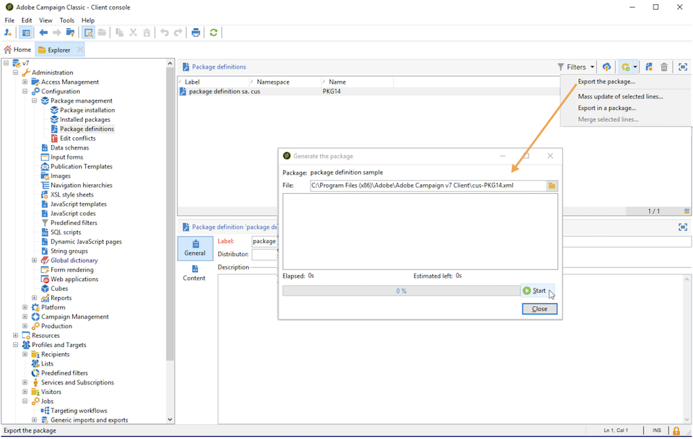

## Importing packages {#importing-packages}

### About package import {#about-package-import}

The package import wizard is accessible via the main menu **Tools > Advanced > Package import...** of the Adobe Campaign client console.

You can import a package from an export performed earlier, e.g. from another Adobe Campaign instance, or a standard package, depending on the terms of your license.


### Installing a package from a file {#installing-a-package-from-a-file}

To import an existing data package, select the XML file and click **Open**.

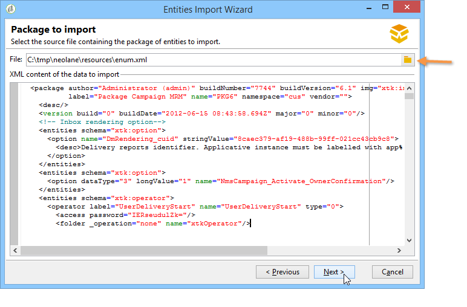

The content of the package to be imported is then displayed in the middle section of the editor.

Click **Next** and **Start** to launch the import.

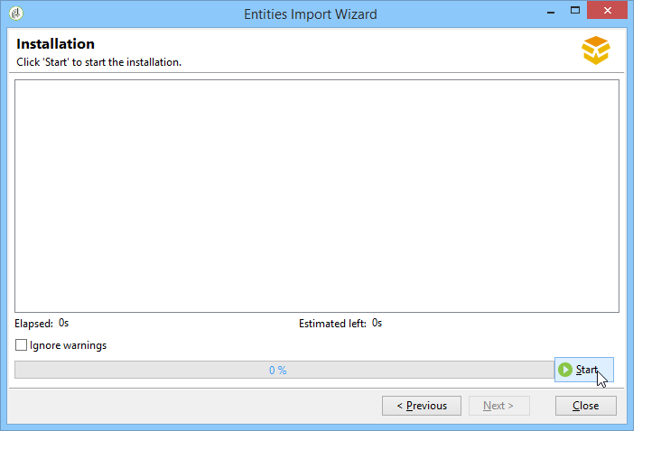

### Installing a standard package {#installing-a-standard-package}

Standard packages are installed when the Adobe Campaign is configured. Depending on your permissions and your deployment model, you can import new standard packages if you acquire new options or add-ons, or if you upgrade to a new offer.

Refer to your license agreement to check which packages you can install.

For more information on standard packages, refer to [this page](/installation/using/installing-campaign-standard-packages.md).
