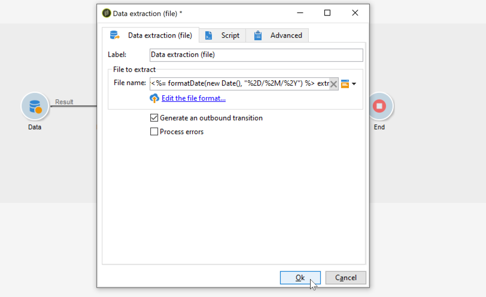
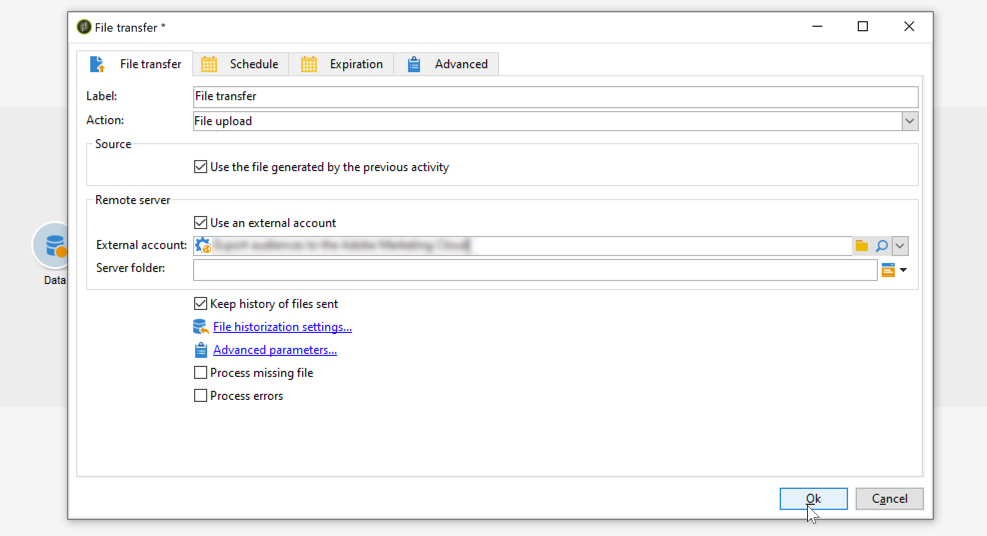

# Zip or encrypt a file {#zipping-or-encrypting-a-file}

Adobe Campaign lets you export zipped or encrypted files. When defining an export through a **[!UICONTROL Data extraction (file)]** activity, you can define a post-processing to zip or to encrypt the file.

To be able to do so:

1. Install a GPG key pair for your instance using the [Control Panel](https://docs.adobe.com/content/help/en/control-panel/using/instances-settings/gpg-keys-management.html#encrypting-data).

    >[!NOTE]
    >
    >Control Panel is accessible to all Admin users. The steps to grant Admin access to a user are detailed in [this page](https://experienceleague.adobe.com/docs/control-panel/using/discover-control-panel/managing-permissions.html?lang=en#discover-control-panel).
    >
    >Note that your instance must be hosted on AWS and upgraded with the latest [Gold Standard](../../rn/using/gs-overview.md) build or the [latest GA build (21.1)](../../rn/using/latest-release.md). Learn how to check your version in [this section](../../platform/using/launching-adobe-campaign.md#getting-your-campaign-version). To check if your instance is hosted on AWS, follow the steps detailed in [this page](https://experienceleague.adobe.com/docs/control-panel/using/faq.html).

1. If your installation of Adobe Campaign is hosted by Adobe, contact [Adobe Customer Care](https://helpx.adobe.com/enterprise/admin-guide.html/enterprise/using/support-for-experience-cloud.ug.html) to have the necessary utilities installed on the server.
1. If your installation of Adobe Campaign is on premise, install the utility you want to use (for example: GPG, GZIP) as well as the necessary keys (encryption key) on the application server.

You can then use commands or code in the **[!UICONTROL Script]** tab of the activity or in a **[!UICONTROL JavaScript code]** activity. An example is presented in the use case below.

**Related topics:**

* [Unzip or decrypt a file before processing](../../platform/using/unzip-decrypt.md)
* [Data extraction (file) activity](../../workflow/using/extraction--file-.md).

## Use case: Encrypt and export data using a key installed on Control Panel {#use-case-gpg-encrypt}

In this use case, we will build a workflow in order to encrypt and export data using a key installed on Control Panel.

 [Discover this feature in video](#video)

The steps to perform this use case are as follows:

1. Generate a GPG key pair (public/private) using a GPG utility, then install the public key onto Control Panel. Detailed steps are available in [Control Panel documentation](https://docs.adobe.com/content/help/en/control-panel/using/instances-settings/gpg-keys-management.html#encrypting-data).

1. In Campaign Classic, build a workflow to export the data and encrypt it using the private key that has been installed via the Control Panel. To do this, we will build a workflow as follows:

    

    * **[!UICONTROL Query]** activity: In this example, we want to execute a query to target the data from the database that we want to export.
    * **[!UICONTROL Data extraction (file)]** activity: Extracts the data into a file.
    * **[!UICONTROL JavaScript code]** activity: Encrypts the data to extract.
    * **[!UICONTROL File transfer]** activity: Sends the data to an external source (in this example, an SFTP server).

1. Configure the **[!UICONTROL Query]** activity to target the desired data from the database. For more on this, refer to [this section](../../workflow/using/query.md).

1. Open the **[!UICONTROL Data extraction (file)]** activity then configure it according to your needs. Global concepts on how to configure the activity are available in [this section](../../workflow/using/extraction--file-.md).

    

1. Open the **[!UICONTROL JavaScript code]** activity, then copy-paste the command below to encrypt the data to extract.

    >[!IMPORTANT]
    >
    >Make sure you replace the **fingerprint** value from the command with the fingerprint of the public key installed on the Control Panel.

    ```
    var cmd='gpg ';
    cmd += ' --trust-model always';
    cmd += ' --batch --yes';
    cmd += ' --recipient fingerprint';
    cmd += ' --encrypt --output ' + vars.filename + '.gpg ' + vars.filename;
    execCommand(cmd,true);
    vars.filename=vars.filename + '.gpg'
    ```
  
      

1. Open the **[!UICONTROL File transfer]** activity, then specify the SFTP server to which you want to send the file. Global concepts on how to configure the activity are available in [this section](../../workflow/using/file-transfer.md).

    

1. You can now run the workflow. Once it is executed, data target by the query will be exported to the SFTP server into an encrypted .gpg file.

## Tutorial video {#video}

This video shows how to use a GPG key to encrypt data is also available in

>[!VIDEO](https://video.tv.adobe.com/v/36399?quality=12)

Additional Campaign Classic how-to videos are available [here](https://experienceleague.adobe.com/docs/campaign-classic-learn/tutorials/overview.html).
