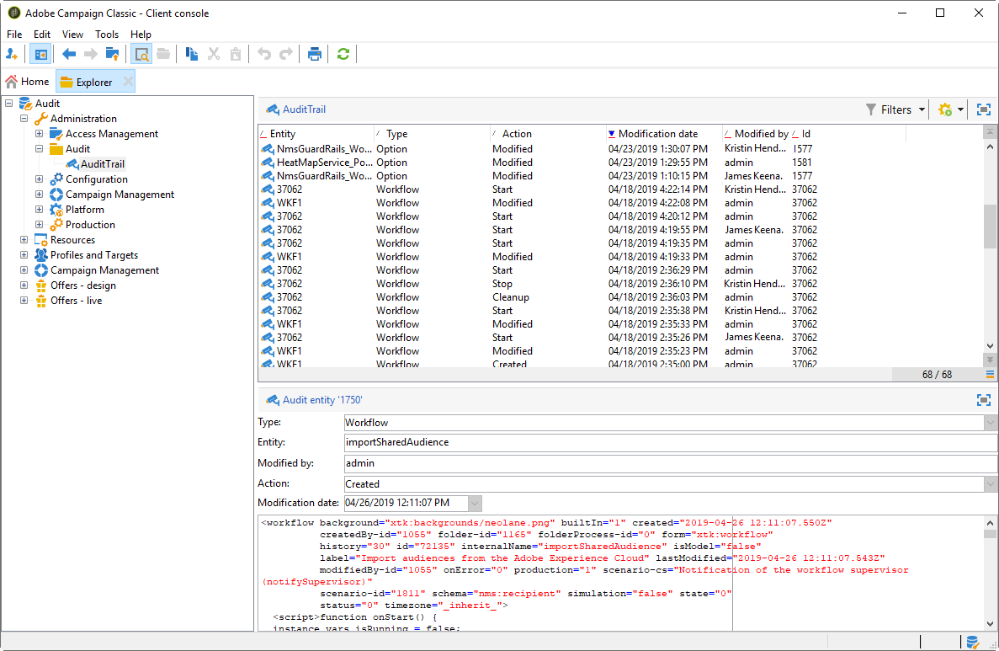
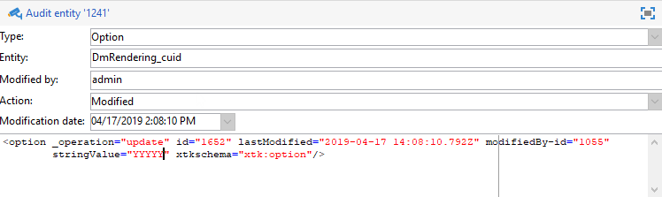
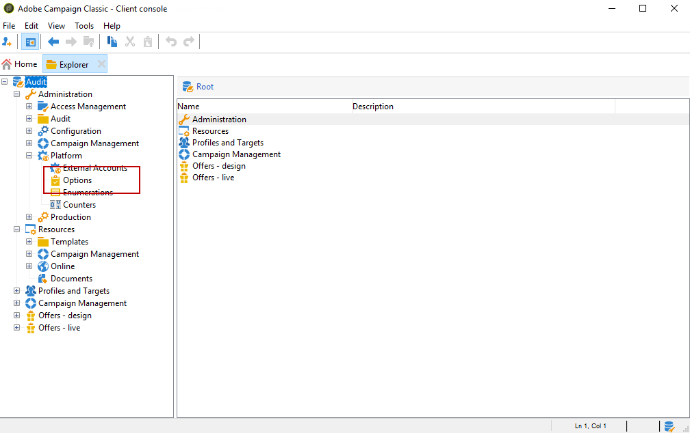
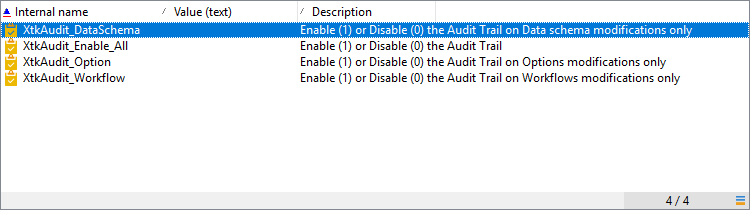
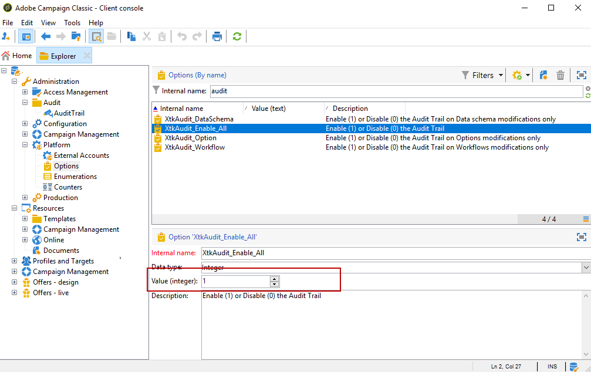

# Audit trail{#audit-trail}

In Adobe Campaign, the **Audit trail** gives you access to the complete history of changes made within your instance.

**Audit trail **captures, in real-time, a comprehensive list of actions and events occurring within your Adobe Campaign instance. It includes a self-serve way to access a history of data to help answer questions such as: what happened to your workflows, and who last updated them or what did your users do in the instance.

>[!NOTE]
>
>Adobe Campaign is not auditing changes made within user rights, templates, personalization or campaigns.  
>Audit trail can only be managed by administrators of the instance.

Audit Trail consists of three components:

* **Schema audit trail**: Check the activities and last modifications done to your schemas.

  For more information on schemas, refer to this [page](../../configuration/using/data-schemas.md).

* **Workflow audit trail**: Check activities and last modifications done to workflows, and additionally, the state of your workflows such as:

    * Start
    * Pause
    * Stop
    * Restart
    * Cleanup which equals to the action Purge history
    * Simulate which equals to the action Start in simulation mode
    * Wakeup which equals to the action Execute pending tasks now
    * Unconditional Stop

  For more information on workflows, refer to this [page](../../workflow/using/about-workflows.md).

* **Option audit trail**: Check the activities and last modifications done to your options.

  For more information on options, refer to this [page](../../installation/using/configuring-campaign-options.md).

## Accessing Audit trail {#accessing-audit-trail}

To access your instance's **Audit trail**:

1. Access the **Explorer** menu of your instance.
1. Under the **Administration** menu, select **Audit**.

   

1. The **Audit trail** window opens with the list of your entities. Adobe Campaign will audit the create, edit and delete actions for workflows, options and schemas.

   Select one of the entities to learn more about the last modifications.

   

1. The **Audit entity** window gives you more detailed information on the chosen entity such as:

    * **Type**: Workflow, Options or Schemas.
    * **Entity**: Internal name of your activities.
    * **Modified by**: Username of the last person who last modified this entity.
    * **Action**: Last action performed on this entity, either Created, Edited or Deleted.
    * **Modification date**: Date of the last action performed on this entity.

   The code block gives you more information on what was changed exactly in your entity.

   

>[!NOTE]
>
>By default, retention period is set to 180 days for **Audit logs**. To learn more on how to change the retention period, refer to this [page](../../production/using/database-cleanup-workflow.md#deployment-wizard).

## Enable/disable Audit trail {#enable-disable-audit-trail}

Audit trail can be easily activated or deactivated for a specific activity if, for example, you want to save some space on the database.

To do so:

1. Access the **Explorer** menu of your instance.
1. Under the **Administration** menu, select **Platform** then **Options**.

   

1. Select one of the following options depending on the entity you want to activate/deactivate:

    * For Workflow: **XtkAudit_Workflows**
    * For Schemas: **XtkAudit_DataSchema**
    * For Options: **XtkAudit_Option**
    * For every entity: **XtkAudit_Enable_All**

   

1. Change the **Value** to 1 if you want to enable the entity or to 0 if you want to disable it.

   

1. Click **Save**.

