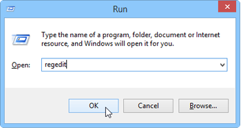
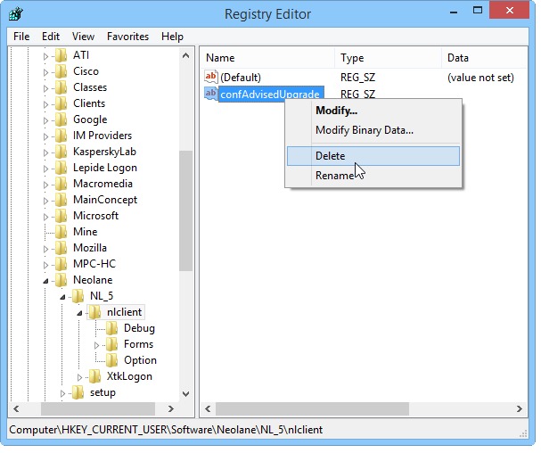

# Console update{#console-update}

If you selected the **[!UICONTROL Do not request console update]** option and you wish to reactivate the update request, apply the following procedure:

1. Open the editor of the registry database using the **regedit** command in the Windows **[!UICONTROL Start > Execute]** menu.

   

1. In the tree, display the options of the **[!UICONTROL HKEY_CURRENT_USERSoftwareneolaneNL_6nlclient]** node.
1. Delete the **[!UICONTROL confAdvisedUpgrade]** entry and close the Registry editor.

   
