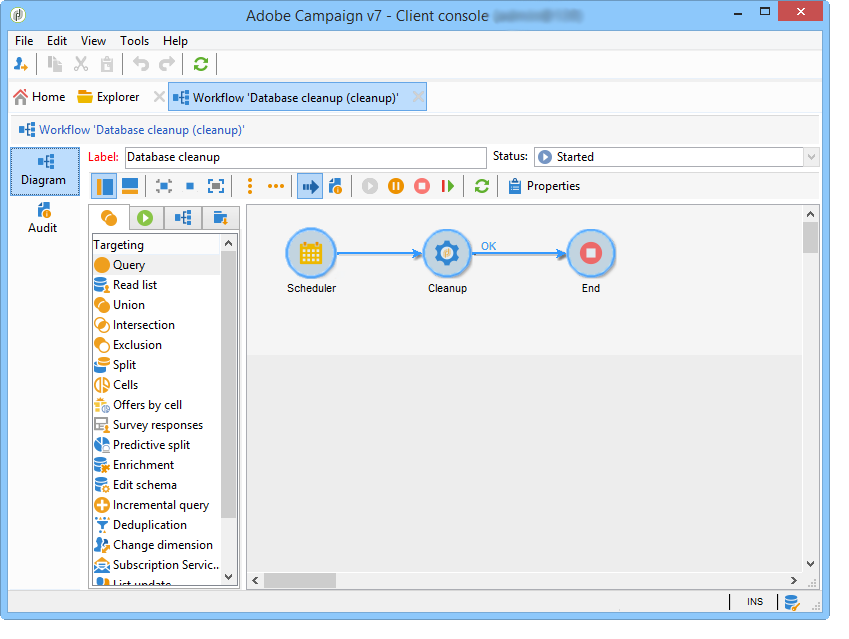
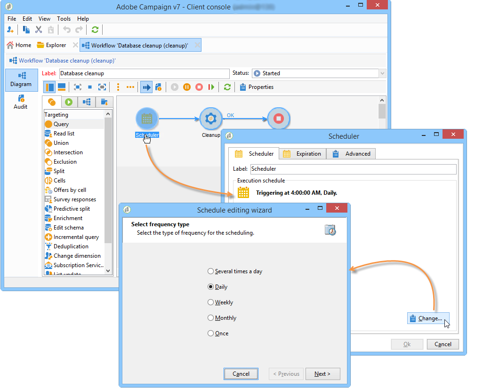
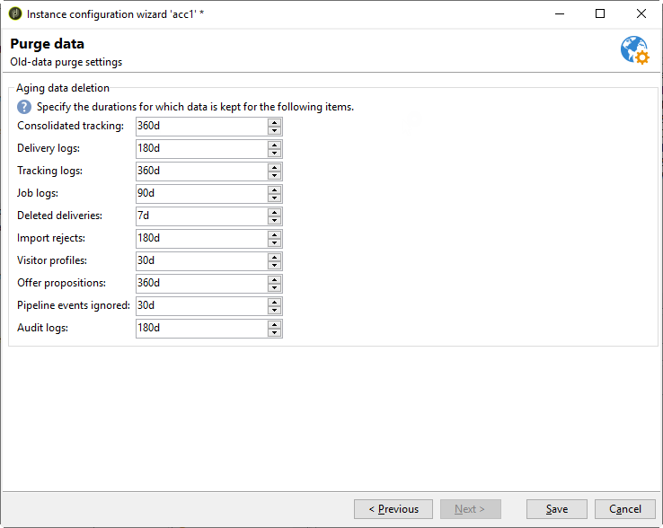

# Database cleanup workflow{#database-cleanup-workflow}

## Introduction {#introduction}

The **[!UICONTROL Database cleanup]** workflow accessible via the **[!UICONTROL Administration > Production > Technical workflows]** node, lets you delete obsolete data to avoid exponential growth of the database. The workflow is triggered automatically without user intervention.



## Configuration {#configuration}

The database cleanup is configured on two levels: in the workflow scheduler and in the deployment wizard.

### Workflow scheduler {#the-scheduler}

>[!NOTE]
>
>For more on the scheduler, refer to [this section](../../workflow/using/scheduler.md).

By default, the **[!UICONTROL Database cleanup]** workflow is configured to start daily at 4AM. The scheduler lets you change the workflow triggering frequency. The following frequencies are available:

* **[!UICONTROL Several times a day]** 
* **[!UICONTROL Daily]** 
* **[!UICONTROL Weekly]** 
* **[!UICONTROL Once]**



>[!IMPORTANT]
>
>In order for the **[!UICONTROL Database cleanup]** workflow to start at the date and time defined in the scheduler, the workflow engine (wfserver) must be started. If this isn't the case, database cleansing won't take place until next time the workflow engine is started.

### Deployment wizard {#deployment-wizard}

The **[!UICONTROL Deployment wizard]**, accessed via the **[!UICONTROL Tools > Advanced]** menu, lets you configure how long data is saved for. Values are expressed in days. If these values aren't altered, the workflow will use the default values. 



The fields of the **[!UICONTROL Purge of data]** window coincide with the following options. These are used by some of the tasks executed by the **[!UICONTROL Database cleanup]** workflow:

* Consolidated tracking: **NmsCleanup_TrackingStatPurgeDelay** (refer to [Cleanup of tracking logs](#cleanup-of-tracking-logs))
* Delivery logs: **NmsCleanup_BroadLogPurgeDelay** (refer to [Cleanup of delivery logs](#cleanup-of-delivery-logs))
* Tracking logs: **NmsCleanup_TrackingLogPurgeDelay** (refer to [Cleanup of tracking logs](#cleanup-of-tracking-logs))
* Deleted deliveries: **NmsCleanup_RecycledDeliveryPurgeDelay** (refer to [Cleanup of deliveries to be deleted or recycled](#cleanup-of-deliveries-to-be-deleted-or-recycled))
* Import rejects: **NmsCleanup_RejectsPurgeDelay** (refer to [Cleanup of rejects generated by imports](#cleanup-of-rejects-generated-by-imports-))
* Visitor profiles: **NmsCleanup_VisitorPurgeDelay** (refer to [Cleanup of visitors](#cleanup-of-visitors))
* Offer propositions: **NmsCleanup_PropositionPurgeDelay** (refer to [Cleanup of propositions](#cleanup-of-propositions))

  >[!NOTE]
  >
  >The **[!UICONTROL Offer propositions]** field is only available when the **Interaction** module is installed.

* Events: **NmsCleanup_EventPurgeDelay** (refer to [Cleansing expired events](#cleansing-expired-events))
* Archived events: **NmsCleanup_EventHistoPurgeDelay** (refer to [Cleansing expired events](#cleansing-expired-events))

  >[!NOTE]
  >
  >The **[!UICONTROL Events]** and **[!UICONTROL Archived events]** fields are only available if the **Message Center** module is installed.

* Audit trail: **XtkCleanup_AuditTrailPurgeDelay** (refer to [Cleanup of Audit trail](#cleanup-of-audit-trail))

All tasks executed by the **[!UICONTROL Database cleanup]** workflow are described in the following section.

## Tasks carried out by the Database cleanup workflow {#tasks-carried-out-by-the-database-cleanup-workflow}

At the date and time defined in the workflow scheduler (refer to [The scheduler](#the-scheduler)), the workflow engine starts the database cleanup process. The Database cleanup connects to the database and executes the tasks in the sequence shown below.

>[!IMPORTANT]
>
>If one of these tasks fails, the following ones will not be executed.   
>SQL queries with a **LIMIT** attribute will be executed repeatedly until all information is processed.

>[!NOTE]
>
>The sections below describing the tasks carried out by the Database cleanup workflow are reserved for database administrators or users familiar with SQL language.

### Lists to delete cleanup {#lists-to-delete-cleanup}

The first task executed by the **[!UICONTROL Database cleanup]** workflow deletes all groups with the **deleteStatus != 0** attribute from the **NmsGroup**. Records linked to these groups and which exist in other tables are also deleted.

1. Lists to be deleted are recovered using the following SQL query:

   ```
   SELECT iGroupId, sLabel, iType FROM NmsGroup WHERE iDeleteStatus <> 0 OR tsExpirationDate <= GetDate() 
   ```

1. Each list has several links to other tables. All of these links are deleted in bulk using the following query:

   ```
   DELETE FROM $(relatedTable) WHERE iGroupId=$(l) IN (SELECT iGroupId FROM $(relatedTable) WHERE iGroupId=$(l) LIMIT 5000) 
   ```

   where **$(relatedTable)** is a table related to **NmsGroup** and **$(l)** is the list identifier.

1. When the list is a 'List' type list, the associated table is deleted using the following query:

   ```
   DROP TABLE grp$(l)
   ```

1. Every **Select** type list recovered by the operation is deleted using the following query:

   ```
   DELETE FROM NmsGroup WHERE iGroupId=$(l) 
   ```

   where **$(l)** is the list identifier

### Cleanup of deliveries to be deleted or recycled {#cleanup-of-deliveries-to-be-deleted-or-recycled}

This task purges all deliveries to be deleted or recycled.

1. The **[!UICONTROL Database cleanup]** workflow selects all deliveries for which the **deleteStatus** field has the value **[!UICONTROL Yes]** or **[!UICONTROL Recycled]** and whose delete date is earlier than the period defined in the **[!UICONTROL Deleted deliveries]** (**NmsCleanup_RecycledDeliveryPurgeDelay**) field of the deployment wizard. For more on this, refer to [Deployment wizard](#deployment-wizard). This period is calculated in relation to the current server date. 
1. For each mid-sourcing server, the task selects the list of deliveries to be deleted. 
1. The **[!UICONTROL Database cleanup]** workflow deletes delivery logs, attachments, mirror page information and all other related data. 
1. Before deleting the delivery for good, the workflow purges linked information from the following tables:

    * In the delivery exclusion table (**NmsDlvExclusion**), the following query is used:

      ```    
      DELETE FROM NmsDlvExclusion WHERE iDeliveryId=$(l)
      ```    
    
      where **$(l)** is the identifier of the delivery. 
    
    * In the coupon table (**NmsCouponValue**), the following query is used (with mass-deletions):

      ```    
      DELETE FROM NmsCouponValue WHERE iMessageId IN (SELECT iMessageId FROM NmsCouponValue WHERE EXISTS (SELECT B.iBroadLogId FROM $(BroadLogTableName) B WHERE B.iDeliveryId = $(l) AND B.iBroadLogId = iMessageId ) LIMIT 5000)
      
      ```    
    
      where **$(l)** is the identifier of the delivery.
    
    * In the delivery log tables (**NmsBroadlogXxx**), mass-deletions are executed in batches of 20,000 records.
    * In the offer proposition tables (**NmsPropositionXxx**), mass-deletions are executed in batches of 20,000 records.
    * In the tracking log tables (**NmsTrackinglogXxx**), mass-deletions are executed in batches of 20,000 records.
    * In the delivery fragment table (**NmsDeliveryPart**), mass-deletions are executed in batches of 500,000 records. This table contains personalization information on the remaining messages to be delivered. 
    * In the mirror page data fragment table (**NmsMirrorPageInfo**), mass-deletions are executed in batches of 20,000 records for expired delivery parts and for finished or cancelled ones. This table contains personalization information on all messages used for generating mirror pages. 
    * In the mirror page search table (**NmsMirrorPageSearch**), mass-deletions are executed in batches of 20,000 records. This table is a search index which provides access to personalization information stored in the **NmsMirrorPageInfo** table. 
    * In the batch process log table (**XtkJobLog**), mass-deletions are executed in batches of 20,000 records. This table contains the log of deliveries to be deleted. 
    * In the delivery URL tracking table (**NmsTrackingUrl**), the following query is used:

      ```    
      DELETE FROM NmsTrackingUrl WHERE iDeliveryId=$(l)
      ```    
    
      where **$(l)** is the identifier of the delivery.

      This table contains the URLs found in the deliveries to be deleted to enable their tracking.

1. The delivery is deleted from the delivery table (**NmsDelivery**):

   ```
   DELETE FROM NmsDelivery WHERE iDeliveryId = $(l)
   ```

   where **$(l)** is the identifier of the delivery.

#### Deliveries using mid-sourcing {#deliveries-using-mid-sourcing}

The **[!UICONTROL Database cleanup]** workflow also deletes deliveries on the mid-sourcing server(s).

1. To do this, the workflow checks that each delivery is inactive (based on its status). If a delivery is active, it will be stopped before it is deleted. The check is carried out by executing the following query:

   ```
   SELECT iState FROM NmsDelivery WHERE iDeliveryId = $(l) AND iState <> 100;
   ```

   where **$(l)** is the identifier of the delivery.

1. If the value of the status is **[!UICONTROL Start pending]** , **[!UICONTROL In progress]** , **[!UICONTROL Recovery pending]** , **[!UICONTROL Recovery in progress]** , **[!UICONTROL Pause requested]** , **[!UICONTROL Pause in progress]** , or **[!UICONTROL Paused]** (values 51, 55, 61, 62, 71, 72, 75), the delivery is stopped and the task purges the linked information.

### Cleanup of expired deliveries {#cleanup-of-expired-deliveries}

This task stops deliveries whose validity period has expired.

1. The **[!UICONTROL Database cleanup]** workflow creates the list of deliveries which have expired. This list includes all expired deliveries with a status other than **[!UICONTROL Finished]** , as well as recently stopped deliveries with over 10,000 non-processed messages. The following query is used:

   ```
   SELECT iDeliveryId, iState FROM NmsDelivery WHERE iDeleteStatus=0 AND iIsModel=0 AND iDeliveryMode=1 AND ( (iState >= 51 AND iState < 85 AND tsValidity IS NOT NULL AND tsValidity < $(currentDate) ) OR (iState = 85 AND DateMinusDays(15) < tsLastModified AND iToDeliver - iProcessed >= 10000 ))
   ```

   where **delivery mode 1** matches the **[!UICONTROL Mass delivery]** mode, **state 51** matches the **[!UICONTROL Start pending]** state, **state 85** matches the **[!UICONTROL Stopped]** state, and the highest number of delivery logs mass-updated on the delivery server equals 10,000.

1. The workflow then includes the list of recently expired deliveries which use mid-sourcing. Deliveries for which no delivery logs have yet been recovered via the mid-sourcing server are excluded.

   The following query is used:

   ```
   SELECT iDeliveryId, tsValidity, iMidRemoteId, mData FROM NmsDelivery WHERE (iDeliveryMode = 4 AND (iState = 85 OR iState = 95) AND tsValidity IS NOT NULL AND (tsValidity < SubDays(GetDate() , 15) OR tsValidity < $(DateOfLastLogPullUp)) AND tsLastModified > SubDays(GetDate() , 15))
   ```

1. The following query is used to detect whether or not the external account is still active, for filtering deliveries by date:

   ```
   SELECT iExtAccountId FROM NmsExtAccount WHERE iActive<>0 AND sName=$(providerName)
   ```

1. In the list of expired deliveries, delivery logs whose status is **[!UICONTROL Pending]** , switch to **[!UICONTROL Delivery cancelled]** , and all deliveries in this list switch to **[!UICONTROL Finished]** .

   The following queries are used:

   ```
   UPDATE $(BroadLogTableName) SET tsLastModified=$(curdate), iStatus=7, iMsgId=$(bl) WHERE iDeliveryId=$(dl) AND iStatus=6
   ```

   where **$(curdate)** is the current date of the database server, **$(bl)** is the identifier of the delivery logs message, **$(dl)** is the delivery identifier, **delivery status 6** matches the **[!UICONTROL Pending]** status and **delivery status 7** matches the **[!UICONTROL Delivery cancelled]** status.

   ```
   UPDATE NmsDelivery SET iState = 95, tsLastModified = $(curdate), tsBroadEnd = tsValidity WHERE iDeliveryId = $(dl)
   ```

   where **delivery state 95** matches the **[!UICONTROL Finished]** status, and **$(dl)** is the identifier of the delivery.

1. All fragments (**deliveryParts**) of obsolete deliveries are deleted and all obsolete fragments of notification deliveries in progress are deleted. Mass-deletion is used for both these tasks.

   The following queries are used:

   ```
   DELETE FROM NmsDeliveryPart WHERE iDeliveryPartId IN (SELECT iDeliveryPartId FROM NmsDeliveryPart WHERE iDeliveryId IN (SELECT iDeliveryId FROM NmsDelivery WHERE iState=95 OR iState=85) LIMIT 5000)
   ```

   ```
   DELETE FROM NmsDeliveryPart WHERE iDeliveryPartId IN (SELECT iDeliveryPartId FROM NmsDeliveryPart WHERE tsValidity < $(curDate) LIMIT 500000)
   ```

   where **delivery state 95** matches the **[!UICONTROL Finished]** status, **delivery state 85** matches the **[!UICONTROL Stopped]** status, and **$(curDate)** is the current server date.

### Cleanup of mirror pages {#cleanup-of-mirror-pages}

This task deletes the web resources (mirror pages) used by deliveries.

1. First of all, the list of deliveries to be purged is recovered using the following query:

   ```
   SELECT iDeliveryId, iNeedMirrorPage FROM NmsDelivery WHERE iWebResPurged = 0 AND tsWebValidity IS NOT NULL AND tsWebValidity < $(curdate)"
   ```

   where **$(curDate)** is the current server date.

1. The **NmsMirrorPageInfo** table is then purged, if necessary using the identifier of the previously recovered delivery. Mass-deletion is used to generate the following queries:

   ```
   DELETE FROM NmsMirrorPageInfo WHERE iMirrorPageInfoId IN (SELECT iMirrorPageInfoId FROM NmsMirrorPageInfo WHERE iDeliveryId = $(dl)) LIMIT 5000)
   ```

   ```
   DELETE FROM NmsMirrorPageSearch WHERE iMessageId IN (SELECT iMessageId FROM NmsMirrorPageSearch WHERE iDeliveryId = $(dl)) LIMIT 5000)
   ```

   where **$(dl)** is the identifier of the delivery.

1. An entry is then added to the delivery log.
1. Purged deliveries are then identified, to avoid having to reprocess them later. The following query is executed:

   ```
   UPDATE NmsDelivery SET iWebResPurged = 1 WHERE iDeliveryId IN ($(strIn))
   ```

   where **$(strIn)** is the list of delivery identifiers.

### Cleanup of work tables {#cleanup-of-work-tables}

This task deletes from the database, all work tables which match deliveries whose status is **[!UICONTROL Being edited]** , **[!UICONTROL Stopped]** or **[!UICONTROL Deleted]** .

1. The list of tables with names beginning with **wkDlv_** is recovered first with the following query (postgresql):

   ```
   SELECT relname FROM pg_class WHERE relname LIKE Lower('wkDlv_') ESCAPE E'\\' AND relkind IN ('r','v') AND pg_get_userbyid(relowner)<>'postgres'
   ```

1. The tables used by workflows in progress are then excluded. To do this, the list of deliveries in progress is recovered using the following query:

   ```
   SELECT iDeliveryId FROM NmsDelivery WHERE iDeliveryId<>0 AND iDeleteStatus=0 AND iState NOT IN (0,85,100);
   ```

   where 0 is the value which matches the **[!UICONTROL Being edited]** delivery status, 85 matches the **[!UICONTROL Stopped]** status and 100 matches the **[!UICONTROL Deleted]** status. 

1. Tables that are no longer used will be deleted using the following query:

   ```
   DROP TABLE wkDlv_15487_1;
   ```

### Cleanup of rejects generated by imports {#cleanup-of-rejects-generated-by-imports-}

This step lets you delete records for which all data wasn't processed during import.

1. Mass-deletion is carried out on the **XtkReject** table with the following query:

   ```
   DELETE FROM XtkReject WHERE iRejectId IN (SELECT iRejectId FROM XtkReject WHERE tsLog < $(curDate)) LIMIT $(l))
   ```

   where **$(curDate)** is the current server date from which we subtract the period defined for the **NmsCleanup_RejectsPurgeDelay** option (refer to [Deployment wizard](#deployment-wizard)) and **$(l)** is the maximum number of records to be mass deleted.

1. All orphan rejects are then deleted using the following query:

   ```
   DELETE FROM XtkReject WHERE iJobId NOT IN (SELECT iJobId FROM XtkJob)
   ```

### Cleanup of workflow instances {#cleanup-of-workflow-instances}

This task purges each workflow instance using its identifer (**lWorkflowId**) and history (**lHistory**). It deletes inactive tables by running the worktable cleanup task again. The cleanup also deletes all orphaned worktables (wkf% and wkfhisto%) of deleted workflows.

>[!NOTE]
>
>The purge frequency of the history is specified for each workflow in the **History in days** field (default value 30 days). This field can be found in the **Execution** tab of the workflow properties. For more on this, refer to [this section](../../workflow/using/workflow-properties.md#execution).

1. To recover the list of workflows to be deleted, the following query is used:

   ```
   SELECT iWorkflowId, iHistory FROM XtkWorkflow WHERE iWorkflowId<>0
   ```

1. This query generates the list of workflows which will be used to delete all linked logs, finished tasks and finished events, using the following queries:

   ```
   DELETE FROM XtkWorkflowLog WHERE iWorkflowId=$(lworkflow) AND tsLog < DateMinusDays($(lhistory))
   ```

   ```
   DELETE FROM XtkWorkflowTask WHERE iWorkflowId=$(lworkflow) AND iStatus<>0 AND tsCompletion < DateMinusDays($(lhistory)) 
   ```

   ```
   DELETE FROM XtkWorkflowEvent WHERE iWorkflowId=$(l) AND iStatus>2 AND tsProcessing < DateMinusDays($(lHistory))
   ```

   where **$(lworkflow)** is the identifier of the workflow and **$(lhistory)** is the identifier of the history.

1. All unused tables are deleted. For this purpose, all tables are collected thanks to a **wkf%** type mask using the following query (postgresql):

   ```
   SELECT relname FROM pg_class WHERE relname LIKE Lower('wkf%') ESCAPE E'\\' AND relkind IN ('r','v') AND pg_get_userbyid(relowner)<>'postgres'
   ```

1. Then all tables used by a pending workflow instance are excluded. The list of active workflows is recovered using the following query:

   ```
   SELECT iWorkflowId FROM XtkWorkflow WHERE iWorkflowId<>0 AND iState<>20
   ```

1. Each workflow identifier is then recovered to find the name of the tables used by workflows in progress. These names are excluded from the list of previously recovered tables.
1. "incremental query" type activity history tables are excluded using the following queries:

   ```
   SELECT relname FROM pg_class WHERE relname LIKE Lower('wkfhisto%') ESCAPE E'\\' AND relkind IN ('r','v') AND pg_get_userbyid(relowner)<>'postgres'
   ```

   ```
   SELECT iWorkflowId FROM XtkWorkflow WHERE iWorkflowId IN ($(strCondition))
   ```

   where **$(strcondition)** is the list of tables which match the **wkfhisto%** mask.

1. The remaining tables are deleted using the following query:

   ```
   DROP TABLE wkf15487_12;
   ```

### Cleanup of workflow logins {#cleanup-of-workflow-logins}

This task deletes workflow logins using the following query:

```
DELETE FROM XtkWorkflowLogin WHERE iWorkflowId NOT IN (SELECT iWorkflowId FROM XtkWorkflow)
```

### Cleanup of orphan work tables {#cleanup-of-orphan-work-tables}

This task deletes orphan work tables linked to groups. The **NmsGroup** table stores the groups to be cleansed (with a type different from 0). The prefix of the table names is **grp**. To identify the groups to be cleansed, the following query is used:

```
SELECT iGroupId FROM NmsGroup WHERE iType>0"
```

### Cleanup of visitors {#cleanup-of-visitors}

This task deletes obsolete records from the visitor table using mass-deletion. Obsolete records are those for which the last modification is earlier than the conservation period defined in the deployment wizard (refer to [Deployment wizard](#deployment-wizard)). The following query is used:

```
DELETE FROM NmsVisitor WHERE iVisitorId IN (SELECT iVisitorId FROM NmsVisitor WHERE iRecipientId = 0 AND tsLastModified < AddDays(GetDate(), -30) AND iOrigin = 0 LIMIT 20000)
```

where **$(tsDate)** is the current server date, from which we subtract the period defined for the **NmsCleanup_VisitorPurgeDelay** option.

### Cleanup of NPAI {#cleanup-of-npai}

This task lets you delete records which match valid addresses from the **NmsAddress** table. The following query is used to perform mass-deletion:

```
DELETE FROM NmsAddress WHERE iAddressId IN (SELECT iAddressId FROM NmsAddress WHERE iStatus=2 AND tsLastModified < $(tsDate1) AND tsLastModified >= $(tsDate2) LIMIT 5000)
```

where **status 2** matches the **[!UICONTROL Valid]** status, **$(tsDate1)** is the current server date, and **$(tsDate2)** matches the **NmsCleanup_LastCleanup** option.

### Cleanup of subscriptions {#cleanup-of-subscriptions-}

This task purges all subscriptions deleted by the user from the **NmsSubscription** table, using mass-deletion. The following query is used:

```
DELETE FROM NmsSubscription WHERE iDeleteStatus <>0
```

### Cleanup of tracking logs {#cleanup-of-tracking-logs}

This task deletes obsolete records from the tracking and webtracking log tables. Obsolete records are those which are earlier than the conservation period defined in the deployment wizard (refer to [Deployment wizard](#deployment-wizard)).

1. First, the list of tracking log tables is recovered using the following query:

   ```
   SELECT distinct(sTrackingLogSchema) FROM NmsDeliveryMapping WHERE sTrackingLogSchema IS NOT NULL;
   ```

1. Mass-deletion is used to purge all tables in the list of previously recovered tables. The following query is used:

   ```
   DELETE FROM XtkTrackingLogRcp WHERE iTrackingLogId IN (SELECT iTrackingLogId FROM XtkTrackingLogRcp WHERE tsLog < $(tsDate) LIMIT 5000) 
   ```

   where **$(tsDate)** is the current server date from which we subtract the period defined for the **NmsCleanup_TrackingLogPurgeDelay** option.

1. The tracking statistics table is purged using mass-deletion. The following query is used:

   ```
   DELETE FROM NmsTrackingStats WHERE iTrackingStatsId IN (SELECT iTrackingStatsId FROM NmsTrackingStats WHERE tsStart < $(tsDate) LIMIT 5000) 
   ```

   where **$(tsDate)** is the current server date from which we subtract the period defined for the **NmsCleanup_TrackingStatPurgeDelay** option.

### Cleanup of delivery logs {#cleanup-of-delivery-logs}

This task lets you purge the delivery logs stored in various tables.

1. For this purpose, the list of delivery log schemas is recovered using the following query:

   ```
   SELECT distinct(sBroadLogSchema) FROM NmsDeliveryMapping WHERE sBroadLogSchema IS NOT NULL UNION SELECT distinct(sBroadLogExclSchema) FROM NmsDeliveryMapping WHERE sBroadLogExclSchema IS NOT NULL
   ```

1. When using mid-sourcing, the **NmsBroadLogMid** table isn't referenced in delivery mappings. The **nms:broadLogMid** schema is added to the list recovered by the previous query.
1. The **Database cleanup** workflow then purges obsolete data from previously recovered tables. The following query is used:

   ```
   DELETE FROM $(tableName) WHERE iBroadLogId IN (SELECT iBroadLogId FROM $(tableName) WHERE tsLastModified < $(option) LIMIT 5000) 
   ```

   where **$(tableName)** is the name of each table in the list of schemas, and **$(option)** is the date defined for the **NmsCleanup_BroadLogPurgeDelay** option (refer to [Deployment wizard](#deployment-wizard)).

1. Finally, the workflow checks whether the **NmsProviderMsgId** table exists. If so, all obsolete data is deleted using the following query:

   ```
   DELETE FROM NmsProviderMsgId WHERE iBroadLogId IN (SELECT iBroadLogId FROM NmsProviderMsgId WHERE tsCreated < $(option) LIMIT 5000)
   ```

   where **$(option)** matches the date defined for the **NmsCleanup_BroadLogPurgeDelay** option (refer to [Deployment wizard](#deployment-wizard)).

### Cleanup of the NmsEmailErrorStat table {#cleanup-of-the-nmsemailerrorstat-table-}

This task cleanses the **NmsEmailErrorStat** table. The main program (**coalesceErrors**) defines two dates:

* **Start date**: date of the next process which matches the **NmsLastErrorStatCoalesce** option or the most recent date in the table.
* **End date**: current server date.

If the start date is greater than or equal to the end date, no process will take place. In this case, the **coalesceUpToDate** message appears.

If the start date is earlier than the end date, the **NmsEmailErrorStat** table is cleansed.

The total number of errors in the **NmsEmailErrorStat** table, between the start and end dates, is recovered using the following query:

```
"SELECT COUNT(*) FROM NmsEmailErrorStat WHERE tsDate>= $(start) AND tsDate< $(end)"
```

where **$end** and **$start** are the start and end dates defined previously.

If the total is greater than 0:

1. The following query is executed in order to keep only errors beyond a certain threshold (which equals 20):

   ```
   "SELECT iMXIP, iPublicId, SUM(iTotalConnections), SUM(iTotalErrors), SUM(iMessageErrors), SUM(iAbortedConnections), SUM(iFailedConnections), SUM(iRefusedConnections), SUM(iTimeoutConnections) FROM NmsEmailErrorStat WHERE tsDate>=$(start ) AND tsDate<$(end ) GROUP BY iMXIP, iPublicId HAVING SUM(iTotalErrors) >= 20"
   ```

1. The **coalescingErrors** message is displayed.
1. A new connection is created to delete all errors which occurred between the start and end dates. The following query is used:

   ```
   "DELETE FROM NmsEmailErrorStat WHERE tsDate>=$(start) AND tsDate<$(end)"
   ```

1. Each error is saved in the **NmsEmailErrorStat** table using the following query:

   ```
   "INSERT INTO NmsEmailErrorStat(iMXIP, iPublicId, tsDate, iTotalConnections, iTotalErrors, iTimeoutConnections, iRefusedConnections, iAbortedConnections, iFailedConnections, iMessageErrors) VALUES($(lmxip ), $(lpublicId ), $(tsstart ), $(lconnections ), $(lconnectionErrors ),$(ltimeoutConnections ), $(lrefusedConnections ), $(labortedConnections ), $(lfailedConnections ), $(lmessageErrors))"
   ```

   where each variable matches a value recovered by the previous query. 

1. The **start** variable is updated with the values of the previous process to finish the loop.

The loop and the task stop.

Cleanups are executed on the **NmsEmailError** and **cleanupNmsMxDomain** tables.

### Cleanup of the NmsEmailError table {#cleanup-of-the-nmsemailerror-table-}

The following query is used:

```
DELETE FROM NmsEmailError WHERE iMXIP NOT IN (SELECT DISTINCT iMXIP FROM NmsEmailErrorStat)
```

This query deletes all lines without linked records in the **NmsEmailErrorStat** from the **NmsEmailError** table.

### Cleanup of the NmsMxDomain table {#cleanup-of-the-nmsmxdomain-table-}

The following query is used:

```
DELETE FROM NmsMxDomain WHERE iMXIP NOT IN (SELECT DISTINCT iMXIP FROM NmsEmailErrorStat)
```

This query deletes all lines without a linked record in the **NmsEmailErrorStat** table from the **NmsMxDomain** table.

### Cleanup of propositions {#cleanup-of-propositions}

If the **Interaction** module is installed, this task is executed to purge the **NmsPropositionXxx** tables.

The list of propositions tables is recovered and mass-deletion is carried out on each one, using the following query:

```
DELETE FROM NmsPropositionXxx WHERE iPropositionId IN (SELECT iPropositionId FROM NmsPropositionXxx WHERE tsLastModified < $(option) LIMIT 5000) 
```

where **$(option)** is the date defined for the **NmsCleanup_PropositionPurgeDelay** option (refer to [Deployment wizard](#deployment-wizard)).

### Cleanup of simulation tables {#cleanup-of-simulation-tables}

This task cleanses orphan simulation tables (that are no longer linked to an offer simulation or a delivery simulation).

1. To recover the list of simulations that require cleanup, the following query is used:

   ```
   SELECT iSimulationId FROM NmsSimulation WHERE iSimulationId<>0
   ```

1. The name of the tables to delete is made up of the **wkSimu_** prefix followed by the identifier of the simulation (for instance: **wkSimu_456831_aggr**):

   ```
   DROP TABLE wkSimu_456831_aggr
   ```

### Cleanup of Audit trail {#cleanup-of-audit-trail}

The following query is used:

```
DELETE FROM XtkAudit WHERE tsChanged < $(tsDate)
```

where **$(tsDate)** is the current server date from which the period defined for the **XtkCleanup_AuditTrailPurgeDelay** option is substracted.

### Cleanup of Nmsaddress {#cleanup-of-nmsaddress}

The following query is used:

```
DELETE FROM NmsAddress WHERE iAddressId IN (SELECT iAddressId FROM NmsAddress WHERE iStatus=STATUS_QUARANTINE AND tsLastModified < $(NmsCleanup_AppSubscriptionRcpPurgeDelay + 5d) AND iType IN (MESSAGETYPE_IOS, MESSAGETYPE_ANDROID ) LIMIT 5000)
```

This query deletes all entries related to iOS and Android.

### Statistics update and storage optimization {#statistics-update}

The **XtkCleanup_NoStats** option allows you to control the behavior of the storage optimization step of the cleanup workflow.

If the **XtkCleanup_NoStats** option does not exist or if its value is 0, this will execute the storage optimization in verbose mode (VACUUM VERBOSE ANALYZE) on PostgreSQL and update statistics on all other databases. To make sure that this command is executed, check the PostgreSQL logs. VACUUM will output lines in the format: `INFO: vacuuming "public.nmsactivecontact"` and ANALYZE will output lines in the format: `INFO: analyzing "public.nmsactivecontact"`.

If the value of the option is 1, statistics updating isn't executed on any database. The following log line will appear in the workflow logs: `Option 'XtkCleanup_NoStats' is set to '1'`.

If the value of the option is 2, this will execute the storage analysis in verbose mode (ANALYZE VERBOSE) on PostgreSQL and update statistics on all other databases. To make sure that this command is executed, check the PostgreSQL logs. ANALYZE will output lines in the format: `INFO: analyzing "public.nmsactivecontact"`.

### Subscription cleanup (NMAC) {#subscription-cleanup--nmac-}

This task deletes any subscriptions related to deleted services or mobile applications.

To recover the list of broadlog schemas, the following query is used:

   ```
   SELECT distinct(sBroadLogSchema) FROM NmsDeliveryMapping WHERE sBroadLogSchema IS NOT NULL
   ```

The task then recovers the names of the tables linked to the **appSubscription** link and deletes these tables.

This cleanup workflow also deletes all entries where idisabled = 1 that have not been updated since the time set in the **NmsCleanup_AppSubscriptionRcpPurgeDelay** option.

### Cleansing session information {#cleansing-session-information}

This task cleanses information from the **sessionInfo** table, the following query is used:

```
 DELETE FROM XtkSessionInfo WHERE tsexpiration < $(curdate) 
```

### Cleansing expired events {#cleansing-expired-events}

This task cleanses the events received and stored on the execution instances and the events archived on a control instance.

### Cleansing reactions {#cleansing-reactions}

This task cleanses the reactions (table **NmsRemaMatchRcp**) in which the hypotheses have themselves been deleted.
