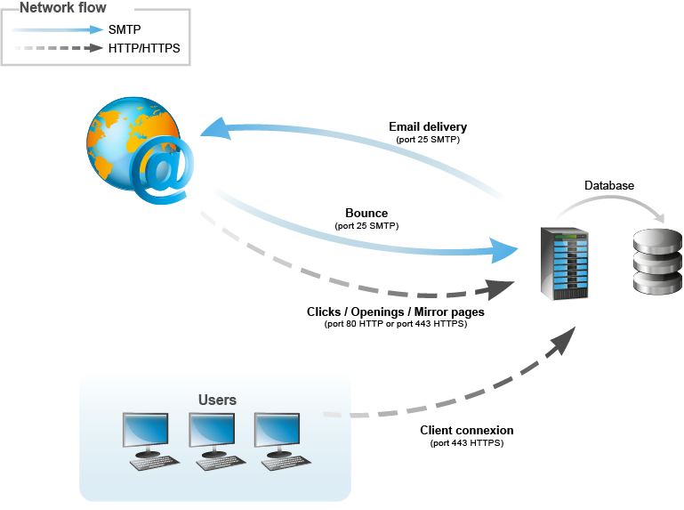
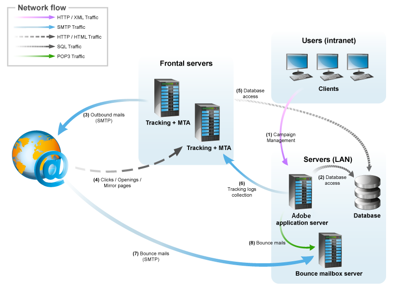

# General architecture{#general-architecture}

## Minimum architecture {#minimum-architecture}

In a minimum configuration, Adobe Campaign operates with:

* the Adobe Campaign application server,
* the database.

  

This diagram shows that the only traffic involved in the context of a minimum architecture is:

1. HTTP protocol traffic to the Adobe Campaign server via the Internet,
1. SMTP protocol traffic from and to the Adobe Campaign server via the Internet.

## Distributed architecture {#distributed-architecture}

Adobe Campaign is made up of multiple modules which can be broken down over several machines. This operating mode has several advantages:

* load balancing,
* setting up of module redundancy,
* building of an architecture broken down over several service providers (segmentation of the services provided).

The distribution of modules over several machines provides great flexibility of use and improved adaptability.

>[!NOTE]
>
>For more on the various architectures, refer to [this section](../../installation/using/general-architecture.md).

## List of open ports {#list-of-open-ports}

|  Port number  | Concerned Adobe Campaign module or application  | Configurable  |
|---|---|---|
|  443/tcp or 80/tcp  | Web Servers (Apache/IIS)  | YES  |
|  6666/udp (local)  | Adobe Campaign: Syslogd  | YES  |
|  8005/tcp (local)  | Adobe Campaign: web module  | YES  |
|  8080/tcp  | Adobe Campaign: web module (tomcat)  | YES  |
|  7777  | Statistics server (stat server)  | YES  |

