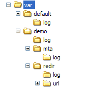

# Log files{#log-files}

The log files are organized as follows:

Each **nlserver** module generates a log file saved in the following directory: **`<installation directory>`/var/`<instance>`/log/`<module>`.log**.

The **nlserver syslogd** module saves the logs to the disk. This module is similar to the Unix **syslog daemon**, but has been adapted for compatibility between Unix and Windows. The other Adobe Campaign modules do not save their logs to the disk; they delegate this task to the **syslogd** module by sending it UDP packets.

By default, the Adobe Campaign platform has the **syslogd** module installed on it, but it is possible to use another **syslog daemon**. This module creates the log files in the **log** directory.

The logs of multi-instance modules are stored in the following directory: **`<installation directory>`/var/default/log/**. The same log file is shared by all instances (e.g. **web.log**).

The logs of the other modules are stored in a subfolder named after the instance. Each instance has its own log files.

Multi-instance log files are listed in the following table:

|  File  | Description  |
|---|---|
|  web.log  | Web module logs (client console, reports, SOAP API, etc.)  |
|  webmdl.log  | Logs from the redirection module  |
|  watchdog.log  | Logs from the Adobe Campaign process monitoring module  |
|  trackinglogd.log  | Tracking logs  |

The mono-instance log files are listed in the following table:

|  File  | Description  |
|---|---|
|  mta.log  | mta module logs  |
|  mtachild.log  | Message delivery processing logs  |
|  wfserver.log  | Logs of the workflow server module  |
|  runwf.log  | Workflow execution logs  |
|  inMail.log  | Bounce mail module log  |
|  logins.log  | Logs all login attempts to Adobe Campaign (sucess or not)  |

>[!IMPORTANT]
>
>The **redir** directory only exists on redirection servers. The **url** subdirectory contains the matches of the URLs to be redirected, and the subdirectory **log** contains the tracking logs. To generate tracking logs, the **trackinglogd** module must be running.

For performance and storage optimization, the logins.log file is split into multiple files, one each day (logins.yy-mm-dd.log) with a maximum of 365 files retained. The number of days can be changed in the serverConf.xml, under syslogd (**maxNumberOfLoginsFiles** option). See the documentation on the [server configuration file](../../installation/using/the-server-configuration-file.md#syslogd).

By default, the logs are limited to two 10 MB files per module and per instance. The second file is called: **`<modulename>`_2.log**. The size of the logs is therefore limited to 2&#42;10MB per module and per instance.

You can, however, keep larger files. To enable this, change the value of the **maxFileSizeMb="10"** setting in the **syslogd** node of the **conf/serverConf.xml** file. This value represents the maximum size in MB of a log file.

If you wish to maintain further levels of detail in the logs, you can start the Adobe Campaign modules with the **-verbose** parameter:

**nlserver start `<MODULE>`@`<INSTANCE>` -verbose**
