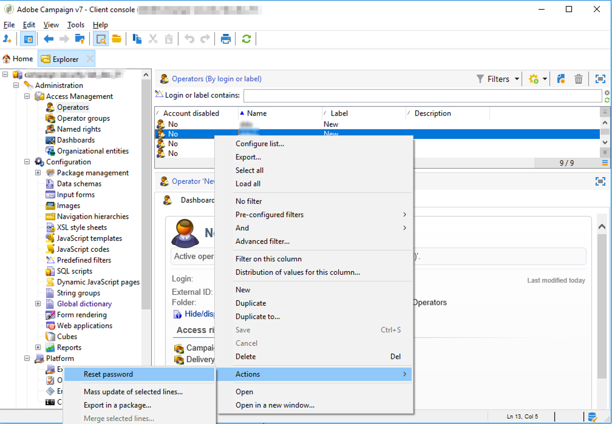

# Lost password{#lost-password}


You can change or recover a lost password.
There are two possible scenarios:

* [Password lost by an Adobe Campaign operator](#password-lost-by-campaign-operator)
* [Internal password lost](#internal-password-lost) (on-premise customers only)

## Password lost by a Campaign operator {#password-lost-by-campaign-operator}

If an Adobe Campaign operator loses their password, you can change it.
To do this, follow the steps below:

1. Connect via an operator with administrator rights.
1. Right-click an operator.
1. Select **[!UICONTROL Actions]** > **[!UICONTROL Reset password]**.

   

1. Set the operator's new password. We recommend that the operator changes their password when they first reconnect.

## Internal password lost {#internal-password-lost}

>[!NOTE]
>
>This section only applies to on-premise customers only.

If the internal password is lost, you must reinitialize it.
To do this, apply the following procedure:

1. Edit the **/usr/local/neolane/nl6/conf/serverConf.xml** file.

1. Go to the **internalPassword** line.

    ```    
    <!-- XTK authentication mode internalPassword : Password of internal account -->
    <xtk internalPassword="myPassword"/>
    ```

1. Delete the string in quotes, in this case: **myPassword**

   You thus obtain the following line:

    ```    
    !-- XTK authentication mode internalPassword : Password of internal account -->
    <xtk internalPassword=""/
    ```

1. Save changes and close the file.

1. Configure the new password. To do this, enter the following commands:

    ```    
    nlserver config -internalpassword
    HH:MM:SS > Application server for Adobe Campaign Classic (7.X YY.R build XXX@SHA1) of DD/MM/YYYY
    Enter current password.
    Password: (empty)
    Enter the new password.
    Password: 
    Confirmation 
    ```

1. You can now use your new password to connect in **Internal** mode.
