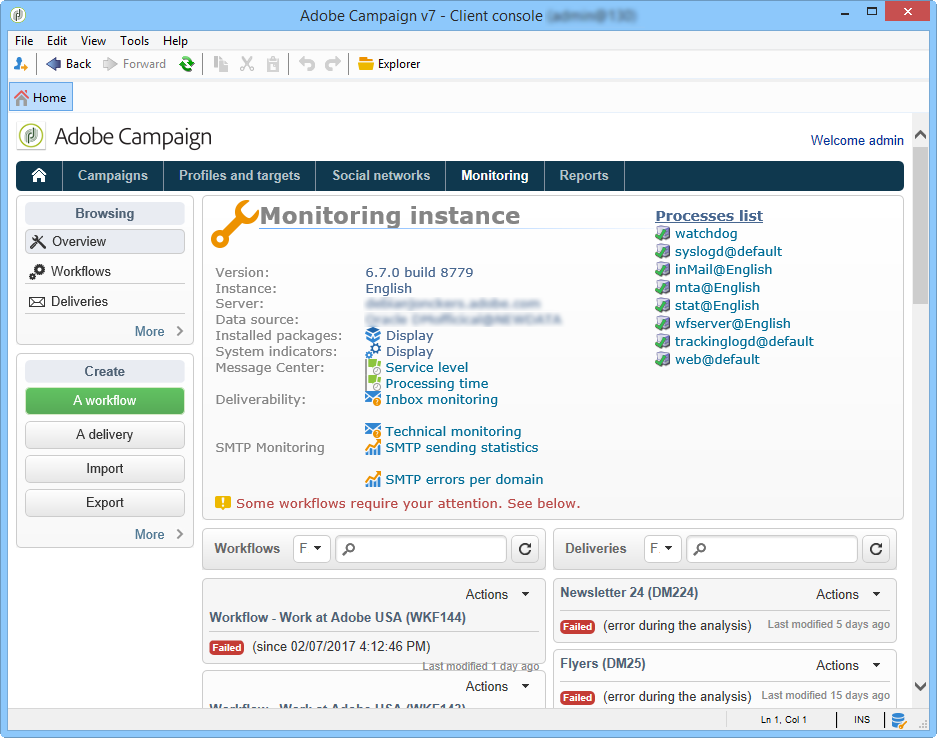

# Monitoring guidelines {#monitoring-guidelines}

## Instance monitoring dashboard {#instance-monitoring-dashboard}

The **[!UICONTROL Monitoring]** tab, which is accessible from Campaign Classic homepage, is the main entry point to help you monitor your instance.

It provides a dashboard of what is occuring on your instance: its status (build version, installed packages, etc.), system indicators, logs,  workflows that are currently running, state of last sent deliveries, etc.

Detailed information is available [here](../../production/using/monitoring-processes.md).

## Monitoring Campaign Classic processes {#monitoring-campaign-classic-processes}

<table>
<tr><td>
<a href="#monitoring-instance">Monitor your instance</a>
</td>
<td>
<a href="#moniroting-workflows">Monitor workflows</a>
</td>
<td>
<a href="#monitoring-deliveries">Monitor deliveries</a>
</td>
<td>
<a href="#monitoring-database">Monitor the database</a>
</td></tr>
</table>

Additional ways of monitoring the different Campaign processes are available. They provide several ways of monitoring your instances to make sure that your system is healthy and eventually troubleshoot issues that may occur when setting up workflows, sending deliveries, etc.

### Monitoring your instance {#monitoring-instance}

**Automatic monitoring tools**

Several automatic methods are available. to help you monitor your instance. You can, for example, set up email reports with detected anomalies, retrieve a list of indicators in XML format, etc. [Click here](../../production/using/monitoring-processes.md#automatic-monitoring) for more information.

**Audit trail**

The Audit trail allows you to visualize the complete history of changes related to options, workflows and schemas within your instance. [Click here](../../production/using/audit-trail.md) for more information.

**Control Panel**

The Control Panel allows you to manage several settings of your instance: manage URL permissions, check your instance details like your servers' build versions, etc. It also allows you to monitor the available space on the SFTP servers that are connected to your instance. [Click here](https://experienceleague.adobe.com/docs/control-panel/using/control-panel-home.html) for more information.

>[!NOTE]
>
>Control Panel is accessible to all Admin users. The steps to grant Admin access to a user are detailed in [this page](https://experienceleague.adobe.com/docs/control-panel/using/discover-control-panel/managing-permissions.html?lang=en#discover-control-panel).
>
>Note that your instance must be hosted on AWS and upgraded with the latest [Gold Standard](../../rn/using/gs-overview.md) build or the [latest GA build (21.1)](../../rn/using/latest-release.md). Learn how to check your version in [this section](../../platform/using/launching-adobe-campaign.md#getting-your-campaign-version). To check if your instance is hosted on AWS, follow the steps detailed in [this page](https://experienceleague.adobe.com/docs/control-panel/using/faq.html).

### Monitoring workflows {#monitoring-workflows}

**Workflow HeatMap**

The Workflow HeatMap provided a visual representation of all the workflows that are running on your instance. It allows you to easily monitor the load on the instance and plan workflows accordingly. [Click here](../../workflow/using/heatmap.md) for more information.

**Audit trail**

The Audit trail allows you to visualize all the modifications that have been made in workflows, as well as their current states. [Click here](../../production/using/audit-trail.md).

**Workflows troubleshooting**

Specific actions can be performed when encountering issues with a workflow execution. [Click here](../../production/using/workflow-execution.md) for more information

**Workflow status monitoring**

Additionally to the heatmap, you can create a workflow that will let you monitor the status of a set of workflows and send recurring messages to supervisors. [Click here](../../workflow/using/supervising-workflows.md) for more information.

**General guidelines**

Following guidelines and best practices when using workflows can help improve performances. For more information, refer to these sections:
* [Best practices when using workflows](../../workflow/using/workflow-best-practices.md)
* [Monitoring workflow execution](../../workflow/using/monitoring-workflow-execution.md)

### Monitoring deliveries {#monitoring-deliveries}

**SMTP reports**

SMTP reports display delivery statistics and SMTP errors by domain. [Learn more](../../production/using/monitoring-processes.md)

**Best practices**

[Best practices for delivery sending and designing](../../delivery/using/delivery-best-practices.md) can help you improve their performances.

**Delivery troubleshooting**
Specific actions can be performed when encountering issues with deliveries:
* [Deliverability issues](../../production/using/performance-and-throughput-issues.md#deliverability_issues)
* [Image display issues](../../production/using/image-display-issues.md)
* [Delivery performance issues](../../delivery/using/delivery-performances.md)
* [Temporary files issues](../../production/using/temporary-files.md) - *on premise hosting models only*

### Monitoring the database {#monitoring-database}

**Database cleanup workflow**

The Database cleanup workflow allows you to delete obsolete data from your database. It is recommended to avoid exponential growth of the database. [Click here](../../production/using/database-cleanup-workflow.md) for more information.

**Database performance troubleshooting**

Specific actions can be performed when encountering issues with database performances. [Click here](../../production/using/database-performances.md) for more information.

**Database maintenance**

*on-premise and hybrid hosting models only*

We recommend that you perform database maintenance on a regular basis to avoid overconsumption of disk space, thus affecting database access. [Click here](../../production/using/recommendations.md) for more information.

**Backup & restoration**

*on-premise and hybrid hosting models only*

Backing up is essential in order to avoid losing data in the event of a problem (whether physical or system-related) on a machine. [Click here](../../production/using/backup.md) for more information. Restoration procedure is described in [this section](../../production/using/restoration.md).

## Campaign Classic technical principles {#campaign-classic-technical-principles}

Technical resources are available in Campaign Classic documentation. We recommend you get familiar with these topics before performing any technical operation on your instance.

**Hosting models and capabilities**

* [Campaign Classic hosting models](../../installation/using/hosting-models.md)
* [Hosting model capabilities](../../installation/using/capability-matrix.md)

**Server configuration**

*On-premise & hybrid hosting models only*

* [Server configurations](../../installation/using/configuring-campaign-server.md)
* [Serverconf.xml file configuration](../../installation/using/the-server-configuration-file.md)
* [Server configuration for deliverability](../../installation/using/email-deliverability.md)
* [Command lines to create an instance and declare a database](../../installation/using/command-lines.md)

**General principles**

* [Campaign Classic architecture](../../production/using/general-architecture.md)
* [Campaign Classic modules](../../production/using/operating-principle.md)
* [Campaign Classic options](../../installation/using/configuring-campaign-options.md)
* [How to set up modules' automatic startup](../../production/using/administration.md)
* [Campaign configuration principle](../../production/using/configuration-principle.md)
* [Troubleshooting procedures](../../production/using/performance-and-throughput-issues.md)
