# Monitoring processes{#monitoring-processes}


The application server and the redirection server (**tracking**) can be monitored manually or automatically.

## Manual monitoring {#manual-monitoring}

Go to **[!UICONTROL Monitoring]** and click the **[!UICONTROL Overview]** link to display the Adobe Campaign process monitoring page. 

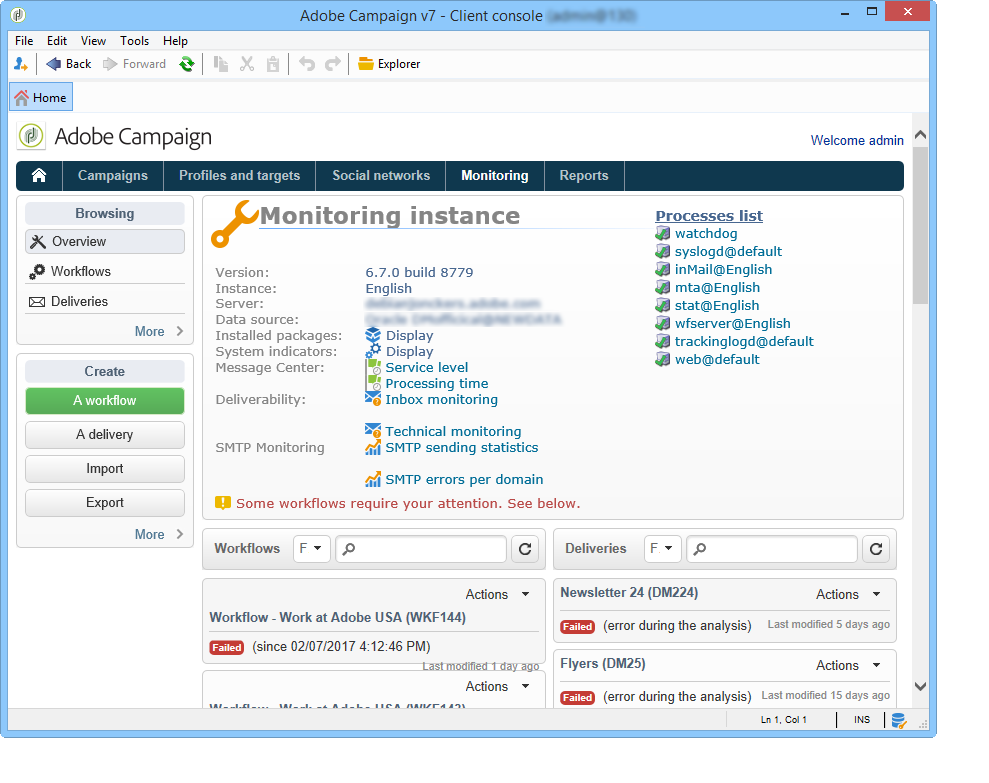

The page displayed lets you view the state of the connected instance, i.e.:

* information on the instance: version, name, database engine, installed packages, server system indicators,
* the list of missing processes and execution information (start date, PID, etc.), 
* a view of workflows and deliveries.

Additional ways of monitoring the different Campaign processes are presented in [this page](../../production/using/monitoring-guidelines.md).

### Log journal {#log-journal}

It is possible to display the log journal related to a process. To do this, click on the process, **mta** for example, then click **[!UICONTROL Open the log journal]** .

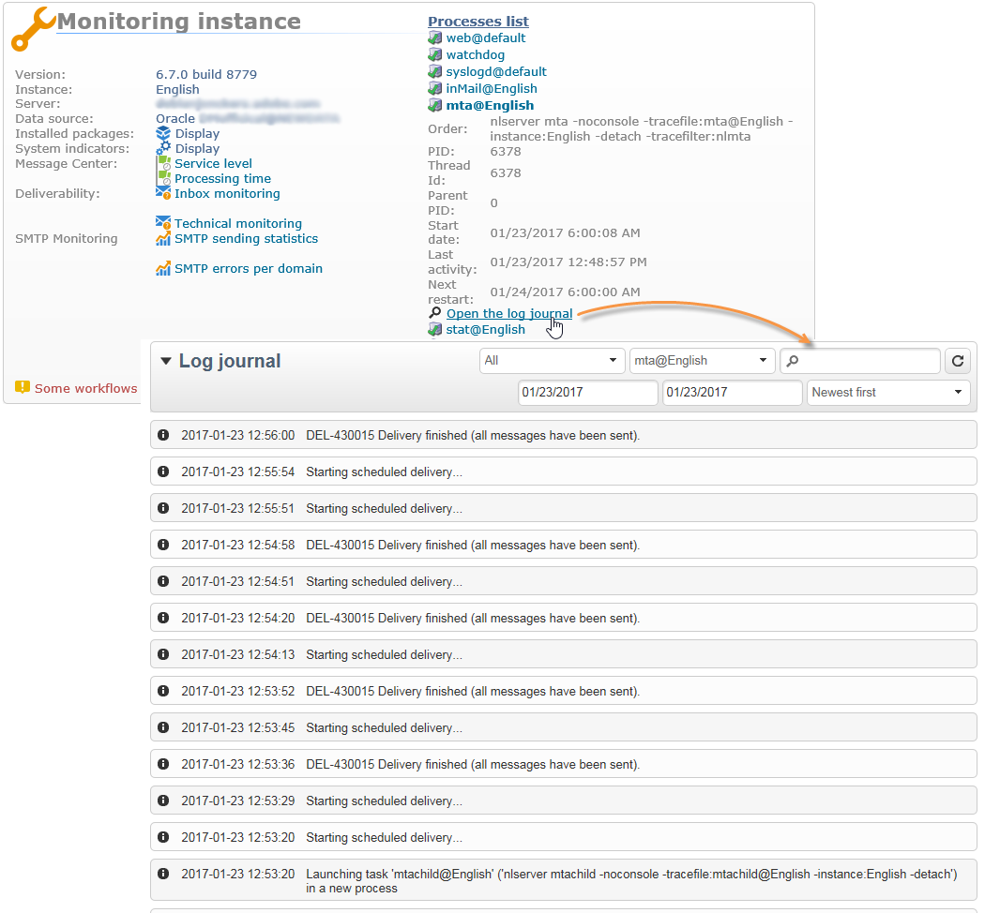

### System indicators {#system-indicators}

The list of system indicators enables you to display information concerning the machine, such as its physical and virtual memory, active processes and available disk space. Indicators are different for Linux and Windows operating systems. Go to the **[!UICONTROL Instance Monitoring]** page and click the **[!UICONTROL Display]** link to open the list of indicators

#### Windows {#in-windows}

* **[!UICONTROL Pending events queued]** : indicator specific to **Message Center**. Refer to [this section](../../message-center/using/additional-configurations.md#monitoring-thresholds) for more information.

* **[!UICONTROL Memory]** : information concerning the physical memory (RAM).

  **[!UICONTROL Current value]** : actual memory consumption.

  **[!UICONTROL Max Value]** : total amount of memory installed.

  **[!UICONTROL Available]** : amount of available memory.

  **[!UICONTROL Warning]** : this indicator is displayed when memory consumption reaches 80% of the total amount.

  **[!UICONTROL Alert]** : this indicator is displayed when memory consumption reaches 90% of the total amount.

  When the **[!UICONTROL Warning]** and **[!UICONTROL Alert]** indicators are displayed, you can solve the issue by adding RAM to the machine which the Adobe Campaign server is installed on. You can also decide to install the Adobe Campaign server on a dedicated machine.

* **[!UICONTROL Swap Memory]** : information related to the virtual memory that matches a paging file: an area on the hard disk that Windows uses as if it were RAM.

  **[!UICONTROL Current value]** : actual memory consumption.

  **[!UICONTROL Max Value]** : total amount of memory.

  **[!UICONTROL Available]** : amount of available memory.

  **[!UICONTROL Warning]** : this indicator is displayed when memory consumption reaches 80% of the total amount.

  **[!UICONTROL Alert]** : this indicator is displayed when memory consumption reaches 90% of the total amount.

  When the **[!UICONTROL Warning]** and **[!UICONTROL Alert]** indicators are displayed, you can solve the issue by increasing the size of the exchange file in the advanced Windows settings.

* **[!UICONTROL Disk XXX]** : information concerning machine readers.

  **[!UICONTROL Current value]** : disk space actually used.

  **[!UICONTROL Max Value]** : total disk capacity.

  **[!UICONTROL Available]** : disk space available

  **[!UICONTROL Used]** : percentage of disk used.

  **[!UICONTROL Warning]** : this indicator is displayed when the available disk space reaches 80% of the total capacity.

  **[!UICONTROL Alert]** : this indicator is displayed when the available disk space reaches 90% of the total capacity.

* **[!UICONTROL Number of processes too old]** : information concerning Adobe Campaign processes that have been active for more than one day.

  **[!UICONTROL Current value]** : number of processes currently active.

  **[!UICONTROL Max Value]** : maximum number of authorized processes (1).

  **[!UICONTROL Alert]** : this indicator is displayed if the number of processes equals 1.

  When the **[!UICONTROL Alert]** indicator is displayed, it may be that the concerned process is locked by the SQL database engine or that it is stuck in an infinite loop. The **watchdog** process provided by Adobe Campaign automatically re-starts all processes every day and enables you to solve this issue. However, you can also stop the concerned process yourself to force re-start.

#### Linux {#in-linux}

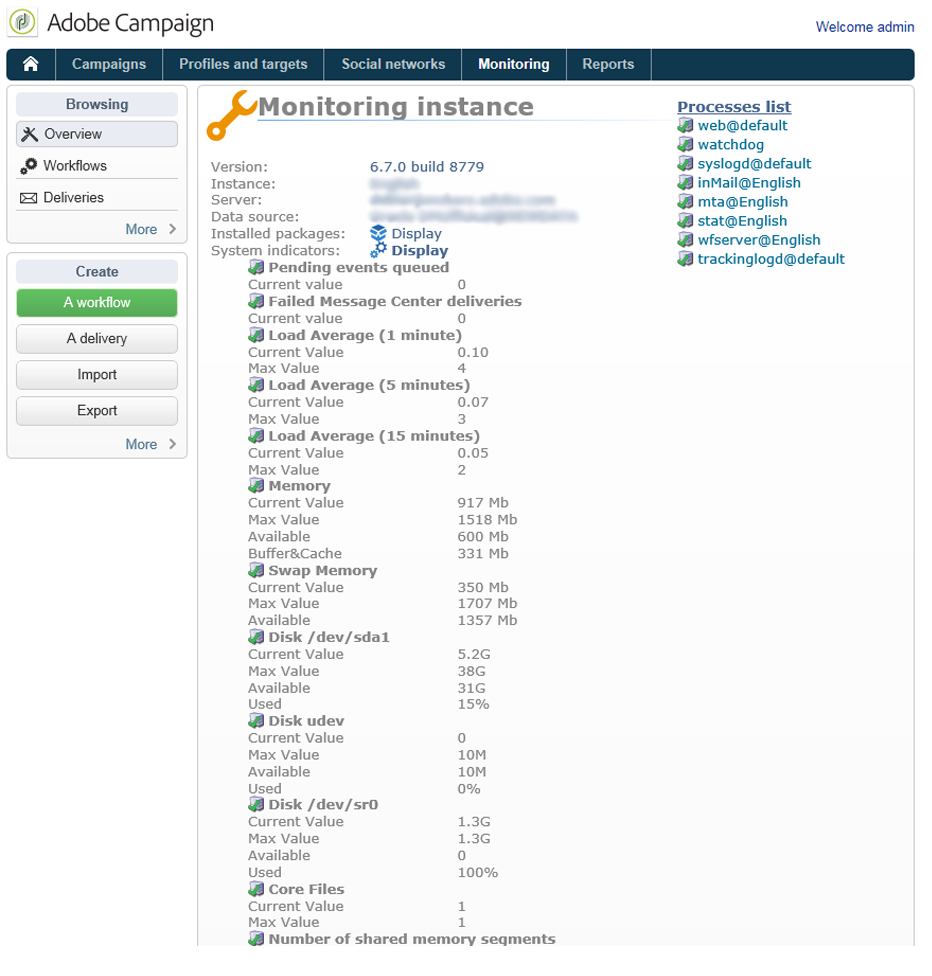

* **[!UICONTROL Pending events queued]** : indicator specific to **Message Center**. Refer to [this section](../../message-center/using/additional-configurations.md#monitoring-thresholds) for more information.

* **[!UICONTROL Load average (1/5/15 minutes)]** : information concerning the load, i.e. the use rate of the processer by the processes running on the machine over the last minute, five minutes, or fifteen minutes

  **[!UICONTROL Current value]** : actual load of the machine.

  **[!UICONTROL Max value]** : maximum use load of the process(es) on the machine

  **[!UICONTROL Warning]** : this indicator is displayed when the load reaches 80% of the maximum authorized value over the last minute, five minutes or fifteen minutes.

  **[!UICONTROL Alert]** : this indicator is displayed when the load reaches 90% of the maximum authorized value of the last minute, five minutes, or fifteen minutes.

* **[!UICONTROL Memory]** : information concerning the physical memory (RAM).

  **[!UICONTROL Current value]** : actual memory consumption.

  **[!UICONTROL Max Value]** : total amount of memory installed.

  **[!UICONTROL Available]** : amount of available memory.

  **[!UICONTROL Warning]** : this indicator is displayed when memory consumption reaches 80% of the total amount.

  **[!UICONTROL Alert]** : this indicator is displayed when memory consumption reaches 90% of the total amount.

  When the **[!UICONTROL Warning]** and **[!UICONTROL Alert]** indicators are displayed, you can solve the issue by adding RAM to the machine which the Adobe Campaign server is installed on. You can also decide to install the Adobe Campaign server on a dedicated machine.

* **[!UICONTROL Swap Memory]** : information related to the virtual memory that matches a paging file: an area on the hard disk that Windows uses as if it were RAM.

  **[!UICONTROL Current value]** : actual memory consumption.

  **[!UICONTROL Max Value]** : total amount of memory.

  **[!UICONTROL Available]** : amount of available memory.

  **[!UICONTROL Warning]** : this indicator is displayed when memory consumption reaches 80% of the total amount.

  **[!UICONTROL Alert]** : this indicator is displayed when memory consumption reaches 90% of the total amount.

  When the **[!UICONTROL Warning]** and **[!UICONTROL Alert]** indicators are displayed, you can solve the issue by increasing the size of the exchange file.

* **[!UICONTROL Core Files]** : information concerning the files generated following the crash of an Adobe Campaign process. These files enable you to diagnose the reasons of the crash.

  **[!UICONTROL Current Value]** : number of existing files.

  **[!UICONTROL Max Value]** : maximum number of authorized files (1).

  **[!UICONTROL Warning]** : this indicator is displayed when the number of files nears 1.

  **[!UICONTROL Alert]** : this indicator is displayed when the number of files equals 1.

  When a process is missing due to a crash, it is shown in red on the list of processes and is re-started automatically by the **watchdog** process provided by Adobe Campaign.

* **[!UICONTROL Number of shared memory segments]** : information concerning the memory segments shared by all Adobe Campaign processes.

  **[!UICONTROL Current value]** : number of memory segments currently in use.

  **[!UICONTROL Max Value]** : maximum number of memory segments authorized (2).

  **[!UICONTROL Warning]** : this indicator is displayed when the number of memory segments reaches 1.

  **[!UICONTROL Alert]** : this indicator is displayed when the number of memory segments reaches 2.

* **[!UICONTROL Number of processes too old]** : information concerning processes that have been active for over one day.

  **[!UICONTROL Current value]** : number of processes currently active.

  **[!UICONTROL Max Value]** : maximum number of authorized processes.

  **[!UICONTROL Warning]** : this indicator is displayed when the number of processes reaches 80% of the authorized threshold.

  **[!UICONTROL Alert]** : this indicator is displayed when the number of processes reaches 90% of the authorized threshold.

* **[!UICONTROL File Handles]** : information concerning the file descriptors, i.e. the number of files opened per process.

  **[!UICONTROL Current value]** : current number of file descriptors.

  **[!UICONTROL Max Value]** : maximum number of file descriptors authorized by the operating system.

  **[!UICONTROL Warning]** : this indicator is displayed when the number of authorized file descriptors reaches the 80% threshold.

  **[!UICONTROL Alert]** : this indicator is displayed when the number of authorized file descriptors reaches the 90% threshold.

* **[!UICONTROL Processes]** : information concerning the machine processes.

  **[!UICONTROL Current value]** : number of processes currently active.

  **[!UICONTROL Max Value]** : maximum number of authorized processes.

  **[!UICONTROL Active Processes]** : number of active processes.

  **[!UICONTROL Inactive Processes]** : number of inactive processes.

  **[!UICONTROL Warning]** : this indicator is displayed when the number of authorized processes reaches the 80% threshold.

  **[!UICONTROL Alert]** : this indicator is displayed when the number of authorized processes reaches the 90% threshold.

* **[!UICONTROL Zombie Processes]** : information concerning the processes that have been stopped but still have a process identifier (PID) and remain visible in the process table.

  **[!UICONTROL Current value]** : number of zombie processes that are currently active.

  **[!UICONTROL Max Value]** : maximum number of authorize zombie processes (2).

  **[!UICONTROL Warning]** : this indicator is displayed when the number of zombie processes nears 2.

  **[!UICONTROL Alert]** this indicator is displayed when the number of zombie processes reaches 2.

#### Customized indicators {#customized-indicators}

Adobe Campaign lets you customize indicators. To do this:

1. Create a **.sh** file and name it **[!UICONTROL cust_indicators.sh]** .
1. Add your customized indicators to this file. For example:

   ```
   #!/bin/bash 
   echo "<indicator name='Zombie Processes'>  
   <current label='Current Value' value='0' display=''/>  
   <warning value='2'/>  <alert value='2'/>  
   <max label='Max Value' value='2'/>
   </indicator>"
   ```

   or

   ```
   #!/bin/bash 
   echo "<indicator name='Availability'>  
   <current label='Last update of data' display='2012-09-03 10:00'/>  
   <current label='Availability last month' display='100.00%'/>  
   <current label='Availability this month' display='100.00%'/> 
   <current label='Recent downtime periods' display='2012-07-04 11:10:00 - 11:19:59'/>
   </indicator>"
   ```

1. Put the file in the **[!UICONTROL usr/local/neolane/nl6]** folder.

This file will be called by Adobe Campaign.

## SMTP Reports {#smtp-reports}

SMTP delivery monitoring reports are integrated into the Adobe Campaign platform. They can be accessed via the console or using Web access.

These reports display SMTP delivery statistics and SMTP errors by domain.

To access them, the operator must have Administration rights.

They are grouped under **Monitoring** > 'SMTP Monitoring'.

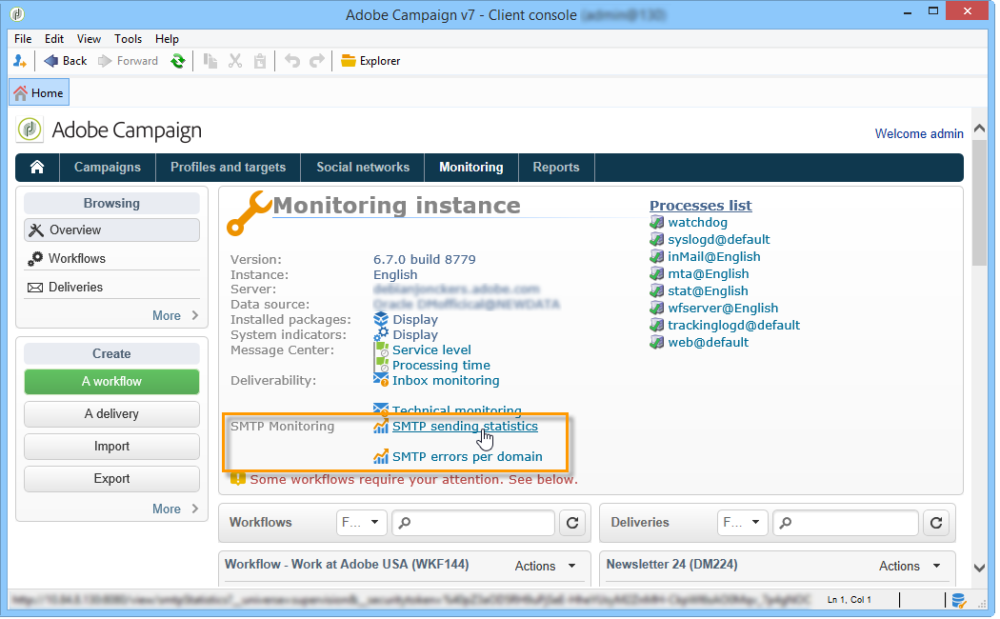

>[!IMPORTANT]
>
>* Information related to SMTP Monitoring is only available if the email channel has been activated.
>* The **[!UICONTROL SMTP sending statistics]** are only offered if the statistics server is started on the instance. 
>

### SMTP sending statistics {#smtp-sending-statistics}

The **[!UICONTROL SMTP sending statistics]** report lets you control server activity. It displays a synthesis of each of the mtachilds.

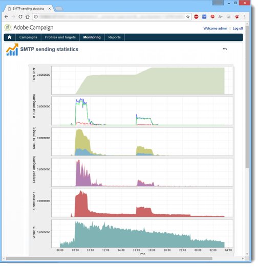

The list of indicators for this report is shown below the chart.

1. Total number of messages sent.
1. * Blue line: messages ready for sending which arrived in the Shaper, i.e. last stage before sending SMTP (coincides with the incoming data).

   * Green line: messages successfully sent (coincides with the outgoing data).

   * Red line: messages abandoned by the Shaper, returned to the **mta** (coincides with the data rejected on this recovery).

   These values are expressed in number of messages per hour. 

1. Represents two queues of the Shaper:

   * Blue curve: queue of active messages. These messages will be sent as soon as possible.

   * Kaki curve: the 'deferred' queue. These messages cannot be returned for the moment due to throttling or because no connection to the target is available. Retries will take place every 5s, 10s, 20s, 40s, 2 min, etc. for the defined **MaxAgeSec** time before being abandoned. 

1. This charts shows a detail of abandoned messages (red curve on the 2nd chart): it shows the proportion of messages abandoned without retries (mauve) compared with messages whose sending failed (red). This lets you view the proportion of messages not processed within the granted period due to limitations by the statistics server (throttling) or due to remote server unavailability. 
1. SMTP connections open or being opened.
1. Estimate of the number of **mtachild**.

>[!NOTE]
>
>This report is related to the status of the Email Traffic Shaper component.

### SMTP errors per domain {#smtp-errors-per-domain}

This report lets you view the delivery errors, over a set period, broken down by domain.

>[!NOTE]
>
>The **minConnectionsToLog**, **minErrorsToLog** and **minMessagesToLog** options of the **serverConf.xml** file define the thresholds above which connection statistics are taken into account.

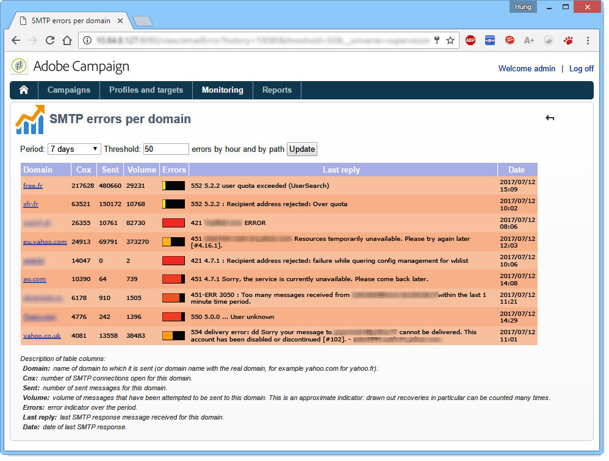

The list of indicators for this report is shown below the table.

* The **Domain** column contains the name of the domain to which the messages are sent (or the real domain name, yahoo.com for yahoo.fr for example),
* The **Cnx** column displays the number of SMTP connections open for this domain,
* The **Sent** column corresponds to the number of messages sent to this domain,
* The **Volume** column displays the volume of messages that have been attempted to be sent to this domain (approximate value),
* The **Errors** column displays a volume indicator of errors on this domain over the period,
* The **Last response** column displays the last SMTP response message received for this domain,
* The **Date** column displays the date of the last SMTP response received for this domain.

>[!NOTE]
>
>The values displayed in the **Cnx**, **Sent**, and **Volume** columns are calculated with respect to the period selected in the **[!UICONTROL Period]** field.

Click on a domain name to view its errors.

They are categorized by PublicId: this identifier corresponds to an IP address shared by several Adobe Campaign mtas behind a router. The statistics server uses this identifier to memorize the connection and delivery statistics between this starting point and the target server.

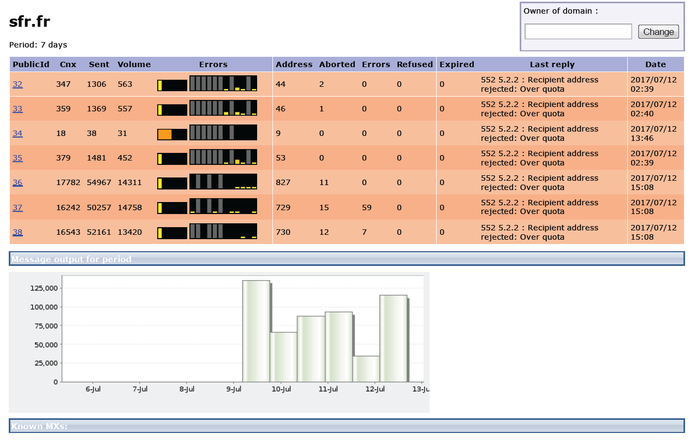

The **[!UICONTROL Owner of domain]** field lets you group various domain names under the same label. In the initial report view, all MX domain names will be associated to this owner.

Click on a PublicId identifier to view further detail.

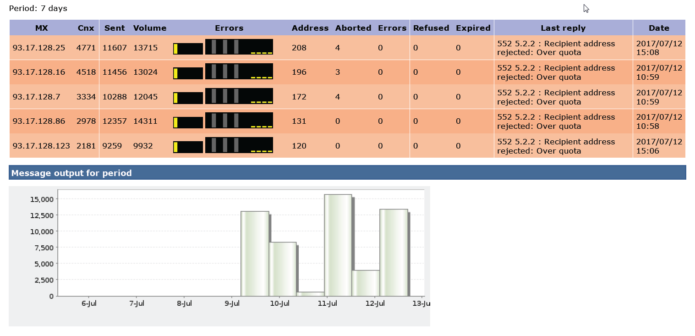

>[!NOTE]
>
>The percentage of errors is represented by two charts. The first is a horizontal progress bar on a black background. The second chart is chronological. The selected period is divided into twelve time intervals, each represented by a vertical progress bar. In both representations, if no error has been detected, the bar is black. The color of the bar depends on the percentage of errors encountered (yellow, then orange, and lastly, red). The color grey means that no significant data volume has been found. It is possible to display the exact percentage of errors by putting the cursor on the chart.

>[!NOTE]
>
>For further information about SMTP errors and managing them in Adobe Campaign, please consult [this section](../../installation/using/email-deliverability.md).

## Billing report {#billing-report}

The **[!UICONTROL Billing]** technical workflow sends the system activity report to the 'billing' operator by email. It is triggered by default the 25th of every month on the Marketing instance.

The technical worklow can be found in a sub-folder of the following node: **Administration** > **Production** > **Technical workflows**.

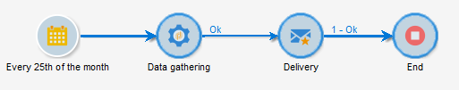

Once the worfklow is started every 25th of the month, your billing operator will receive the following report in his inbox.

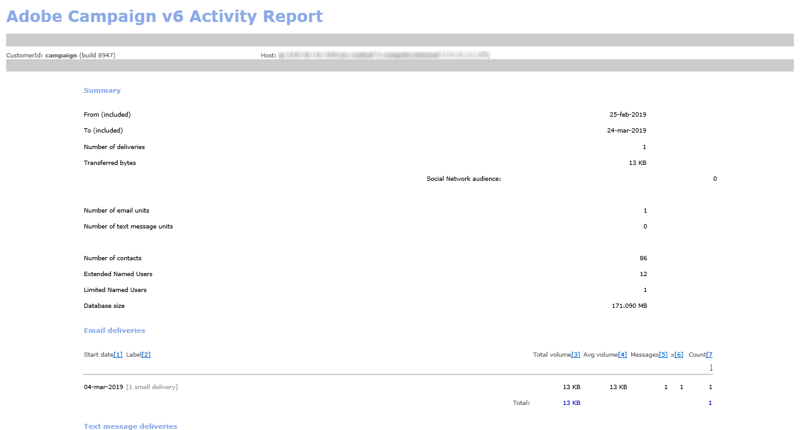

The following metrics are available to track your deliveries:

* **[!UICONTROL Start date]** : Start date of the delivery. Note that it can be earlier than the report's "from" date.
* **[!UICONTROL Label]** : Label of the delivery. Deliveries that have less than 100 messages to send are considered too small and thus aggregated by start date, in which case the label displays the number of aggregates, e.g. [Aggregation of 3 small deliveries].
* **[!UICONTROL Total volume]** : Total volume of bytes transferred for the delivery.
* **[!UICONTROL Avg volume]** : Average volume of bytes transferred. This is the result of the following formula **(total volume / messages)**, which is the calculation basis of the **[!UICONTROL Multiplier]** metric.
* **[!UICONTROL Messages]** : Number of sent messages. This includes both messages that were successfully sent and retries (following the reception of a bounce message from the contacted server).
* **[!UICONTROL Multiplier (x)]** : The value of the multiplier is deduced from the messages' average volume.
* **[!UICONTROL Count]** : Result of the multiplication of the messages and the multiplier.

## Automatic monitoring {#automatic-monitoring}

Adobe Campaign offers several automatic monitoring methods, which are presented below.

### Command line {#command-line}

Command

**nlserver monitor**

Lets you list a set of indicators on the Adobe Campaign modules and the system.

It generates output in an easily processed XML format.

This command can also be run with the **-missing** parameter, which lists the processes that are missing from this instance when the configuration files say that they should be executing.

```
nlserver monitor -missing
HH:MM:SS > Application server for Adobe Campaign Classic (7.X YY.R build XXX@SHA1) of DD/MM/YYYY
mta@prod
stat@prod
wfserver@prod
```

### Information published by the server {#information-published-by-the-server}

#### /r/test {#r-test}

The **http(s)://`<application>`/r/test** page is used to test the redirection server. We recommend using this same method to test the frontal servers used for tracking. This page can also be used to test a load dispatcher.

It displays a line like this in XML format:

```
<redir status='OK' date='YYYY-MM-DD HH:MM:SS.112Z' build='XXXX' host='<hostname>' localHost='<servername>'/>

```

**Frequency**: this test does not use any load, and so it can be run very often (e.g. once every second).

#### /nl/jsp/ping.jsp {#nl-jsp-ping-jsp}

This **http(s)://`<Application server url>`/nl/jsp/ping.jsp**  page operates in the same way as its network counterpart: it tests a complete query going through apache/tomcat/web module/database and uploading to the client. If everything is working properly, it returns an "OK". We recommend running this test on machines with access to the databases (mtas and surveys, for instance).

**Usage**: a session token associated with an operator login must be passed as an argument in order to log in remotely (see the tip in [Automatic monitoring via Adobe Campaign scripts](#automatic-monitoring-via-adobe-campaign-scripts)).

For example: 

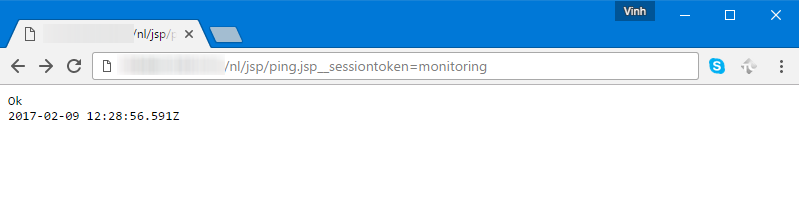

The operator name and login need to be previously configured in the Adobe Campaign client console with database rights.


**Frequency**: this is a test that uses very little bandwidth. It can therefore be run fairly often, though not more than once a minute.

#### /nl/jsp/monitor.jsp {#nl-jsp-monitor-jsp}

This is a test to check that an operator can access the Adobe Campaign server via a web page; the same web page as the one accessed via the client console menus. You can call this page from your surveillance tools (Tivoli, Nagios, etc.).

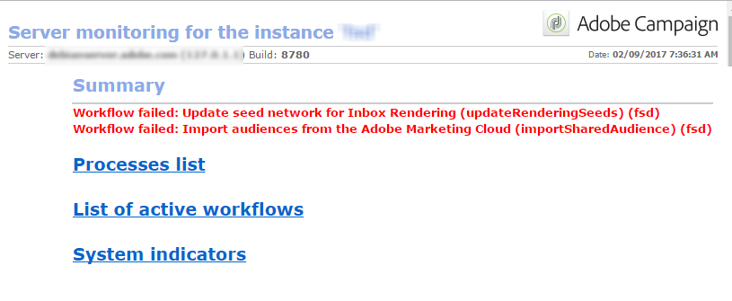

**Usage**: a session token associated with an operator login which lets you connect to the instance needs to be used as an argument (see the tip in [Automatic monitoring via Adobe Campaign scripts](#automatic-monitoring-via-adobe-campaign-scripts)).

The operator and their login needs to be configured previously in the Adobe Campaign client console with the appropriate database rights and restrictions.

**Frequency**: this is a full server test and doesn't need be run often (it can be carried out once every ten minutes, for example).

#### /nl/jsp/soaprouter.jsp {#nl-jsp-soaprouter-jsp}

This **jsp** represents the point of entry of Adobe Campaign application APIs. It can therefore provide detailed monitoring of the application. It can also be used to monitor Adobe Campaign web services. It is used in our monitoring scripts, but note that it is for power users only.

### Monitoring based on deployment types {#monitoring-based-on-deployment-types}

Adobe Campaign enables various deployment configurations (for more on this, refer to [this section](../../installation/using/hosting-models.md)). This section details the various automatic monitoring techniques to be applied depending on your type of installation.

<table> 
 <thead> 
  <tr> 
   <th> Deployment type </th> 
   <th> Monitoring </th> 
  </tr> 
 </thead> 
 <tbody> 
  <tr> 
   <td> Stand-alone </td> 
   <td> 
    <ul> 
     <li><p> <span class="uicontrol">/r/test</span> and <span class="uicontrol">/nl/jsp/monitor.jsp</span> on the Adobe Campaign server</p> </li> 
    </ul> </td> 
  </tr> 
  <tr> 
   <td> Standard </td> 
   <td> 
    <ul> 
     <li><p> <span class="uicontrol">/r/test</span> and <span class="uicontrol">/nl/jsp/ping.jsp</span> on the frontal servers</p> </li> 
     <li><p> <span class="uicontrol">/nl/jsp/monitor.jsp</span> on the application server</p> </li> 
    </ul> </td> 
  </tr> 
  <tr> 
   <td> Enterprise </td> 
   <td> 
    <ul> 
     <li><p> <span class="uicontrol">/r/test</span> and <span class="uicontrol">/nl/jsp/ping.jsp</span> on the frontal servers</p> </li> 
     <li><p> <span class="uicontrol">/r/test</span> and <span class="uicontrol">/nl/jsp/monitor.jsp</span> on the application server</p> </li> 
    </ul> </td> 
  </tr> 
  <tr> 
   <td> Mid-sourcing </td> 
   <td> 
    <ul> 
     <li><p> <span class="uicontrol">/nl/jsp/monitor.jsp</span> on the application server</p> </li> 
    </ul> </td> 
  </tr> 
 </tbody> 
</table>

## Automatic monitoring via Adobe Campaign scripts {#automatic-monitoring-via-adobe-campaign-scripts}

Adobe Campaign can provide an instance monitoring tool (netreport) that lets you send a report by email regarding the detected anomalies. 

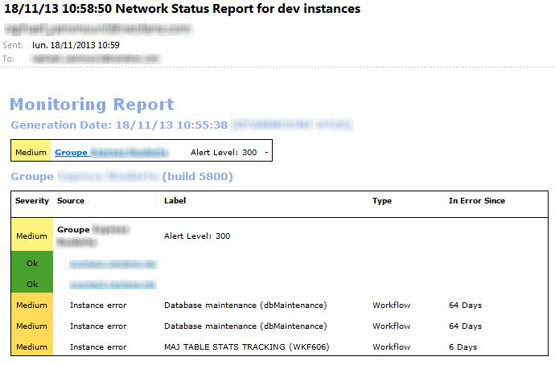

>[!IMPORTANT]
>
>This tool can be used to monitor your instances but is not supported by Adobe Campaign. Contact your Campaign Administrator for more information.

### Required elements {#required-elements}

The following pre-installation precautions are required for automatic monitoring:

* You must have the **netreport.tgz** (Linux installation) or **netreport.zip** (Windows installation) files,
* We strongly advise you not to install monitoring on the machine to be monitored, 
* it must be installed on a machine with a JRE or a JDK,
* in Linux, the machine to be monitored must have the **bc** package. For more on this, refer to [this section](../../installation/using/installing-packages-with-linux.md#distribution-based-on-rpm--packages).

### Installation procedure {#installation-procedure}

The installation procedure is as follows:

1. In the console, create a new operator if necessary (the 'monitoring' user already exists), but do not assign any rights. 
1. Run archive extraction.
1. Read the **readme** file.
1. Update the **netconf.xml** configuration file.
1. Update the **netreport.bat** (Windows) or **netreport.sh** (Linux) file.

### Configuring the netconf.xml file {#configuring-the-netconf-xml-file}

The XML configuration file contains the following elements:

* ['Properties' element](#properties--element)
* ['Instance' element](#instance--element)
* ['Host' element](#host--element)
* [Sub-elements](#sub-elements)

Here is a configuration example:

```
<?xml version="1.0" encoding="ISO-8859-1"?>
<netconf>
  <properties mailServer="mail.adobe.net" mailFrom="mail@adobe.com" recipientList="recipient@adobe.com">
    <nightMode start="00:00 am" end="07:00 am"/>
    <buildRange minimum="7829" maximum="8180"/>
    <buildRange minimum="8300" maximum="8400"/>
    <sla/>
  </properties>

  <instance name="dev" recipientList="mail@mail.com,mail2@mail.com">
                <host name="devrd.domain.com" alias="devrd" sessiontoken="monitoring" criticalLevel="1" filter="wkf;new">
                                <ncs instance="devrd" url="/nl/jsp/soaprouter.jsp" includeDead="false" isSecure="false"/>
                                <redir url="/r/test"/>
                                <http url="/nl/jsp/ping.jsp"/>
                </host>
                <host name="devtrk.domain.com" alias="devtrk" sessiontoken="monitoring" criticalLevel="0" filter="wkf;new">
                                <ncs instance="devrd" url="/nl/jsp/soaprouter.jsp" includeDead="true" isSecure="false"/>
                </host>
  </instance>
  <host name="dev-test" alias="dev-test" sessiontoken="monitoring" criticalLevel="2">
                <ncs instance="dev" url="/nl/jsp/soaprouter.jsp" includeDead="false"/>
  </host>
</netconf>

```

>[!NOTE]
>
>You can specify various configurations by adding a suffix to the **netconf.xml** file, for example, **netconf-dev.xml**, **netconf-prod.xml**, etc. Then specify the configuration to use for executing the netreport in the **netreport.bat** or **netreport.sh** files by adding **$JAVA_HOME/bin/java netreport dev** or **@%JAVA_HOME%binjava netreport prod** for example.

>[!IMPORTANT]
>
>For the **monitoring** operator to work, the machine that the netreport is executed on must be in a security zone that is in **sessionTokenOnly** mode. If no trusted IP mask has been specified for this operator, the security zone must also be in **allowEmptyPassword** and **allowUserPassword** mode.

#### 'Properties' element {#properties--element}

This element is used to populate the configuration of emails, i.e.

* **mailServer**: SMTP server used to send emails (e.g.: smtp.domain.net).
* **mailFrom**: email address of the report sender (e.g.: monitoring@domain.net). 
* **recipientList**: the list of email addresses of monitoring recipients. Addresses must be separated by commas (no spaces).
* '**night**' mode (optional) is used to avoid sending emails between the specified times period. Instead, the data is consolidated, and an email concerning the night's activity is sent after the end time (7:00 by default).
* The **buildRange** sub-element (optional) lets you specify a minimum and maximum build number. An error will be generated for all machines whose build number does not fall into this range

  ```
  <buildRange minimum="0000" maximum="9999"/>
  ```

* You can add an **`<sla>`** (optional) sub-element in the **properties** element. A log file will be generated every time the netreport is executed. The name of the file contains the configuration name and the date and time, for example **dev_06_12_13_16_47_05.tmp**. The file contains the following information: instance name, machine name, severity level, (0 to 3, from least critical to most critical), date (timestamp format), time elapsed (in milliseconds) between the query and the response, service used (http, ncs, ncsex, redir). This information is separated by tabulation marks and line breaks at the end of each service.

>[!NOTE]
>
>The **persistHtmlFile** attribute with the value "true" on the **`<property>`** element is used to record the latest monitoring status in the file **netreport.md**. This file is saved in the installation directory.

#### 'Instance' element {#instance--element}

This element lets you regroup several machines (hosts) into the same instance. The instance names appear in the first part of the monitoring email. You can click on the name of an instance to access detail regarding each machine.

```
instance name="instanceName" recipientList="mail@mail.com,mail2@mail.com">
                <host name="devcamp.domain.com" ...>
                       ...
                </host>
                <host name="devtrack.domain.com" ...>
                       ...
                </host>
</instance

```

* **name**: instance name that will appear in the first part of the email. 
* **recipientList** (optional): lets you send a monitoring report regarding a particular instance by email.

#### 'Host' element {#host--element}

This element configures the monitoring of a given server on the host, i.e.

* **name**: name of the machine to be monitored.
* **alias** (optional): name of the monitored machine as it will appear in the report. 
* **sessionToken**: provides login authentication via an authorized session token.

  To configure the session token, select the **monitoring** operator in the Adobe Campaign console. In the **Access rights** tab, specify the IP addresses of the machines authorized to monitor this instance. You will then be able to connect to the monitoring page from those machines using the **monitoring** identifier and without needing to specify a password. 

  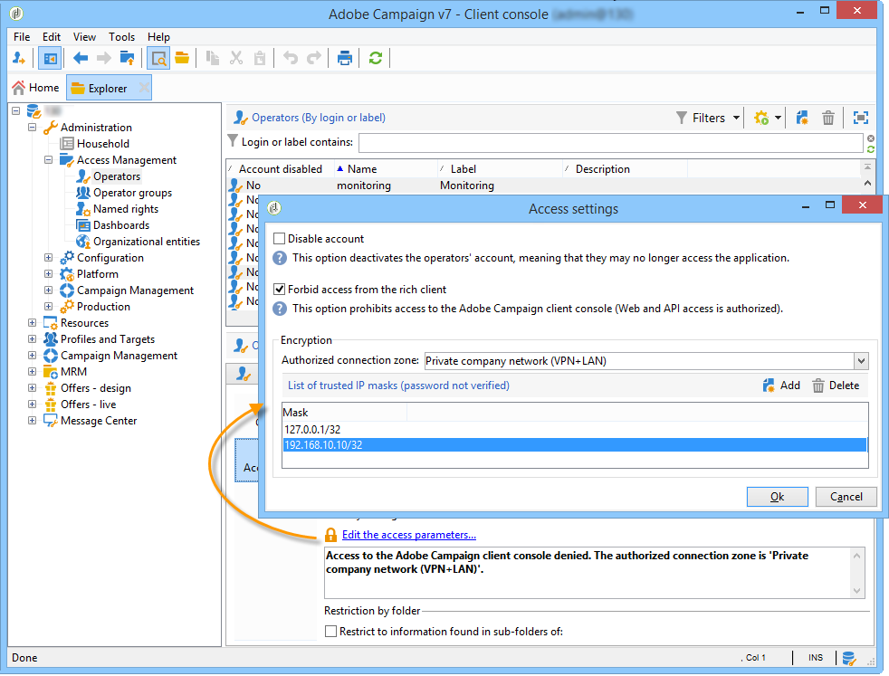

* **criticalLevel** (optional): lets you sort errors to be displayed by level of severity. Possible values are '0' (all levels displayed), '1' (only high and critical errors displayed) and '2' (only critical errors displayed). If this attribute is not provided, all error levels are displayed.
* **filter** (optional): lets you exclude certain workflow errors, for example **filter="wkf;wkf1"**. Workflow labels must be separated by semicolons.

#### Sub-elements {#sub-elements}

* **tcp**: checks if the server is up or down. You must enter a port number.
* **http**: checks that the Web server exists (application server is operational).
* **ncs**: checks the processes on the instance entered in the 'instance' attribute (workflow errors, memory usage, etc.). The **includead** (mandatory) attribute gives you the option of displaying dead processes ('true' or 'false' values). 
* **redir**: checks the tracking.

In most cases, only the **ncs** and **redir** sub-elements can be kept.

In any case, certain nodes can be overloaded in the sub-elements (e.g., the node **port=75** to overload the port used for the http, ncs or redir connection):

```
<ncs instance="clap40" url="/nl/jsp/soaprouter.jsp" includeDead="false" port="80"/>
```

In the **ncs**, **redir** and **http** sub-elements, you can add the **isSecure** attribute (optional) to choose whether or not to use the https protocol ('true' or 'false' values). If this attribute is not provided, the http protocol is used.

### Configuring the netreport.bat or netreport.sh file {#configuring-the-netreport-bat-or-netreport-sh--file}

To configure it, edit this file and indicate which directory the JRE or JDK is installed in.

### Launching monitoring {#launching-monitoring}

To launch monitoring, execute the **netreport.bat** or **netreport.sh** file at regular intervals via a script. A report is sent after the first execution, and then only in the event of a change of status.

### Testing monitoring {#testing-monitoring}

To test the monitoring, execute the **netreport.bat** or **netreport.sh** file.

An email is sent to the recipients specified in the **recipientList** of the **netconf.xml** file.
