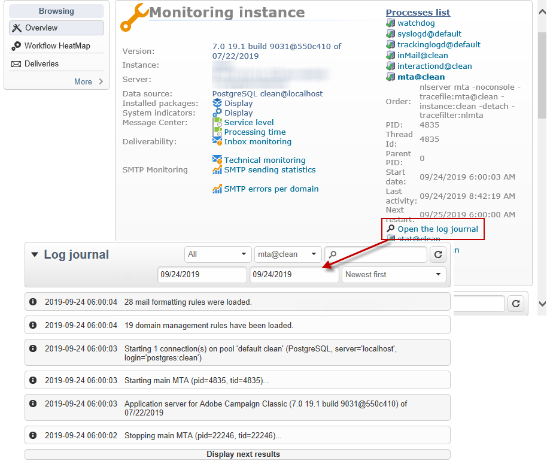
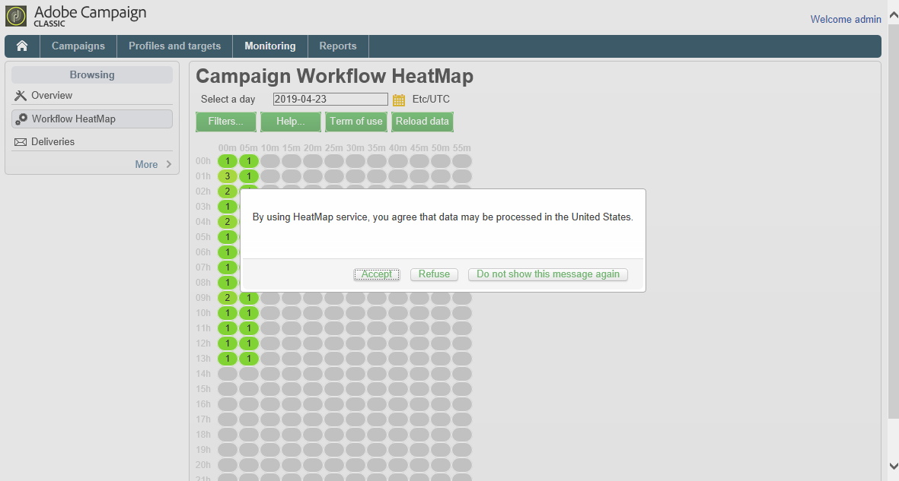
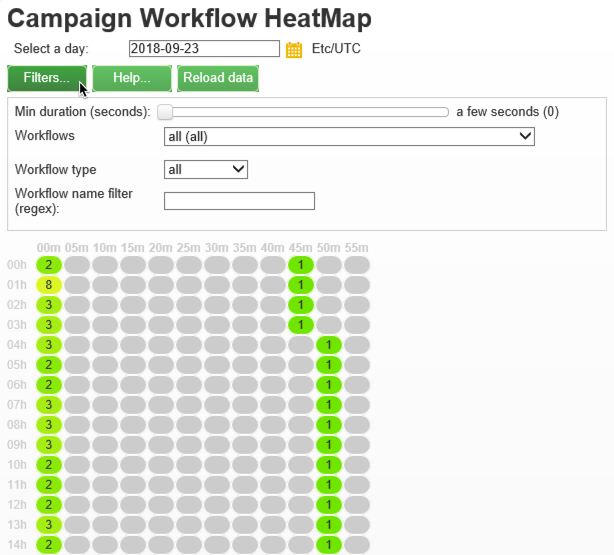
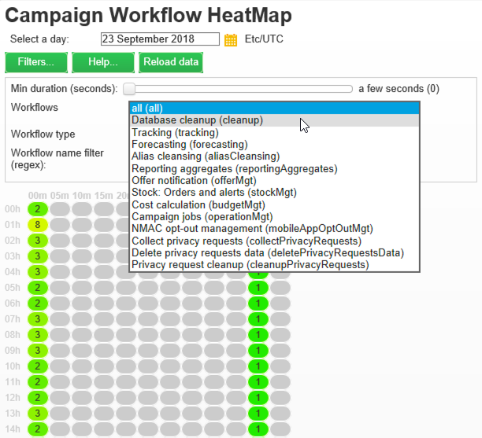
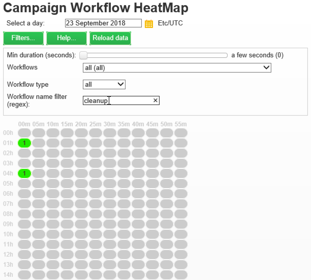
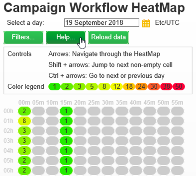
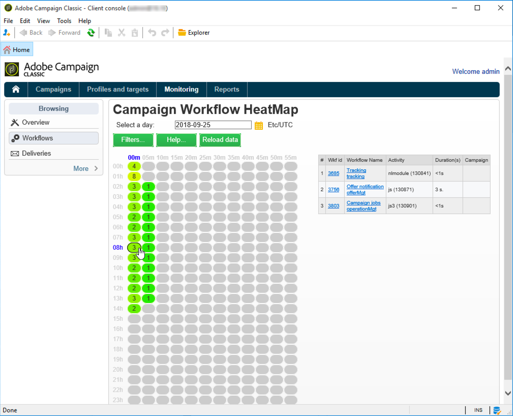

# Monitoring processes{#monitoring-processes}

The application server and the redirection server (**tracking**) can be monitored manually or automatically.

## Manual monitoring {#manual-monitoring}

Go to **Monitoring** and click the **Overview** link to display the Adobe Campaign process monitoring page. 


The page displayed lets you view the state of the connected instance, i.e.:

* information on the instance: version, name, database engine, installed packages, server system indicators,
* the list of missing processes and execution information (start date, PID, etc.), 
* a view of workflows and deliveries.

### Log journal {#log-journal}

It is possible to display the log journal related to a process. To do this, click on the process, **mta** for example, then click **Open the log journal**.



### System indicators {#system-indicators}

The list of system indicators enables you to display information concerning the machine, such as its physical and virtual memory, active processes and available disk space. Indicators are different for Linux and Windows operating systems. Go to the **Instance Monitoring** page and click the **Display** link to open the list of indicators

#### In Windows {#in-windows}

* **Pending events queued** : indicator specific to **Message Center**. Refer to [this section](../../message-center/using/monitoring-thresholds.md) for more information.
* **Memory**: information concerning the physical memory (RAM).

  **Current value**: actual memory consumption.

  **Max Value**: total amount of memory installed.

  **Available**: amount of available memory.

  **Warning**: this indicator is displayed when memory consumption reaches 80% of the total amount.

  **Alert**: this indicator is displayed when memory consumption reaches 90% of the total amount.

  When the **Warning** and **Alert** indicators are displayed, you can solve the issue by adding RAM to the machine which the Adobe Campaign server is installed on. You can also decide to install the Adobe Campaign server on a dedicated machine.

* **Swap Memory**: information related to the virtual memory that matches a paging file: an area on the hard disk that Windows uses as if it were RAM.

  **Current value**: actual memory consumption.

  **Max Value**: total amount of memory.

  **Available**: amount of available memory.

  **Warning**: this indicator is displayed when memory consumption reaches 80% of the total amount.

  **Alert**: this indicator is displayed when memory consumption reaches 90% of the total amount.

  When the **Warning** and **Alert** indicators are displayed, you can solve the issue by increasing the size of the exchange file in the advanced Windows settings.

* **Disk XXX**: information concerning machine readers.

  **Current value**: disk space actually used.

  **Max Value**: total disk capacity.

  **Available** : disk space available

  **Used**: percentage of disk used.

  **Warning**: this indicator is displayed when the available disk space reaches 80% of the total capacity.

  **Alert**: this indicator is displayed when the available disk space reaches 90% of the total capacity.

* **Number of processes too old**: information concerning Adobe Campaign processes that have been active for more than one day.

  **Current value**: number of processes currently active.

  **Max Value**: maximum number of authorized processes (1).

  **Alert**: this indicator is displayed if the number of processes equals 1.

  When the **Alert** indicator is displayed, it may be that the concerned process is locked by the SQL database engine or that it is stuck in an infinite loop. The **watchdog** process provided by Adobe Campaign automatically re-starts all processes every day and enables you to solve this issue. However, you can also stop the concerned process yourself to force re-start.

#### In Linux {#in-linux}


* **Pending events queued** : indicator specific to **Message Center**. Refer to [this section](../../message-center/using/monitoring-thresholds.md) for more information.
* **Load average (1/5/15 minutes)**: information concerning the load, i.e. the use rate of the processer by the processes running on the machine over the last minute, five minutes, or fifteen minutes

  **Current value**: actual load of the machine.

  **Max value**: maximum use load of the process(es) on the machine

  **Warning**: this indicator is displayed when the load reaches 80% of the maximum authorized value over the last minute, five minutes or fifteen minutes.

  **Alert**: this indicator is displayed when the load reaches 90% of the maximum authorized value of the last minute, five minutes, or fifteen minutes.

* **Memory**: information concerning the physical memory (RAM).

  **Current value**: actual memory consumption.

  **Max Value**: total amount of memory installed.

  **Available**: amount of available memory.

  **Warning**: this indicator is displayed when memory consumption reaches 80% of the total amount.

  **Alert**: this indicator is displayed when memory consumption reaches 90% of the total amount.

  When the **Warning** and **Alert** indicators are displayed, you can solve the issue by adding RAM to the machine which the Adobe Campaign server is installed on. You can also decide to install the Adobe Campaign server on a dedicated machine.

* **Swap Memory**: information related to the virtual memory that matches a paging file: an area on the hard disk that Windows uses as if it were RAM.

  **Current value**: actual memory consumption.

  **Max Value**: total amount of memory.

  **Available**: amount of available memory.

  **Warning**: this indicator is displayed when memory consumption reaches 80% of the total amount.

  **Alert**: this indicator is displayed when memory consumption reaches 90% of the total amount.

  When the **Warning** and **Alert** indicators are displayed, you can solve the issue by increasing the size of the exchange file.

* **Core Files**: information concerning the files generated following the crash of an Adobe Campaign process. These files enable you to diagnose the reasons of the crash.

  **Current Value**: number of existing files.

  **Max Value**: maximum number of authorized files (1).

  **Warning**: this indicator is displayed when the number of files nears 1.

  **Alert**: this indicator is displayed when the number of files equals 1.

  When a process is missing due to a crash, it is shown in red on the list of processes and is re-started automatically by the **watchdog** process provided by Adobe Campaign.

* **Number of shared memory segments**: information concerning the memory segments shared by all Adobe Campaign processes.

  **Current value**: number of memory segments currently in use.

  **Max Value**: maximum number of memory segments authorized (2).

  **Warning**: this indicator is displayed when the number of memory segments reaches 1.

  **Alert**: this indicator is displayed when the number of memory segments reaches 2.

* **Number of processes too old**: information concerning processes that have been active for over one day.

  **Current value**: number of processes currently active.

  **Max Value**: maximum number of authorized processes.

  **Warning**: this indicator is displayed when the number of processes reaches 80% of the authorized threshold.

  **Alert**: this indicator is displayed when the number of processes reaches 90% of the authorized threshold.

* **File Handles**: information concerning the file descriptors, i.e. the number of files opened per process.

  **Current value**: current number of file descriptors.

  **Max Value**: maximum number of file descriptors authorized by the operating system.

  **Warning**: this indicator is displayed when the number of authorized file descriptors reaches the 80% threshold.

  **Alert**: this indicator is displayed when the number of authorized file descriptors reaches the 90% threshold.

* **Processes**: information concerning the machine processes.

  **Current value**: number of processes currently active.

  **Max Value**: maximum number of authorized processes.

  **Active Processes**: number of active processes.

  **Inactive Processes**: number of inactive processes.

  **Warning**: this indicator is displayed when the number of authorized processes reaches the 80% threshold.

  **Alert**: this indicator is displayed when the number of authorized processes reaches the 90% threshold.

* **Zombie Processes**: information concerning the processes that have been stopped but still have a process identifier (PID) and remain visible in the process table.

  **Current value**: number of zombie processes that are currently active.

  **Max Value**: maximum number of authorize zombie processes (2).

  **Warning**: this indicator is displayed when the number of zombie processes nears 2.

  **Alert** this indicator is displayed when the number of zombie processes reaches 2.

#### Customized indicators {#customized-indicators}

Adobe Campaign lets you customize indicators. To do this:

1. Create a **.sh** file and name it **cust_indicators.sh**.
1. Add your customized indicators to this file. For example:

   ```
   #!/bin/bash 
   echo "<indicator name='Zombie Processes'>  
   <current label='Current Value' value='0' display=''/>  
   <warning value='2'/>  <alert value='2'/>  
   <max label='Max Value' value='2'/>
   </indicator>"
   ```

   or

   ```
   #!/bin/bash 
   echo "<indicator name='Availability'>  
   <current label='Last update of data' display='2012-09-03 10:00'/>  
   <current label='Availability last month' display='100.00%'/>  
   <current label='Availability this month' display='100.00%'/> 
   <current label='Recent downtime periods' display='2012-07-04 11:10:00 - 11:19:59'/>
   </indicator>"
   ```

1. Put the file in the **usr/local/neolane/nl6** folder.

This file will be called by Adobe Campaign.

## SMTP Reports {#smtp-reports}

SMTP delivery monitoring reports are integrated into the Adobe Campaign platform. They can be accessed via the console or using Web access.

These reports display SMTP delivery statistics and SMTP errors by domain.

To access them, the operator must have Administration rights.

They are grouped under **Monitoring** > 'SMTP Monitoring'.


>[!CAUTION]
>
>* Information related to SMTP Monitoring is only available if the email channel has been activated.
>* The **SMTP sending statistics** are only offered if the statistics server is started on the instance. 
>

### SMTP sending statistics {#smtp-sending-statistics}

The **SMTP sending statistics** report lets you control server activity. It displays a synthesis of each of the mtachilds.


The list of indicators for this report is shown below the chart.

1. Total number of messages sent.
1. * Blue line: messages ready for sending which arrived in the Shaper, i.e. last stage before sending SMTP (coincides with the incoming data).

* Green line: messages successfully sent (coincides with the outgoing data).

* Red line: messages abandoned by the Shaper, returned to the **mta** (coincides with the data rejected on this recovery).

   These values are expressed in number of messages per hour. 

1. Represents two queues of the Shaper:

   * Blue curve: queue of active messages. These messages will be sent as soon as possible.

   * Kaki curve: the 'deferred' queue. These messages cannot be returned for the moment due to throttling or because no connection to the target is available. Retries will take place every 5s, 10s, 20s, 40s, 2 min, etc. for the defined **MaxAgeSec** time before being abandoned. 

1. This charts shows a detail of abandoned messages (red curve on the 2nd chart): it shows the proportion of messages abandoned without retries (mauve) compared with messages whose sending failed (red). This lets you view the proportion of messages not processed within the granted period due to limitations by the statistics server (throttling) or due to remote server unavailability. 
1. SMTP connections open or being opened.
1. Estimate of the number of **mtachild**.

>[!NOTE]
>
>This report is related to the status of the Email Traffic Shaper component.

### SMTP errors per domain {#smtp-errors-per-domain}

This report lets you view the delivery errors, over a set period, broken down by domain.

>[!NOTE]
>
>The **minConnectionsToLog**, **minErrorsToLog** and **minMessagesToLog** options of the **serverConf.xml** file define the thresholds above which connection statistics are taken into account.


The list of indicators for this report is shown below the table.

* The **Domain** column contains the name of the domain to which the messages are sent (or the real domain name, yahoo.com for yahoo.fr for example),
* The **Cnx** column displays the number of SMTP connections open for this domain,
* The **Sent** column corresponds to the number of messages sent to this domain,
* The **Volume** column displays the volume of messages that have been attempted to be sent to this domain (approximate value),
* The **Errors** column displays a volume indicator of errors on this domain over the period,
* The **Last response** column displays the last SMTP response message received for this domain,
* The **Date** column displays the date of the last SMTP response received for this domain.

>[!NOTE]
>
>The values displayed in the **Cnx**, **Sent**, and **Volume** columns are calculated with respect to the period selected in the **Period** field.

Click on a domain name to view its errors.

They are categorized by PublicId: this identifier corresponds to an IP address shared by several Adobe Campaign mtas behind a router. The statistics server uses this identifier to memorize the connection and delivery statistics between this starting point and the target server.


The **Owner of domain** field lets you group various domain names under the same label. In the initial report view, all MX domain names will be associated to this owner.

Click on a PublicId identifier to view further detail.


>[!NOTE]
>
>The percentage of errors is represented by two charts. The first is a horizontal progress bar on a black background. The second chart is chronological. The selected period is divided into twelve time intervals, each represented by a vertical progress bar. In both representations, if no error has been detected, the bar is black. The color of the bar depends on the percentage of errors encountered (yellow, then orange, and lastly, red). The color grey means that no significant data volume has been found. It is possible to display the exact percentage of errors by putting the cursor on the chart.

>[!NOTE]
>
>For further information about SMTP errors and managing them in Adobe Campaign, please consult [this section](../../installation/using/email-deliverability.md).

## Billing report {#billing-report}

The **Billing** technical workflow sends the system activity report to the 'billing' operator by email. It is triggered by default the 25th of every month.

The technical worklow can be found in a sub-folder of the following node: **Administration** > **Production** > **Technical workflows**.


Once the worfklow is started every 25th of the month, your billing operator will receive the following report in his inbox.


The following metrics are available to track your deliveries:

* **Start date**: Start date of the delivery. Note that it can be earlier than the report's "from" date.
* **Label**: Label of the delivery. Deliveries that have less than 100 messages to send are considered too small and thus aggregated by start date, in which case the label displays the number of aggregates, e.g. [Aggregation of 3 small deliveries].
* **Total volume**: Total volume of bytes transferred for the delivery.
* **Avg volume**: Average volume of bytes transferred. This is the result of the following formula **(total volume / messages)**, which is the calculation basis of the **Multiplier** metric.
* **Messages**: Number of sent messages. This includes both messages that were successfully sent and retries (following the reception of a bounce message from the contacted server).
* **Multiplier (x)**: The value of the multiplier is deduced from the messages' average volume.
* **Count**: Result of the multiplication of the messages and the multiplier.

## Workflow monitoring {#workflow-monitoring}

The Adobe Campaign Workflow HeatMap consists in a color-coded graphical representation of all the workflows that are currently running.

### About the Workflow HeatMap {#about-the-workflow-heatmap}

By providing a quick overview on the number of concurrent workflows, the Workflow HeatMap enables the Adobe Campaign platform administrators to monitor the load on the instance and plan workflows accordingly.

More precisely, it helps the platform administrators to:

* See and understand concurrent workflows
* Filter workflows by duration to see which workflows may encounter issues
* Filter activities by duration to see which activities may encounter issues
* Easily find individual workflows and all related activities (with their duration)
* Search by workflow type ( [technical workflows](../../workflow/using/building-a-workflow.md#technical-workflows) or [campaign workflows](../../workflow/using/building-a-workflow.md#campaign-workflows))
* Look for a specific workflow to analyze

>[!NOTE]
>
>In addition to the **Workflow Heatmap**, you can create a workflow that will let you monitor the status of a set of workflows and send recurring messages to supervisors. For more on this, refer to the [dedicated section](../../workflow/using/supervising-workflows.md).

Using the Workflow HeatMap requires to have a good understanding of the following concepts: [Workflows](../../workflow/using/about-workflows.md), [Activities](../../workflow/using/about-activities.md) and [Workflow Best Practices](../../workflow/using/workflow-best-practices.md).

The Workflow HeatMap is available by default in Adobe Campaign starting 18.10 release. If you have a build between 8700 and 8977 (18.10), you can also benefit from this capability. To request the corresponding package, contact the [Adobe Customer Care](https://support.neolane.net/) and follow the instructions from [this page](https://helpx.adobe.com/campaign/kb/install-workflow-heatmap-package.html) to understand how to install it.

When you first access Worfklow HeatMap the following pop-up window will appear. This agreement allows the transfer and storage in the United States allowing Adobe Campaign to:

* monitor instances to investigate any performance issues.
* collect data for anomaly detection.

Note that the transfer of your data is only available for users connecting to Adobe Campaign using their Adobe ID. 



Three options are available:

* **Accept**: By accepting this agreement, you authorize Adobe Campaign to collect your data and to transfer it to the United States to be able to help you in case of anomaly detections.
* **Refuse**: By declining the agreement, your data will not be transferred but you can still use Workflow Heatmap.
* **Do not show this message again**: By clicking **Do not show this message again**, the pop-up window will stop showing when accessing Workflow Heatmap but is still available from the **Term of use** button.

This choice is not final, you can always change it by clicking the **Term of use** button.

### Using the HeatMap {#using-the-heatmap}

>[!NOTE]
>
>Only users with administration rights can access the Campaign Workflow HeatMap.

1. Go to **Monitoring** and click the **Workflows** link to display the **Campaign Workflow HeatMap** page.

   

1. Click the calendar to select a day.

   By default, the page shows the workflow activity for the current day. You can change it and select any day in the past.

   >[!NOTE]
   >
   >Only the workflows that have not been deleted by the **Database cleanup** workflow are visible. For more on the Database cleanup workflow, refer to [this section](../../production/using/database-cleanup-workflow.md).  
   >By default, the Workflow HeatMap time zone is the one defined for the current administrator user. For example, you may want to change it if you are not in the same area as the marketing users you are working with.

1. Click the **Filters** button.

   

1. Use the slider to set the minimum duration from 0 second to 1 hour. This enables you to search only workflows running for more than a certain number of seconds or minutes.

   

1. You can also choose a specific workflow from the **Workflows** list.

   

   >[!NOTE]
   >
   >The **Min duration** filter is applied. If you cannot find a specific workflow, reset the minimum duration to 0 so that all workflows are displayed in the list.

1. You can also filter on the **Workflow type**:

    * **Technical**: Only [out-of-the box-technical workflows](../../workflow/using/building-a-workflow.md#technical-workflows) and [data management workflows](../../workflow/using/targeting-data.md#data-management) are displayed.
    * **Marketing**: Only workflows linked to a marketing campaign, known as [campaign workflows](../../workflow/using/building-a-workflow.md#campaign-workflows), are displayed.

1. To search a specific workflow by name, you can also use the **Workflow name filter** field.

   

1. If you edited some workflows in the time between, click the **Reload data** button to refresh the data that are displayed in the grid.

### Reading the HeatMap {#reading-the-heatmap}

The Campaign Workflow HeatMap is a grid naturally readable from upper left to bottom right, allowing to find the "hot zones" with a green to red color-coded range.

* The darker red cells correspond to periods when a high number of workflows are running at the same time.
* The grey cells correspond to periods when no workflow is running.

To learn how the color code is applied and how to navigate the HeatMap, click the **Help** button.



Each row represents an hour of the day and each cell represents 5 minutes of that hour.

The grid shows all the workflows that are running at the same time for each of these 5-minute periods.

In the example below, between 8am and 8:05am, three workflows are running (no matter their individual duration):


1. Click a colored cell to display the details of all concurrent workflows running during this period.

   

   For each workflow, all the activities that it contains are listed, with their duration.

1. Click the workflow ID or name to directly open a workflow.
1. To go back to the **Campaign Workflow HeatMap** view, click the **Home** button.

### Use cases: using the HeatMap to take actions {#use-cases--using-the-heatmap-to-take-actions}

There are two main cases where the Campaign Workflow HeatMap can be useful.

#### Reducing the number of concurrent workflows {#reducing-the-number-of-concurrent-workflows}

As a Campaign administrator, the Workflow HeatMap can help you to understand the load on the instance and plan existing or new workflows at appropriate times.

1. From the **Campaign Workflow HeatMap** view, click the **Filters** button.
1. Set duration to a few seconds or a few minutes.
1. Exclude the shortest workflows that are not significant by increasing the duration filter.

   

1. Explore the results to understand the load on the instance and take appropriate actions:

    * If you encounter performance issues and if one or more red cells are displayed in the grid, consider changing several workflows' starting times. Ask the marketing users to move manually workflows from busy ("hot") periods to more available time slots. This should maintain a stable level of activity along the day.
    * To avoid peaks and prevent the instance from overload, look at the HeatMap before planning new workflows and choose the best time. Consider time slots corresponding to grey or green cells in the grid to start new workflows.

#### Finding long-running workflows that impact performance {#finding-long-running-workflows-that-impact-performance}

As a Campaign administrator, the Workflow HeatMap helps you to find the longest workflows which can slow down the activity.

1. From the **Campaign Workflow HeatMap** view, click the **Filters** button.
1. Set duration to 1 hour.

   

1. Include more results by decreasing the **Min duration** filter.
1. Explore the results to find the longest workflows, who can potentially have more impact on the server and database resources (CPU, RAM, network, IOPS, and so on).
1. Take appropriate actions:

    * Advise marketing users to split the longest workflows to reduce processing time.
    * Start a deeper analyze on specific workflows and specific activities (such as JavaScript, import, export, and so on) to isolate the issues and solve them more easily.

### Example: Using the HeatMap to improve workflow planning {#example--using-the-heatmap-to-improve-workflow-planning}

The example below shows how planning can be more efficient and how performance can be improved when using the Adobe Campaign Workflow HeatMap.

In this case, many users are complaining about workflow performance. You need to check what is slowing down the activity and how to solve the problem.

1. Go to **Monitoring** and click the **Workflows** link to display the **Campaign Workflow HeatMap** page.
1. Set the **Min duration** filter to 5 minutes.
1. Set the **Workflow type** filter to **Marketing**.
1. From the HeatMap grid, observe the following:

   

    * Fifty long-lasting (more than 5 minutes) campaign workflows are running at 10am.
    * Most of them have a pending state (by default, the concurrency limit is set to 20).
    * The pending workflows need to be manually restarted every day.
    * Performance is low.

1. Instead of having fifty workflows starting at 10am, distribute the workflows' starting times evenly throughout the rest of the day.
1. Go back to the **Campaign Workflow HeatMap** page and click the **Reload data** button.
1. Now observe the following:

   

    * Only eighteen long-lasting campaign workflows are still running at 10am.
    * No more workflows are in pending state (the concurrency limit is still set to 20).
    * Workflow starting times are evenly distributed throughout the day.
    * No more users are complaining about performance issues.

## Automatic monitoring {#automatic-monitoring}

Adobe Campaign offers several automatic monitoring methods, which are presented below.

### Command line {#command-line}

Command

**nlserver monitor**

Lets you list a set of indicators on the Adobe Campaign modules and the system.

It generates output in an easily processed XML format.

This command can also be run with the **-missing** parameter, which lists the processes that are missing from this instance when the configuration files say that they should be executing.

```
nlserver monitor -missing
HH:MM:SS > Application server for Adobe Campaign Version X.Y.Z (build XXXX) of DD/MM/YYYY
mta@prod
stat@prod
wfserver@prod
```

### Information published by the server {#information-published-by-the-server}

#### /r/test {#-r-test}

The **http(s):// `<application server="" url="">  /r/test </application>`** page is used to test the redirection server. We recommend using this same method to test the frontal servers used for tracking. This page can also be used to test a load dispatcher.

It displays a line like this in XML format:

```
<redir status='OK' date='YYYY-MM-DD HH:MM:SS.112Z' build='XXXX' host='<hostname>' localHost='<servername>'/>

```

**Frequency**: this test does not use any load, and so it can be run very often (e.g. once every second).

#### /nl/jsp/ping.jsp {#-nl-jsp-ping-jsp}

This **http(s):// `<application jsp="" nl="" server="" strong="" url="">  page operates in the same way as its network counterpart: it tests a complete query going through apache/tomcat/web module/database and uploading to the client. If everything is working properly, it returns an "OK". We recommend running this test on machines with access to the databases (mtas and surveys, for instance). </application>`**
** ** **Usage**: a session token associated with an operator login must be passed as an argument in order to log in remotely (see the tip in [Automatic monitoring via Adobe Campaign scripts](../../production/using/monitoring-processes.md#automatic-monitoring-via-adobe-campaign-scripts)).

For example: 


The operator name and login need to be previously configured in the Adobe Campaign client console with database rights.


**Frequency**: this is a test that uses very little bandwidth. It can therefore be run fairly often, though not more than once a minute.

#### /nl/jsp/monitor.jsp {#-nl-jsp-monitor-jsp}

This is a test to check that an operator can access the Adobe Campaign server via a web page; the same web page as the one accessed via the client console menus. We recommend including it in your surveillance tools (Tivoli, Nagios, etc.).


**Usage**: a session token associated with an operator login which lets you connect to the instance needs to be used as an argument (see the tip in [Automatic monitoring via Adobe Campaign scripts](../../production/using/monitoring-processes.md#automatic-monitoring-via-adobe-campaign-scripts)).

The operator and their login needs to be configured previously in the Adobe Campaign client console with the appropriate database rights and restrictions.

**Frequency**: this is a full server test and doesn't need be run often (it can be carried out once every ten minutes, for example).

#### /nl/jsp/soaprouter.jsp {#-nl-jsp-soaprouter-jsp}

This **jsp** represents the point of entry of Adobe Campaign application APIs. It can therefore provide detailed monitoring of the application. It can also be used to monitor Adobe Campaign web services. It is used in our monitoring scripts, but note that it is for power users only.

### Monitoring based on deployment types {#monitoring-based-on-deployment-types}

Adobe Campaign enables various deployment configurations (for more on this, refer to [this section](../../installation/using/about-deployment-types.md)). This section details the various automatic monitoring techniques to be applied depending on your type of installation.

<table> 
 <thead> 
  <tr> 
   <th> Deployment type </th> 
   <th> Monitoring </th> 
  </tr> 
 </thead> 
 <tbody> 
  <tr> 
   <td> Stand-alone </td> 
   <td> 
    <ul> 
     <li><p><strong>/r/test</strong> and <strong>/nl/jsp/monitor.jsp</strong> on the Adobe Campaign server</p> </li> 
    </ul> </td> 
  </tr> 
  <tr> 
   <td> Standard </td> 
   <td> 
    <ul> 
     <li><p><strong>/r/test</strong> and <strong>/nl/jsp/ping.jsp</strong> on the frontal servers</p> </li> 
     <li><p><strong>/nl/jsp/monitor.jsp</strong> on the application server</p> </li> 
    </ul> </td> 
  </tr> 
  <tr> 
   <td> Enterprise </td> 
   <td> 
    <ul> 
     <li><p><strong>/r/test</strong> and <strong>/nl/jsp/ping.jsp</strong> on the frontal servers</p> </li> 
     <li><p><strong>/r/test</strong> and <strong>/nl/jsp/monitor.jsp</strong> on the application server</p> </li> 
    </ul> </td> 
  </tr> 
  <tr> 
   <td> Mid-sourcing </td> 
   <td> 
    <ul> 
     <li><p><strong>/nl/jsp/monitor.jsp</strong> on the application server</p> </li> 
    </ul> </td> 
  </tr> 
 </tbody> 
</table>

## Automatic monitoring via Adobe Campaign scripts {#automatic-monitoring-via-adobe-campaign-scripts}

Adobe Campaign can provide an instance monitoring tool (netreport) that lets you send a report by email regarding the detected anomalies. 


>[!CAUTION]
>
>This tool can be used to monitor your instances but is not supported by Adobe Campaign. Contact your Campaign Administrator for more information.

### Required elements {#required-elements}

The following pre-installation precautions are required for automatic monitoring:

* You must have the **netreport.tgz **(Linux installation) or **netreport.zip** (Windows installation) files,
* We strongly advise you not to install monitoring on the machine to be monitored, 
* it must be installed on a machine with a JRE or a JDK,
* in Linux, the machine to be monitored must have the **bc** package. For more on this, refer to [this section](../../installation/using/installing-campaign-standard-packages.md#distribution-based-on-rpm--packages).

### Installation procedure {#installation-procedure}

The installation procedure is as follows:

1. In the console, create a new operator if necessary (the 'monitoring' user already exists), but do not assign any rights. 
1. Run archive extraction.
1. Read the **readme** file.
1. Update the **netconf.xml** configuration file.
1. Update the **netreport.bat** (Windows) or **netreport.sh **(Linux) file.

### Configuring the netconf.xml file {#configuring-the-netconf-xml-file}

The XML configuration file contains the following elements:

* ['Properties' element](../../production/using/monitoring-processes.md#-properties--element)
* ['Instance' element](../../production/using/monitoring-processes.md#-instance--element)
* ['Host' element](../../production/using/monitoring-processes.md#-host--element)
* [Sub-elements](../../production/using/monitoring-processes.md#sub-elements)

Here is a configuration example:

```
<?xml version="1.0" encoding="ISO-8859-1"?>
<netconf>
  <properties mailServer="mail.adobe.net" mailFrom="mail@adobe.com" recipientList="recipient@adobe.com">
    <nightMode start="00:00 am" end="07:00 am"/>
    <buildRange minimum="7829" maximum="8180"/>
    <buildRange minimum="8300" maximum="8400"/>
    <sla/>
  </properties>

  <instance name="dev" recipientList="mail@mail.com,mail2@mail.com">
                <host name="devrd.domain.com" alias="devrd" sessiontoken="monitoring" criticalLevel="1" filter="wkf;new">
                                <ncs instance="devrd" url="/nl/jsp/soaprouter.jsp" includeDead="false" isSecure="false"/>
                                <redir url="/r/test"/>
                                <http url="/nl/jsp/ping.jsp"/>
                </host>
                <host name="devtrk.domain.com" alias="devtrk" sessiontoken="monitoring" criticalLevel="0" filter="wkf;new">
                                <ncs instance="devrd" url="/nl/jsp/soaprouter.jsp" includeDead="true" isSecure="false"/>
                </host>
  </instance>
  <host name="dev-test" alias="dev-test" sessiontoken="monitoring" criticalLevel="2">
                <ncs instance="dev" url="/nl/jsp/soaprouter.jsp" includeDead="false"/>
  </host>
</netconf>

```

>[!NOTE]
>
>You can specify various configurations by adding a suffix to the **netconf.xml** file, for example, **netconf-dev.xml**, **netconf-prod.xml**, etc. Then specify the configuration to use for executing the netreport in the **netreport.bat** or **netreport.sh** files by adding **$JAVA_HOME/bin/java netreport dev** or **@%JAVA_HOME%binjava netreport prod** for example.

>[!CAUTION]
>
>For the **monitoring** operator to work, the machine that the netreport is executed on must be in a security zone that is in **sessionTokenOnly** mode. If no trusted IP mask has been specified for this operator, the security zone must also be in **allowEmptyPassword** and **allowUserPassword** mode.

#### 'Properties' element {#-properties--element}

This element is used to populate the configuration of emails, i.e.

* **mailServer**: SMTP server used to send emails (e.g.: smtp.domain.net).
* **mailFrom**: email address of the report sender (e.g.: monitoring@domain.net). 
* **recipientList**: the list of email addresses of monitoring recipients. Addresses must be separated by commas (no spaces).
* '**night**' mode (optional) is used to avoid sending emails between the specified times period. Instead, the data is consolidated, and an email concerning the night's activity is sent after the end time (7:00 by default).
* The **buildRange** sub-element (optional) lets you specify a minimum and maximum build number. An error will be generated for all machines whose build number does not fall into this range

  ```
  <buildRange minimum="0000" maximum="9999"/>
  ```

* You can add an ** `<sla>`** (optional) sub-element in the **properties** element. A log file will be generated every time the netreport is executed. The name of the file contains the configuration name and the date and time, for example **dev_06_12_13_16_47_05.tmp**. The file contains the following information: instance name, machine name, severity level, (0 to 3, from least critical to most critical), date (timestamp format), time elapsed (in milliseconds) between the query and the response, service used (http, ncs, ncsex, redir). This information is separated by tabulation marks and line breaks at the end of each service.

>[!NOTE]
>
>The **persistHtmlFile** attribute with the value "true" on the ** `<property>`** element is used to record the latest monitoring status in the file **netreport.html**. This file is saved in the installation directory.

#### 'Instance' element {#-instance--element}

This element lets you regroup several machines (hosts) into the same instance. The instance names appear in the first part of the monitoring email. You can click on the name of an instance to access detail regarding each machine.

```
instance name="instanceName" recipientList="mail@mail.com,mail2@mail.com">
                <host name="devcamp.domain.com" ...>
                       ...
                </host>
                <host name="devtrack.domain.com" ...>
                       ...
                </host>
</instance

```

* **name**: instance name that will appear in the first part of the email. 
* **recipientList** (optional): lets you send a monitoring report regarding a particular instance by email.

#### 'Host' element {#-host--element}

This element configures the monitoring of a given server on the host, i.e.

* **name**: name of the machine to be monitored.
* **alias** (optional): name of the monitored machine as it will appear in the report. 
* **sessionToken**: provides login authentication via an authorized session token.

  To configure the session token, select the **monitoring** operator in the Adobe Campaign console. In the **Access rights** tab, specify the IP addresses of the machines authorized to monitor this instance. You will then be able to connect to the monitoring page from those machines using the **monitoring** identifier and without needing to specify a password. 

  

* **criticalLevel** (optional): lets you sort errors to be displayed by level of severity. Possible values are '0' (all levels displayed), '1' (only high and critical errors displayed) and '2' (only critical errors displayed). If this attribute is not provided, all error levels are displayed.
* **filter** (optional): lets you exclude certain workflow errors, for example **filter="wkf;wkf1"**. Workflow labels must be separated by semicolons.

#### Sub-elements {#sub-elements}

* **tcp**: checks if the server is up or down. You must enter a port number.
* **http**: checks that the Web server exists (application server is operational).
* **ncs**: checks the processes on the instance entered in the 'instance' attribute (workflow errors, memory usage, etc.). The **includead** (mandatory) attribute gives you the option of displaying dead processes ('true' or 'false' values). 
* **redir**: checks the tracking.

In most cases, only the **ncs** and **redir** sub-elements can be kept.

In any case, certain nodes can be overloaded in the sub-elements (e.g., the node **port=75** to overload the port used for the http, ncs or redir connection):

```
<ncs instance="clap40" url="/nl/jsp/soaprouter.jsp" includeDead="false" port="80"/>
```

In the **ncs**, **redir** and **http** sub-elements, you can add the **isSecure** attribute (optional) to choose whether or not to use the https protocol ('true' or 'false' values). If this attribute is not provided, the http protocol is used.

### Configuring the netreport.bat or netreport.sh file {#configuring-the-netreport-bat-or-netreport-sh--file}

To configure it, edit this file and indicate which directory the JRE or JDK is installed in.

### Launching monitoring {#launching-monitoring}

To launch monitoring, execute the **netreport.bat** or **netreport.sh** file at regular intervals via a script. A report is sent after the first execution, and then only in the event of a change of status.

### Testing monitoring {#testing-monitoring}

To test the monitoring, execute the **netreport.bat** or **netreport.sh** file.

An email is sent to the recipients specified in the **recipientList** of the **netconf.xml** file.
