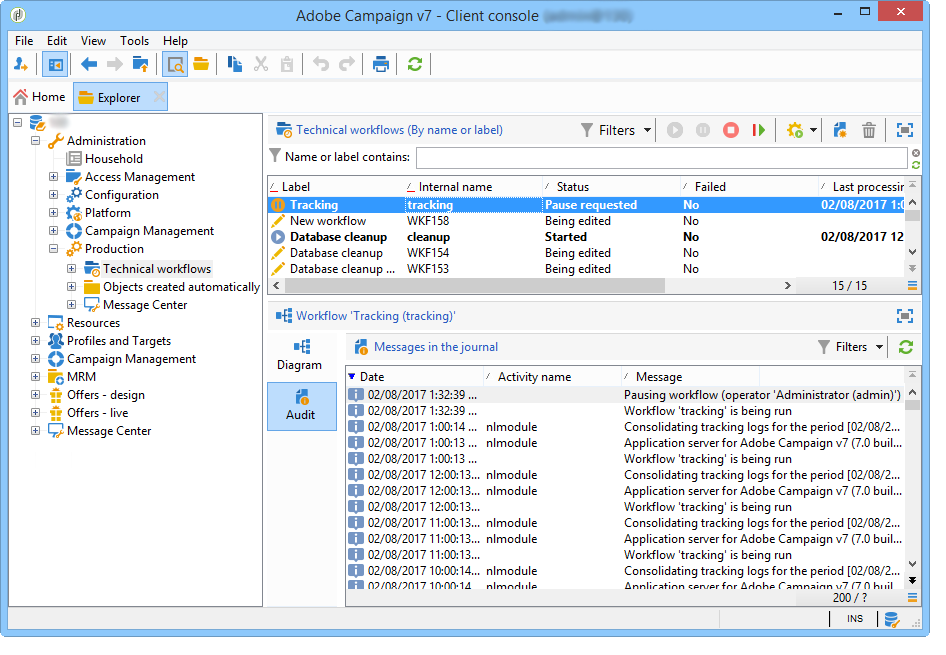

# Tracking logs issues{#tracking-logs-issues}

There can be multiple reasons for tracking logs not being forwarded. We recommend that you check the following information:

* **Does the **Tracking** workflow have errors?**

  Refer to [Monitoring technical workflows](../../workflow/using/monitoring-technical-workflows.md).

  

* **Is the module **trackinglogd** running on the server?**

  Refer to [Log files](../../production/using/log-files.md).

* **Have changes been made?**

  They can trigger a loss of connection to the servers using the tracking alias.
