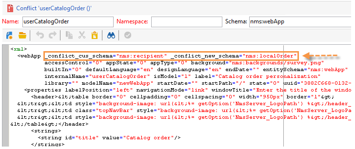

# Upgrading to a new build (on-premise){#upgrading}


Before starting the upgrading process, determine and confirm which version of Adobe Campaign is to being upgraded to and consult the [Release Notes](../../rn/using/latest-release.md) .

>[!IMPORTANT]
>
>* Adobe strongly recommends making a database backup on each instance before updating. For more information, refer to [this section](../../production/using/backup.md).   
>* To perform an upgrade, make sure you have the ability and permissions to access instances and logs.
>* Read out [this section](../../installation/using/general-architecture.md) and the [build upgrade](https://helpx.adobe.com/campaign/kb/acc-build-upgrade.html) chapter before starting.
>

## Windows {#in-windows}

On a Windows environment, follow the steps below to update Adobe Campaign to a new build:

* [Shut down services](#shut-down-services),
* [Upgrade the application server](#upgrade-the-adobe-campaign-server-application),
* [Synchronize resources](#synchronize-resources),
* [Restart services](#restart-services).

To find out how to update the client console, refer to [this section](../../installation/using/client-console-availability-for-windows.md).

### Shut down services {#shut-down-services}

In order to replace all files with the new version, you need to shut down all instances of the nlserver service.

1. Shut down the following services:

    * Web services (IIS):

      **iisreset /stop**
    
    * Adobe Campaign service: **net stop nlserver6**

   >[!IMPORTANT]
   >
   >You also need to make sure the redirection server (webmdl) is stopped, so that the **nlsrvmod.dll** file used by IIS can be replaced with the new version.

1. Check that no tasks are active by running the **nlserver pdump** command. The following should come up:

   ```
   C:<installation path>Adobe Campaign v7bin>nlserver pdump
   HH:MM:SS > Application Server for Adobe Campaign Classic (7.X YY.R build XXX@SHA1) of DD/MM/YYYY
   No tasks
   ```

   You can use the Windows Task Manager to make sure all processes are stopped.

### Upgrade the Adobe Campaign server application {#upgrade-the-adobe-campaign-server-application}

To run the upgrade file, apply the following steps:

1. Run **setup.exe**.

   To download this file, connect to the [Software distribution portal](https://experience.adobe.com/#/downloads/content/software-distribution/en/campaign.html) using your user credentials. Learn more about Software distribution in [this page](https://experienceleague.adobe.com/docs/experience-cloud/software-distribution/home.html?lang=en).

1. Select the installation mode: choose **[!UICONTROL Update or repair]** 
1. Click **[!UICONTROL Next]** .
1. Click **[!UICONTROL Finish]** .

   The installation program then copies the new files.

1. Once the operation is complete, click **[!UICONTROL Finish]** .

### Synchronize resources {#synchronize-resources}

Use the following command line:

**nlserver config -postupgrade -allinstances**

This will enable you to carry out the following operations:

* Synchronize resources
* Update schemas
* update the database

>[!NOTE]
>
>This operation should be performed only once, and only on an (**nlserver web**) application server.

Then check whether the synchronization has generated errors or warnings. For more on this, refer to [Resolving upgrade conflicts](#resolving-upgrade-conflicts).

### Restart services {#restart-services}

The services to be restarted are:

* Web services (IIS):

  **iisreset /start**

* Adobe Campaign service: **net start nlserver6**

## Linux {#in-linux}

On a Linux environment, follow the steps below to update Adobe Campaign to a new build:

* [Download the updated packages](#obtain-updated-packages),
* [Perform the update](#perform-an-update),
* [Reboot the web server](#reboot-the-web-server).

[Learn more about Client Console availability](../../installation/using/client-console-availability-for-windows.md).

>[!NOTE]
>
>From build 8757, the third-party library is no longer needed.

### Obtain updated packages {#obtain-updated-packages}

Start by recovering both updated packages of Adobe Campaign: connect to the [Software distribution portal](https://experience.adobe.com/#/downloads/content/software-distribution/en/campaign.html) using your user credentials. Learn more about Software distribution in [this page](https://experienceleague.adobe.com/docs/experience-cloud/software-distribution/home.html?lang=en).

The file is **nlserver6-v7-XXX.rpm**

### Perform an update {#perform-an-update}

* RPM based distribution (RedHat, SuSe)

  To install them, execute as root:

  ```
  $rpm -Uvh nlserver6-v7-XXXX.rpm
  ```

  Where XXX is the version of the file.

  The rpm file has dependencies on packages that you can find on CentOS/Red Hat distributions. If you don't want to use some of these dependencies, you may have to use the "nodeps" option of rpm:

  ```
  rpm --nodeps -Uvh nlserver6-v7-XXXX-0.x86_64.rpm
  ```

* DEB based distribution (Debian)

  To install them, execute as root:

  ```
  dpkg -i nlserver6-v7-XXXX-amd64_debX.deb
  ```

>[!NOTE]
>
>Full installation procedures are detailed in [this section](../../installation/using/installing-campaign-standard-packages.md). Resources are synchronized automatically, however you need to make sure no errors occurred. For more on this, refer to [Resolve upgrade conflicts](#resolving-upgrade-conflicts).

### Reboot the web server {#reboot-the-web-server}

You must shut down Apache for the new library to become applicable.

To do this, execute the following command:

```
/etc/init.d/apache stop
```

>[!IMPORTANT]
>
>* Your script might be called **httpd** instead of **apache**.
>* You MUST execute this command until you obtain the following reply:
>
>   This operation is required in order for Apache to apply the new library.

Then restart Apache:

```
/etc/init.d/apache start
```

## Resolve upgrade conflicts {#resolving-upgrade-conflicts}

During resource synchronization, the **postupgrade** command enables you to detect whether synchronization has generated errors or warnings.

### View the synchronization result {#view-the-synchronization-result}

There are two ways of viewing the synchronization result:

* In the command-line interface, errors are materialized by a triple chevron **>>>** and synchronization is stopped automatically. Warnings are materialized by a double chevron **>>** and must be resolved once synchronization is complete. At the end of the postupgrade, a summary is displayed in the command prompt. It can look like this:

  ```
  2013-04-09 07:48:39.749Z 00002E7A 1 info log =========Summary of the update==========
  2013-04-09 07:48:39.749Z 00002E7A 1 info log <instance name> instance, 6 warning(s) and 0 error(s) during the update.
  2013-04-09 07:48:39.749Z 00002E7A 1 warning log The document with identifier 'mobileAppDeliveryFeedback' and type 'xtk:report' is in conflict with the new version.
  2013-04-09 07:48:39.749Z 00002E7A 1 warning log The document with identifier 'opensByUserAgent' and type 'xtk:report' is in conflict with the new version.
  2013-04-09 07:48:39.750Z 00002E7A 1 warning log The document with identifier 'deliveryValidation' and type 'nms:webApp' is in conflict with the new version.
  2013-04-09 07:48:39.750Z 00002E7A 1 warning log Document of identifier 'nms:includeView' and type 'xtk:srcSchema' updated in the database and found in the file system. You will have to merge the two versions manually.
  
  ```

  If the warning concerns a conflict of resources, user attention is required to resolve it.

* The **postupgrade_`<server version number>_<time of postupgrade>`.log** log file contains the synchronization result. It is available by default in the following directory: **`<installation directory>/var/<instance/postupgrade`**. Errors and warnings are indicated by the error and warning attributes.

### Resolve conflicts {#resolving-conflicts}

To resolve conflicts, apply the following process:

1. In the Adobe Campaign tree, go to **[!UICONTROL Administration > Configuration > Package management > Edit conflicts]** .
1. Select the conflict you want to resolve in the list.

There are three ways to resolve a conflict:

* **[!UICONTROL Declare as resolved]** : requires user intervention beforehand.
* **[!UICONTROL Accept the new version]** : recommended if the resources provided with Adobe Campaign have not been changed by the user.
* **[!UICONTROL Keep the current version]** : means that the update is rejected.

  >[!IMPORTANT]
  >
  >If you select this resolution mode, you may not benefit from corrections in the new version.

If you chose to resolve the conflict manually, proceed as follows:

1. In the lower section of the window, search for the **_conflict_** string to locate the entities with conflicts. The entity installed with the new version contains the **new** argument, the entity that matches the previous version contains the **cus** argument. 

   

1. Delete the version you don't want to keep. Delete the **_conflict_argument_** string of the entity you are keeping.

   

1. Go to the conflict you have resolved. Click the **[!UICONTROL Actions]** icon and select **[!UICONTROL Declare as resolved]** . 
1. Save your changes: the conflict is now resolved.

### Best practices {#best-practices}

An update failure may be linked to the database configuration. Make sure the configurations carried out by the technical administrator and the database administrator are compatible.

For example, a unicode database must not only authorize storage of LATIN1 data, etc.

## Warn the client consoles of the available update {#warn-the-client-consoles-of-the-available-update}

### Windows {#in-windows-1}

On the machine where the Adobe Campaign application server is installed (**nlserver web**), download and copy the file  **setup-client-6.XXXX.exe** i n **[path of the application]/datakit/nl/eng/jsp**.

The next time client consoles are connected, a window will inform users about the availability of an update and offer them the possibility of downloading and installing it.

>[!NOTE]
>
>Make sure the IIS_XPG user has the appropriate read rights for this installation file and refer to the [installation guide](../../installation/using/general-architecture.md) for more information.

### Linux {#in-linux-1}

On the machine where the Adobe Campaign application server (**nlserver web**) is installed, retrieve the  **setup-client-6.XXXX.exe** package and copy it, saving as **/usr/local/neolane/nl6/datakit/nl/eng/jsp**:

```
 cp setup-client-6.XXXX.exe /usr/local/neolane/nl6/datakit/nl/eng/jsp
```

The next time client consoles are connected, a window will inform users about the availability of an update and offer them the possibility of downloading and installing it.

>[!NOTE]
>
>Make sure the Apache user has the appropriate read rights for this installation file and refer to the [installation guide](../../installation/using/general-architecture.md) for more information.
