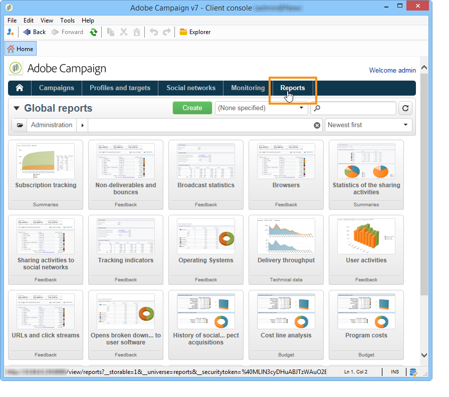
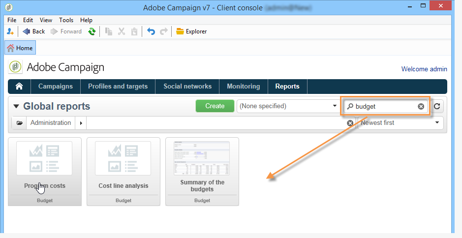
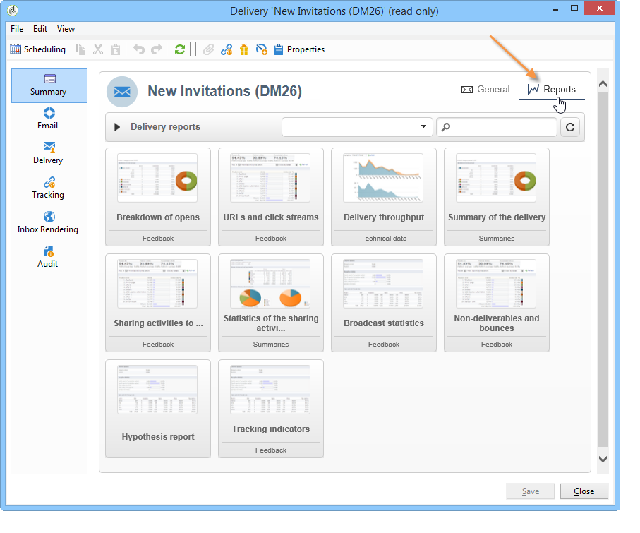

# About Campaign built-in reports{#about-campaign-built-in-reports}

This chapter provides the list of Adobe Campaign built-in reports, their content and their context. The information below will enable you to avoid creating reports already available in the platform.

>[!NOTE]
>
>You can also learn how to add your own reports to the **[!UICONTROL Reports]** tab. For more information, refer to this [page](../../reporting/using/configuring-access-to-the-report.md#defining-the-filtering-options).

These reports and their content are detailed in the documents related to the functionalities they concern.

Adobe Campaign offers several types of reports, accessible via the customer console or an internet browser.

The following types of report are available:

* Reports on the entire platform, see [Global reports](../../reporting/using/global-reports.md).
* Delivery reports, see [Delivery reports](../../reporting/using/delivery-reports.md).
* Cumulated reports, see [Cumulative reports](../../reporting/using/cumulative-reports.md).

You can access reports from the client console home page, the reports dashboard or the delivery list. The display mode of a report depends on its context. The list of main reports is available on the home page and lets you access delivery data quickly. This list can be changed to suit your needs. Refer to [this section](../../reporting/using/about-reports-creation-in-campaign.md) for more information.

To access Campaign built-in reports:

1. Select the **[!UICONTROL Reports]** tab of the Adobe Campaign interface.

    

1. Use the search fields to filter the displayed reports.

1. Then click the report you want to display.

    

1. Click the **[!UICONTROL Back]** link at the top of the screen takes you back to the list of reports.

    

Other possible actions on a report being edited are detailed in [this page](../../reporting/using/actions-on-reports.md).

Reports that are specific to a campaign or a delivery are accessible via their respective dashboards.

The principle is the same for lists, services, offers, etc. as shown below:

