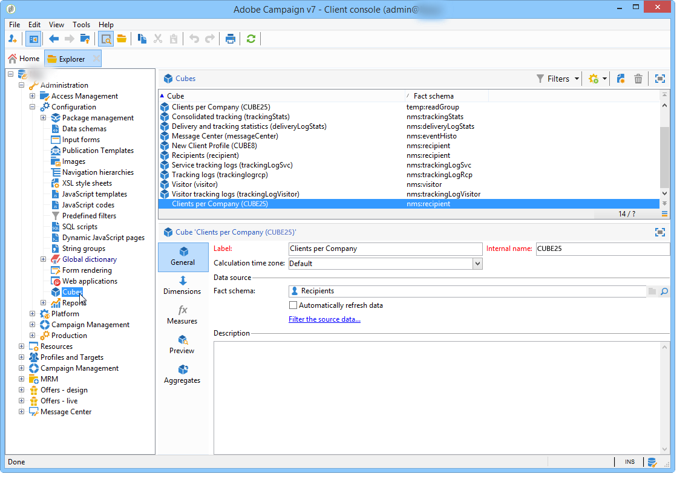
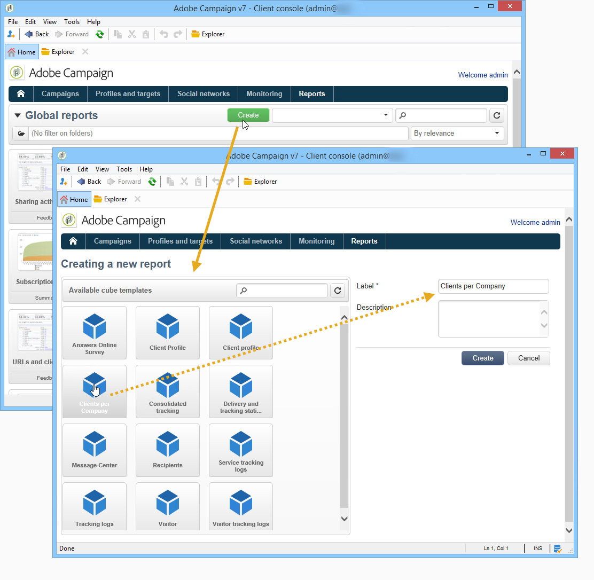
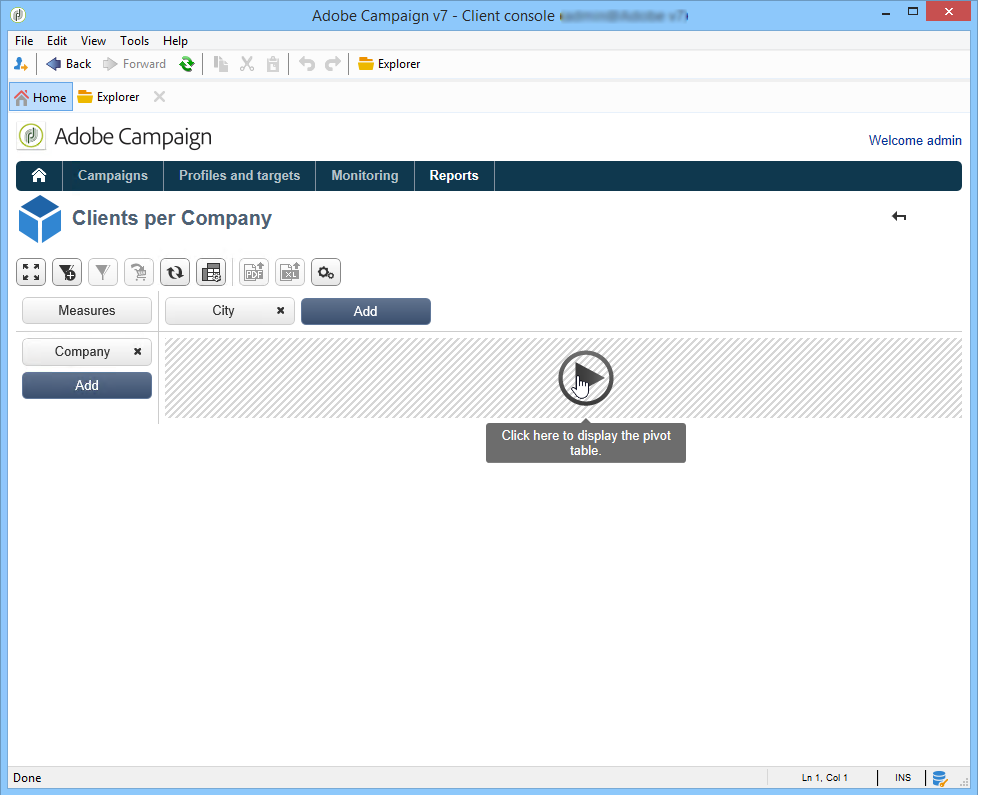
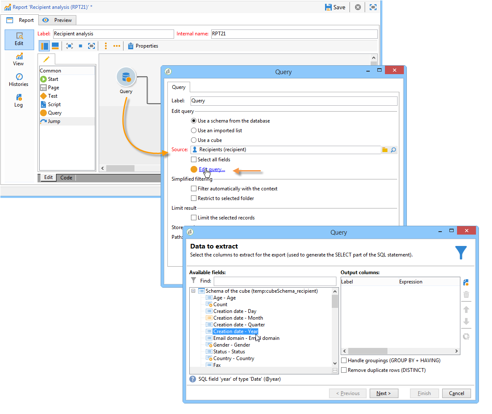
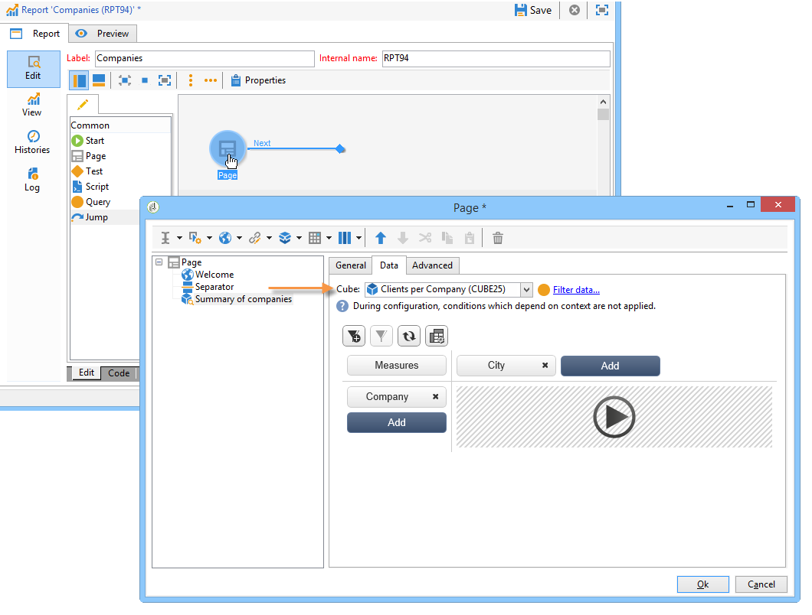

# Get started with cubes{#about-cubes}

Exploration of data in the database is offered via the **Marketing Analytics** module. It enables you to analyze and measure data, calculate statistics, simplify and optimize report creation and calculation. In addition to this, Marketing Analytics enables you to create reports and build target populations. Once these are identified, they are stored in lists that can be used in Adobe Campaign (targeting, segmentation, etc.).

Cubes are used for generating certain built-in reports, including delivery reports (delivery tracking, clicks, opens, etc.). Reports based on cubes may only be used as a standard for data volumes under 5 million fact lines.

You can extend the database exploration and analysis capacities while making it easier for final users to configure reports and tables: all they need to do is select an existing (fully configured) cube when creating their report or table to process calculations, measures and statistics.

Once they have been created and configured, cubes are used in report query boxes and Web applications. They can be used and manipulated within pivot tables.

>[!CAUTION]
>
>**Marketing Analytics** is an Adobe Campaign module. It needs to be installed on your instance so that you can use the capabilities described below.

With Marketing Analytics module, Campaign enables you to:

1. Create cubes in view of:

    * aggregating data and storing it in a work table to pre-calculate indicators based on user needs,
    * reducing the volume of data involved in the various calculations used for reports and queries, thus significantly optimizing indicator calculation times,
    * simplifying access to data, enabling users to manipulate data (whether it is pre-aggregated or not) depending on various dimensions.

   For more on this, refer to [Creating indicators](../../reporting/using/creating-indicators.md).

1. Create pivot tables in view of:

    * exploring calculated data, configured measures,
    * selecting the data to display as well as its display mode,
    * personalizing the measures and indicators used,
    * offering interactive analysis tools to users with a non-technical background.

   For more on this, refer to [Using cubes to explore data](../../reporting/using/using-cubes-to-explore-data.md).

1. Build a query using data calculated and aggregated in a Cube.
1. Identify populations and reference them in lists.

## Terminology {#terminology}

When working with cubes, the following concepts must be known:

* Cube

  A cube is a representation of multidimensional information: it provides end users with structures designed for interactive data analysis.

* Fact table/schema

  The facts table (or fact schema) contains the raw or elementary data on which analyses will be based. These are mainly large volume tables (possibly with linked tables) with potentially long calculations.

  For example, a fact table can be: the broadlog table, the purchase table, etc.

* Dimension

  Dimensions let you segment data into groups: once they have been created, the dimensions serve as analysis axes. In most cases, for a given dimension, several levels will be defined. For example, for a temporal dimension, the levels will be months, days, hours, minutes, etc. This set of levels represents the dimension hierarchy and enables various levels of data analysis.

* Binning

  For some fields, you can define binning to group values and make it easier to read information. Binning is applied to levels

  We recommend that you define binning when there is a possibility of many different values.

* Measure

  The most frequent measures are sum, average, maximum, minimum, standard deviation etc.

  Measures can be calculated: for instance, the acceptance rate of an offer is the ratio of the number of times it was presented compared to the number of times it was accepted.

## Cube workspace {#cube-workspace}

Cubes are stored in the **[!UICONTROL Administration > Configuration > Cubes]** node.

The main contexts of use for cubes are as follows:

* Data exports can be carried out directly in a report, designed in the **[!UICONTROL Reports]** tab of the Adobe Campaign platform.

  To do this, create a new report and select the cube you want to use.

  

  Cubes appear like templates based on which reports are created. Once you have chosen a template, click **[!UICONTROL Create]** to configure and view the matching report.

  You can adapt measures, change the display mode or configure the table, then display the report using the main button.

  

* You can also reference a cube in the **[!UICONTROL Query]** box of a report to use its indicators, as shown below:

  

* You can also insert a pivot table based on a cube into any page of a report. To do this, reference the cube to be used in the **[!UICONTROL Data]** tab of the pivot table on the concerned page.

  

  For more on this, refer to [Exploring the data in a report](../../reporting/using/using-cubes-to-explore-data.md#exploring-the-data-in-a-report).
