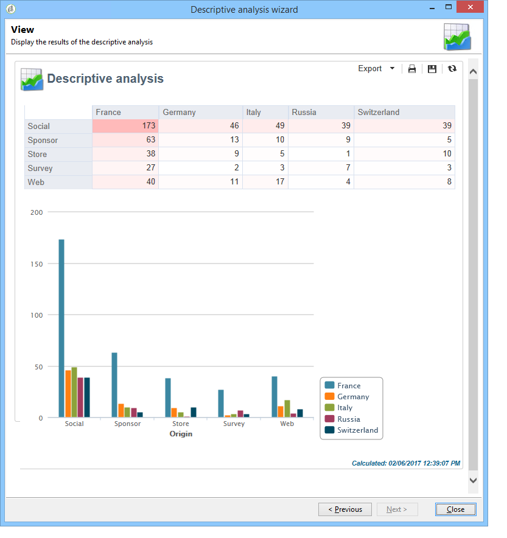
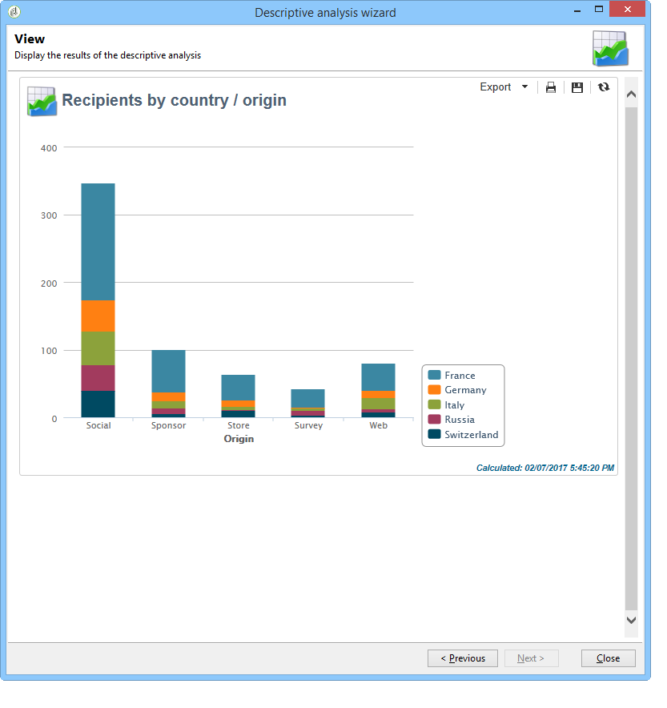
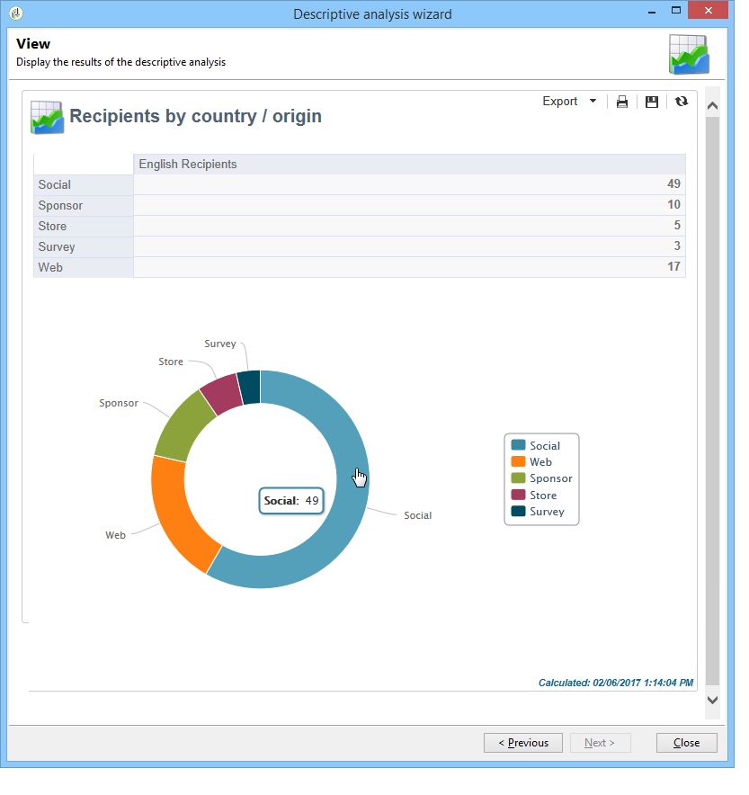
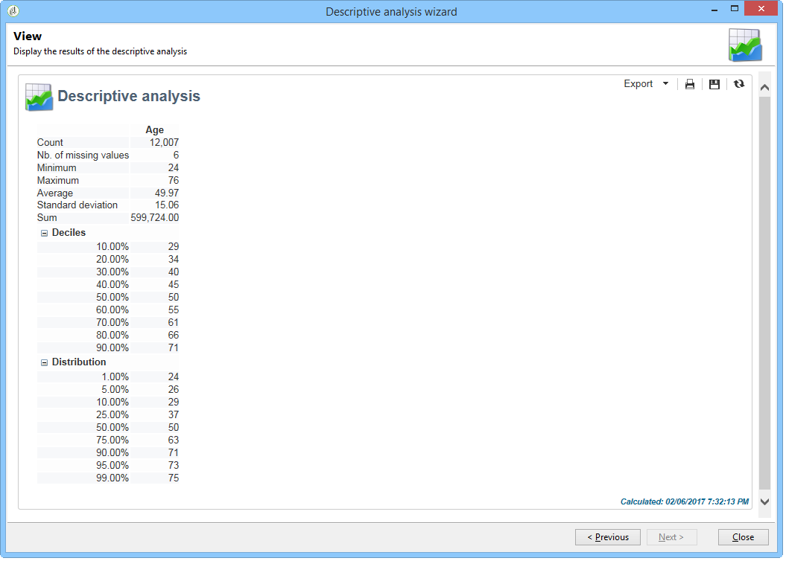

# About descriptive analysis{#about-descriptive-analysis}

In order to produce statistics on the data in the database, create descriptive analysis reports using the dedicated wizard and adapt their content and presentation to suit your needs.

These reports concern populations and should only be used to analyze small data volumes.

You can generate quantitative or qualitative analysis reports. Qualitative analyses enable you to represent data as follows:

* Table and histogram:

  

* Cumulated values, without the table:

  

* Breakdown by line of business

  

Quantitative analyses provide overall statistics on the numerical data of the selection, as shown below:

These reports are created via the descriptive analysis wizard, which based on various steps, lets you choose the type of report you want to create as well as the data and layout. The report is displayed in the last step. If necessary, the report can be published and shared with other operators, printed, exported in Excel, PDF or OpenDocument format.

Descriptive analysis wizards aren't as powerful as Adobe Campaign reports but they do provide a quick overview of the database content or a selection of data.

>[!CAUTION]
>
>A descriptive analysis does not enable you to explore large data volumes.
