# Actions on reports{#actions-on-reports}

When you are viewing a report, the toolbar lets you carry out a certain number of actions. These are detailed below.

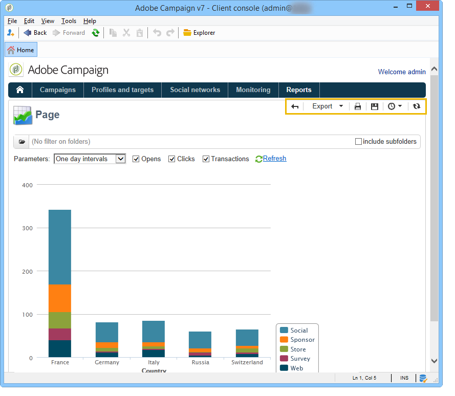

The toolbar lets you export, print, archive or display the report in a web browser for instance.

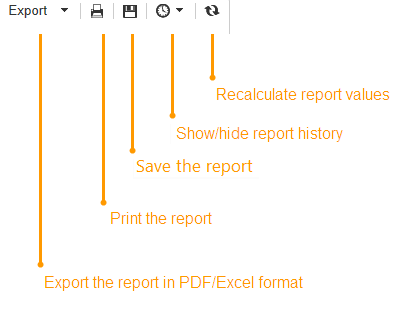

## Exporting a report {#exporting-a-report}

Select the format you want to export your report into from the drop-down list. (.xls, .pdf or .ods).

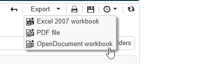

When a report contains several pages, you need to repeat the operation for each page.

You can configure your report in view of exporting it in PDF, Excel or OpenOffice format. Open the Adobe Campaign explorer and select the concerned report.

Export options are accessed via the **[!UICONTROL Page]** activities of the report, in the **[!UICONTROL Advanced]** tab.

Change the settings of **[!UICONTROL Paper]** and **[!UICONTROL Margins]** to suit your needs. You can also authorize the exporting of a page in PDF format only. To do this, uncheck the **[!UICONTROL Activate OpenOffice/Microsoft Excel export]** option. 

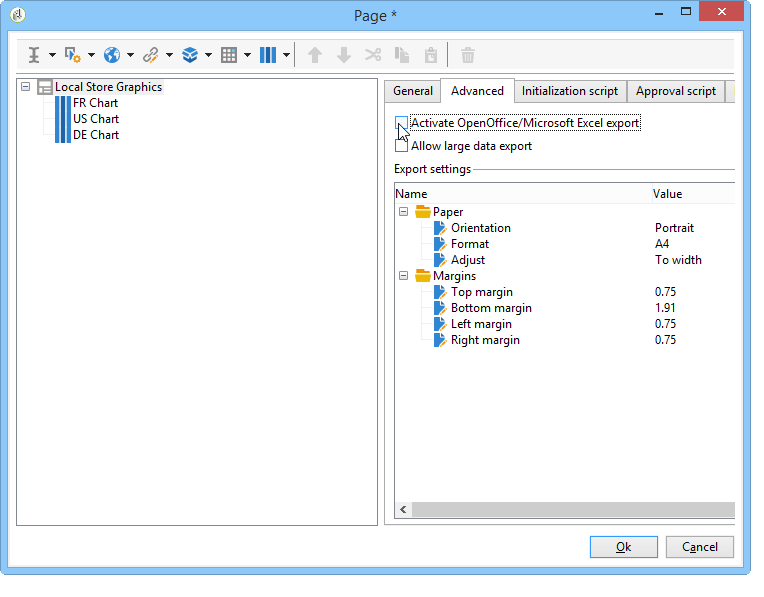

### Exporting into Microsoft Excel {#exporting-into-microsoft-excel}

For **[!UICONTROL List with group]** type reports destined to be exported into Excel, the following recommendations and limitations apply:

* These reports must not contain any empty lines.

  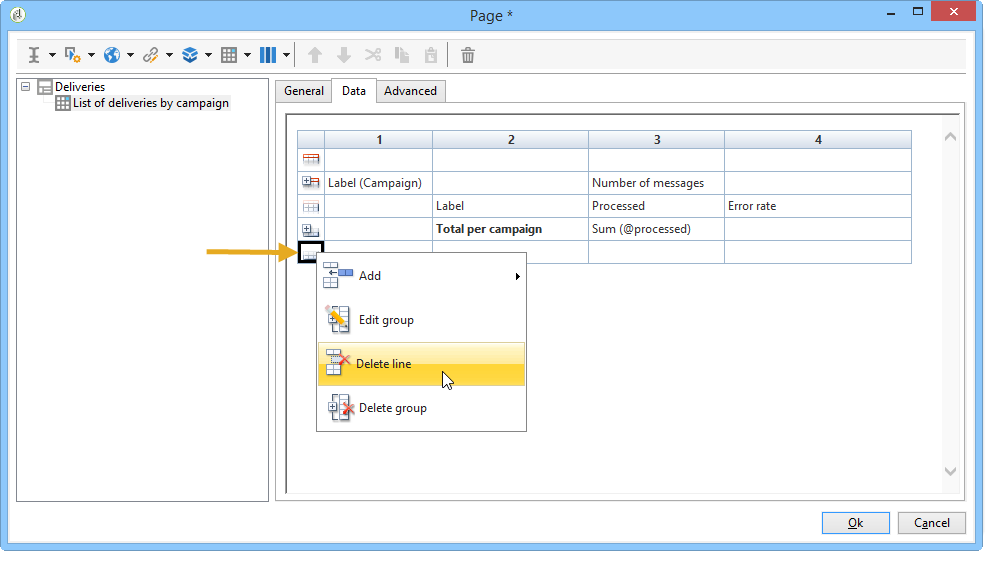

* The legend of the list must be hidden.

  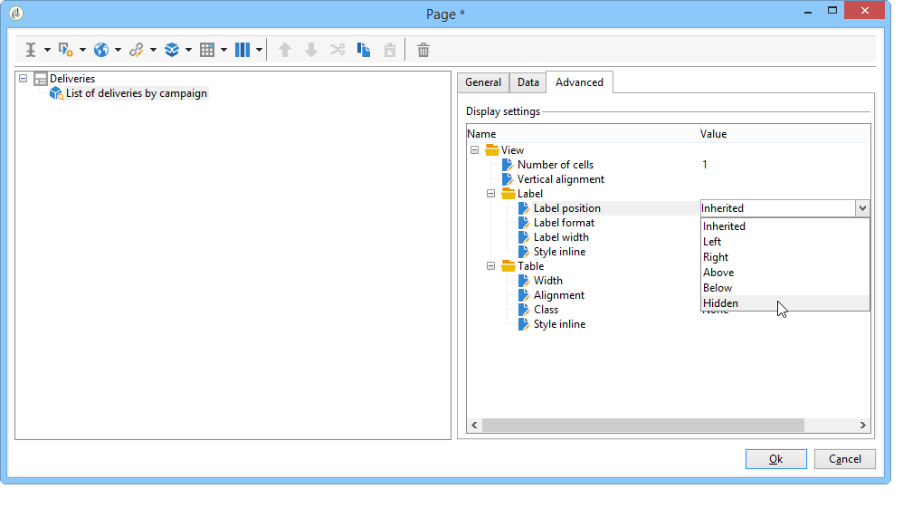

* The reports do not have to use specific formatting defined at the cell level. It is preferable to use **[!UICONTROL Form rendering]** to define the format of the cells in the table. The **[!UICONTROL Form rendering]** can be accessed via **[!UICONTROL Administration > Configuration > Form rendering]**.
* We do not recommend inserting HTML content.
* If a report contains several table, chart, etc. type elements, they will be exported one under the other.
* You can force the carriage return in cells: this configuration will be kept in Excel. For more on this, refer to this [Defining cell format](../../reporting/using/creating-a-table.md#defining-cell-format).

### Postpone the export {#postpone-the-export}

You can postpone exporting a report, for instance to wait for asynchronous calls. To do this, enter the following parameter in the initialization script of the page:

```
document.nl_waitBeforeRender = true;
```

To activate the export and start converting into a PDF, use the **document.nl_renderToPdf()** function without any parameter.

### Memory allocation {#memory-allocation}

When exporting certain large reports, memory allocation errors may occur.

In certain instances, the default value **maxMB** (**SKMS** for hosted instances) of the JavaScript indicated in the **serverConf.xml** configuration file is set to 64 MB. If you encounter any insufficient memory errors while exporting a report, it may be recommended to increase this figure to 512 MB:

```
<javaScript maxMB="512" stackSizeKB="8"/>
```

To apply changes made to the configuration, the **nlserver** service needs to be restarted.

To find out more about the **serverConf.xml** file, refer to [this section](../../production/using/configuration-principle.md).

To find out more about the **nlserver** service, refer to [this section](../../production/using/administration.md).

## Printing a report {#printing-a-report}

You can print your report: to do this, click the printer icon: this opens the dialog box.

For a better result, edit the Internet Explorer printing options and select **[!UICONTROL Print background colors and images]**.

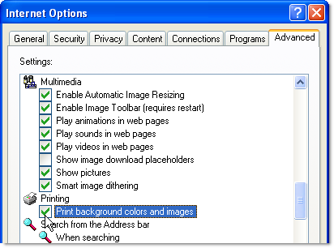

## Creating report archives {#creating-report-archives}

Archiving a report lets you create a view of the report at various periods, for instance to show the statistics for a given period of time.

To create an archive, open the concerned report and click the appropriate icon.

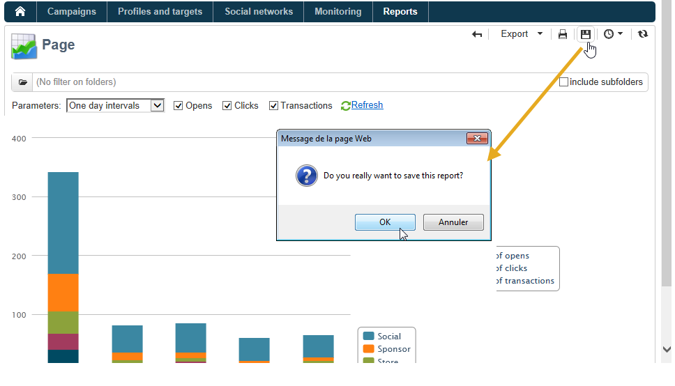

To display or hide existing archives, click the show/hide icon.

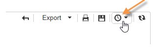

The archive dates are displayed under the show/hide icon. Click the archive to view it.

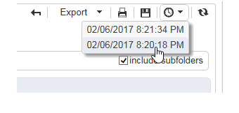

It's possible to delete a report archive. To do this, go to the Adobe Campaign node where your reports are stored. Click the **[!UICONTROL Archives]** tab, select the one you want to delete and click **[!UICONTROL Delete]**.

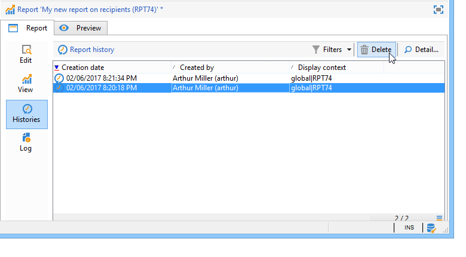
