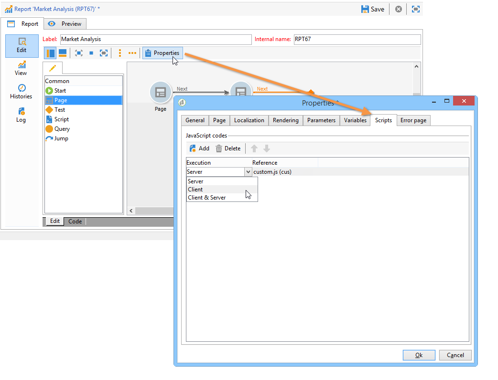
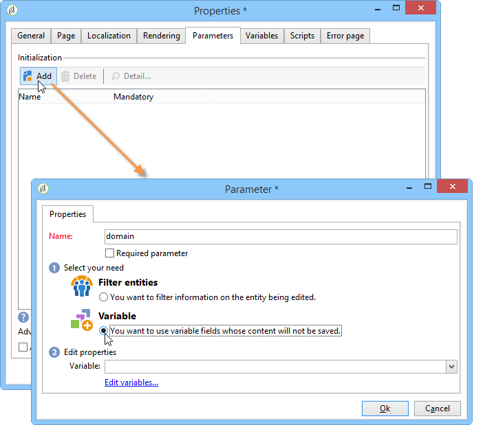
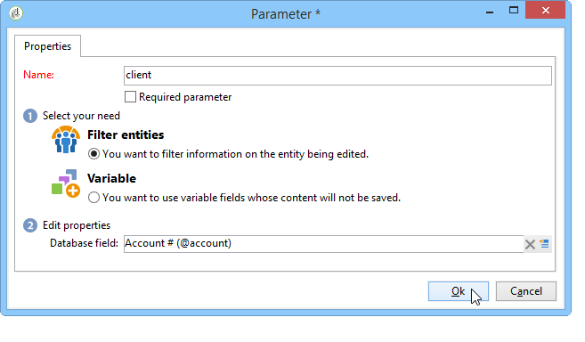
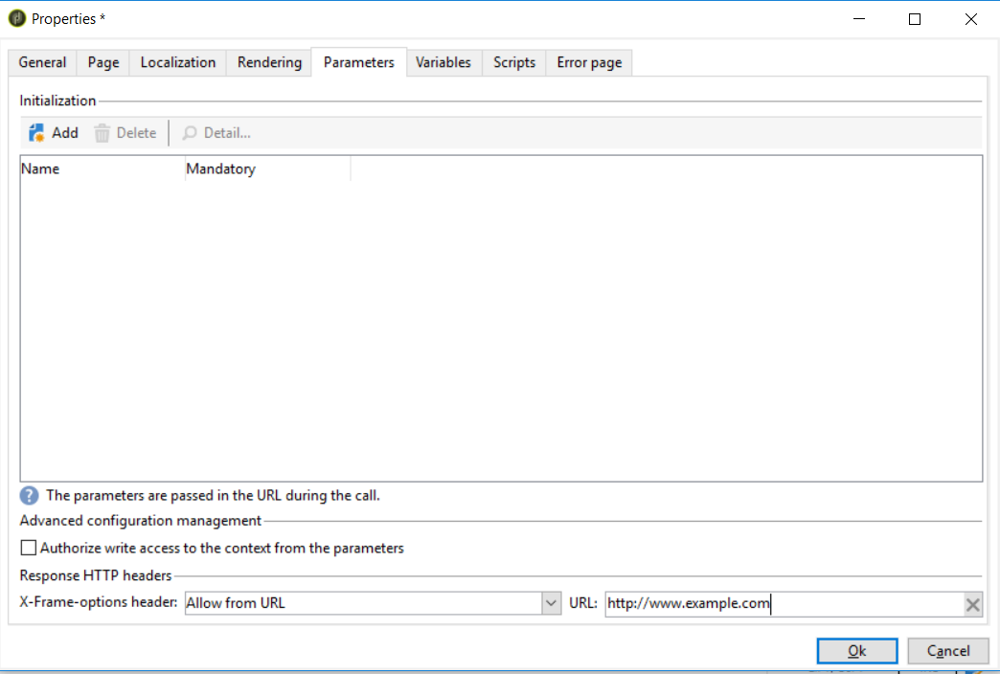
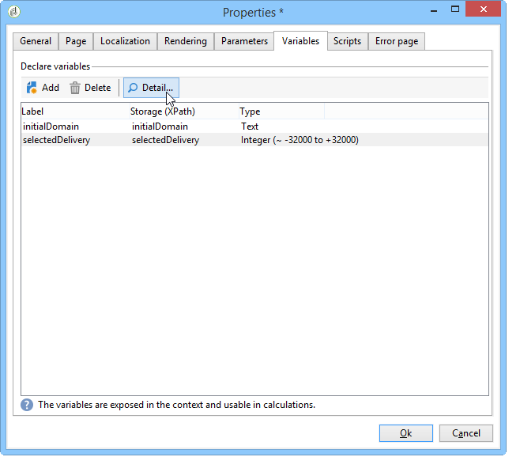

# Advanced capabilities{#advanced-functionalities}

As a technical user, in addition to [general properties](../../reporting/using/properties-of-the-report.md), you can leverage advanced capabilities to configure your reports, such as:

* Create complex queries to process data in a **Script** activity. [Learn more](#script-activity)

* Add an external script to execute on the server or client side. [Learn more](#external-script)

* Call a report with a **Jump** activity. [Learn more](#calling-up-another-report)

* Add a URL parameter to a report to make it more accessible. [Learn more](#calling-up-another-report)

* Add variables to be used in the context of the report. [Learn more](#adding-variables)

## Working with scripts {#adding-a-script}

### Reference external scripts {#external-script}

You can reference JavaScript codes that will be executed on the client and/or server side when the report page is called up. 

To do this:

1. Edit the [report properties](../../reporting/using/properties-of-the-report.md) and click the **[!UICONTROL Scripts]**.
1. Click **[!UICONTROL Add]** and select the script to be referenced.
1. Then select the execution mode.

   If you add several scripts, use the arrows of the toolbar to define their execution sequence.

   

For normal execution on the client side, the referenced scripts must be written in JavaScript and need to be compatible with common browsers. For more on this, refer to [this section](../../web/using/web-forms-answers.md).

### Adding a Script activity {#script-activity}

When [designing your report](../../reporting/using/creating-a-new-report.md#modelizing-the-chart), use the **[!UICONTROL Script]** activity to process data and easily create complex queries that don't enable SQL language. You can directly enter your query in the script window.

The **[!UICONTROL Texts]** tab enables you to define text strings. They may then be used with the following syntax: **$(Identifier)**. For more on using texts, refer to [Adding a header and a footer](../../reporting/using/element-layout.md#adding-a-header-and-a-footer).

>[!CAUTION]
>
>We do NOT recommend using JavaScript code to create aggregates.

To create a history of your report, add the following line to your JavaScript query in order to save your archived data:

```
if( ctx.@_historyId.toString().length == 0 )
```

Otherwise, only current data will be displayed.

## Adding a URL parameter {#defining-additional-settings}

The **[!UICONTROL Parameters]** tab of the [report properties](../../reporting/using/properties-of-the-report.md) lets you define additional settings for the report: these settings will be passed into the URL during the call up.

>[!CAUTION]
>
>For security reasons, these parameters must be used with great caution.

To create a new setting:

1. Click the **[!UICONTROL Add]** button and enter the name of the setting.

   

1. If necessary, specify whether or not the setting will be mandatory.

1. Select the type of setting you want to create: **[!UICONTROL Filter]** or **[!UICONTROL Variable]**.

   The **[!UICONTROL Filter entities]** option lets you use a field of the database as a parameter.

   

   The data is recovered directly at the entity level: **ctx/recipient/@account**.

   The **[!UICONTROL Variable]** option lets you create or select a variable which will be passed as a parameter of the URL and can be used in the filters.

The **[!UICONTROL Response HTTP headers]** allows you to prevent clickjacking when including your report's page in an HTML page using iframe. To avoid clickjacking, you can choose the **[!UICONTROL X-Frame-options header]** behavior:

* **[!UICONTROL None]**: The report will have no **[!UICONTROL X-Frame-options header]**.
* **[!UICONTROL Same as origin]**: Set by default for new reports and republished reports. The hostname will be the same as the report's URL.
* **[!UICONTROL Deny]**: The report cannot be included in an HTML page using iframe.



## Adding variables {#adding-variables}

The **[!UICONTROL Variables]** tab contains the list of variables configured in the report. These variables are exposed in the context of the report and can be used in calculations.

Click the **[!UICONTROL Add]** button to create a new variable.

To view the definition of a variable, select it and click the **[!UICONTROL Detail...]** button.



## Use Case: use variables and parameters in a report

In the video example below, you will learn how to  add a "_type" parameter to create different views of a report, based on the value of this attribute.

 [Discover this feature in video](https://helpx.adobe.com/campaign/classic/how-to/add-url-parameter-in-acv6.html?playlist=/ccx/v1/collection/product/campaign/classic/segment/business-practitioners/explevel/intermediate/applaunch/how-to-4/collection.ccx.js&ref=helpx.adobe.com)


## Calling up another report {#calling-up-another-report}

A **Jump** activity is like a transition without an arrow: it lets you go from one activity to another or access another report.
