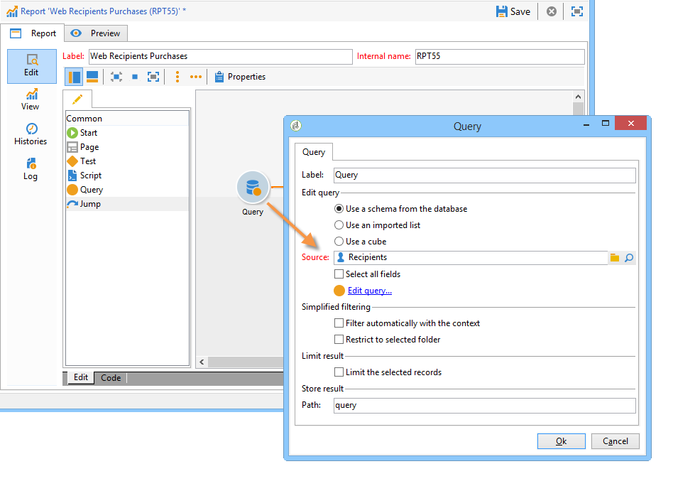
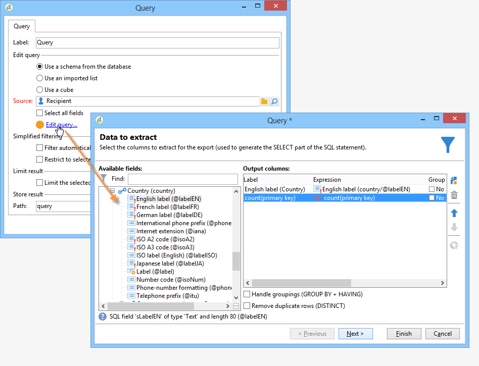
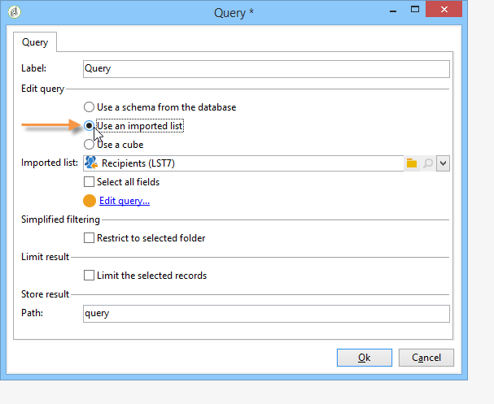
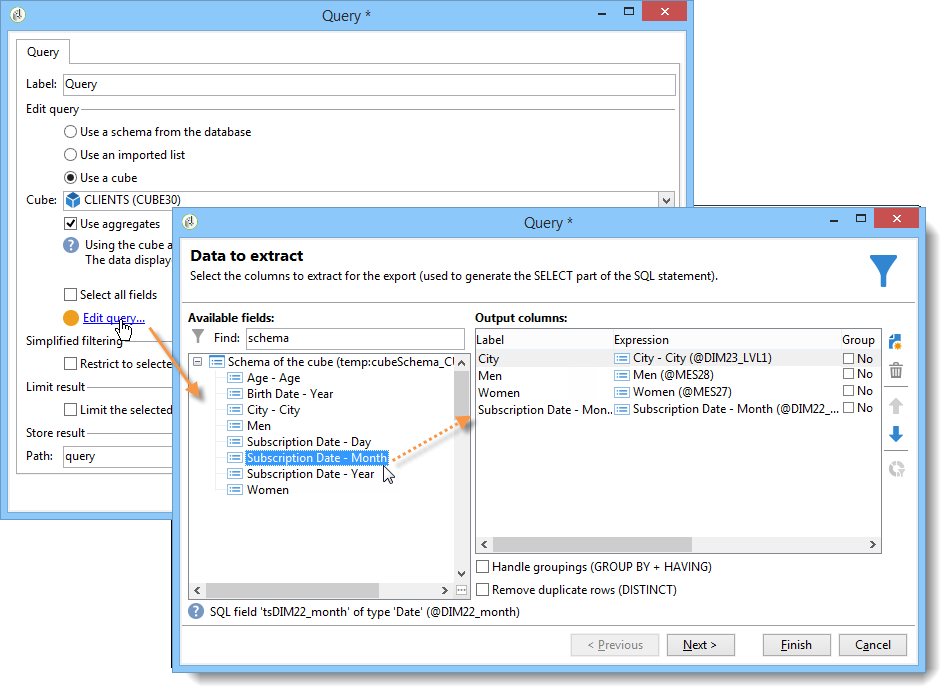

# Collecting data to analyze{#collecting-data-to-analyze}

The data to be used for building the report can be selected directly in the report page (for more on this, refer to [Using the context](../../reporting/using/using-the-context.md)) or collected via one or more queries.

This activity offers three different methods:

1. Building a query using the data in the database.
1. Processing the data contained in a list.
1. Using data contained in an existing cube.

The choice of method depends on the type of calculation, the data volume and their durability, etc. All these parameters must be examined carefully to avoid overloading the Adobe Campaign database and to optimize the generation and manipulation of the created reports. For more on this, refer to [this page](../../reporting/using/best-practices.md#optimizing-report-creation).

In all cases, data is collected via a **[!UICONTROL Query]** type activity.

This data selection mode is relevant when the data in the report needs to be collected or built using data in the database. In some cases, you can also select the data straight from the elements used in the report. For instance when inserting a chart, you can select the source data directly. For more on this, refer to [Using the context](../../reporting/using/using-the-context.md).

## Using the data from a schema {#using-the-data-from-a-schema}

To use data linked to a database schema, select the appropriate option in the query editor and configure the query to be applied.

The following example lets you collect the number of recipients for each country, among the profiles in the database. They can then be displayed in a report in the form of a table.

## Using an imported list {#using-an-imported-list}

To create a report, you can use data from a list of imported data.

To do this, select the **[!UICONTROL Use an imported list]** option in the query box and select the concerned list.

Click the **[!UICONTROL Edit query...]** link to define the data to collect among the elements in this list for building the report.

## Using a cube {#using-a-cube}

It's possible to select a Cube for defining the query.

Cubes enable you to extend the database's exploration and analysis capacities while making for easier configuration of reports and tables for end users: simply select an existing, fully configured Cube and use its calculations, measures and statistics. For more on creating cubes, refer to [this section](../../reporting/using/about-cubes.md).

Click the **[!UICONTROL Edit query...]** link and select the indicators that you want to display or use in your report.

## Filtering options in the queries {#filtering-options-in-the-queries}

To avoid running queries on the entire database, the data needs to be filtered.

### Simplified filter {#simplified-filter}

You can select the **[!UICONTROL Filter automatically with the context]** option to make the report accessible via a specific node of the tree such as a list, a recipient, or a delivery.

The **[!UICONTROL Filter with the folder]** option lets you specify a folder and take into account only its contents. This lets you filter the report data to show only the data from one of the folders in the tree, as shown below: 

### Limiting the amount of data collected {#limiting-the-amount-of-data-collected}

Configure the number of records to be extracted via the query using the result limiting options:

* **[!UICONTROL Limit to first record]** to extract one result,
* **[!UICONTROL Size]** to extract a set number of records.
