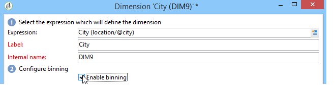

# Best practices for cubes{#concepts-and-methodology}

## Data binning {#data-binning}

Binning enables you to simplify data display by grouping values according to criteria. Depending on the information available to you, you can define age groups, group email domains together, restrict to a value enumeration, explicitly restrict the data to display and group all other data in a dedicated line or column, etc.

Overall, three types of binning are available:

1. Using manually defined value ranges. For instance, age, average shopping cart, number of deliveries opened, etc.). For more on this, refer to [Defining each bin](#defining-each-bin).
1. Dynamically, depending on the values of an enumeration: only display the values contained in the enumeration, all other values are grouped in 'Others'. For more on this, refer to [Dynamically managing bins](#dynamically-managing-bins).
1. Using value ranges, all others being grouped together. For instance, 18 to 25 year-olds, 26 to 59 year-olds, and the others. For more on this, refer to [Creating value ranges](#creating-value-ranges).

To enable binning, check the appropriate box when creating the dimension.

You can either create bins manually or link them to an existing enumeration.

Adobe Campaign also provides an assistant for automatic binning: values can be broken down into N groups, or grouped according to the most frequent values in the database.

### Defining each bin {#defining-each-bin}

To create each bin individually, select the **[!UICONTROL Define each bin]** option and use the table to create the various bins.

Click the **[!UICONTROL Add]** button to create a new bin and list the values which will be grouped into the bin.

In the following example, languages are grouped into three categories: English/German/Dutch, French/Italian/Spanish, and Others.

You can use an SQL mask to combine several values into a filter. To do this, check **[!UICONTROL Yes]** in the **[!UICONTROL Use an SQL mask]** column and enter the SQL filter to be applied in the **[!UICONTROL Value or expression]** column.

In the example below, all email domains that start with **yahoo** (yahoo.fr, yahoo.com, yahoo.be, etc.), or with **ymail** (ymail.com, ymail.eu, etc.) will be grouped under the label **YAHOO!**, as well as addresses with the **rocketmail.com** domain.

### Dynamically managing bins {#dynamically-managing-bins}

Values can be managed dynamically via enumerations. This means that only the values contained in the enumeration will be displayed. When the enumeration values change, the content of the Cube is adapted automatically.

To create this type of value binning, apply the following steps:

1. Create a new dimension and enable binning.
1. Select the **[!UICONTROL Dynamically link the values to an enumeration]** option and select the matching enumeration.

   

   Whenever the enumeration values are updated, the matching bins are adapted automatically.

### Creating value ranges {#creating-value-ranges}

You can group the values into ranges based on a desired interval.

To define ranges manually, click the **[!UICONTROL Add]** button and select **[!UICONTROL Define a range]** :

Then specify the lower and upper limits and click **[!UICONTROL Ok]** to confirm.

### Generating bins automatically {#generating-bins-automatically}

It's also possible to generate bins automatically. To do this, click the **[!UICONTROL Generate bins...]** link.

You can either:

* Recover the most frequently used values

  In the following example, the 4 most frequently used values will be displayed, while the others will be counted and grouped in the 'Others' category.

* Generate bins in the form of slots

  In the following example, Adobe Campaign automatically creates 4 same-sized value slots to display the values in the database.

In this case, the filter selected in the fact schema is ignored.

### Enumerations {#enumerations}

To improve the relevance and readability of a report, Adobe Campaign lets you create specific enumerations to regroup different values into the same bin. These enumerations, reserved for binning, are referenced in the cubes then displayed in the reports.

Adobe Campaign also offers an enumeration on domains which lets you display a list of the email domains of all the contacts in the database, regrouped by ISP, as shown in the following example: 

It is built using following template:

To create a report using this enumeration, create a Cube using the **[!UICONTROL Email domain]** dimension. Choose the **[!UICONTROL Enable binning]** option then **[!UICONTROL Dynamically link the values to an enumeration]**. Then select the **Domains** enumeration as shown above. All values that have no specified alias will be regrouped under the **Others** label.

Next, create a report based on this Cube to display the values.

You only need to modify the enumeration to update the related report. For example, create the **Adobe** value and add the **adobe.com** alias and the report is automatically updated with the Adobe value at the enumeration level.

The **[!UICONTROL Domains]** enumeration is used to generate built-in reports that display the list of domains. To adapt the content of these reports, you can edit this list.

You can create other enumerations reserved for binning and use them in other Cubes: all alias values will be regrouped in the bins specified in the first enumeration tab.

## Calculating and using aggregates {#calculating-and-using-aggregates}

The largest data volumes can be calculated in aggregates.

Aggregates are useful when manipulating large volumes of data. They are updated automatically based on settings defined in the dedicated workflow box, to integrate the data collect most recently into the indicators

Aggregates are defined in the relevant tab of each cube.

>[!NOTE]
>
>The workflow for updating aggregate calculations can be configured in the aggregate itself, or the aggregate can be updated via an external workflow linked to the relevant cube.

To create a new aggregate, apply the following steps:

1. Click the **[!UICONTROL Aggregates]** tab of the cube, then click the **[!UICONTROL Add]** button.

   

1. Enter a label for the aggregate, then add the dimensions to be calculated.

   

1. Select a dimension and a level. Repeat this process for each dimension and each level.
1. Click the **[!UICONTROL Workflow]** tab to create the aggregation workflow.

   

    * The **[!UICONTROL Scheduler]** activity lets you define the frequency of calculation updates. The scheduler is detailed in [this section](../../workflow/using/scheduler.md).
    * The **[!UICONTROL Aggregate update]** activity lets you select the update mode which you want to apply: full or partial.

      By default, a full update is carried out during each calculation. To enable a partial update, select the relevant option and define the update conditions.
    
      

## Defining measures {#defining-measures}

The types of measures are defined in the **[!UICONTROL Measures]** tab of the cube. You can calculate sums, averages, deviations, etc.

You can create as many measures as necessary: then select the measure that you want to show or hide in the table. For more on this, refer to [Displaying measures](#displaying-measures).

To define a new measure, apply the following steps:

1. Click the **[!UICONTROL Add]** button above the list of measures and select the type of measure and the formula to be calculated.

   

1. If necessary, and depending on the operator, choose the expression which the operation concerns.

   The **[!UICONTROL Advanced selection]** button lets you create complex calculation formulas. For more on this, refer to [this section](../../platform/using/about-queries-in-campaign.md).

   

1. The **[!UICONTROL Filter the measure data...]** link lets you restrict the calculation field and only apply it to specific data in the database.

   

1. Enter the label of the measure and add a description, then click **[!UICONTROL Finish]** to create it.

## Displaying measures {#displaying-measures}

You can configure the display of measures in the table depending on your needs:

* the display sequence of measures (refer to [Display sequence](#display-sequence)),
* the information to show/hide in the report (refer to [Configuring the display](#configuring-the-display)) 
* which measures to display: percentage, total, number of decimals, etc. (refer to [Changing the type of measure displayed](#changing-the-type-of-measure-displayed)).

### Display sequence {#display-sequence}

The measures calculated in the cube are configured via the **[!UICONTROL Measures]** button.

Move the lines around to change the display sequence. In the following example, French data is moved to the bottom of the list: this means it will be displayed in the last column.

### Configuring the display {#configuring-the-display}

The configuration of measures, lines and columns can be carried out individually for each measure or overall. A specific icon lets you access the display mode selection window.

* Click the **[!UICONTROL Edit the configuration of the pivot table]** icon to access the configuration window.

  You can choose whether or not to display the labels of measures as well as configure their layout (lines or columns).

The color options let you highlight important values for easy reading.

### Changing the type of measure displayed {#changing-the-type-of-measure-displayed}

Within each measure, you can define the unit and formatting to be applied.

## Sharing a report {#sharing-a-report}

Once the report is configured, you can save it and share it with other operators.

To do this, click the **[!UICONTROL Show the report properties]** icon and enable the **[!UICONTROL Share this report]** option.

Specify the category which the report belongs to as well as its relevance. For more on this, refer in [this page](../../reporting/using/configuring-access-to-the-report.md#report-display-context) to the **Display sequence**and **Defining the filtering options** sections.

To confirm these changes, you need to save the report.

## Creating filters {#creating-filters}

It is possible to create filters for viewing a section of the data.

To do this:

1. Click the **[!UICONTROL Add a filter]** icon.

   

1. Select the dimension which the filter concerns 

   

1. Select the type of filter and its level of precision.

   

1. Once it is created, the filter is displayed above the report.

   

   Click the filter to edit it.

   Click the cross to delete it.

   You can combine as many filters as necessary: they will all be shown in this area.

   

Each time a filter is modified (add, remover, alter), the report has to be recalculated.

Filters can also be created based on a selection. To do this, select your source cells, lines and columns, then click the **[!UICONTROL Add a filter]** icon.

To select a line, column or cell, left-click on it. To deselect, click again.

The filter is applied automatically and added to the filter zone above the report.

