# Configuring access to the report{#configuring-access-to-the-report}

## Report display context {#report-display-context}

Define the display context of the report in the Adobe Campaign platform using the **[!UICONTROL Display]** tab. Access to a report depends on its selection type, display conditions and access authorizations.

### Selection type {#selection-type}

Access to the report can be limited to a specific context or offer space, for instance a delivery, a recipient, a selection of recipients, etc. This access is configured in the **[!UICONTROL Selection type]** section of the **[!UICONTROL Display]** tab.

* **[!UICONTROL Single selection]** : the report is only accessible when a specific entity is selected. 
* **[!UICONTROL Multiple selection]** : the report is accessed when several entities are selected.
* **[!UICONTROL Global]** : the report is accessed via the list of available reports in the **[!UICONTROL Reports]** tab.

### Display sequence {#display-sequence}

The **[!UICONTROL Sequence]** field lets you enter a numeric value that specifies the display sequence of the report in the list.

By default, reports are displayed by relevance: the value entered in this field lets you sort reports from the most (highest value) to the least (smallest value) relevant.

You can select the scale to be used based on your needs: 1 to 10, 0 to 100, -10 to 10, etc.

### Display conditions {#display-conditions}

You can also condition the display of the report via a query. 

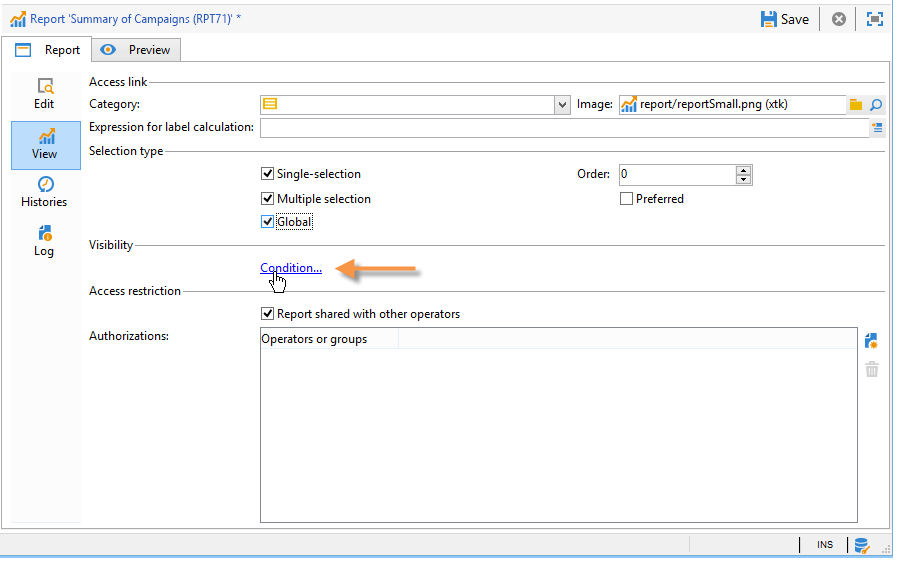

In the following example, the report is displayed if the main campaign channel is email.

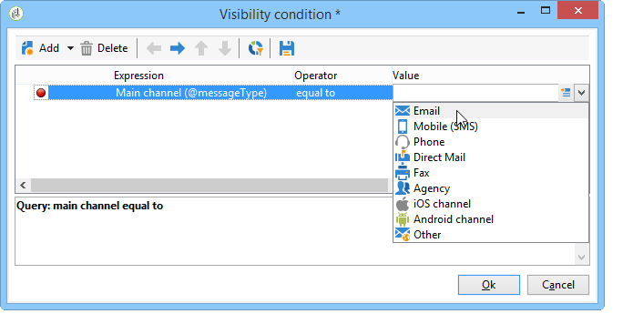

This means that if the main channel of the campaign is direct mail, the report won't be available in the campaign reports.

### Access authorization {#access-authorization}

The report can be shared with other operators.

To make the report accessible, select the **[!UICONTROL Report shared with other operators]** option. If this option isn't selected, only the operator who created the report can access the report.

The report can also be shared with specific operators or groups of operators added via the authorizations window.

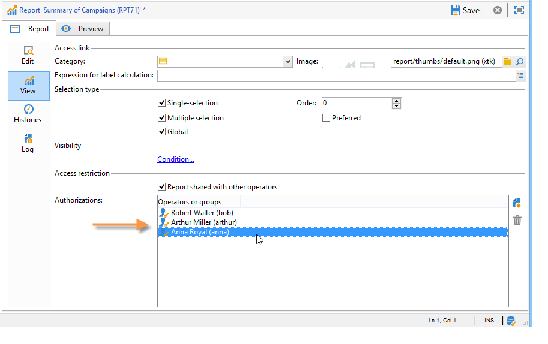

### Defining the filtering options {#defining-the-filtering-options}

The **[!UICONTROL Reports]** tab displays all available reports in the platform and for which the connected operator has an access right.

By default, they are sorted by relevance, but you can apply other types of filters: alphabetical, by age, etc.

You can also filter the display based on the report category:

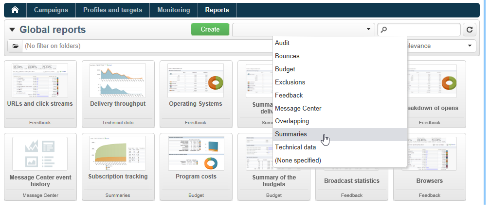

To define the category of a report, select it via the **[!UICONTROL Display]** tab, as shown below:

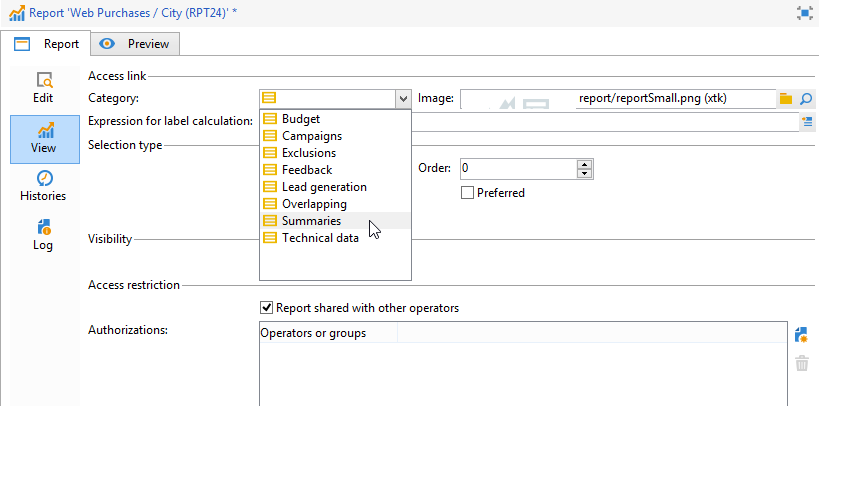

You can enter a new category here, and add it to the list of available categories. The matching enumeration is updated automatically.

## Creating a link to a report {#creating-a-link-to-a-report-}

It's possible to make a report accessible via a specific node of the tree, such as a list, a recipient, a delivery, etc. To do this, simply create a link to the concerned report and specify the entity where you want to make it available.

As an example, we are going to create a link to a report to make it accessible via a list of recipients.

1. Click **[!UICONTROL New]** and select **[!UICONTROL Create a link to an existing report]** in the report creation wizard.

   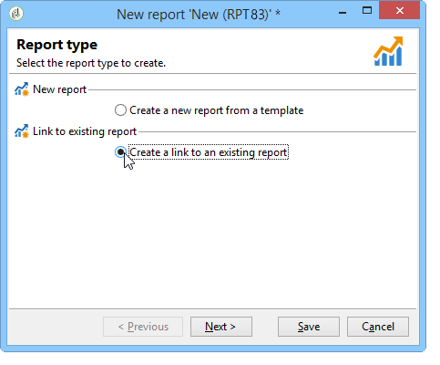

1. Select the report you want to create a link to using the drop-down list. In this example, we're going to select the **Breakdown by country** report.

   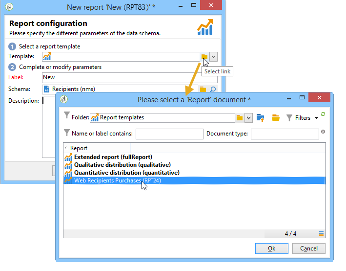

1. Enter a label and select the schema. In this example, we're going to select the recipient lists table. 

   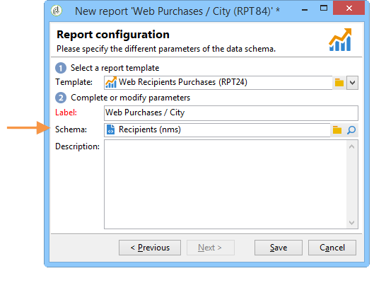

   This means that the report will be accessible via any recipients list and that statistics will concern the recipients in the selected list.

1. Saving and displaying your report.
1. Enter the link key. In this case, the foreign key of the 'Folders' link.

   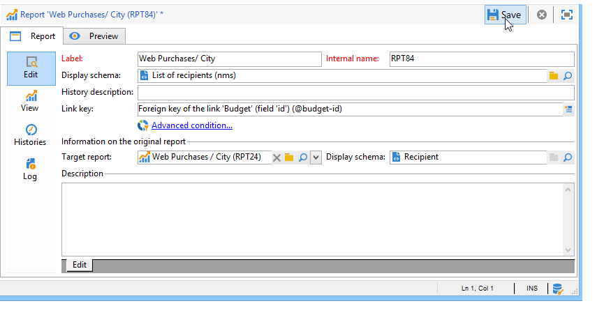

1. Publish your report.
1. Go to one of your recipient lists and click the **[!UICONTROL Reports]** link: the report you have just created is accessible.

   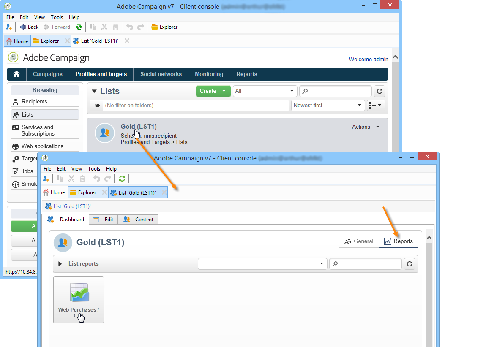

## Preview of the report {#preview-of-the-report}

Before publishing your report, make sure it is displayed correctly in the **[!UICONTROL Preview]** tab.

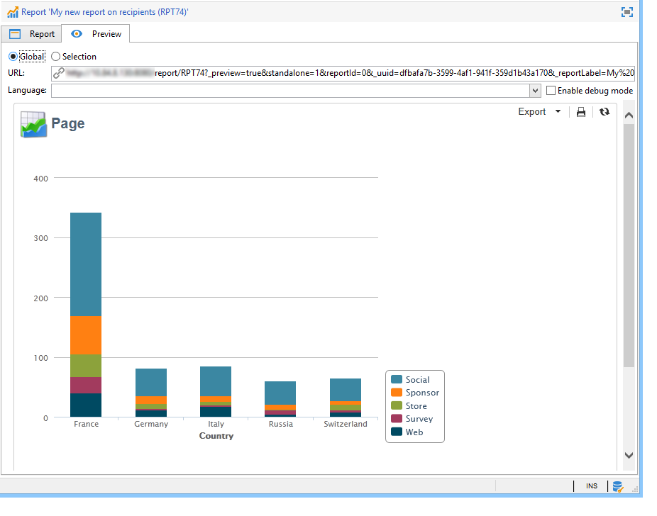

To display the preview of the report, select the **[!UICONTROL Global]** or the **[!UICONTROL Selection]** option.

These two options are selected based on the display settings of the report. If the display setting is **[!UICONTROL Global]**, you need to select the **[!UICONTROL Global]** preview option. If the display settings are **[!UICONTROL Single selection]** or **[!UICONTROL Multiple selection]**, the **[!UICONTROL Selection]** preview option must be selected.

For more on this, refer to [Report display context](#report-display-context).

Specific settings enable you to control errors. The **_uuid** setting is found in the URL of the report. You can add the **&_preview** or the **&_debug** settings to it.

To learn more about these settings, refer to the **Defning web form properties** section of the [Web forms](../../web/using/about-web-forms.md) chapter.

## Publishing the report {#publishing-the-report}

Publishing the report is mandatory in order to share them with other operators and display them in the list of available reports (also refer to [Report display context](#report-display-context)). This operation must be carried out again each time the report is changed.

1. Open the publishing wizard by clicking **[!UICONTROL Publish]** in the toolbar.

   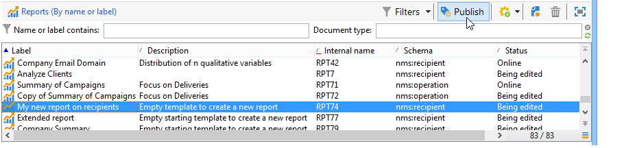

1. Click **[!UICONTROL Start]** to publish.

   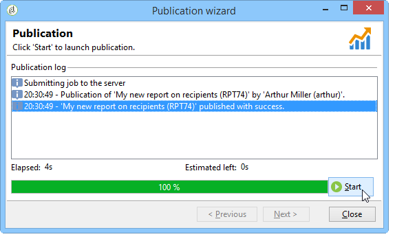

1. Click the **[!UICONTROL Enlarge]** icon to open the report in a web browser.
