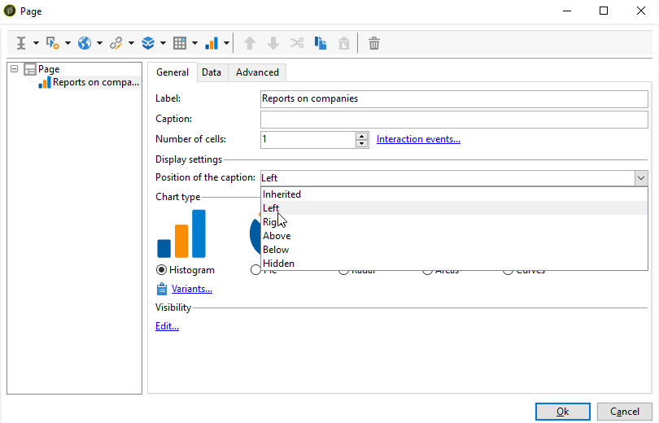

# Create a chart{#creating-a-chart}

 

The data in the database can also be collected and displayed in a chart. Adobe Campaign provides a set of graphical representations. Their configuration is detailed below.

Charts are inserted directly into a report page via the right-click menu or the toolbar.

## Creation steps {#creation-steps}

To create a chart in a report, apply the following steps:

1. Edit the page where you want to display the chart and select the chart type on the toolbar.

   

1. Enter a name and caption. If necessary, you can change the position of the caption using the drop-down list.

   

1. Click the **[!UICONTROL Data]** tab to define the data source and the series to be calculated.

   The statistics to be displayed in the chart can be calculated based on a query or on the context data, i.e. the data provided by the inbound transition of the current page (for more on this, refer to [Using context data](../../reporting/using/using-the-context.md#using-context-data)).

    * Click the **[!UICONTROL Filter data...]** link to define filtering criteria for the data in the database.
    
      

    * To used contextual data, select **[!UICONTROL Context data]** from the **[!UICONTROL Source]** drop-down and click the **[!UICONTROL Advanced settings...]** link. Then select the data which the statistics will concern.
    
      

      You will then be able to access the contextual data to define the values to be displayed in the chart:
    
      

## Chart types and variants {#chart-types-and-variants}

Adobe Campaign offers various types of graphical representations. They are detailed below.

The chart type is selected when it is inserted into the page. 

It can also be altered via the **[!UICONTROL Chart type]** section of the **[!UICONTROL General]** tab in the chart.

Variants depend on the selected chart type. They are selected via the **[!UICONTROL Variants...]** link.

### Breakdown: pie charts {#breakdown--pie-charts}

This type of graphical representation lets you display an overview of the measured elements.

Pie charts only enable you to analyze one variable.

The **[!UICONTROL Variants]** link lets you personalize the overall rendering of the chart.

Pie charts let you enter the value of the inner radius in the appropriate field.

For example:

0.00 traces a full circle.

0.40 traces a circle with a radius of 40%.

1.00 only traces the outside of the circle.

### Evolution: curves and areas {#evolution--curves-and-areas}

This type of graphical representation lets you understand the evolution of one or more measures in time. 

### Comparison: histograms {#comparison--histograms}

Histograms enable you to compare the values of one or more variables.

For these types of charts, the following options are offered in the **[!UICONTROL Variants]** window:

Check the **[!UICONTROL Display caption]** option to show the caption with the chart and choose its position:

When appropriate, you can stack values together.

If necessary, you can reverse the value display sequence. To do this, select the **[!UICONTROL Reverse stacking]** option.

### Conversion: funnel {#conversion--funnel}

This type of chart lets you track the conversation rate of measured elements.

## Interaction with the chart {#interaction-with-the-chart}

You can define an action when the user clicks the chart. Open the **[!UICONTROL Interaction events]** window and select the action you want to perform.

Possible interaction types and their configurations are detailed in [this section](../../web/using/static-elements-in-a-web-form.md#inserting-html-content).

## Compute statistics {#calculating-statistics}

Charts let you display statistics on the collected data.

These statistics are defined via the **[!UICONTROL Series parameters]** section of the **[!UICONTROL Data]** tab.

To create a new statistic, click the **[!UICONTROL Add]** icon and configure the appropriate window. The available calculation types are detailed below.

For more on this, refer to [this section](../../reporting/using/using-the-descriptive-analysis-assistant.md#statistics-calculation).
